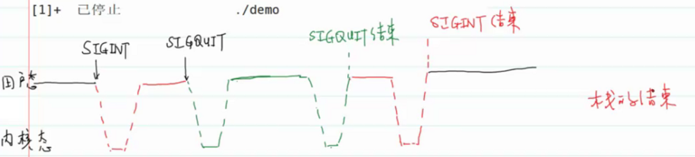
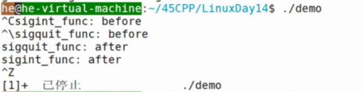

deck:: [[王道笔记/Linux14]]

- 可重入函数与不可重入函数 #card
  card-last-interval:: 4
  card-repeats:: 1
  card-ease-factor:: 2.6
  card-next-schedule:: 2022-07-11T01:06:28.801Z
  card-last-reviewed:: 2022-07-07T01:06:28.803Z
  card-last-score:: 5
	- 可重入函数就是在信号处理函数中可以安全调用的函数。不可重入函数就是在信号处理函数中会修改全局数据、静态区数据的函数。
	- 这样是为了保证一个信号执行过程中被中断去执行另一个信号时，全局数据、静态区数据，也就是进程原有结构不会被破坏
	- 
- 不可重入函数有那些？ #card
  card-last-interval:: 4
  card-repeats:: 1
  card-ease-factor:: 2.6
  card-next-schedule:: 2022-07-12T00:09:04.580Z
  card-last-reviewed:: 2022-07-08T00:09:04.581Z
  card-last-score:: 5
	- 1.malloc/calloc/free
	- 2.标准库IO函数
		- printf、scanf...
	- 3.使用静态数据区的函数
		- getpwnam...
- 示例，感受信号的执行流程 #card
	- ```
	  //demo.c
	  	  //查看不同情况下信号的行为
	  	  void sigint_func(int signo);
	  
	  	  void sigquit_func(int signo);
	  
	  	  int main(void)
	  	  {
	  	    //注册
	  	    struct sigaction act1,act2;
	  	    act1.sa_handler = sigint_func;
	  	    sigemptyset(&act1.sa_mask);
	  	    act1.sa_flasg = 0;
	  
	  	    sigaction(SIGINT,act1,NULL);
	  
	  	    act2.sa_handler = sigquit_func;
	  	    sigemptyset(&act2.sa_mask);
	  	    act2.sa_flasg = 0;
	  
	  	    sigaction(SIGINT,act2,NULL);
	  
	  	    while(1)
	  	      ;
	  	    return 0;  
	  	  }
	  
	  	  void sigint_func(int signo)
	  	  {
	  	    //不要用printf，只是为了演示方便
	  	    printf("sigint_func before\n");
	  	    sleep(5);//睡眠5s过程中输入ctrl+\ SIGQUIT信号
	  	    printf("sigint_func after\n");
	  	  }
	  
	  	  void sigquit_func(int signo)
	  	  {
	  	    printf("sigquit_func before\n");
	  	    sleep(5);
	  	    printf("sigquit_func after\n");
	  	  }
	  ```
		- 用户的代码是可以响应信号的，所以在第一个信号处理过程中可以响应第二个信号，去处理第二个信号。就像一个函数调用栈：
		- 
		- 