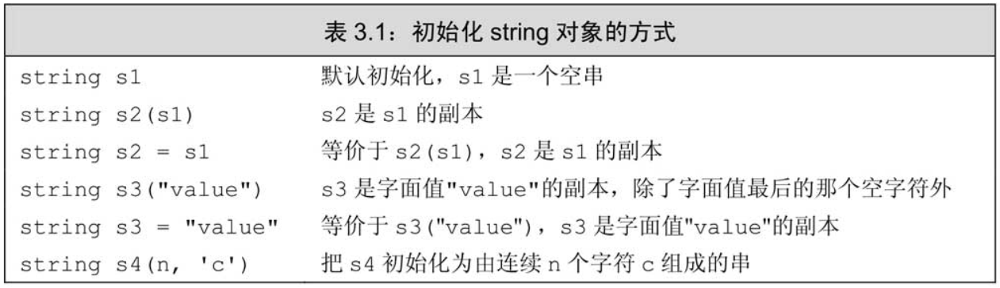
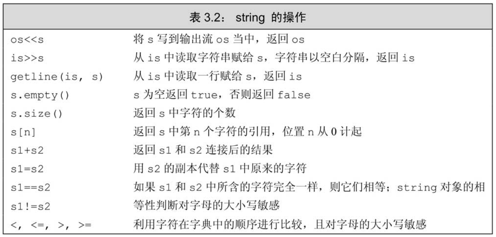
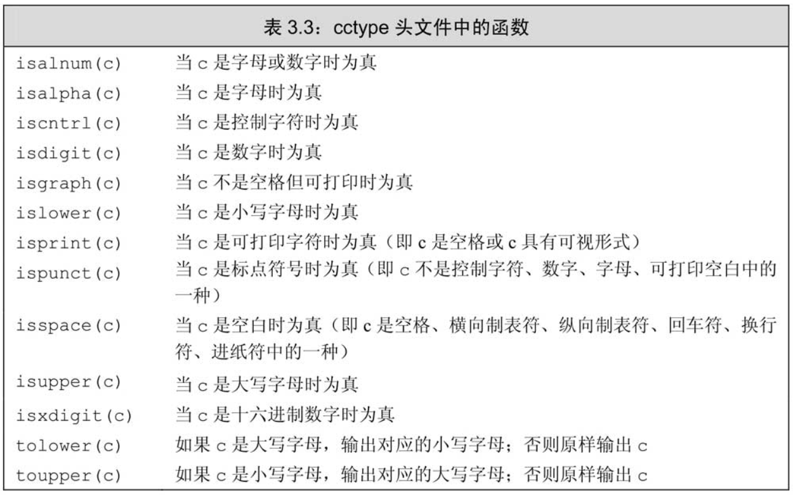
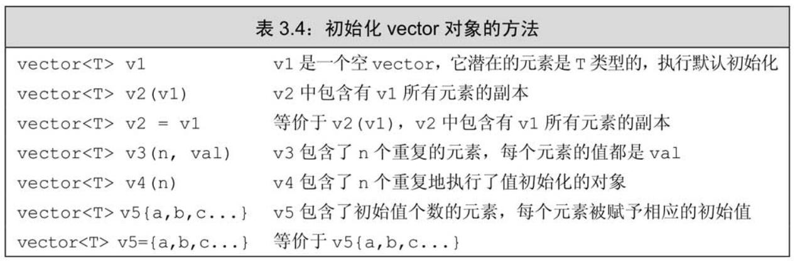
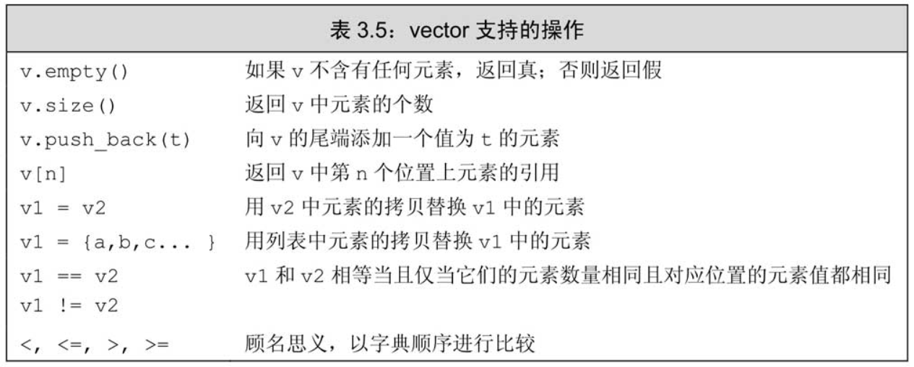
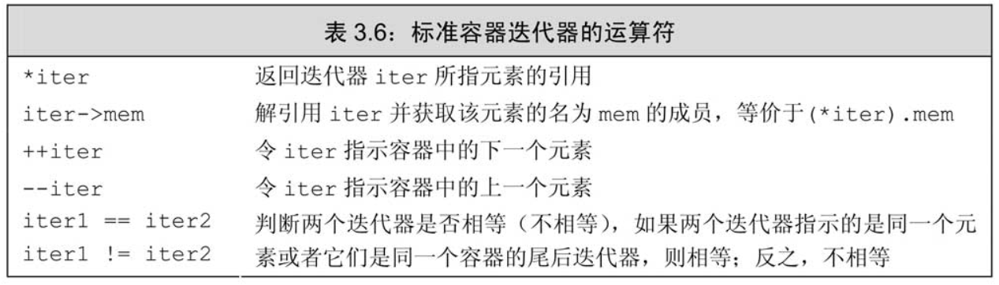
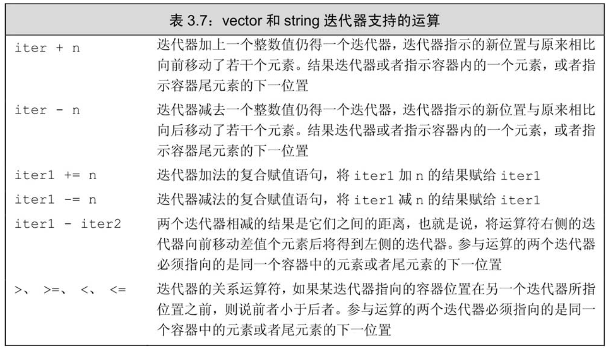

title:: C++ Primer_2

- # 第三章
  id:: 6271fc68-bad7-4552-9e00-85bfc9b51154
  collapsed:: true
	- ## 3.1　命名空间的using声明
	  id:: 6271fc7a-db38-4be7-8ec4-0f9004999086
	- ## 3.2　标准库类型string
	  id:: 6271fd19-a27a-45d7-a83f-631e9556d20c
	  collapsed:: true
		- 标准库类型string表示可变长的字符序列，**使用string类型必须首先包含string头文件**。作为标准库的一部分，**string定义在命名空间std中**。
		- ### 3.2.1　定义和初始化string对象
		  id:: 6271fd64-c26f-4f6c-974f-df8aaad6b4d4
			- ^^初始化^^
				- 
			- 如果**使用等号（=）初始化一个变量，实际上执行的是拷贝初始化**（copy initialization），编译器把等号右侧的初始值拷贝到新创建的对象中去。与之相反，**如果不使用等号，则执行的是直接初始化**（direct initialization）。
		- ### 3.2.2　string对象上的操作
		  id:: 6271fe88-a8be-40f2-89a5-de1a4b58be27
			- 
			- size函数返回的是一个string：：size_type类型的值。
			- 尽管我们不太清楚string：：size_type类型的细节，但有一点是肯定的：它是一个无符号类型的值（参见2.1.1节，第30页）而且能足够存放下任何string对象的大小。所有用于存放string类的size函数返回值的变量，都应该是string：：size_type类型的。
		- ### 3.2.3　处理string对象中的字符
		  id:: 62731f42-119f-4ab4-a619-b431c3fde9bc
			- 在cctype头文件中定义了一组标准库函数处理这部分工作
			- 
			- **建议：使用C++版本的C标准库头文件**
				- C++标准库中除了定义C++语言特有的功能外，也兼容了C语言的标准库。C语言的头文件形如name.h，C++则将这些文件命名为cname。也就是去掉了.h后缀，而在文件名name之前添加了字母c，这里的c表示这是一个属于C语言标准库的头文件。
			- 如果想对string对象中的每个字符做点儿什么操作，目前最好的办法是使用C++11新标准提供的一种语句：范围for（range for）语句。这种语句遍历给定序列中的每个元素并对序列中的每个值执行某种操作，其语法形式是：
				- ```cpp
				  for(declaration:expression)
				    	statement
				  ```
				- 其中，expression部分是一个对象，用于表示一个序列。declaration部分负责定义一个变量，该变量将被用于访问序列中的基础元素。每次迭代，declaration部分的变量会被初始化为expression部分的下一个元素值。
				- 举一个简单的例子，我们可以使用范围for语句把string对象中的字符每行一个输出出来：
					- ```cpp
					  string str("some string");
					  for(auto c:str)
					  {
					    cout<<c<<endl;
					  }
					  ```
			- **使用范围for语句改变字符串中的字符**
				- 如果想要改变string对象中字符的值，必须把循环变量定义成引用类型。当使用引用作为循环控制变量时，这个变量实际上被依次绑定到了序列的每个元素上。使用这个引用，我们就能改变它绑定的字符。
				- 如：输出大写字母：
					- ```cpp
					  string s("hello world!!!");
					  for(auto &c:s)//要用引用！
					  {
					    c = toupper(c);
					  }
					  cout<<s<<endl;
					  ```
			- **只处理一部分字符？**
				- 要想访问string对象中的单个字符有两种方式：一种是使用下标，另外一种是使用迭代器
				- 下标运算符（[ ]）接收的输入参数是string：：size_type类型的值，这个参数表示要访问的字符的位置；**返回值是该位置上字符的引用**。
				-
	- ## 3.3　标准库类型vector
	  id:: 62736f6b-5af2-43b9-bb47-99f6fb01310c
	  collapsed:: true
		- vector头文件声明
			- ```cpp
			  #include<vector>
			  using std::vector;
			  ```
		- 对于类模板来说，我们通过提供一些额外信息来指定模板到底实例化成什么样的类，需要提供哪些信息由模板决定。提供信息的方式总是这样：即在模板名字后面跟一对尖括号，在括号内放上信息。
		- 以vector为例，提供的额外信息是vector内所存放对象的类型：
			- ```cpp
			  vector<int> ivec;
			  vector<Sales_item> Sales_vec;
			  vector<vector<string>> file;
			  ```
		- vector是模板而非类型
		- ### 3.3.1　定义和初始化vector对象
		  id:: 627370eb-6310-4c44-bf01-9f3a69b6b92e
		  collapsed:: true
			- 
			- 可以默认初始化vector对象：
				- ```cpp
				  vector<string> svec;//默认初始化，svec不含任何元素
				  ```
			- 初始化的真实含义依赖于传递初始值时用的是花括号还是圆括号。
				- ```cpp
				  vector<int> v1(10);//v1有10个元素，每个值都是0
				  vector<int> v2{10};//v2有1个元素，该元素的值是10
				  
				  vector<int> v3(10,1);//
				  vector<int> v4{10,1};
				  ```
			-
		- ### 3.3.2　向vector对象中添加元素
		  id:: 6273982d-63ad-4149-91bb-9d3009855c65
		  collapsed:: true
			- 如果循环体内部包含有向vector对象添加元素的语句，则不能使用范围for循环。
			-
		- ### 3.3.3　其他vector操作
		  id:: 62739831-055f-468f-8f47-b5153127e662
			- 
			- vector的比较：
				- 两个vector对象相等当且仅当它们所含的元素个数相同，而且对应位置的元素值也相同。关系运算符依照字典顺序进行比较：如果两个vector对象的容量不同，但是在相同位置上的元素值都一样，则元素较少的vector对象小于元素较多的vector对象；若元素的值有区别，则vector对象的大小关系由第一对相异的元素值的大小关系决定。
				- 只有当元素的值可比较时，vector对象才能被比较。
			-
	- ## 3.4　迭代器介绍
	  id:: 62739b10-f0fb-430b-9772-d950d08d4689
	  collapsed:: true
		- 我们已经知道可以使用下标运算符来访问string对象的字符或vector对象的元素，还有另外一种更通用的机制也可以实现同样的目的，这就是迭代器（iterator）。
		- ### 3.4.1　使用迭代器
		  id:: 62739b24-676f-49fa-acb2-c9039d9d995d
		  collapsed:: true
			- ```cpp
			  auto b = v.begin(),e = v.end();
			  //b表示v的第一个元素，e表示v的最后一个元素的下一个位置。
			  ```
			- end成员返回的迭代器常被称作尾后迭代器（off-the-end iterator）或者简称为尾迭代器（end iterator）
			- 如果容器为空，则begin和end返回的是同一个迭代器，都是尾后迭代器。
			- begin和end返回的具体类型由对象是否是常量决定，如果对象是常量，begin和end返回const_iterator；如果对象不是常量，返回iterator；
			- 为了便于专门得到const_iterator类型的返回值，C++11新标准引入了两个新函数，分别是cbegin和cend：
				- 类似于begin和end，上述两个新函数也分别返回指示容器第一个元素或最后元素下一位置的迭代器。有所不同的是，不论vector对象（或string对象）本身是否是常量，返回值都是const_iterator。
			- **迭代器运算符**
				- 
				- 使用==和！=来比较两个合法的迭代器是否相等，如果两个迭代器指向的元素相同或者都是同一个容器的尾后迭代器，则它们相等；否则就说这两个迭代器不相等。
				- 和指针类似，也能通过解引用迭代器来获取它所指示的元素
				- 迭代器就类似指针。
				- 为了简化表达式，C++语言定义了箭头运算符（->）。箭头运算符把解引用和成员访问两个操作结合在一起，也就是说，it->mem和（＊it）.mem表达的意思相同。
			- 从逻辑上来说，迭代器的递增和整数的递增类似，整数的递增是在整数值上“加1”，迭代器的递增则是将迭代器“向前移动一个位置”。
			- 因为end返回的迭代器并不实际指示某个元素，所以不能对其进行递增或解引用的操作。
			- **迭代器类型**
				- 一般来说我们也不知道（其实是无须知道）迭代器的精确类型。而实际上，那些拥有迭代器的标准库类型使用iterator和const_iterator来表示迭代器的类型。
			- **谨记，但凡是使用了迭代器的循环体，都不要向迭代器所属的容器添加元素。**
			-
		- ### 3.4.2　迭代器运算
		  id:: 62739f81-6e9e-4e37-92e4-89e020b9d40c
		  collapsed:: true
			- **string和vector的迭代器提供了更多额外的运算符**，一方面可使得迭代器的每次移动跨过多个元素，另外也支持迭代器进行关系运算。所有这些运算被称作**迭代器运算**（iterator arithmetic）
				- 
			- 如：下面的代码得到一个迭代器，它指向某vector对象中间位置的元素：
				- ```cpp
				  auto mid = vi.begin()+vi.size()/2;
				  //计算得到最接近vi中间元素的迭代器
				  ```
				- 如果vi有20个元素，vi.size（）/2得10，此例中即令mid等于vi.begin（）+10。已知下标从0开始，则迭代器所指的元素是vi[10]，也就是从首元素开始向前相隔10个位置的那个元素。
			- 关系运算符：<、>、<=、>=
				- ```cpp
				  if(it<mid)
				    //可以处理vi前半部分数据
				  ```
			- it1-it2：返回值类型是名为difference_type的带符号整型数，他表示it2移动多少步得到it1。string和vector都定义了difference_type，因为这个距离可正可负，所以difference_type是带符号类型的。