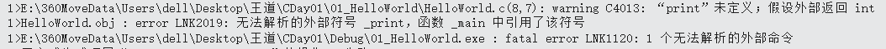
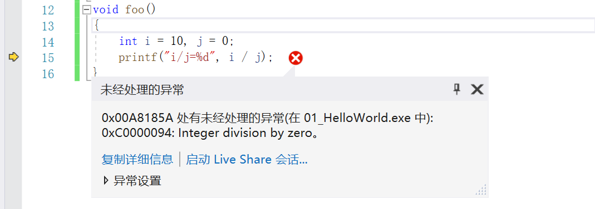
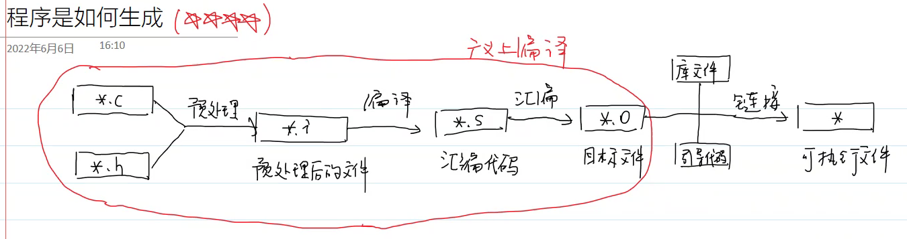
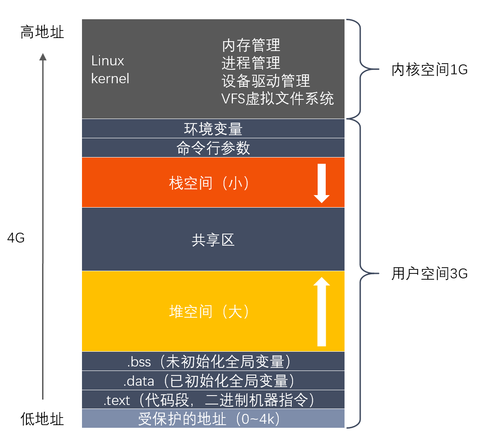
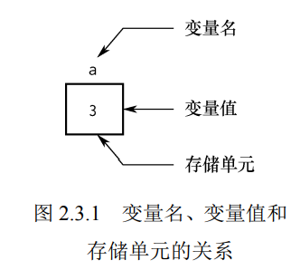

title:: CDay01_2

#王道

- # 一、C语言历史
	- BCPL->B->C->用C重写了整个Unix系统
	- C语言虽是一门高级语言，但是可以直接操作硬件（因为它要写操作系统，需要直接操作硬件资源），性能非常高
		- 不会检查数组是否越界，因为检查会损耗运行时性能
		- 没有try...catch机制，因为这个机制会损坏运行时性能
	- C语言和汇编语言之间有比较强的对应关系
- # 二、VS的基本操作
	- 解决方案，管理多个项目
		- 项目1：
			- 头文件：*.h
			- 源文件：*.c
			- 资源文件：配置文件、图片、音视频
		- 项目2：
			- 头文件
			- 源文件
			- 资源文件...
	- **熟悉调试步骤**
- # 三、HelloWorld
	- ```CPP
	  #include "stdio.h"//预处理指令：头文件包含
	  
	  int main(void)//main函数：程序的入口，操作系统会调用main函数
	    				//void是关键字，表示没有参数；int表示返回值类型
	  {
	  	printf("Hello World\n");//\n是转义序列：换行
	  
	  	return 0;
	  }
	  ```
	- _问题：main函数的返回值有什么作用？谁会接收这个返回值？_
		- **返回的值是状态码：表示程序的退出状态**
			- 0表示程序正常退出，非0表示程序异常退出。
		- **返回给调用者**，main函数的调用者是操作系统，所以返回给操作系统。
	- ^^**错误类型**^^：
		- 
			- C表示Compile，^^编译错误^^。
		- 
			- LNK表示Link：^^链接错误^^
				- 1. 函数名写错了
				  2. 缺少对应的头文件包含
		- 
			- ^^运行时错误^^
	-
- # ^^四、程序是如何生成的？^^
	- \*.c+\*.h--->预处理--->\*.i--->编译--->\*.s--->汇编--->\*.o
		- 广义上的编译过程
		- *.i：预处理后的文件
		- *.s：汇编代码
		- *.o：目标文件
	- \*.o+库文件+引导代码--->可执行文件
	- {:height 194, :width 706}
	- ## 1.预处理
		- ^^主要作用：执行预处理指令：以\#开头的命令^^。包含三类预处理指令
		- **`#include`头文件包含**
			- 原理：将头文件中的内容复制到这里。
			- 项目-属性-C/C++-预处理器-预处理到文件：可以查看.i文件
		- **`#define N 5`宏定义**
			- 原理：简单的文本替换
			- 源代码：
				- ```CPP
				  #define N 5
				  	
				  	printf("Hello World\n");
				  	printf("%d\n", N);
				  ```
			- 预处理后代码：
				- ```CPP
				  	printf("Hello World\n");
				  	printf("%d\n", 5);
				  ```
		- **`#define FOO(x) 1+x*x`宏函数**
			- ```CPP
			  #define FOO(x) 1+x*x
			  
			  	printf("Hello World\n");
			  	printf("%d\n", 3 * FOO(3));
			  ```
			- 预处理后
			- ```CPP
			  	printf("%d\n", 3*1+3*3);
			  ```
			- 为了避免优先级问题，原表达式要用括号括起来
				- `#define FOO(x) （1+x*x）`
			- ^^**四个注意事项**^^
				- 1. 左括号应该紧贴宏函数名称，不然就成为了宏定义
				- 2. 应该把整个宏函数表达式括起来
					- 但是FOO(1+2)这样还会出现问题。不是想要的FOO(3)
				- 3. 为参数添加括号`#define FOO(x) （1+(x)*(x)）`
					- 但是对于FOO(i++)又有问题，我只需要i加一次，但是宏替换后会多次+1
				- 4. 警惕宏函数导致的多次副作用。尽量别使用i++、i--
		- **思考：宏函数用起来这么麻烦，为什么C语言会提供这样的特性？**
			- 效率高
			- 对于小型的，需要多次调用的函数，使用宏函数进行替换，可以节省大量的函数调用时间。
	- ## 2.编译
		- 在线编译网站：https://godbolt.org/
	- ## 3.汇编
		- 把汇编代码翻译成对应平台的机器指令
	- ## 4.链接
		-
- # ^^五、进程的虚拟内存空间^^ #card
  card-last-interval:: 4
  card-repeats:: 1
  card-ease-factor:: 2.6
  card-next-schedule:: 2022-07-12T00:08:44.441Z
  card-last-reviewed:: 2022-07-08T00:08:44.441Z
  card-last-score:: 5
	- 程序：可执行的静态的文件
	- 进程：执行中的程序
	- 32位地址空间：
	- 
		- 0~4K：有特殊用途，不可以访问（代表空指针NULL就指向的0）
		-
- # 六、变量和常量
	- ## 1.变量
		- 在程序运行过程中，可以发生改变的量。
		- 变量的本质：一片内存空间。
			- 变量代表内存中具有特定属性的一个存储单元
			- 
		- 变量的三要素
			- 1. 如何引用这片内存空间--->变量名
			  2. 这片内存空间有多大？如何解释这片内存空间中的数据？--->数据类型
			  3.如何设置这片内存空间的数据--->值
	- ## 2.常量 #card
	  card-last-interval:: 4
	  card-repeats:: 1
	  card-ease-factor:: 2.36
	  card-next-schedule:: 2022-07-13T01:06:29.864Z
	  card-last-reviewed:: 2022-07-09T01:06:29.867Z
	  card-last-score:: 3
		- 在程序的运行期间不可以发生改变的量。
		- 两种定义常量的方法：
			- ^^宏定义^^
			- ^^const关键字^^
				- >本质区别：宏定义是一个预处理指令，在预处理阶段会替换--->在编译阶段就知道常量的具体值，
				- >在C语言中，const定义的常量代表一片内存空间，只是这片内存空间不能够修改--->在编译阶段是不知道他的具体值的，只有在运行阶段才分配内存，才知道值。
					- ^^const定义的常量，相当于变量，只是不能够修改。^^
					- [const](obsidian://open?vault=My_Computer&file=01.Learn%2F102.C%2B%2B%2Fconst)
				- 1. const定义的常量不能作为数组的长度：因为C语言的数组必须在编译时就知道数组的长度，以分配内存空间。
					- ```CPP
					  #define N 5;
					  const M = 5;
					  
					  int array[N];
					  int arr[M];//错误
					  
					  switch(i)
					    case M://错误
					  {
					    
					  }
					  ```
				- 2. 不能够作为switch语句的case标签：编译器事先要知道case标签，进行优化之类的。
				-
	-
- # 七、标识符和关键字
	- ## 1.标识符
		- identifier：为变量、函数、宏起的名字。
		- 以字母、数字、下划线组成，字母、下划线开头。
		-
		- 规范：见名知义
			- 单词与单词之间以下划线分割：symbol_table
			- 驼峰命名法：symbolTable
		-
		- 注意事项：
			- 1. 标识符是区分大小写的
			  2. 标识符不能够与关键字冲突：https://en.cppreference.com/w/c
		-
		- 在大多数IDE中，关键字都有特殊的颜色进行标识。
-