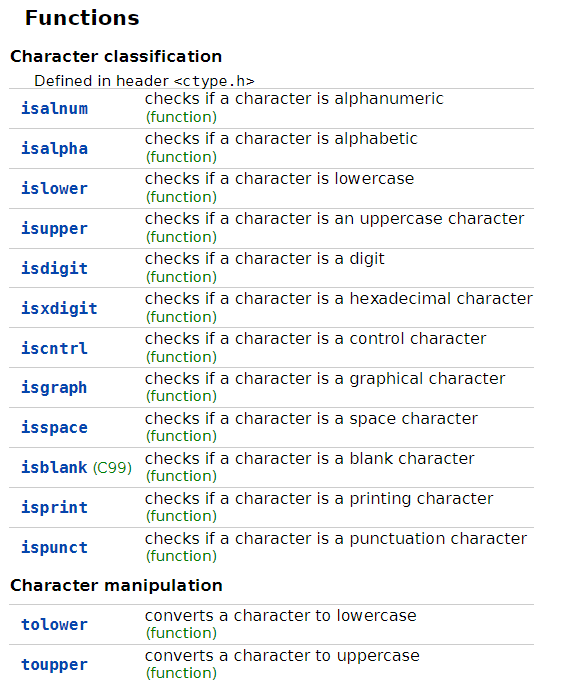

#王道

- # 一、输入输出模型
	- ## 1.计算机是由哪几部分组成？
	  collapsed:: true
		- **现代是存储程序型计算机**：输入、存储器、控制器、运算器、输出。
		- 最简单的计算机：输入、运算器、输出。
	- ## ^^2.输入输出模型^^
	  collapsed:: true
		- 核心的矛盾：CPU、内存、I/O设备存在很大的速度差异。
		  collapsed:: true
			- CPU一天，内存一年（CPU一天处理的数据量，内存要传一年）
			- 内存一天，I/O十年
		-
		- 木桶理论：一个木桶能装多少水，取决于最短的那块木板。
		-
		- CPU、内存：Cache、编译器优化、TLB...
		- 内存、I/O：缓冲区（buffer）、缓存（Redis）...
		  collapsed:: true
			- 
			- buffer相当于一个队列，一端写入，一端读出。
			- 缓存就是一个集合，当需要一个数据时，先去缓存找一找，没有再去其他地方找
		- CPU、I/O：DMA...
		-
		- ^^**键盘--->缓冲区(stdin，在内存中)--->程序--->缓冲区(stdout，在内存中)--->屏幕**^^
		-
	-
- # 二、格式化输出
  card-last-interval:: 4
  card-repeats:: 1
  card-ease-factor:: 2.36
  card-next-schedule:: 2022-07-11T01:02:55.189Z
  card-last-reviewed:: 2022-07-07T01:02:55.191Z
  card-last-score:: 3
	- printf：格式化输出
		- print：打印
		- f：format，格式
		-
	- **原型**：int printf ( 格式化字符串,表达式1,表达式2,...)
	- **作用**：显示格式化字符串里面的内容，并且会在字符串指定的位置插入后面表达式的值。
	-
	- **格式化字符串包含**：
		- 1. 普通字符
			- 直接输出普通字符
		- 2. 转换说明
			- 以%开头的内容，表示一个占位符，输出时会用后面表达式的值替换这些占位符。
			- 作用：
				- 1. 以何种方式解释内存区域
				- 2. 控制输出格式
	-
	- 转换说明的格式：%m.pX ^ea8a53
	  id:: 62bc0330-e9ee-4247-8be6-8b1605fe65ba
		- m：minimal field width：最小字段宽度：整数--->表明要显示最少字符的数量
		- p：precision：精度：整数
			- d：p代表要显示数字的最少个数（必要时会在前面补0），如果省略，默认为1.
				- ```CPP
				  	int i = 10;
				  	printf("i = %4.3d\n", i);
				  	printf("i = %4.4d\n", i);
				  	printf("i = %4.5d\n", i);
				  /*
				  i =  010
				  i = 0010
				  i = 00010
				  */
				  ```
			- f：p就代表小数点后面数字的个数（默认为6）
				- ```cpp
				  	float f = 3.14f;
				  	printf("f = %10f\n", f);
				  	printf("f = %10.2f\n", f);
				  	printf("f = %10.5f\n", f);
				  /*
				  f =   3.140000
				  f =       3.14
				  f =    3.14000
				  */
				  ```
			- 对齐方式：默认情况是右对齐，加上 '-' 可以指定为左对齐
				- ```CPP
				  	float f = 3.14f;
				  	printf("f = %-10f\n", f);
				  	printf("f = %-10.2f\n", f);
				  	printf("f = %-10.5f\n", f);
				  /*
				  f = 3.140000
				  f = 3.14
				  f = 3.14000
				  */
				  ```
		- X：字母，表示以何种方式解释内存区域
		- m.p：控制输出格式
	-
	- printf的返回值表示显示字符的个数（\\n等字符别忘）。
		- ```CPP
		  	int n;
		  	n = printf("f = %10f\n", f);
		  //n=15
		  ```
- # 三、格式化输入
  collapsed:: true
	- scanf
	  collapsed:: true
		- scan：扫描
		- f：format
	- **从键盘输入的都是字符，scanf匹配的也全是字符，没有整数的概念，匹配完了才有**
	- **原型**：int scanf(格式化字符串,表达式1,表达式2...)
	- **scanf本质上是一个“模式匹配”函数**，试图把输入的字符与格式化字符串进行匹配。
	- **工作原理**：从左到右依次匹配格式化字符串，如果匹配成功，则继续匹配后面的字符，如果匹配失败，则立即返回
	-
	- 键盘--->缓冲区(stdin，队列：)--->scanf会进行字符匹配--->程序
	  collapsed:: true
		- 
		- 从键盘读入到缓冲区，比如读入：10 3.14159\\n
		- 缓冲区是一个队列，所以里面的数据就是：\\n95141.3 01
		- scanf开始模式匹配，
		  collapsed:: true
			- %d：匹配整数，匹配到10。当匹配到空格，不再是整数，匹配不上，push_back回去空格。将匹配出的数值10存入&i地址。push_back空格其实相当于词法分析的超前搜索
			- %f：从退回的空格开始匹配，匹配出3.14159，在匹配到换行，退回换行。将匹配出的数值存入&f地址
		-
	- **转换说明的作用**
	  collapsed:: true
		- 1. 表示匹配规则
		- 2. 表示如何将字符数据转换为二进制数据
	-
	- **格式化字符串**
	  collapsed:: true
		- collapsed:: true
		  1. 普通字符
			- 空白字符（空格、制表符、换行符...）--->匹配任意多个空白符，包括0个。
			- 其他字符：精确匹配
			  collapsed:: true
				- ```CPP
				  	int i;
				  	float f;
				  	scanf("i = %d,f = %f", &i, &f);
				  /*
				  输入：10 3.14
				  i和f不会变
				  因为scanf是模式匹配，先匹配i，i普通字符中的其他字符，需要精确匹配，
				  而输入中没有i，匹配失败退出。
				  */
				  /*
				  输入：i=10,f=3.14
				  匹配成功
				  i精确匹配，空白字符略过，最后能匹配成功
				  */
				  ```
			- ^^scanf在处理%d，%f（进行数值匹配时），会读取前置空白字符^^
			  collapsed:: true
				- ```CPP
				  	int i,j;
				  	float f,g;
				  	scanf("%d%d%f%f", &i, &j , &f, &g);
				  /*
				  输入：
				  
				  1 4
				  
				  
				  3.14
				  
				  5.2
				  
				  仍然能读取成功，因为数值匹配会读取前置空白符，但是不会读取后面的空白字符，
				  会push_back
				  */
				  ```
		- 2. 转换说明：和printf一致
	- **scanf的返回值表示什么意思？**
	  collapsed:: true
		- 表示正确匹配的转换说明的个数。
		- ```CPP
		  	int i;
		  	float f;
		  	int n = scanf("i = %d, f = %f", &i, &f);
		  /*
		  输入：
		  i=10 ,f=3.14（10后面,前面多加一个空格），到这里,需要进行精确匹配，而缓冲区是一个空格，所以
		  匹配失败。
		  n=1
		  表示正确匹配的转换说明的个数。
		  */
		  ```
	- ^^**空格可以匹配任意数量的空格**^^
- # 四、基本数据类型
  collapsed:: true
	- 基本数据类型
	  collapsed:: true
		- 整数类型
		- 浮点数类型
		- 字符类型
		  collapsed:: true
			- C语言把字符类型当作整数类型处理。
	- ## 1.整数类型
	  collapsed:: true
		- 整数类型：有符号整数、无符号整数
		- short (int)
		  collapsed:: true
			- unsigned short (int)
		- int
		  collapsed:: true
			- unsigned (int)
		- long (int)
		  collapsed:: true
			- unsigned  long (int)
		- long long (int)
		  collapsed:: true
			- unsigned  long long (int)
		-
		- 注意事项：
		  collapsed:: true
			- C语言没有明确规定各个整数类型的大小，他们的大小可能随机器的不同而不同
			- C语言规定了各个类型的最小大小
			  collapsed:: true
				- int≥2B，long≥4B
			- short≤int≤long≤long long
		-
		- ### ^^1.编码^^
		  collapsed:: true
			- **无符号整数**（以一个字节为例）
			  collapsed:: true
				- 1001 0011 = 147
			- **有符号整数（补码）**
			  collapsed:: true
				- 1001 0011 = -109
			- 为什么有符号整数会采用补码？
			  collapsed:: true
				- 利用加法器做减法运算。
			- 补码的数学原理：
			  collapsed:: true
				- 模运算
		- ### 2.64位机器上整数类型的常见范围
		  collapsed:: true
			- | 类型               | 字节   | 最小值 | 最大值 |
			  | ------------------ | ------ | ------ | ------ |
			  | short              | 2      |   -2^15     |    2^15-1    |
			  | unsigned short     | 2      | 0      |   2^16-1     |
			  | int                | 4(≥2B)      |     -2^31   |    2^31-1    |
			  | unsigned int       | 4      | 0      |   2^32-1     |
			  | long               | 8(≥4B) |    -2^63    |    2^63-1    |
			  | unsigned long      | 8      |    0    |   2^64-1     |
			  | long long          | 8(≥8B) |    -2^63    |   2^63-1     |
			  | unsigned long long | 8      |   0     |    2^64-1    |
		- ### 3.整数常量
		  collapsed:: true
			- 三种表示方式：
			  collapsed:: true
				- 十进制：不能以0开头
				- 八进制：以0开头
				- 十六进制：以0x开头
			- 整数常量的类型变迁
			  collapsed:: true
				- 十进制：int--->long--->long long--->unsigned long long--->error!
				  collapsed:: true
					- ```CPP
					  10;//int
					  10000000000000;//long long
					  ```
					- 微软VS里long和int都是4B，所以int表示不了就直接跳到了long long
				- 八进制、十六进制：int--->unsigned--->long--->unsigned long--->long long--->unsigned long long--->error!
			- 我们也可以在整数常量后添加后缀指定整数常量的类型（不区分大小写，建议大写，容易区分）
			  collapsed:: true
				- U：unsigned
				- L：long
				- LL：long long
				- 可以混合使用：43UL：unsigned long、43LU：unsigned long、43ULL：unsigned long long
			-
		- ### 4.读写整数
		  collapsed:: true
			- %d：有符号十进制整数--->decimal
			- %u：无符号十进制整数--->unsigned
			- %o：无符号八进制整数--->octal
			- %x：无符号十六进制整数--->hexadecimal
			  collapsed:: true
				- 不用h是因为h被占用了，元音字母一般不会使用
			- 读写短整型，在d、u、o、x前添加h--->(short)，s被占用了
			- 读写长整数，在d、u、o、x前添加 l -->long
			- 读写长长整数，在d、u、o、x前添加 ll -->long long
			- ```CPP
			  	short s;
			  	long l;
			  	long long ll;
			  	scanf("%hd", &s);
			  	printf("%hd\n", s);
			  
			  	scanf("%ld", &l);
			  	printf("%ld\n", l);
			  
			  	scanf("%lld", &ll);
			  	printf("%lld\n", ll);
			  ```
		-
	- ## 2.浮点数类型
	  collapsed:: true
		- 浮点数
		  collapsed:: true
			- float--->4B
			- double--->8B
			- long double--->用于高精度数值计算中，一般用不到
		- ### ^^1.浮点数的编码（IEEE754)^^
		  collapsed:: true
			- 以float为例：
			- | sign（符号位） | Exponent（指数部分，8位） | Fraction（小数部分23位） |
			  | :--------------: | :-------------------------: | :------------------------: |
			  | 31             | 30~23                     | 22~0                         |
			- sign：1表示负，0表示正--->$(-1)^S$
			- Exponent：E-127（2^7-1）（指数部分移码表示）
			  collapsed:: true
				- 表示范围：-127~128，但表示的指数只有：-126~127。其中-127（全为0）和128（全为1）有特殊用途。
			- Fraction：小数部分（补码表示）
			-
			- 三个特殊值：
			  collapsed:: true
				- E全0，F全0，表示±0
				- E全1，F全0，表示±∞
				- E全1，F不全为0，表示NaN，Not a Number
			- 规约数
			  collapsed:: true
				- 指数部分E：[0000 0001，1111 1110]
				- (-1)^S×1.F×2^(E-127)
			- 非规约数
			  collapsed:: true
				- E全0，F不全为0--->表示十分接近于0的数。非规约数的绝对值都是小于规约数的
				- (-1)^S×0.F×2^-126
				  collapsed:: true
					- 不是-127次方
			- float最大的正数：0 1111 1110 111...111=1.111....1(23个)×2^127≈2^128≈3.4×10^38
			- float最小的正数：0 0000 0000 0000...001=(-1)^0 × 0.00...01(23个)×2^-126=2^-149≈1.4×10^-45
			-
			- double类型：
			  collapsed:: true
				- | sign（符号位） | Exponent（指数部分，11位） | Fraction（小数部分52位） |
				  |:--------------:|:--------------------------:|:------------------------:|
				  |       63       |           62~50            |           51~0           |
				- E：E-1023（2^10-1），表示范围：-1023~1024，表示的指数范围：[-1022，1023]
			- double最大的正数：0 1111 1111 110 111...1(52个)=1.11...1×2^1023=1.79×10^308
			- double最小的正数：0 0000 0000 000 000...01(52个)=0.000...01×2^-1022=2^-1074≈4.94^-324
			-
		- ### 2.浮点数常量
		  collapsed:: true
			- 表示方法：要么包含小数点，要么包含字母E(e)
			  collapsed:: true
				- 5.7 57. 5.7e2 5.7e-1
			- 浮点数常量的默认类型：double，如果需要指定为float类型，需要在后面添加F或f后缀。
			  collapsed:: true
				- ```CPP
				  3.14F;//float
				  5.7e-1;//double
				  ```
			-
		- ### 3.读写浮点数
		  collapsed:: true
			- %f：float
			- %lf：double
			  collapsed:: true
				- l 不能大写，大写的L用来表示long double类型。
				- ```CPP
				  double d;
				  scanf("%lf", &d);
				  printf("%lf\n", d);
				  ```
	- ## 3.字符类型
	  collapsed:: true
		- ^^char类型只占一个字节，并且采用ASCⅡ编码^^，ASCⅡ编码用7位表示128个字符（最高位都为0）。
		- 0号编码：表示空字符‘\0’，不是空指针
		- 32号：空格
		- 48号：数字0
		- 65：A
		- 97：a
		-
		- ### 1.字符类型可以进行算术运算和比较运算
		  collapsed:: true
			- 因为C把字符当作整数
			- ```CPP
			  int main()
			  {
			  	int i = 'a';
			  	char ch = 'A';
			  	ch = ch + 1;
			  	ch++;
			  	if (ch >= 'A' && ch <= 'Z')
			  	{
			  		ch = ch - 'A' + 'a';
			  	}
			  }
			  ```
		- ### 2.转义序列
		  collapsed:: true
			- 字符转义序列
			  collapsed:: true
				- \\a（alert，bell）
				- \\b（backspace）空格
				- \\f（form feet）换页
				- \\n（new line）
				- \\r（carriage return） 回车符
				- \\t （horizontal tab）水平制表符
				- \\v （vertical ab）垂直制表符
				- \\
				- \\?
				- \\'
				- \\"
			- 数字转义序列
			  collapsed:: true
				- 八进制形式：以\\开头，后面接最多三位八进制数。‘\0'、'\101'='A'
				- 十六进制形式：以\\x开头，后面接十六进制数。'\x0'、'\x41'='A'
			-
		- ### 3.字符处理函数
		  collapsed:: true
			- 
			- 会查即可
		- ### 4.读写字符
		  collapsed:: true
			- collapsed:: true
			  1. scanf/printf 配合%c来读写字符
				- 注意事项：%c 不会忽略前面的空白字符
				- ```CPP
				  int i;
				  char ch;
				  scanf("%d%c", &i, &ch);
				  printf("i = %d,ch = %c\n", i, ch);
				  /*
				  ch读取了输入的数字之后的空格/换行
				  可以在%c前面加一个空格，以正常读取字符
				  因为空格可以匹配任意多个空白字符
				  */
				  scanf("%d %c", &i, &ch);
				  ```
			- collapsed:: true
			  2. getchar/putchar 读写单个字符
				- getchar/putchar效率比scanf/printf效率高很多（s/p要处理格式串，g/p直接就读写字符）
				- ```CPP
				  char ch;
				  ch = getchar();
				  putchar(ch);
				  ```
				- 惯用法(idiom) 类似作文的成语 让人觉得我是个老程序员
				  collapsed:: true
					- ```CPP
					  while (getchar() != '\n')//读取一行剩余的字符（丢掉）（包括换行符）
					  	;
					  ```
			-
			-
-