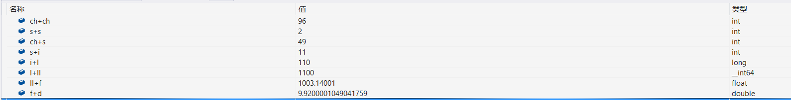
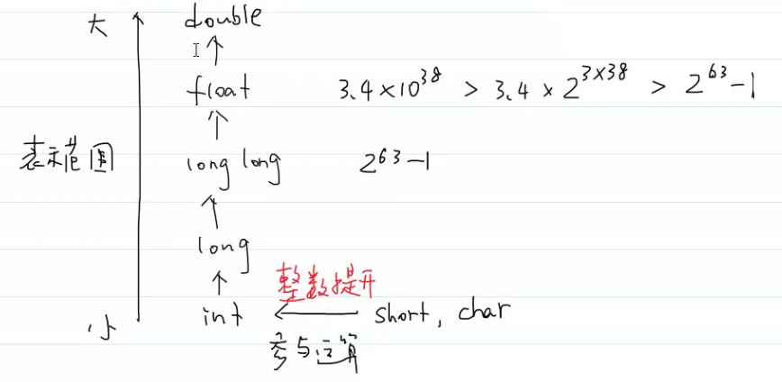

#王道

- # 一、时间复杂度
  collapsed:: true
	- f、g
	- 1. f=O(g)--->f的增长速度不大于g，类比：f≤g
		- g是f的上渐确界
		- 当n足够大时，f(n)≤cg(n)
		- 可以f/g求极限，看结果然后确定O、Ω、Θ。
	- 2. f=Ω(g)--->g是f的下渐确界
	- 3. f=Θ(g)--->f和g的增长速度相当
	-
	- 诀窍：
		- 1. 忽略系数
		- 2. 如果a>b，则n^a>n^b   n^a=Ω(n^b)
		- 3. 指数的增长速度大于多项式  3^n=Ω(n^5)
		- 4. 多项式的增长速度大于对数 n=Ω(log5_2 n)
	-
	-
- # 二、布尔类型
	- C99引入布尔类型，定义在<stdbool.h>
	- **bool类型的本质是无符号整数**
		- ```CPP
		  printf("%u\n", true);
		  printf("%u\n", false);
		  /*
		  1 0
		  */
		  ```
	- 其实true和false是宏：
		- ```CPP
		  #define true 1
		  #define false 0
		  ```
	- ^^**注意事项：**^^
		- 给布尔类型赋值时，非零会转换为true，0会转换为false。
	-
- # 三、类型转换
  card-last-interval:: 4
  card-repeats:: 1
  card-ease-factor:: 2.36
  card-next-schedule:: 2022-07-11T13:03:23.891Z
  card-last-reviewed:: 2022-07-07T13:03:23.894Z
  card-last-score:: 3
	- 1. 为什么需要进行类型转换？
		- 硬件只能对相同“类型”的数据进行运算
			- 类型：占的字节长度大小一致，并且编码一致
	- 2. 什么时候会发生类型转换？
		- 给定的数据类型与需要的数据类型不匹配时，会发生类型转换。
	- 3. 如何进行数据类型转换？
		- 隐式类型转换：编译器做的类型转换。
			- ```CPP
			  	char ch = '0';
			  	short s = 1;
			  	int i = 10;
			  	long l = 100L;
			  	long long ll = 1000LL;
			  	float f = 3.14F;
			  	double d = 6.78;
			  ```
			- {:height 103, :width 746}
				- _int64就是long long
			- 
			- short、char参与运算就会整型提升，变为int进行计算。
			- int、long、long long、float、double的表示范围逐渐增大，混合运算，会往表示范围大的类型转换
			- signed--->unsigned
				- ```CPP
				  	int i = -1;
				  	unsigned u = 100;
				  	if (i < u)
				  	{
				  		printf("%d is less than %u\n", i, u);
				  	}
				  	else
				  	{
				  		printf("%d is greater than %u\n", i, u);
				  	}
				  /*
				  执行else分支
				  因为i<u也是运算。编译器将i隐式转换为unsigned类型，变得大于u
				  */
				  ```
			- ^^**注意事项：不要将无符号整数和有符号整数一起运算**^^
		- 显式类型转换：
			- 1. 计算浮点数的小数部分
				- ```CPP
				  //1.计算浮点数的小数部分
				  	double d = 3.14, fraction;
				  	fraction = d - (int)d;//这样可以计算d的小数部分
				  ```
			- 2. 表明肯定会发生的转换，提高代码的可读性。
				- ```CPP
				  	float f = 3.14F;
				  	//...中间很长的代码
				  	int i = (int)f;//这里进行类型转换，如果不写显式转换，编译器会进行隐式转换
				  	//那我可能就不知道它进行了转换，写出显式转化方便阅读
				  ```
			- 3. 对类型进行更精确的控制
				- ```CPP
				  	int dividend = 4, divisor = 3;
				  	double quotient;
				  	quotient = (double)dividend / divisor;
				  ```
			- 4. 可以避免溢出
				- ```CPP
				  int millisPerDay = 24 * 60 * 60 * 1000;//一天的ms数
				  long long nanosPerDay = 24LL * 60 * 60 * 1000 * 1000 * 1000;
				  long long nanosPerDay = (long long)24 * 60 * 60 * 1000 * 1000 * 1000;//ns
				  //后面常量默认是int类型，所以乘了之后最后的结果溢出了，需要进行强制类型转换
				  //在那里强制转换呢？在第一个数的位置，因为第一个转换后，后面乘就都会转换了。
				  //若写在后面的位置，那就只有那个位置及之后的数字是转换后的，前面还没转换
				  //还是可能溢出的。
				  long long nanosPerDay = 24 * 60 * 60 * 1000 * 1000 * (long long)1000;
				  //错误，前面还是会溢出。
				  
				  //有两种方式：(long long )或者在第一个数后面加LL，推荐第二种方式
				  printf("%lld\n", nanosPerDay / millisPerDay);
				  ```
- # 四、typedef
  card-last-interval:: 4
  card-repeats:: 1
  card-ease-factor:: 2.36
  card-next-schedule:: 2022-07-11T00:38:46.201Z
  card-last-reviewed:: 2022-07-07T00:38:46.203Z
  card-last-score:: 3
	- 作用：给类型起别名。
	- 格式：`typedef type_name alias;`
		- `typedef int Bool;`
	- typedef和宏定义之间的区别：
		- 宏定义是在预处理阶段就进行处理了，编译器是不能够识别宏定义的，因此无法给出一些错误提示。
		- typedef是C语言的一种语法，编译器是可以识别typedef定义的别名的。编译器可以给出相关的错误提示。
		- ^^**定义类型别名：一律使用typedef**^^
	- 为什么要给类型起别名？
		- 可以提高代码的可读性。
		- 增加代码的可移植性
			- ```CPP
			  //定义一个int变量
			  int quantity = 400000;
			  //如果移植到其他机器，他的int类型可能只有2B，这样就溢出了。
			  //这时需要将int改为long或long long，一个一个改就特别麻烦
			  
			  //就可以使用
			  typedef int Quantity；
			  Quantity quantity = 400000;
			  //移植时，就不需要改变他们的类型，只需要改变一条语句
			  //typedef int Quantity
			  //变为typedef long Quantity
			  ```
	- `typedef void(*Func)()`：定义的是一个新类型，类型名为Func，其为指向void()()的函数指针。
- # 五、sizeof
	- [sizeof那些事儿](obsidian://open?vault=My_Computer&file=01.Learn%2F102.C%2B%2B%2Fsizeof)
	- 作用：计算某一类型的数据所占字节的大小
		- 格式：sizeof(typename)
		- ```CPP
		  int i = 3;
		  /*
		  监视 
		  sizeof(int) = 4
		  sizeof(int) = 4
		  sizeof(1) = 4
		  sizeof(i+1) = 4
		  ```
	- sizeof返回unsigned int类型。
	- **sizeof不关注i的取值，只关注i的类型**
		- ```CPP
		  int i;
		  printf("%u\n", i);//报错，i未初始化
		  printf("%u\n", sizeof(i));//正常输出4
		  ```
	- ^^**注意事项：sizeof运算符是在编译期间进行计算的，因此它是一个常量表达式。**^^
		- 所以它可以作为数组长度，也可以作为case的标签。
	-
- # 六、表达式
	- 什么叫表达式？
		- 计算某个值的公式
	- 最简单的表达式：变量、常量。
	-
	- 运算符：连接表达式，创建更复杂的表达式。
	- 运算符：
		- 算术运算符
		- 逻辑运算符
		- 关系运算符
		- 位运算
		- 符赋值运算符
		- 比较运算符
		- ...
	- **运算符的两个属性**
		- 优先级
		- 结合性
-