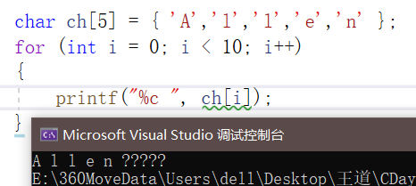

#王道

- # 一、指针和数组的关系
  collapsed:: true
	- ## 1.指针的算术运算
	  collapsed:: true
		- 当指针指向数组元素时，可以通过指针的算术运算，去访问数组的其他元素
		  collapsed:: true
			- collapsed:: true
			  1. 指针加上一个整数
				- 指针指向一个数组元素，且加减后不越界。
			- 2. 指针减去一个整数
			- collapsed:: true
			  3. 两个指针可以相减（**没有两个指针相加**）
				- 两个指针指向同意数组的元素
				- ```CPP
				  int arr[] = { 0,1,2,3,4,5,6,7,8,9 };
				  int* p = &arr[2];
				  int* q = p + 3;
				  //3以p指向的基本数据类型所占的大小为单位
				  p += 6;
				  printf("*p = %d\n", *p);
				  printf("*q = %d\n", *q);
				  ```
				- 
				- ^^**注意事项：指针的算术运算以基础类型（int）所占字节数为单位。**^^
			- ```CPP
			  	int arr[] = { 0,1,2,3,4,5,6,7,8,9 };
			  	int* p = &arr[2];
			  	int* q = &arr[5];
			  	printf("p - q = %d\n", p - q);
			  	printf("p - q = %d\n", p - q);
			  //两个指针的值，就是地址值相减。
			  //-3 3.
			  //单位是4B
			  ```
		- 指针的比较运算（两个指针指向同一数组的元素）
		  collapsed:: true
			- p-q<0--->p<q
			- p-q=0--->p=q
			- p-q>0--->p>q
	- ## 2.用指针处理数组
	  collapsed:: true
		- collapsed:: true
		  ```CPP
		  int arr[] = { 0,1,2,3,4,5,6,7,8,9 };
		  int sum = 0;
		  for (int* p = &arr[0]; p < &arr[10]; p++)
		  {
		  	sum += *p;
		  }
		  printf("sum = %d\n", sum);
		  ```
			- **对`&arr[10]`前面有&，所以只会计算地址，并不会访问`arr[10]`，因此不会发生数组越界。**
		- *和++的组合
		  collapsed:: true
			- \*p++，*(p++)：表达式的值为\*p，副作用为p自增。
			- (\*p)++：表达式的值是\*p，副作用是*p自增。
			- \*++p，\*(++p)：表达式的值是*(p+1)，副作用是p自增。
			- ++\*p：表达式的值为(\*p)+1，副作用是*p自增
		- *和--也有类似组合
		  collapsed:: true
			- \*p--，*(p--)：表达式的值为\*p，副作用为p自减。
			- (\*p)--：表达式的值是\*p，副作用是*p自减。
			- \*--p，\*(--p)：表达式的值是*(p-1)，副作用是p自减。
			- --\*p：表达式的值为(\*p)-1，副作用是*p自减
			- ```CPP
			  int* p = &arr[0]；
			  while ( p < &arr[10])
			  {
			  	sum += *p++;
			  }
			  ```
		-
		- ^^**把数组名作为指针**^^，其为指向数组第一个元素的指针。
		  collapsed:: true
			- ```CPP
			  int arr[] = { 0,1,2,3,4,5,6,7,8,9 };
			  *arr = 10;
			  *(arr + 7) = 70;
			  //可以简化代码
			  for(int *p = arr ; p < arr + 10 ; p++)
			  {
			  }
			  ```
			- **数组名可以当作指向数组第一个元素的指针去使用，但是不能修改它的值，因为他是一个常量**
			-
		- ^^**指针也可以作为数组名使用**^^，对指针使用`[]`运算符
		  collapsed:: true
			- ```CPP
			  #include<stdio.h>
			  int find_largest(int* arr, int n);
			  int main()
			  {
			  	int arr[] = { 0,1,2,3,4,5,6,7,8,9 };
			  	int max = find_largest(arr, 10);
			  	printf("max = %d\n", max);
			  }
			  int find_largest(int* arr, int n)
			  {
			  	int max = *arr;
			  	for (int i = 1; i < n; i++)
			  	{
			  		if (*(arr + i) > max)max = *(arr + i);
			  	}
			  	return max;
			  }
			  //改为：
			  int find_largest(int* arr, int n)
			  {
			  	int max = arr[0];
			  	for (int i = 1; i < n; i++)
			  	{
			  		if (arr[i] > max)max = arr[i];
			  	}
			  	return max;
			  }
			  ```
			- 
			- 二维数组是按行连续存放的，所以`matrix[0][5]`地址为：`base_addr+0*3*sizeof(int)+5*sizeof(int)`
			  collapsed:: true
				- 指针运算默认单位为指针指向元素类型所占字节数，所以编程时，就不加`sizeof(elem_type)`。
			-
		- ^^**总结：指针和数组的关系**^^
		  collapsed:: true
			- 可以利用指针处理数组（指针的算术运算）
			- 数组名可以作为指向数组第一个元素的指针。
			- 可以对指针使用`[]`运算符（把指针当作数组名使用）
			-
- # 二、字符串
  card-last-interval:: 4
  card-repeats:: 1
  card-ease-factor:: 2.36
  card-next-schedule:: 2022-07-13T01:22:20.373Z
  card-last-reviewed:: 2022-07-09T01:22:20.374Z
  card-last-score:: 3
  collapsed:: true
	- ## 1.字符串的字面值
	  collapsed:: true
		- collapsed:: true
		  ```CPP
		  printf("hello world,\n");
		  printf("I love xixi\n"
		         "       -From Peanut");
		  //一行占不下，就可以用第二种，
		  ```
			- 编译时会把相邻的字符串字面值，合并成一个。
			  collapsed:: true
				- 相邻：两个字符串字面值仅以空白字符分割。
		- **字符串字面值是如何存储的**
		  collapsed:: true
			- 
			- `printf("hello world,\n");`
			  collapsed:: true
				- 传递的第一个参数其实是一个字符指针
			- 
			  collapsed:: true
				- const char*类型
		-
	- ## 2.字符串变量
	  collapsed:: true
		- C语言没有专门的字符串类型，C语言的字符串依赖于字符数组存在--->字符数组末尾加'\0'，不加就会一直读。
		- `char name[10] = "Allen";`不是字符串字面值，本质上是一个数组初始化式，初始化为{'A','l','l','e','n'}，未赋值的地方就为'\0'。name是一个字符数组，“Allen\0”是字符串。
		- ### 1.字符串的初始化
		  collapsed:: true
			- `char name[10] = "Allen";`
			- `char name[5] = "Allen";`--->这是一个字符数组，不是字符串，因为末尾没有'\0'了
			  collapsed:: true
				- C语言认为字符串以'\0'结尾
				- 
				  collapsed:: true
					- 不加就会一直读到有'\0'，即使越界了。
			- 推荐用：`char name[] = "Allen";`，这样末尾就会自动加'\0'。
		- ### 2.字符串变量的初始化和字符指针的初始化
		  collapsed:: true
			- 字符串变量：`char name[] = "Allen";`"Allen"本质是数组的初始化式，是一个字符串变量
			- 字符指针：`char* name = "Allen";`这里"Allen"本质是一个字符串字面值。位于数据段某个区域，"Allen"是一个字符串常量，name指向它。--->其实就是`const char *`
			- 
			- 
			- char* name2的"Allen"是字符串常量
		- ### 3.读写字符串
		  collapsed:: true
			- 写：
			  collapsed:: true
				- printf+%s
				- puts(s)<--->printf("%s\\n",s)
				  collapsed:: true
					- puts会在后面添加一个额外的换行符。
			- 读：
			  collapsed:: true
				- scanf+%s
				  collapsed:: true
					- 匹配规则：%s会跳过前置的空白字符，读取字符存入数组，直到遇到空白字符为止。在最后添加'\0'。
					- ```CPP
					  char name[100];
					  scanf("%s",name);//name是一个地址
					  ```
					- 缺陷：
					  collapsed:: true
						- 永远不会包含空白字符
						- 不会检查数组是否越界。（写一个读一个，不安全）（所以VS里面scanf会报错）
						-
	-