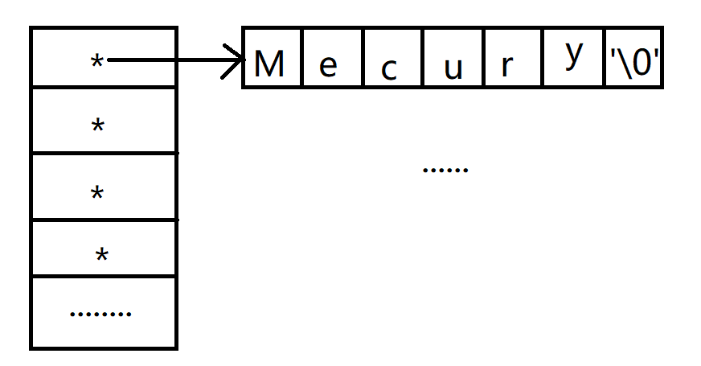

#王道

- # 一、读字符串
  card-last-interval:: 4
  card-repeats:: 1
  card-ease-factor:: 2.36
  card-next-schedule:: 2022-07-12T00:07:50.483Z
  card-last-reviewed:: 2022-07-08T00:07:50.485Z
  card-last-score:: 3
  collapsed:: true
	- 读字符串
	  collapsed:: true
		- scanf+%s
		- gets
		  collapsed:: true
			- `char *gets(char *str);`
			- 读取一整行数据，直到遇到换行符为止（不会跳过前置空白字符，中间的空格也会读取），会读取换行符，并把换行符替换成空字符'\0'，不会像scanf退回。
			- **缺陷**：
			  collapsed:: true
				- 不会检查数组是否越界
			- 因为不会检查数组越界，所以一般自己写：`int read_line(char *str,int n)`n表示最多能读取的字符数，（传数组的长度-1）。--->解决gets缺陷，用`getchar()`实现
	-
- # 二、字符串库函数  
  collapsed:: true
	- 头文件`string.h`
	- `size_t strlen(const char* str)`
	  collapsed:: true
		- const：表示不会修改str指向的字符串的内容。这样的参数称为**传入参数**
		- **计算字符串的长度，不包括'\0'。**
	- `int strcpm(const char *lhs,const char *rhs)`
	- `char *strcat(char *dest,const char*src)`
	  collapsed:: true
		- concatnate:拼接
		- **传入传出参数**：表明在函数中会修改指针指向对象的值。
		- 将src追加到dest的末尾，并返回dest。（不会检查数组是否越界，因为不知道dest的大小）
	- `char *strncat(char *dest,const char*src,int n)`--->解决strcat会越界的缺陷
	  collapsed:: true
		- n：表示最多能够拼接字符的数量，不是dest的长度
		- ```CPP
		  char s1[6] = "abc";
		  char *s2 = "bcd";
		  strncat(s1, s2, 6);//sizeof(s1)-strlen(s1)-1
		  //strncat(s1, s2, sizeof(s1)-strlen(s1)-1);
		  ```
	- `char *strcpy(char *dest,const char *src)`
	  collapsed:: true
		- 缺陷：不会检查数组是否越界。
	- `char *strncpy(char *dest,const char *src,size_t count)`
	  collapsed:: true
		- 最多复制count个字符，并且包含空字符'\0'
		- ```CPP
		  	char s1[6];
		  	char *s2 = "HelloWorld";
		  	strncpy(s1, s2, sizeof(s1) - 1);//-1，给空字符留位置。
		  //因为前面没有初始化为'\0'
		  	s1[sizeof(s1) - 1] = '\0';//设置空字符，不然字符数组不会结束
		  	puts(s1);
		  ```
	- **重点了解设计思想：前面没有越界检查，后面添加了n，要注意n的含义**
	- ## 惯用法
	  collapsed:: true
		- 搜索字符串的末尾
		  collapsed:: true
			- ```CPP
			  while (*p)
			  {
			  	p++;
			  }//p指向空字符
			  
			  while (*p++);//p指向空字符，后一个字符
			  ```
			- ```CPP
			  size_t my_strlen(const char* str)
			  {
			  	size_t n = 0;
			  	for (; *str!='\0'; str++)
			  	{
			  		n++;
			  	}
			  	return n;
			  }
			  //优化
			  size_t my_strlen(const char* str)
			  {
			  	size_t n = 0;
			  	while ( *str++)//'\0'=0
			  	{
			  		n++;
			  	}
			  	return n;
			  }
			  //优化
			  size_t my_strlen(const char* str)
			  {
			  	const char* p = str;
			  	while (*p)
			  	{
			  		p++;
			  	}//p指向空字符
			  	return p-str;//指针相减
			  }
			  ```
		- 复制字符串，包括空字符
		  collapsed:: true
			- ```C
			  	while (*p++ = *str++)
			  		;
			  ```
			- ```CPP
			  char* my_strcat(char* dest, const char* str)
			  {
			  	//搜索dest的末尾
			  	char* p = dest;
			  	while (*p)
			  		p++;
			  
			  	//p指向空字符
			  	while (*str)
			  	{
			  		*p = *str;
			  		p++;
			  		str++;
			  	}
			  	*p = '\0';
			  	return dest;
			  }
			  //优化
			  char* my_strcat(char* dest, const char* str)
			  {
			  	//搜索dest的末尾
			  	char* p = dest;
			  	while (*p)
			  		p++;
			  
			  	//复制字符串
			  	while (*p++ = *str++)
			  		;
			  	return dest;
			  }
			  ```
		-
- # 三、字符串数组  
  card-last-interval:: 4
  card-repeats:: 1
  card-ease-factor:: 2.6
  card-next-schedule:: 2022-07-11T12:56:03.946Z
  card-last-reviewed:: 2022-07-07T12:56:03.950Z
  card-last-score:: 5
  collapsed:: true
	- 如何表示字符串数组
	  collapsed:: true
		- collapsed:: true
		  1. 二维数组
			- ```C
			  char planets[][8] = { "Mecury","Venus","Earth","Mars","Jupitor",
			  						"saturn","Uranus","Neptune","Plute" };
			  //每个""都是一个字符数组初始化式，不是字符串常量
			  ```
			- 缺陷：
			  collapsed:: true
				- 1. 浪费内存空间。
				- 2. 不灵活。
		- collapsed:: true
		  2. 字符指针数组
			- ```C
			  char * planets[]= { "Mecury","Venus","Earth","Mars","Jupitor",
			  					"saturn","Uranus","Neptune","Plute" };
			  //每个""都是一个字符串常量，因为他们的长度都不一样
			  ```
			- 
- # 四、命令行参数  
  collapsed:: true
	- 程序的开始：操作系统调用main函数
	- 程序的结束：main函数结束、exit函数（现在只考虑main结束）
	  collapsed:: true
		- ```C
		  C:\Users\dell>E:\360MoveData\Users\dell\Desktop\王道\CDay07\Debug\CDay07 hello world hello kitty
		  argc = 5
		  E:\360MoveData\Users\dell\Desktop\王道\CDay07\Debug\CDay07
		  hello
		  world
		  hello
		  kitty
		  ```
		- 项目右键--->属性--->调试--->命令参数
- # ^^五、结构体^^  
  card-last-interval:: 4
  card-repeats:: 1
  card-ease-factor:: 2.6
  card-next-schedule:: 2022-07-12T00:00:38.096Z
  card-last-reviewed:: 2022-07-08T00:00:38.100Z
  card-last-score:: 5
  collapsed:: true
	- C语言：结构体<--->类(数据、方法)
	  collapsed:: true
		- 结构体只能定义数据。
	- 如何表示一个学生对象
	  collapsed:: true
		- 属性：学号、姓名、性别、语文成绩、数学成绩、英语成绩。
		- ```C
		  struct student_s
		  {
		  	//属性
		  	int number;
		  	char name[25];
		  	bool gender;//true-->male,false--->female
		  	int chinese;
		  	int math;
		  	int english;
		  };
		  int main()
		  {
		    struct student_s s1, s2;//创建学生对象
		  }
		  ```
	- 内存布局：
	  collapsed:: true
		- 
		- 填充的目的是为了对齐
		- 对齐方法不是随便对，对于：char、bool这种一字节大小的，可以存放任意位置
		- 对于int四字节，需要存放在4的整数倍起始的位置，name数组25个字节，存放任意够25字节的起始位置。
			- ```C
			  struct foo
			  {
			      bool flag;
			      int i;
			  };
			  //占8字节
			  ```
	- ## 结构体对象的初始化
	  collapsed:: true
		- ```C
		  int main()
		  {
		    struct student_s s1 = {1, "liuyifei", false, 100, 100, 100};
		    struct student_s s2 = {2, "huasheng", true};//未指定的成员，会初始化为0
		  }
		  ```
	- ## 基本操作
	  collapsed:: true
		- ### 1.获取成员
		  collapsed:: true
			- s1.name
		- ### 2.赋值
		  collapsed:: true
			- s1 = s2;
			  collapsed:: true
				- 就是把s2的数据拷贝到s1.
			- 当结构体作为参数或者返是返回值时，会拷贝整个结构体的数据。
		- ### 3.避免数据的复制，往往传递的是指向结构体的指针。
		  collapsed:: true
			- `(*s).gender`=`s->gender`
		-
	- ### 使用typedef给结构体起别名
	  collapsed:: true
		- ```C
		  typedef struct student_s
		  {
		    ...
		  }Student;
		  ```
		-
- # 六、枚举类型  
  collapsed:: true
	- 有些变量只能取一些离散的值
	  collapsed:: true
		- 如扑克牌的花色。
		- ```C
		  #define SUIT int
		  #define SPADE 0
		  #define HEART 1
		  #define CLUB 2
		  #define DIAMOND 3
		  
		  int main()
		  {
		  	SUIT s = SPADE;
		  
		  	return 0;
		  }
		  ```
		- 缺陷：
		  collapsed:: true
			- 1. 如果程序出错，编译器不会给出友好提示。
			- 2. 不能从语法层面限制SUIT类型的数值。`SUIT s = 100`也可以通过检验
		- ```C
		  enum suit { SPADE, HEART, CLUB, DIAMOND };//0 1 2 3
		  int main()
		  {
		  	enum suit s = SPADE;
		  
		  	return 0;
		  }//枚举和宏定义是一样的，相当于语法起的别名
		  //只不过枚举是一种类型。
		  ```
	-
	- 指定枚举类型的值
	  collapsed:: true
		- 枚举类型本质是无符号整数
		- ```C
		  enum suit { SPADE, HEART = 7, CLUB, DIAMOND = 14 };//0 7 8 14
		  ```
	- 给枚举类型起别名
	  collapsed:: true
		- ```C
		  typedef enum suit { 
		  	SPADE,
		  	HEART = 7, 
		  	CLUB, 
		  	DIAMOND  = 14
		  }suit;
		  ```
	-