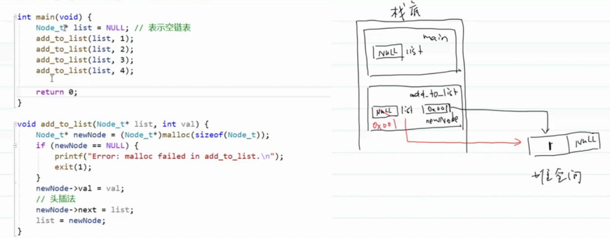
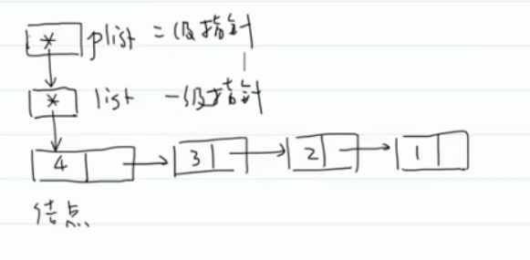
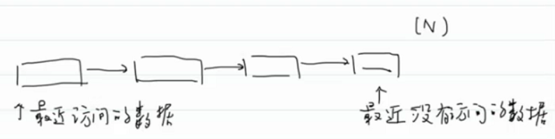

#王道

- # 常见问题
  id:: 62a7eb33-6165-4f82-98a9-ab596671f8b9
  collapsed:: true
	- 
	- 
	- **注意事项**：不要返回栈上的数组。因为随着栈帧的出栈，数据就释放了。 ^fe5894
- # 一、指针的高级应用  
  collapsed:: true
	- ## ^^1.动态内存分配^^
	  id:: 62a7ef07-a14d-459b-a7bb-689f75115be2
	  collapsed:: true
		- 头文件`stdlib.h`
		- 堆区：从内存分配开始，到free结束
		- ### 1.内存分配函数
		  collapsed:: true
			- `void* malloc(size_t size)`
			  collapsed:: true
				- m：memory
				- alloc：allocate
				- 分配size个字节的内存空间大小，不用初始化，所以它的效率最高
			- `void* calloc(size_t num,size_t size)`
			  collapsed:: true
				- num：元素个数
				- size：每个元素的大小
				- 分配num*size个字节，并且会对分配的内存空间清零。
				- c：clear
			- `void* realloc(void* ptr,size_t new_size)`
			  collapsed:: true
				- re：重新分配
				- 重新分配内存空间，使其有new_size的大小。
				- ptr以前通过malloc、calloc、realloc返回指针。
				- 扩容：new_size增大
				  collapsed:: true
					- 尽量在以前分配的这块内存区域上进行扩容，若不能就重新去找一片更大的区域进行扩容，以前的数据会复制过来不变，后来扩容的会是未初始化的。
					- 找多大的区域？类似vector扩容？
				- 缩容：new_size减小
				  collapsed:: true
					- 截断。
			- **注意事项：分配成功，返回分配内存空间的地址，如果未分配成功，返回空指针**（NULL，指向受保护区域0号地址）。
			  collapsed:: true
				- 分配不一定成功的，可能就没有那么大的空间呢
			- **`void*`**：^^通用指针。可以指向任意类型，可以和其他类型指针互换。^^
			  collapsed:: true
				- 不知道指针指向谁，但是知道它是指针，就知道分配多少内存空间了
				- ```C
				  int main()
				  {
				  	printf("void* = %u\n", sizeof(void*));
				  	printf("int* = %u\n", sizeof(int*));
				  	printf("double* = %u\n", sizeof(double*));
				  	printf("float* = %u\n", sizeof(float*));
				  	printf("char* = %u\n", sizeof(char*));
				  }
				  /*输出：
				  void* = 4
				  int* = 4
				  double* = 4
				  float* = 4
				  char* = 4
				  */
				  ```
			- 空指针：不指向任何对象的指针（谁都不指）。（^^**用0值表示空指针，在C语言中用宏NULL表示**^^）
			  collapsed:: true
				- 野指针：未初始化或指向未知区域的指针
				- 悬空指针：内存被free的指针。
		-
		- ### 2.释放内存空间
		  collapsed:: true
			- 如果申请的内存空间没有释放，会造成内存泄漏现象。
			- 举例：
			  collapsed:: true
				- ```C
				  p=malloc(...)
				  q=malloc(...)
				  p=q;
				  ```
				- 
			- 内存泄漏：如果程序中存在垃圾，这种现象称为内存泄漏。
			  collapsed:: true
				- 内存一直泄露，导致最后没有内存分配了，会导致OOM（Out of Memory）
			- **如何尽量避免内存泄露？**及时释放不用的内存空间。
			- `void free(void *ptr)`
			  collapsed:: true
				- ptr：调用malloc、calloc、realloc返回的指针
				- free不会改变ptr指针的值，而是释放了ptr指向的那片内存空间。
				- 操作系统如何知道该释放多少内存空间？
				  collapsed:: true
					- 动态申请会多分配一个头的空间，里面存储了大小、校验码等信息。
					  collapsed:: true
						- 
				- **注意事项：**
				  collapsed:: true
					- 不能释放已经释放的内存空间。
					- 不能释放堆内存空间以外的空间。（不然会触发一个断点。）
					- 引入了悬空指针问题。
					  collapsed:: true
						- 
						- p和q都是悬空指针。
						-
						-
	- ## 2.指向指针的指针（二级指针）
	- ## 3.指向函数的指针（函数指针）
	-
- # 二、链表
  id:: 62a7fff7-0c56-4c92-8972-1d9a013a8dc3
  collapsed:: true
	- ## 1.概念
	  collapsed:: true
		- 链表：用一条"链"将所有结点串连起来的一种结构。
		- 结点：
		  collapsed:: true
			- 数据域
			- 指针域：存放下一个结点的地址
	- ## 2.链表的分类
	  collapsed:: true
		- 单向链表
		- 单向循环链表
		- 双向链表
		- 双向循环链表
		- 循环链表在处理具有环状特点的数据时非常有用（约瑟夫环问题），但是在实际开发过程中用得很少。
		-
		-
- # 三、二级指针  
  id:: 62a82dc5-1e10-4493-9dc9-e61c02334c78 ^a71c95
  card-last-interval:: 4
  card-repeats:: 1
  card-ease-factor:: 2.6
  card-next-schedule:: 2022-07-13T01:15:55.349Z
  card-last-reviewed:: 2022-07-09T01:15:55.353Z
  card-last-score:: 5
  collapsed:: true
	- 
	- ^^**指针传递也是值传递**^^，修改函数内的指针值，无法修改main函数中的指针。
	  collapsed:: true
		- 解决：二级指针。因为指针也是值，所以可以用二级指针修改。
	- 
	- ^^**修改指针指向对象的值--->传递一级指针**^^
	- ^^**修改指针变量的值(即：修改指针的指向)--->传递二级指针**^^
	-
- # 四、函数指针  
  id:: 62a82f63-35dd-48eb-bda5-9ede35ff373a
  collapsed:: true
	- 给定任意一个函数 f ，以及两点 a b，求 `f((a+b)/2)`
	- collapsed:: true
	  ```C
	  #include <stdio.h>
	  #include<math.h>
	  #define PI 3.1415926
	  
	  double average(double (*f)(double), double a, double b);
	  
	  int main()
	  {
	  	printf("%lf\n", average(sin, 0, PI));//和数组类似，
	    //函数名可以作为指向函数的指针使用，所以可以写&sin，也可以写sin
	  }
	  
	  double average(double (*f)(double), double a, double b)
	  {
	  	return (*f)((a + b) / 2.0);
	    	return f((a + b) / 2.0);
	    	//和数组与指针类似。
	    	//函数指针也可以作为函数名使用。
	  }
	  ```
		- `double (*f)(double)`：函数指针：callback，回调函数
	- **qsort 函数**    q：quik，底层是快排实现。只能排序数组。可以对任意数组进行排序
	  collapsed:: true
		- `void qsort(void* ptr, size_t count, size_t size, int (*cmp)(const void*, const void*)`
		- ptr：指向待排序数组
		- count：数组中元素的个数
		- size：元素的大小
		- cmp：比较函数。提供比较规则，因为不知道数组中元素类型、大小嘛
		  collapsed:: true
			- ```C
			  int main()
			  {
			  	printf("void* = %u\n", sizeof(void*));
			  	printf("int* = %u\n", sizeof(int*));
			  	printf("double* = %u\n", sizeof(double*));
			  	printf("float* = %u\n", sizeof(float*));
			  	printf("char* = %u\n", sizeof(char*));
			  }
			  /*输出：
			  void* = 4
			  int* = 4
			  double* = 4
			  float* = 4
			  char* = 4
			  */
			  ```
		- ```C
		  #include <stdio.h>
		  #include<string.h>
		  #define SIZE(a) sizeof(a)/sizeof(a[0])
		  
		  int cmp(const void* p1, const void* p2);
		  
		  typedef struct student_s
		  {
		  	int number;
		  	char name[25];
		  	int chinese;
		  	int math;
		  	int english;
		  }Student;
		  
		  int main()
		  {
		  	Student students[5] = {
		  		{1,"liuyifei",100,100,100},
		  		{2,"wangyuyan",99,99,99},
		  		{3,"xiaolongnv",100,99,100},
		  		{4,"zhaolinger",100,100,99},
		  		{5,"baixiuzhu",100,100,100}
		  	};
		  	qsort(students, SIZE(students), sizeof(Student), cmp);
		  
		  }
		  
		  //按总分从大到小排序，再按语文成绩从大到小，按数学成绩从大到小，按英语成绩从大到小
		  //按名字从小到大排序
		  int cmp(const void* p1, const void* p2)
		  {
		  	//1.因为p1是void*，无法操作student，所以先类型转换
		  	Student* s1 = (Student*)p1;
		  	Student* s2 = (Student*)p2;
		  
		  	int total1 = s1->chinese + s1->math + s1->english;
		  	int total2 = s2->chinese + s2->math + s2->english;
		  
		  	if (total1 != total2)
		  	{
		  		return total2 - total1;
		  		/*
		  		  qsot函数默认按从小到大排序，所以传入负数，则
		  		  会按从大到小，证书则会从小到大。
		  		*/
		  	}
		  
		  	if (s1->chinese != s2->chinese)
		  	{
		  		return s2->chinese - s1->chinese;
		  	}
		  
		  	if (s1->math != s2->math)
		  	{
		  		return s2->math - s1->math;
		  	}
		  
		  	if (s1->english != s2->english)
		  	{
		  		return s2->english - s1->english;
		  	}
		  
		  	return strcmp(s1->name, s2->name);
		  }
		  ```
		-
- # 五、常见的数据结构和算法
  id:: 62a7ecc4-fe45-45ad-b903-8a20b8144b28
  collapsed:: true
	- **数组和链表是其他更高级数据结构的基础**
	- ## 1.链表
	- ## 2.栈和队列
	- ## 3.哈希表
	- ## 4.红黑树（BST,Binary Search Tree）
	- # 算法
	  collapsed:: true
		- 排序算法：**学习怎么去分析一个算法的性能，而不是写出算法**
		- 查找算法：二分查找（难的是二分查找的变种）
- # 六、链表
  collapsed:: true
	- ## 1.链表的基本操作
	  id:: 62a84121-8b4f-46ef-a049-56b2b8975570
	  collapsed:: true
		- 单链表：
		  collapsed:: true
			- 增加（在某个结点后面添加）：O(1)
			- 删除（删除某个节点后面的结点）：O(1)
			  collapsed:: true
				- ```C
				  removedNode = cur->next;
				  cur->next = cur->next->next;
				  free(removedNode)
				  ```
			- 查找：
			  collapsed:: true
				- 1. 根据索引查找值：O(n)
				- collapsed:: true
				  2. 查找与特定值相等的结点
					- 大小有序：O(n)
					- 大小无序：O(n)
		- 双链表：除了单链表的基本操作外，双链表还有一些额外的基本操作
		  collapsed:: true
			- 增加（在某个结点前面添加）：O(1)
			- 删除（删除当前结点）：O(1)
			- 查找
			  collapsed:: true
				- 根据索引查找值：O(n)
				  collapsed:: true
					- 单链表平均遍历n/2个结点，双链表只需遍历n/4个结点
					- 因为知道双链表大小，可以从近的那一端去找
				- 查找与特定值相等的结点
				  collapsed:: true
					- 大小有序：O(n)
					  collapsed:: true
						- 可以记录上一次查找的结点，从他附近找，优化查找效率。
					- 大小无序：O(n)
		- **虽然双向链表占用更多的内存，但是很多操作是优于单链表的，所以在实际开发过程中，更倾向于使用双向链表**
		- **思想：可以用空间换时间**
		-
		- **缓存淘汰策略**
		  collapsed:: true
			- FIFO：先进先出
			- LFU：（Least Frequently Used)，最少未使用
			  collapsed:: true
				- 记录使用次数
			- LRU：（Least Recently Used），最近最久未使用
			  collapsed:: true
				- 记录访问顺序
				- 用链表实现LRU（青春版）：
				  collapsed:: true
					- 
					- 添加：O(n)，遍历链表，判断元素是否存在
					  collapsed:: true
						- 1. 元素存在：删除该结点，在头结点前面添加
						- collapsed:: true
						  2. 元素不存在：
							- 1.缓存没满：在头结点前添加。
							- 2.缓存满了：删除尾结点，在头结点前面添加
						- 优化：哈希表+链表：哈希表优化查找速度
			- 头结点：head指向的结点
			  sentinal：哨兵
			  dummy node:哑结点
		-
		-
	-
-