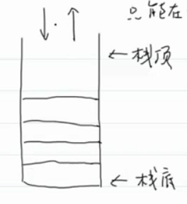
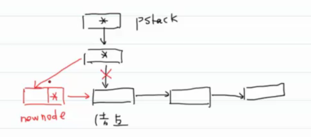
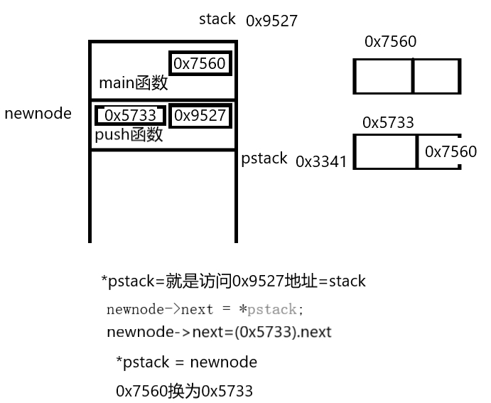

#王道

- # 栈  
  id:: 62aa9acc-7b0d-4b12-b2bd-7641a569ddef
  collapsed:: true
	- 操作受限的线性表。
	  collapsed:: true
		- 只能在一端添加，在同一端删除：**LIFO**
		- 
	- 为什么提供栈？
	  collapsed:: true
		- 提高代码的可读性
		  collapsed:: true
			- 如果是线性表：`add(item,n)`不知道索引n是否是末尾，就不知道是否插入在末尾，可读性不高
			- 栈：`push(item)`：可读性高
		- 代表现实中的一个特定场景。
		- 操作受限不是一种坏处，可以减少bug。
	- 栈的API
	  collapsed:: true
		- `void push(stack* Stack,int item)`itm可以是任何类型，方便理解，改为int型
		- `int pop(Stack* stack)`
		- 查找：`int peek(Stack* stack)`:查看栈顶元素，peek：瞥一眼
		- `bool isEmpty(Stack* stack)`
	- 实现一：链表
	  collapsed:: true
		- 可以用单链表实现，头结点为栈顶。
	- 实现二：数组
	  collapsed:: true
		- 0为栈底，用一个整型数 top 标记栈顶索引。
		- isEmpty：top = 0
	- ## 链表实现
	  id:: 62aaa254-6459-4ec0-a4b5-63f5f91d22e5
	  collapsed:: true
		- 
		- 
		-
	- ## ^^栈的应用^^
	  id:: 62aaa4e5-fba6-4084-97c7-03cd048bffc4
	  collapsed:: true
		- 函数调用栈
		- 括号匹配问题
		  collapsed:: true
			- 遇到左括号，压入对应的右括号。
			- 遇到右括号，如果和栈顶相等，出栈，不相等就不匹配。
		- 游览器的前进和后退--->两个栈
		- DFS：深度优先搜索（Depth First Search）
		- 表达式求值
		  collapsed:: true
			- 中缀表达式：1+2×3：优先级
			  collapsed:: true
				- 将中缀一边转化为后缀，一边计算
				- 用两个栈：操作数栈和运算符栈
				- 遇到操作数：入操作数栈
				- ②遇到运算符：
				  id:: 62aad034-8c78-4a2a-92e7-b829806ccc53
				  collapsed:: true
					- 判断运算符栈是否为空
					  collapsed:: true
						- 空则入栈
						- 非空则与栈顶运算符比较，如果优先级比栈顶高，则入栈；否则弹栈并连续弹出两个操作数计算后入操作数栈。
						- 回到2，继续判断与栈顶元素的优先级，判断结束后，将这个运算符入运算符栈。
				- 弹出一个运算符，连续弹出两个操作数计算后压入操作数栈。直至运算符栈为空，返回操作数栈顶元素。
			- 后缀表达式：123×+：没有优先级
			  collapsed:: true
				- 用一个栈
				- 遇到操作数就入栈，遇到运算符就连续弹出两个操作数。计算结果，将结果入栈。
			-
- # 队列  
  collapsed:: true
	- 操作受限的线性表：只能在一端插入元素，在另一端删除元素
	- **特性**：FIFO
	- ## 队列的API
	  collapsed:: true
		- 增加：入队：`void enqueue(Queue* q,int item)`
		- 出队：`int dequeue(Queue* q)`
		- 查找：`int peek(Queue* q)`
		- 判空：`bool isEmpty(Queue* q)`、`isFull(Queue* q)`：判满
		-
	- ## 队列的应用
	  collapsed:: true
		- BFS：广度优先搜索；Breadth First Search
		- 缓存：消息队列：kafka、RabbitMQ
		  collapsed:: true
			- 缓冲区的意思
			- 缓存不会无限大，所以需要一个最大空间。所以会有一个判满函数。
	- ## 队列的实现
	  collapsed:: true
		- ### 实现一：链表
		  collapsed:: true
			- 可以用双向链表：头结点做队尾。
		- ### 实现二：数组
		  collapsed:: true
			- 索引为0：队头。所以就只需要一个rear去表示队尾：表示下一个元素插入的位置。
			  collapsed:: true
				- enqueue：O(1)
				- dequeue：O(n)，因为固定了队头，所以复杂度高
				- peek：O(1)
				- isEmpty：O(1)：rear==0
				- isFull：O(1)：rear==N
				- 删除的负责度太高
			- 不固定队头。用front索引表示队头，rear表示队尾
			  collapsed:: true
				- enqueue：O(1)
				- dequeue：O(1)
				- peek：O(1)
				- isEmpty：O(1)：rear==front
				- isFull：O(1)：rear==N
				- 缺陷：浪费内存空间：（rear\=\=N就不行了，front会一致往rear靠近）或浪费时间重新排列元素（rear==N的时候，rear-front!=N，就把所有元素移动到0号索引重新排列）
			- 循环链表(数组)，rear返回头部
			  collapsed:: true
				- enqueue：O(1):rear=(rear+1)%N
				- dequeue：O(1):(front+1)%N
				- peek：O(1)
				- isEmpty：O(1)：rear==front
				- isFull：O(1)：
				- 如何解决判空和判满问题？
				  collapsed:: true
					- 1.(rear+1)%N==front，（牺牲一个空间）
					- 2.添加一个元素个数属性。
			-
	-
- # 哈希表  
  collapsed:: true
	- **哈希函数本质上是一个分类的函数**，按类去找
	- 统计一段文本中，每个小写字母出现的次数。
	  collapsed:: true
		- 用一个数组，索引表示字母位置，数值表示出现次数。键值对（key，value）
		  collapsed:: true
			- 基本操作
			  collapsed:: true
				- 根据键获取值。`Val get(K key)`
				- 添加键值对。`Val put(K key,V val)`添加键值对/更新键值对。
				- `Val delete(K key)`删除键值对
				- get：O(1)   **key-'a'=index**
				- put：O(1)  找到索引，然后更新值
				- delete：O(1)  重新设置一个值就删除了
				- 限制：
				  collapsed:: true
					- key的取值范围很小。现实key取各种值，如身份证，很大
					- key很容易转换成索引，而且一一对应。
	- 如何解决这两个限制?
	  collapsed:: true
		- **key-'a'=index--->泛化--->int index = hash(key)(哈希函数)**。
		  collapsed:: true
			- 哈希函数要求所有的键能够尽可能的平均分布。
	- 如何解决哈希冲突？
	  collapsed:: true
		- 拉链法--->哈希表=数组+链表
	- **拉链法哈希表** ^ddc4ae
	  collapsed:: true
		- `Val get(K key)`--->O(L)：L：链表的平均长度
		  collapsed:: true
			- 1.根据哈希函数得到key
			- 2.遍历链表判断key是否存在
			  collapsed:: true
				- 存在：返回value
				- 不存在：返回特殊值--->表明它不存在
		- `Val put(K key,V val)`--->O(L)：L：链表的平均长度
		  collapsed:: true
			- 1.先获取key
			- 2.遍历链表，判断key是否存在
			  collapsed:: true
				- 存在：更新value，返回原来的value
				- 不存在：添加键值对，头插快。返回一个特殊值--->表明键原来不存在
		- `Val delete(K key)`--->O(L)：L：链表的平均长度
		  collapsed:: true
			- 1.先获取key
			- 2.遍历链表，判断key是否存在
			  collapsed:: true
				- 存在：删除键值对（就是删除链表结点），并返回删除的value
				- 不存在：返回一个特殊值--->表明键不存在
	- **应用场景：查找：根据键查找值。**