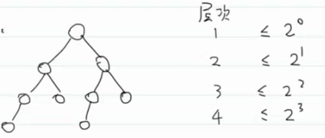
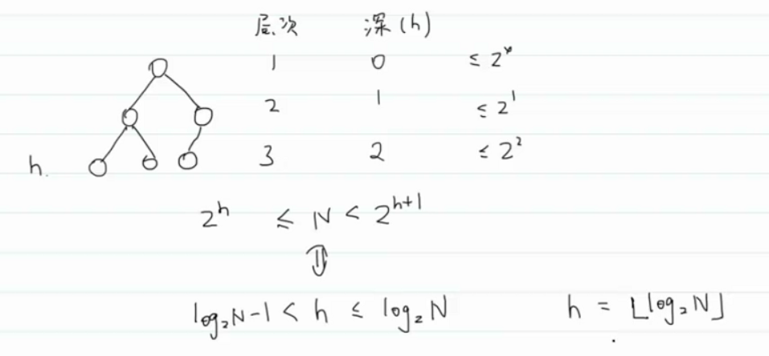
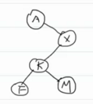
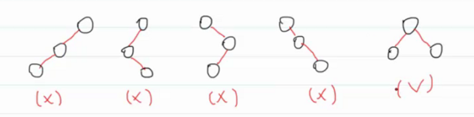
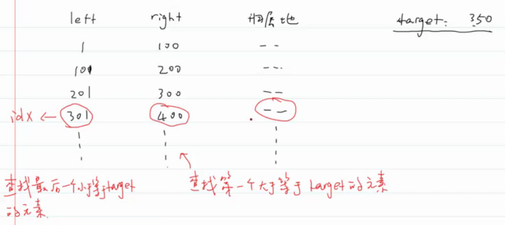

#王道

- # 树
	- 是一种层次结构。（1:N）
	- 父结点（双亲结点）
	- 子结点
	- 祖父结点（父结点的父结点）
	- 叔父结点（父结点的旁边的结点）
	- 兄弟结点（同一个父结点的孩子结点）
	- 叶子结点
	  collapsed:: true
		- 1.没有孩子的结点
		- 2.NIL结点（NULL结点）
	- ## 二叉树
	  collapsed:: true
		- 每个结点最多有两个孩子
		  collapsed:: true
			- 空树
			- 只有根结点
			- 只有左子树
			- 只有右子树
			- 左右子树都有
		- 两种特殊的二叉树
		  collapsed:: true
			- 满二叉树
			- 完全二叉树：从上到下，每层从左到右，依次插入
			  collapsed:: true
				- parent(i)=i/2
				- leftchild(i)=2i
				- rightchild(i)=2i+1
				- 可以用数组存储结点
		- **性质**：
		  collapsed:: true
			- 层次为n的二叉树，最多能有2^(n-1)个结点。
			  collapsed:: true
				- 
		- **二叉搜索树：BST**：前提：**key值能够比较大小**
		  collapsed:: true
			- 左子树所有结点的key值小于根结点的key值，并且左子树也是BST；右子树所有结点的key值大于根结点的key值，并且右子树也是BST
			  collapsed:: true
				- 递归的定义
			- 查：search(tree,key)--->O(h);h:树高
			- 增：先查找到位置O(h)，再添加O(1)，总共O(h)
			- 删：先查找到位置O(h)，删除O(1)，总共O(h)
			- **都依赖树高**
			  collapsed:: true
				- 最坏情况就是一条线：有多少结点就有多深了。O(n)
				- 最好情况，n个结点的二叉树，树高最小为（完全二叉树）：$O(log_2N)$
				  collapsed:: true
					- n个结点的完全二叉树，树高最小为：$log_2n + 1$（n看为编号，就好推了）
					  collapsed:: true
						- $2^h≤n＜2^(h+1)$
						- 
		- **平衡二叉搜索树**：解决二叉搜索树的最坏情况
		  collapsed:: true
			- 1.严格的定义：要求左右子树的高度相差不超过1.--->AVL树
			- 2.树的高在$O(log_2N)$内，--->红黑树
			  collapsed:: true
				- 红黑树的插入、删除等操作优于AVL树，因为AVL树插入等操作需要调整树高不超过1，但是AVL树的查找快于红黑树
		- ### 二叉树的遍历
		  collapsed:: true
			-
			- 深度优先遍历
			- 
			  collapsed:: true
				- 先序遍历：AXKFM：深度优先遍历
				- 中序遍历：AFKMX
				- 后序遍历：FMKXA
			-
			- 广度优先遍历--->层次遍历：AXKFM
			  collapsed:: true
				- 将根结点入队列
				- ②判断队列是否为空
				  collapsed:: true
					- 空：遍历结束
					- 非空：
					  collapsed:: true
						- 出队列，遍历该结点，如果该队列有左孩子，将左孩子入队列；如果该结点有右孩子，将右孩子入队列。
						- 回到②继续判断
			-
			-
		- ### 二叉树的建树 ^8e00ad
		  collapsed:: true
			- collapsed:: true
			  1. 根据先序、中序、后序中的一种遍历顺序，能否建树？
				- 不能
			- collapsed:: true
			  2. 根据其中两种是否能建树？
				- 前中、后中。必须要有中序。
				  collapsed:: true
					- 中序把左右子树分开，根据根结点左右的长度分开。
					- 前后确定根结点。
	- ## 2-3-4树
	  collapsed:: true
		- 完美平衡的二叉树，叶子结点在同一层。
		  collapsed:: true
			- 每次添加删除就需要动态调整
		- 2-3-4树保证了树的高度为$O(log_2n)$
		-
	- ## 红黑树
	  collapsed:: true
		- 红黑树就是用BST表示2-3-4树
		  collapsed:: true
			- 用内部的红色边表示2-3-4树的2-node、3-node。
			  collapsed:: true
				- 三结点就有两种表示方式：左边红或者右边为红边
				- 四结点只有一种表示方式：左右边为红色。
				  collapsed:: true
					- 
				- 理解为：红色的边力的作用特别强，把结点连结在一起。
				- 那么红色边的标识放在父结点还是子结点？
				  collapsed:: true
					- 用孩子结点的颜色表示边的颜色。因为孩子结点和边一一对应
		- **但是这种方式表示2-3-4树不唯一对应一颗红黑树**
		- 后又提出左倾红黑树，3-node红边只能往左倾。以限制3-node表示方式。这样红黑树表示就唯一了，2-3-4树和红黑树就一一对应了。
		  collapsed:: true
			- 左倾红黑树代码比经典红黑树简单很多，但是左倾没有原版经典红黑树效率高，但也几乎相差不大。
		- **左旋和右旋是实现平衡二叉树的基本操作**--->见PPT
		-
- # 二分查找  
  collapsed:: true
	- 局限性
	- 1. 二分查找依赖的是顺序表结构，也就是数组
	- 2. 二分查找针对的是有序数据
	- collapsed:: true
	  3. 数据量太小没必要进行二分查找。
		- a) 二分查找可以减少比较操作。
		- b) 比较操作很耗时，比如大字符串，大集合
	- collapsed:: true
	  4. 数据量太大也不适合二分查找
		- 不适合数据量太大的排序：因为二分查找基于连续的内存空间，数组。可能没有那么大的连续空间存储数据
	- collapsed:: true
	  5. 动态数据也不适合二分查找
		- 动态数据不适合，数组删除和插入都需要O(n)的时间复杂度
		  collapsed:: true
			- 用哈希表和平衡二叉树
	- 6. 动态数据查找：平衡二叉树，哈希表
	-
	- 二分查找的变种：
	  collapsed:: true
		- 1.查找第一个与key相等的元素
		  collapsed:: true
			- 二分找到相等的元素，然后往左移动索引找
		- 2.查找最后一个与key相等的元素
		- 3.查找最后一个小于等于key值的元素
		- 4.查找第一个大于等于key值的元素
	-
	- 归属地问题：
	  collapsed:: true
		- 
		- IP可以用一个int整数存储，然后对比大小，二分。