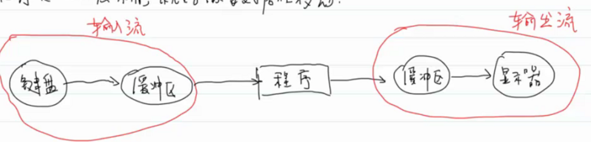

#王道

- # 一、文件流  
  collapsed:: true
	- ## 概念：
	  collapsed:: true
		- 流：表示任意的输入源或者是输出的目的地
		- {:height 88, :width 637}
		  collapsed:: true
			- 可以屏蔽硬件之间的差异。
			- 就像我站在河边，河水在流动。文件流就看起来是数据在流动，其实是文件指针在动。
			  collapsed:: true
				- 程序员不需要自己移动文件的指针，读/写文件时，文件指针会自动往后移动。
				- 所以从程序员角度看，就像是数据自己在移动。
	- ## 2
	  collapsed:: true
		- 
		- 缓冲区的类型：（用户态缓冲区）[[LinuxDay07#^e05ee2|用户态IO]]
		  collapsed:: true
			- 满缓冲区：满则读出
			- 行缓冲区：往往表示字符设备，因为字符才有换行
			  collapsed:: true
				- 标准输入（stdin）--->键盘
				- 标准输出（stdout）--->显示器：遇到换行符就全部输出
			- 无缓冲区：日志文件。标准错误流（stderr）--->显示器
	- ## 3.三种标准流
	  collapsed:: true
		- stdin：-->默认关联-->键盘
		- stdout：-->默认关联-->显示器
		- stderr：-->默认关联-->显示器
		  collapsed:: true
			- 程序启动时，操作系统会自动创建这三个标准流，用完后也无需关闭，使用完毕操作系统会销毁。
			- 所以直接用就行。
	- ## 4.文本文件和二进制文件的区别
	  collapsed:: true
		- 文本文件：存放^^**字符数据**^^。--->编码
		- 二进制文件：存放^^**二进制数据**^^。--->二进制01
		  collapsed:: true
			- 老师的手写笔记就是二进制数据，1表示黑色，0表示白色。
	-
	- `FILE *fopen(const char* filename, const char* mode);`
	  collapsed:: true
		- filename：路径名，不是文件名
		- mode：打开模式
		- FILE：文件流
		- 头文件<stdlib.h>
	- **文件路径**
	  collapsed:: true
		- 绝对路径：从磁盘/根目录开始
		- 相对路径：从当前工作目录开始，到文件所在目录。
	- **打开模式**：（与文件类型、对文件的操作相关）
	  collapsed:: true
		- 文本文件（默认打开文本文件）
		  collapsed:: true
			- "r"：read，只读，要求文件必须存在！
			- "w"：write，只写，文件不需要存在。
			  collapsed:: true
				- 不存在会自动创建，如果存在会清空文件的内容再写。
			- "a"：append，追加模式，文件也不需要存在
			  collapsed:: true
				- 不存在会创建一个空文件，存在会将内容追加到原文件后面
			- "r+"：读写，要求文件必须存在
			- "w+"：读写，文件不需要存在，存在则清空后写
			- "a+"：读写，文件不需要存在，存在则追加
			  collapsed:: true
				- ==**a和a+为追加模式，在此两种模式下，在一开始的时候读取文件内容是从文件起始处开始读取的，而无论文件读写点定位到何处，在写数据时都将是在文件末尾添加（写完以后读写点就移动到文件末尾了），所以比较适合于多进程写同一个文件的情况下保证数据的完整性**==
		- 二进制文件
		  collapsed:: true
			- "rb"：read binary，只读，要求文件必须存在！
			- "wb"：write，只写，文件不需要存在。
			- "ab"：append，追加模式，文件也不需要存在
			- "rb+"：读写，要求文件必须存在
			- "wb+"：读写，文件不需要存在，存在则清空后写
			- "ab+"：读写，文件不需要存在，存在则追加
	-
	- `int fclose(FILE* steam);`
	  collapsed:: true
		- 头文件<stdlib.h>
		- int：表示有没有关闭成功：0成功，EOF（其他）失败。
		  collapsed:: true
			- EOF：宏，用 -1 表示：end of file。
			-
	-
- # 二、读写文本文件  
  collapsed:: true
	- 存放的字符数据
	- ## 1.一个字符一个字符的读写：fgetc/fputc
	  collapsed:: true
		- getchar/putchar
		  collapsed:: true
			- 从stdin/stdout流读写数据
		- fgetc/fput
		  collapsed:: true
			- 可以读写任意一个流
			- f：FILE，流
		- `int fgetc(FILE* stream);`
		- `int fputc(int ch, FILE* stream);`
		-
		-
	- ## 2.一行一行的读写：fgets/fputs
	  collapsed:: true
		- `char* fgets(char* src, int count, FILE *stream);`
		  collapsed:: true
			- src：数组，一次读一行，那肯定是读入数组了，指针怎么存的下
			- count：最多能读取多少个字符
			- 成功返回读到的字符串
			- 返回null pointer表示读取失败--->这不算一种失败，null pointer表示读到文件末尾。
			  collapsed:: true
				- linux时再讲读到文件末尾和读写失败的区别是什么，虽然返回值都是null
		-
		- `int fputs(const char* str,FILE* stream)`
		  collapsed:: true
			- 把str指向的字符串写入stream流中，str的空字符不会写入
			- ```C
			  //惯用法
			  char buffer[4096];//一般设置4096的大小，因为4096是一页的大小，读完一页在交换嘛
			  while (fgets(buffer, 4096, src) != NULL)
			  {
			  	fputs(buffer, dest);
			  }
			  ```
	- ## 3.序列化：11：20
	  collapsed:: true
		- 把内存中的对象进行持久化
		  collapsed:: true
			- 把程序中的数据持久的保存起来，或者是写到网络里去，或者是写到数据库里去、文件里去。
			- 如网络传输，游戏中服务器向客户端传输对象。
			- 有时候防止数据丢失，需要将数据持久化，比如服务器618承受不住压力宕机，这时内存中的数据就都消失了，那么我们此时就需要将内存数据持久化，以便之后恢复。如购物车，没登帐号可以加，要登陆账号才能付款，但是登陆账号的时候就自动把没登的时候的商品加入进去了。
		- 反序列化：把文件/数据库中的数据加载到内存中，还原成程序中的对象。
		-
		- **以文本形式序列化**
		  collapsed:: true
			- 可读性会很高
			- JSON：现在前端后台都是通过JSON数据去序列化的
			- ```C
			  #define _CRT_SECURE_NO_WARNINGS
			  #include<stdlib.h>
			  #include<stdio.h>
			  
			  typedef struct student_s
			  {
			  	int number;
			  	char name[25];
			  	int chinese;
			  	int math;
			  	int english;
			  }Student;
			  
			  int main(int argc, char* argv[])
			  {
			  	//参数校验
			  	if (argc != 2)
			  	{
			  		//或许不够参数，可以自己指定参数情况.
			  		printf("Error:\n");
			  		exit(1);
			  	}
			  
			  	//打开文件
			  	FILE* dest = fopen(argv[1], "r+");
			  	if (dest == NULL)
			  	{
			  		printf("Error:\n");
			  		exit(1);
			  	}
			  
			  	//文本形式:
			  	//Student s = { 1,"xixi",100,100,100 };//会转化为"1 xixi 100 100 100"字符数据
			  	//序列化
			  	//fprintf(dest, "%d %s %d %d %d\n", s.number, s.name, s.chinese, s.math, s.english);
			  
			  	//反序列化
			  	Student s = {0};
			  	fscanf(dest, "%d%s%d%d%d", &s.number, &s.name, &s.chinese, &s.math, &s.english);
			  
			  	//关闭文件
			  	fclose(dest);
			  }
			  ```
		-
		- **以二进制形式序列化** ^e3de8d
		  collapsed:: true
			- 可读性低，但是效率很高
			- 做游戏，对速率要求高。所以游戏往往自己编写协议传输数据，这个编制数据的过程就是序列化操作。然后在客户端反序列化。
			- 自定义协议
			- id:: 62ad6f48-9cff-4e7e-90da-091831c9b05d
			  ```C
			  #define _CRT_SECURE_NO_WARNINGS
			  #include<stdlib.h>
			  #include<stdio.h>
			  
			  typedef struct student_s
			  {
			  	int number;
			  	char name[25];
			  	int chinese;
			  	int math;
			  	int english;
			  }Student;
			  
			  int main(int argc, char* argv[])
			  {
			  	//参数校验
			  	if (argc != 2)
			  	{
			  		//或许不够参数，可以自己指定参数情况.
			  		printf("Error:\n");
			  		exit(1);
			  	}
			  
			  	//打开文件
			  	FILE* dest = fopen(argv[1], "rb+");//读的时候不要用wb+，在打开的时候会清空数据的
			  	if (dest == NULL)
			  	{
			  		printf("Error:\n");
			  		exit(1);
			  	}
			  
			  	//文本形式:
			  	//Student s = { 1,"xixi",100,100,100 };//"1 xixi 100 100 100"字符数据
			  
			  	//序列化	11:59
			  	//fwrite(&s,sizeof(Student),1,dest);
			  
			  	//反序列化
			  	Student s = { 0 };
			  	fread(&s, sizeof(Student), 1, dest);
			  
			  	//关闭文件
			  	fclose(dest);
			  }
			  ``` ^7c84a3
	- ## 4.格式化读写：fscanf/fprintf
	  collapsed:: true
		- 可以指定从哪个流读写数据
		- 
	-
- # 三、读写二进制文件  
  card-last-interval:: 4
  card-repeats:: 1
  card-ease-factor:: 2.36
  card-next-schedule:: 2022-07-11T12:55:33.500Z
  card-last-reviewed:: 2022-07-07T12:55:33.502Z
  card-last-score:: 3
  collapsed:: true
	- **fread/fwrite**
	- 
	  collapsed:: true
		- buffer：数组
		- size：元素的大小
		- count：最多能读取元素的数目
		- stream：输入流
		- 返回读取元素的个数。（不区别返回失败还是文件末尾）
		  collapsed:: true
			- 返回值可能小于count，
			  collapsed:: true
				- 读取的元素小于count或者error
	- 
	  collapsed:: true
		- buffer：数组
		- size：元素的大小
		- count：要写入元素的个数
		- stream：输出流
		- 返回实际写入元素的数目
	-
	- ```C
	  //11:52
	  //复制二进制文件
	  char buffer[4096];
	  int len;//读取字节数
	  while ((len = fread(buffer, 1,SIZE(buffer) , src)) != 0)
	  {//元素大小为1：char类型
	  	fwrite(buffer, 1, len, dest);
	  }
	  ```
	- [fread、fwrite实现二进制序列化和反序列化]((62ad6f48-9cff-4e7e-90da-091831c9b05d))
	- [[#^e3de8d|fread、fwrite实现二进制序列化和反序列化]]
- # 四、移动文件指针  
  collapsed:: true
	- ## fseek：找到当前文件指针的位置
	  collapsed:: true
		- `int fseek(FILE* stream, long offset, int origin);`
		  collapsed:: true
			- offset：偏移量
			- origin：参照点，根据参照点跳转到哪个位置
			  collapsed:: true
				- `#define SEEK_SET`文件开头
				- `#define SEEK_CUR`当前位置
				- `#define SEEK_END`文件末尾
			- `fseek(fp,0,SEEK_SET)`：跳到文件开头
			- `fseek(fp,0,SEEK_END)`：跳到文件末尾
			- `fseek(fp,-10,SEEK_CUR)`：回退十个文件指针位置
	- ## ftell
	  collapsed:: true
		- `long ftell(FILE* stream)`
		  collapsed:: true
			- 返回当前文件指针的位置。
			- 一般情况用于记录当前文件指针的位置，方便可以回到这里继续处理
	- ## rewind
	  collapsed:: true
		- `void rewind(FILE* stream)`
		  collapsed:: true
			- rewind：卷起来--->倒带
			- 回到文件的开头。
			- 等价于`fseek(fp,0,SEEK_SET)`，只是rewind可读性更高
	-
	- ```C
	  #define _CRT_SECURE_NO_WARNINGS
	  #include<stdlib.h>
	  #include<stdio.h>
	  
	  typedef struct student_s
	  {
	  	int number;
	  	char name[25];
	  	int chinese;
	  	int math;
	  	int english;
	  }Student;
	  
	  int main(int argc, char* argv[])
	  {
	  	//参数校验
	  	if (argc != 2)
	  	{
	  		//或许不够参数，可以自己指定参数情况.
	  		printf("Error:\n");
	  		exit(1);
	  	}
	  
	  	//打开文件
	  	FILE* dest = fopen(argv[1], "w+");
	  	if (dest == NULL)
	  	{
	  		printf("Error:\n");
	  		exit(1);
	  	}
	  
	  	//文本形式:
	  	Student s1 = { 1,"xixi",100,100,100 };//会转化为"1 xixi 100 100 100"字符数据
	  
	  	//序列化
	  	fprintf(dest, "%d %s %d %d %d\n", s1.number, s1.name, s1.chinese, s1.math, s1.english);
	  
	  	//偏移指针
	  	rewind(dest);
	  
	  	//反序列化
	  	Student s = {0};
	  	fscanf(dest, "%d%s%d%d%d", &s.number, &s.name, &s.chinese, &s.math, &s.english);
	  
	  	//关闭文件
	  	fclose(dest);
	  }
	  ```
- # 五、文件处理模板  
  collapsed:: true
	- 
- # 六、错误处理  
  card-last-interval:: 4
  card-repeats:: 1
  card-ease-factor:: 2.36
  card-next-schedule:: 2022-07-11T00:51:50.929Z
  card-last-reviewed:: 2022-07-07T00:51:50.932Z
  card-last-score:: 3
  collapsed:: true
	- **检测错误**
	  collapsed:: true
		- 1.返回值
		  collapsed:: true
			- 检查函数的返回值
		- 2.errno---><errno.h>如果系统调用发生错误，一般会设置errno
		  collapsed:: true
			- **有一个系统调用，就要马上检测是否出错，不然可能中间会有其他系统调用，就会有更改，因为它是全局变量**
			- 是一个全局变量
			- 系统调用：操作系统给应用程序提供的接口
			- errno=0，没有错误
			- errno!=0，有错误
			  collapsed:: true
				- ```c
				  //r读文件不存在的错误
				  printf("%d\n", errno);
				  FILE* fp = fopen("tmp.txt", "r");
				  printf("%d\n", errno);
				  // 0 2
				  //但我们希望以字符串形式打印错误信息
				  ```
			- `char* strerror(int errnum);`---><string.h>
			  collapsed:: true
				- ```C
				  puts(strerror(errno));
				  FILE* fp = fopen("tmp.txt", "r");
				  puts(strerror(errno));
				  
				  //No error
				  //No such file or directory
				  
				  //但还不知道是哪个文件错误，我们想要定制的精确的信息
				  ```
			- `void perror(const char* s)`---><stdio.h>
			  collapsed:: true
				- p：print
				- s：额外的提示信息
				- ```C
				  //r读文件不存在的错误
				  perror("tmp.txt");
				  FILE* fp = fopen("tmp.txt", "r");
				  perror("tmp.txt");
				  
				  tmp.txt: No error
				  tmp.txt: No such file or directory
				  //有精确的信息，所以perror是用的最多的。
				  ```
	-
	-
- # 七、编译器项目
  collapsed:: true
	- 词法分析--->语法分析--->语义分析->生成中间代码->平台无关优化--->平台相关优化--->可执行程序
	- 
	- 基本要求：完成词法分析（能够给出错误提示）
	- 进阶要求：完成词法分析+语法分析
	-
	- ## 1.词法分析--->模式匹配过程：基本单位：字符
	  collapsed:: true
		- 作用：读取源文件，生成TOKEN序列
		- 1.单字符TOKEN：；，（，{，[--->switch语句
		- 2.双字符TOKEN：+=、-=、/=...--->if判断
		- 3.多字符TOKEN：char，symbol_table--->while循环
		- 词法分析就是：一个很大的switch语句，里面嵌套了if、while语句等
		-
		- 有限状态机：（switch+if+while）
		-
	- ## 2.语法分析--->模式匹配：基本单位：TOKEN
	  collapsed:: true
		- 语法分析作用：解析TOKEN序列，生成语法树
		- 解析表达式，能解析出来就算过
		-
		- **如何解析表达式语句？**
		  collapsed:: true
			- 上下文无关文法：用递归实现
			- 17：00
			-