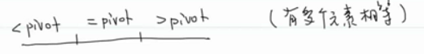
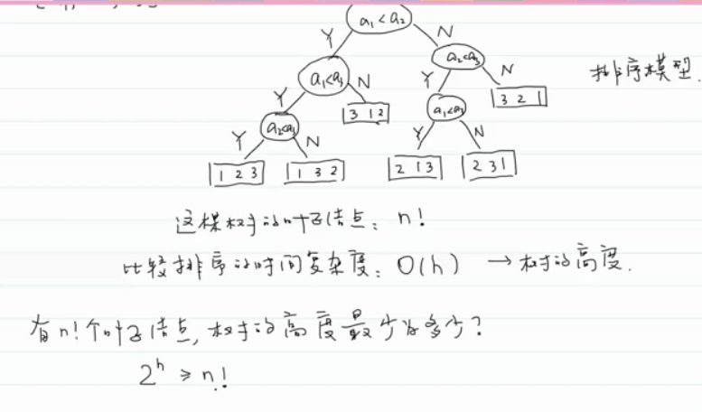
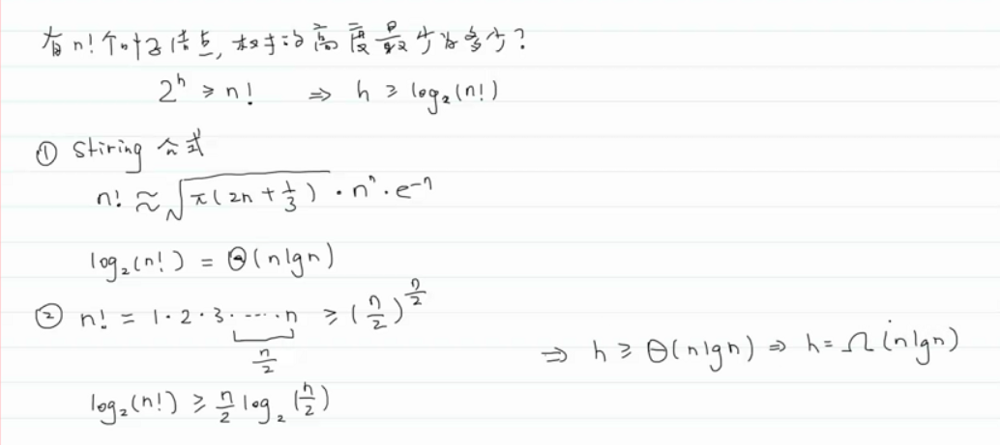

- 重点是理解如何分析算法效率
- 理解好了，这节课后超越中级程序员
- 排序的前提是元素可以比较
-
- # 一、冒泡排序
	- ## 1.时间复杂度
		- 最好的情况：有序：O(n)，因为要冒泡一次，才知道
		- 最坏的情况：逆序：O(n^2)
		- 平均情况：O(n2)
			- 有序对和逆序对
				- 有序对：i<j，arr[i]<arr[j]
				- 逆序对：i<j，arr[i]>arr[j]
				- 有序度
					- 数组中有序对的个数
				- 逆序度
					- 数组中逆序对的个数
			- 排序就是增加有序度，减少逆序度的过程
			- 对于冒泡排序，平均情况下有序对、逆序对各占一半：n(n-1)/4
			- 这样对于交换元素，则有多少逆序对就交换多少次：n(n-1)/4数量级
			- 对于比较：肯定多于交换，但少于总的次数n(n-1)/2，所以两者相加还是O(n^2)得数量级。
	- ## 2.空间负责度
		- O(1)：原地排序
	- ## 3.稳定性
		- 稳定的
- # 二、选择排序
	- ## 1.时间复杂度
		- 对所有数据一视同仁。。对数据不敏感，差不多的
		- 比较：n(n-1)/2
		- 交换：n-1（交换次数比较少）
		- 任何情况都是O(n2)
	- ## 2.空间复杂度
		- O(1)
	- ## 3.稳定性
		- 不稳定。
			- 因为它是和最小元素交换，所以就可能会发生长距离交换
- # 三、插入排序
	- ## 1.时间复杂度
		- 最好情况：有序：
			- 比较：n-1次
			- 交换：0次
			- O(n)
		- 最坏情况：逆序：
			- 比较：n(n-1)/2
			- 交换：n(n-1)/2
			- O(n2)
		- 平均情况：
			- 比较：大于交换的次数，小于最多比较次数n(n-1)/2
			- 交换：n(n-1)/4
			- O(n2)
	- ## 2.空间复杂度
		- O(1)
	- ## 3.稳定性
		- 稳定
- # 小结
	- 选择排序一般不用，冒泡排序一般也不用，以后可能会用到的是插入排序
		- 其他高级算法，在数据元素较少的时候，可能效率是不如插入排序的。
		- 冒泡和插入排序差不多，但是插入排序的系数小一些。所以一般选择插入排序。
- # 四、归并排序
	- 归并：把两个有序的子数组合并成一个有序的数组。
	- ## 1.时间复杂度
		- $O(nlog_2n)$--->对所有数据一视同仁，不分最好最坏
	- ## 2.空间复杂度
		- $O(n)$
	- ## 3.稳定性
		- 稳定的。
- # 五、快速排序
	- 1. 选取基准值（pivot）
	- 2. 分区（partition）
		- 把比基准值小的元素放到数组的左边。
		- 把比基准值大的元素放到数组的右边。
	- 3. 对左边区间进行快速排序
	- 4. 对右边区间进行快速排序
	- ## 1.时间复杂度
		- 最好的情况：每次分区都能分成大小相等的两份。（即：每次都刚好一分为二）：$O(nlog_2n)$
		- 最坏的情况：分区后基准值位于最左边或最右边。（即：根据基准值没办法分两份，只能由一份）:$O(n^2)$
		- 平均情况：$O(nlog_2n)$
	- ## 2.空间复杂度
		- $O(log_2n)$：递归栈的深度
	- ## 3.稳定性
		- 不稳定（因为他发生的是长距离的交换）
	- ## 改进策略
		- 1. 改善基本值的选取：随机选取、选择多个元素中的中位数（三个或五个）
		- 2. 分成多个区域：有多个元素和pivot相等时：
			- {:height 88, :width 637}
		- 3. 数据量小的时候，可以采用插入排序
		- 等等
- # 六、堆排序
	- 堆分为大顶堆和小顶堆
		- 大顶堆：左右子树所有key值都小于根结点的key值，并且左右子树都是大顶堆。
		- 小顶堆：左右子树所有key值都大于根结点的key值，并且左右子树都是小顶堆。
	- 堆排算法：
		- 1. 构造大顶堆（找到第一个非叶子结点，从后往前构建大顶堆）
		- 2. 将堆顶元素和无序区的最后一个元素交换
			- 无序度长度-1
		- 3. 将无序区重新调整成大顶堆
		- 4. 重复2和3直到无序区的长度为1。
	- ## 1.时间复杂度
		- $O(nlog_2n)$
	- ## 2.空间复杂度
		- $O(1)$
	- ## 3.稳定性
		- 不稳定（会发生长距离的交换）
- # 小结
	- 快排的性能是最好的，只有极端情况下，复杂度才为$O(n^2)$。
	- 堆排系数比快排高，而且比较复杂，要建堆啥的。
- # 基于比较的排序算法
	- **证明：基于比较的排序算法的时间复杂度的下限就是$O(nlog_2n)$，不会达到$O(n)$。**
		- a1、a2、a3
		- 
		- 
		- 