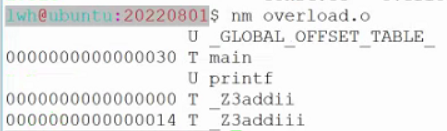

- # 一、匿名命名空间
	- 全局变量可以**跨模块调用**（另一个模块调用它，需要`extern`声明为外部变量）。匿名命名空间只能在本模块内调用。
	- ```CPP
	  另一个模块：
	  namespace
	  {
	  extern int number;//error，就算这样，也没办法用另一个模块的匿名命名空间的变量。
	  }
	  匿名命名空间无法跨模块调用
	  
	  另一个模块内声明函数后，可以使用命名空间的函数
	  namespace wd
	  {
	    void test();
	  }
	  ```
	- 可以把命名空间看成是一个容器，其中可以无限定义实体，而且是在任意的文件中都可以操作。
- # 二、const用法
	- 在C语言中定义一个常量  宏定义
	- 在C++中，可以用const取代宏定义定义常量
		- 常量是不能修改的，具有只读属性
		- const常量的内存位置，看常量定义的位置，即看定义的生命周期。
			- 函数内则为栈区、全局常量则在文字常量区
	- ```CPP
	  #define MAX 1000
	  void test0()
	  {
	    int a = 1,b = 2;
	    int c = a + b + MAX;
	    
	    const int d = 10;
	  }
	  ```
	- ==**const与宏定义的区别**== #面试常考
		- 1.发生的时机不同
			- const常量发生在编译时
			- 宏定义发生在预处理时
		- 2.const常量有类型检查，安全性更高；宏定义没有类型检查，很有可能将错误延迟到运行时，运行时错误比较难以发现。
	- 常量指针（pointer to const）
		- int const、const int  常量指针，指针在后面，*在const后面
	- 指针常量（const pointer）
		- int \*const 指针常量 指针在前面，\*在const前面
	- **概念区分** #面试常考
		- 数组指针 指针数组
			- 数组指针：数组的指针。即：它是一个指针，他指向一个数组。`int (*p)[]`
			- 指针数组：数组元素是指针。`int *p[]`
		- 函数指针 指针函数
			- 函数指针：它是一个指针，指向函数。`int (*p)()`
			- 指针函数：返回值是指针。`int* p()`
		- 常量指针 指针常量
- # ==三、C++内存布局、虚拟地址空间、内存分配方式== #面试常考
	- 以32位系统为例。虚拟地址空间：
	- {:height 500, :width 825}
	- 1.栈区(stack)：由编译器自动分配释放 ，存放函数的参数值，局部变量的值等。其操作方式类似于数据结构中的栈。
	- 2.堆区(heap)：一般由程序员分配释放，若程序员不释放，程序结束时可能由OS回收。注意它与数据结构 中的堆是两回事，分配方式倒是类似于链表。
	- 3.全局/静态区(static）：全局变量和静态变量的存储是放在一块的，在程序编译时分配。
	- 4.文字常量区：存放常量字符串。
	- 5.程序代码区：存放函数体（类的成员函数、全局函数）的二进制代码
	- ```CPP
	  str[] = "hello";
	  str和&str相同，但是：
	  str + 1：求得是数组第一个元素的地址
	  &str + 1:指针偏移的是整个数组的长度。取地址后，把整个数组看为了一个单位
	  ```
- # 四、new/delete
	- ```cpp
	  void test0()
	  {
	    //new表达式其返回值是一个相应类型的指针。malloc是void*
	    //小括号中可以进行初始化。malloc无法进行初始化
	    int *pint = new int;//都可,只是未初始化
	    int *pint = new int(1);
	    
	    free(pint);//虽然编译器没有报错，但并不代表没有错误。不能用free，要用delete
	    //free不会释放new的空间
	    delete(pint);//new与delete成对出现
	    
	    //数组,可以开辟一个数组空间，在[]中只需要加入元素个数；
	    int* pint2 = new int[10];
	    int* pint2 = new int[10](0);
	    
	    //数组回收不能delete(pint2);
	    delete []pint2;//在回收数组空间时，需要加上[]，否则就会有问题
	  }
	  ```
	- `valgrind`：内存泄漏检测工具：面试问：平常工作中如何检测内存泄漏 #面试常考
		- `valgrind --tool=memcheck ./a.out`
		- `sudo apt install valgrind`
		- 在家目录之下的.bashrc中加入：alias memcheck='valgrind --tool=memcheck --leak-check=full'
		- 之后再在命令行执行`source ~/.bashrc`
	- **new/delete与malloc/free的区别** #面试常考
		- 1.new/delete是表达式；malloc/free是库函数
		- 2.new表达式可以进行初始化，malloc是不可以进行初始化的。
		- 3.new表达式针对的是某一种类型，malloc开辟的是字节数，没有类型。
			- 所以new返回的是相应类型的指针，malloc返回的是noid*
		- 4.new/delete能对对象进行构造和析构函数的调用，进而对内存进行更加详细的工作，而malloc/free不能。
	- **区分以下概念：内存泄漏、内存溢出、内存踩踏、野指针？** #面试常考
		- >内存泄漏：程序中存在垃圾（未释放的一片无法访问的内存空间），这种线程称为内存泄漏。
		  >内存溢出：内存一直泄漏，导致最后没有内存分配了，就会导致内存溢出。
		  >内存踩踏：访问了不该访问的地址。
		  >野指针：未初始化的指针或指向未知区域的指针。
	- **`malloc` 的**底层实现**是怎样的？ `free` 是怎么回收内存的？** #面试常考
		- > malloc从堆中申请内存，并根据需要使用sbrk进行调整，当分配的内存块大于MMAP_THRESHOLD（默认128kB，可以使用mallopt进行调整）字节时，malloc会使用mmap实现内存分配。
		  >
		  >free通常不会将内存返回给OS，会将内存块放到自己的空闲块列表中，尝试合并相邻的空闲块。当需要新的空闲内存时，malloc会先查看空闲列表，如果有合适的内存空间，就将其分为两部分，一部分返回给调用者，另一部分放回空闲列表。
		  >
		  >[c++ - How do malloc() and free() work? - Stack Overflow](https://stackoverflow.com/questions/1119134/how-do-malloc-and-free-work)
- # 五、引用
	- 定义
		- `类型 &ref = 变量;`
		- 取地址、按位与、C++中的引用
	- **理解上：引用本质上是一个变量的别名，实际上：C++中的引用本质上是一种被限制的指针。**
	- 引用变量会占据存储空间，存放的是一个地址，但是编译器阻止对它本身的任何访问，从一而终总是指向初始的目标单元。在汇编里， 引用的本质就是“间接寻址”。
		- 下一讲笔记可以利用类测大小。
	- ```CPP
	  void test0()
	  {
	    int a = 1;
	    //对一个引用进行初始化时，就是在进行绑定。引用不能单独存在，必须进行初始化
	    int &ref = a;
	    ref = 10;
	    cout<<"a = "<<a<<endl;
	    cout<<"ref = "<<ref<<endl;
	    cout<<"&ref = "<<&ref<<endl;//与a的地址一样。左值
	    
	    &2;//error,字面值常量，不能取地址，2 它本身是一个立即数，没有写入回内存。右值
	    int &ref2 = 2;//error。非const左值引用无法绑定到右值
	    const int &ref2 = 2;//const左值引用可以绑定到右值    14：44 √
	    //理解：2是立即数，要有引用，得有个内存来存他，所以定义了const &ref2来绑定它，将他放入内存，
	    //即用ref2来保存2.
	    cout<<"&ref2 = "<<&ref2<<endl;
	  }
	  ```
	- 一个表达式能够取地址就称为左值。
	- 一个表达式不能取地址就称为右值
	- **非const左值引用只能绑定到左值，无法绑定右值；const左值引用可以绑定到右值**
	- ## 1.引用作为函数的参数
		- 引用传递：没有对参数本身进行复制，提高程序的执行效率，而且操作参数时，就是在操作实参本身
		- **传递的参数没有加const修饰，那么这个引用就是传入传出参数。**
	- ## 2.引用作为函数的返回值
		- 若返回引用，其返回的变量生命周期一定要大于函数。
			- 不要返回局部变量的引用。
			- 不要轻易返回一个堆空间变量的引用。
		- ```cpp
		  int func()
		  {
		    int a = 1;
		    retuan a;//执行return语句时，会进行复制
		  }
		  int& func()
		  {
		    int a = 1;
		    retuan a;//error，a是一个局部变量，当程序执行结束时，会销毁；
		  }
		  
		  int& getvalue(int idx)
		  {
		    return arr[idx];
		  }
		  
		  getvalue(1) = 20;//可以改变数组的元素，因为返回的是引用
		  
		  int& func()
		  {
		    int* pint = new int(10);
		    return *pint;
		  }
		  int& ref = func();
		  delete &ref;
		  
		  int d = a + func() + b + c;//在表达式中调用，调用一次就发生一次内存泄露，因为无法delete
		  //因此不能够轻易的返回一个堆空间变量的引用
		  //除非有了内存回收的策略。
		  ```
- # 六、C++强制转换
	- C风格强制转换：`TYPE a = (TYPE)EXPRESSION;`
	- C++对强制转换的形式做了区分：
		- `static_cast`：void*向其他类型进行转换
			- ```CPP
			  int* p = (int*)malloc(sizeof(int));
			  CPP
			  int* p = static_cast<int*>(malloc(sizeof(int)));
			  ```
		- `const_cast`：去除常量属性，函数传参时使用
			- ```cpp
			  void func(int* px)
			  {
			    *px = 100;
			  }
			  void test1()
			  {
			    const int number = 10;
			    func(&number);//error
			    func(const_cast<int*>(&number));
			  }
			  //number最后不会变，还是10
			  在函数func执行过程中，好像值被修改掉了。
			  当我们在func函数之外打印number时，发现并没有被修改。
			  可以理解func修改的是寄存器中的值，而number是存在内存里面的。
			  ```
		- `dynamic_cast`：基类与派生类之间使用
		- `reinterpret_cast`：可以在任意类型之间进行转换
			- interpret：解释说明，re重新
- # 七、函数重载
	- C没有函数重载。
	- C++ 允许多个函数拥有相同的名字，只要它们的参数列表不同就可以，这就是函数重载（Function Overloading）。
	- 函数重载的实现原理：**名字改编（name mangling）**
	- 当函数名称相同时，会根据函数参数的**类型、顺序、个数**不同进行改编。
		- 
		- 
			- nm：name mangling：展示所有函数
	- C函数的调用方式，没有进行名字改编。而C++函数的调用方式，会进行名字改编。
	- **新的需求：C++需要兼容C语言。**
		- 用C++编译器重新编译C代码时，还是希望用C的方式调用C代码：C++的按C++的方式，改编；C的按C的方式，不进行改编。
		- 在C++编译器中，涉及到C与C++的混合编程
			- extern "C"，见extern那些事儿。
			- C++编译器有一个宏==__cplusplus==。C的编译器没有
				- 见extern那些事儿
- # 八、默认参数
	- 为程序员着想，少写代码
	- **设置默认参数顺序只能按从右到左的顺序进行**
	- 当函数分成声明与实现时，只需要做声明中设置默认值即可，定义中不需要再重复给出，否则报错。
	- 默认参数也称为缺省值
- # 九、bool类型
	- C语言中表示真假：true/false 非0即为true
		- 可以包含`#include<stdbool.h>`使用bool类型
	- C++定义了新的类型：bool类型
	- 整型数据：bool、char、short、int、long。分有无符号
- # 十、inline函数
	- 内联函数是C++的增强特性之一，用来降低程序的运行时间。当内联函数收到编译器的指示时，即可发
	  生内联：编译器将使用函数的定义体来替代函数调用语句，这种替代行为发生在编译阶段而非程序运行
	  阶段。
	- 作用与宏函数类似。但是宏函数可能会发生一些错误（如：#define mul(a,b) a*b），所以有了inline。
	- 宏函数的优势是没有函数调用的开销
	- **inline与宏函数的区别**
		- 发生时机上：inline函数在**编译期**会直接用函数体进行替换，宏函数发生在预处理时期。
		- **从执行效率上来说，与宏函数保持一致。但更有优势的是，inline有类型检查，可以防止一些错误被推迟到运行时才爆发**
	- ```C
	  inline int multiply(int x,int y)
	  {
	    ...
	  }
	  ```
	- **不适合使用inline函数的实现**
		- 1.代码量太大
		- 2.代码中有for循环。（函数运行开销远大于了函数调用的开销）
	- **适合使用inline函数的情况**
		- 常用语句，而且语句比较少的情况下。
	- 函数声明不用加inline，函数实现需要加inline。或者在.h文件中给出完整的实现，不进行分离
	- 当在进行编译时，inline函数在每一个模块中，**会被函数体内的语句块进行替换的**，因此**根本就不会真正有函数的定义**存在。