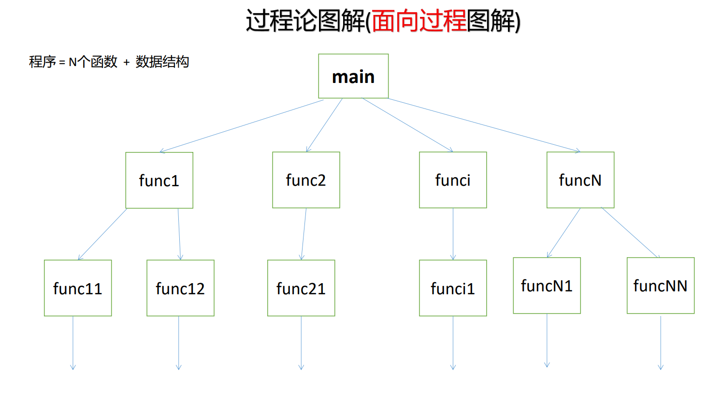
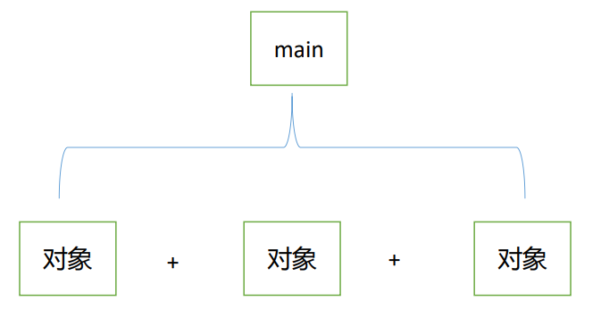
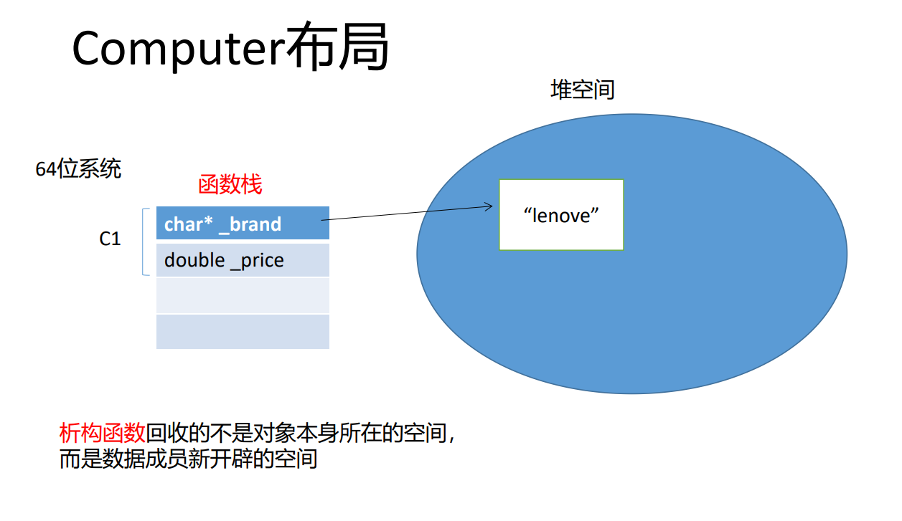
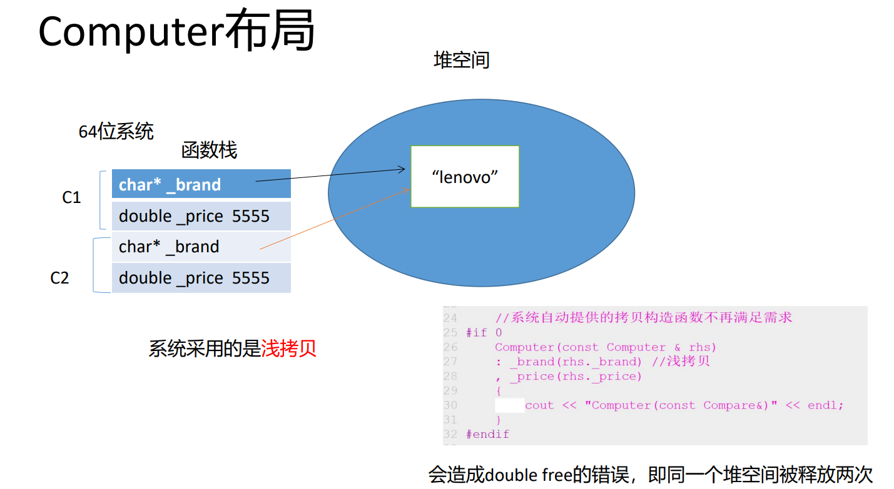

- # 一、面向过程 VS 面向对象
	- 
	- ## 1.面向对象编程
		- ### 1.具有相同的属性和行为的对象提取出一个类（分类）
			- 对象之间的交互导致属性发生变化
				- 属性：id、name、money
				- 行为：收钱、付钱
				- 人类的抽象思维方式在起作用。客观现实世界**只有对象->类**
				- 程序世界：类->对象（实例化）；类是对象的模板
			- 
			- 程序 = N个对象进行交互。
			- 本质特征：**消息传递**。
			- 三大特性：**封装、继承、多态**
- # 二、类的定义
	- ```CPP
	  class 类名
	  {
	  public:
	  //公有数据成员和成员函数
	  protected:
	  //保护数据成员和成员函数
	  private:
	  //私有数据成员和成员函数
	  }; // 千万不要忘了这个分号
	  ```
	- 编程规范：
		- 1.类名一定要首字母大写
		- 2.数据成员之前一定要加上下划线 “_”，表示它是数据成员。
			- 类似有：`m_price`、`price_`等...。我喜欢m开头的
			- 谷歌就是首字母大写和类名保持一致
	- 在C++中，类中的属性称为**数据成员**；类中的行为称为**成员函数（方法）**
	- ```CPP
	  class Computer
	  {//大括号包围的地方就是类内，其他地方就是类外
	  public://被public修饰的成员可以在类之外进行访问
	    void setBrand(const char* brand)
	    {
	      strcpy(_brand,brand);
	    }
	    void setPrice(double price)
	    {
	      _price = price;
	    }
	    
	    void print()
	    {
	      cout<<"brand: "<<_brand<<endl;
	      cout<<"_price: "<<_price<<endl;
	    }
	  private://被private进行修饰的成员都不能在类之外直接访问
	    char _brand[20];
	    double _price;
	  };
	  
	  void test0()
	  {
	    Computer c1;
	    c1.setBrand("Lenovo");//在类之外访问成员函数
	    c1.setPrice(5555);
	    c1._price = 500；//error,privete的。在类之外访问数据成员
	  }
	  ```
	- ```CPP
	  class Computer
	  {
	  public:
	    void setBrand(const char* brand);
	    //其他同上
	  };
	  
	  //成员函数在类之外实现时，需要加上类作用域
	  void Computer::setBrand(const char* brand)
	  {
	    strcpy(_brand,brand);
	  }
	  ```
	- 类的定义就是类中成员函数实现的过程。
	- **在C++里面，class和struct的唯一区别就是struct的默认访问权限时public，calss默认访问权限是private的。**
- # 三、构造函数
	- 1.对象创建时，会自动调用构造函数
	- 2.构造函数的形式：
		- 是特殊的成员函数
			- 没有返回值，即使是void也不能有
			- 函数名与类名相同
	- 3.构造函数的作用：初始化数据成员
	- 构造函数分：
		- 无参构造函数
		- 有参构造函数
		- 拷贝构造函数
		- 委托构造函数（C++11，依托有参构造实现，在初始化表达式中直接进行）
			- 作用就相当于一个补充。
			- ```CPP
			  Point(int ix)
			    :Point(ix,0)//委托给两个参数的构造函数
			  {
			      cout<<"Point(int)"<<endl;
			  }
			  ```
	- **无参构造函数**又称为默认构造函数
	- 在类中显式定义一个**有参构造函数**之后，系统就不会再自动提供默认构造函数了
	- 构造函数可以重载。
	- 结合默认参数可以简化
	- ```CPP
	  C++中
	  void test()
	  {
	    int a = 0;//初始化语句
	    a = 2;//赋值语句
	    int a(2);
	    cout<<"a = "<<a<<endl;
	  }
	  
	  构造函数中，引入默认参数后：
	  Person(int ix = 0,int iy = 0)
	  {
	    _iy = ix;//这就是赋值语句，不再是初始化语句
	    _iy = iy;
	  }
	  所以引入初始化列表：进行初始化
	  Person(int ix = 0,int iy = 0)
	    :_ix(ix)//习惯上是一行一个
	    ,_iy(iy)数据成员在初始化表达式中初始化时，要与其在类中声明的顺序保持一致，否则容易出错
	    {}
	  数据成员的初始化顺序只与其在类中被声明时的顺序有关，而与其在初始化表达式中的顺序无关。
	  ```
- # 四、析构函数
	- 1.对象被销毁时，会自动调用析构函数
	- 2.析构函数的作用：**清理类中数据成员申请的资源**（堆空间之类）
		- 不是回收对象本身的空间，而是回收之后数据成员申请的空间
	- 3.形式：
		- 是一个特殊的成员函数，不能重载
		- 没有返回值，即使是void也没有
		- 没有参数
		- 函数名与类名相同，但需要再函数名之前加上一个波浪号
	- Computer3.cc
	- ```Cpp
	  系统提供的析构函数无法满足我们的需要，因此我们需要自己定义析构函数
	  ~Computer()
	  {
	  	cout << "~Computer()" << endl;
	  	if(_brand) {
	  		delete [] _brand;
	  		_brand = nullptr;//指针赋值为空指针
	  	}
	  }
	  
	  //堆对象
	  Computer * pc = new Computer("战神", 9999);
	  cout << "pc:" << endl;
	  pc->print();
	  pc->~Computer();//析构函数可以主动调用的
	  				//但一般情况下，都不这样做
	  delete pc;//执行delete表达式时，依然会自动调用析构函数
	  ```
	- Computer布局：
		- 
	- C1对象只有16字节：一个指针、一个double数据。
	- 析构函数回收的不是对象本身所在的空间，而是数据成员新开辟的空间
	- **析构函数在那些情况下被调用？**
		- 对象被销毁的时候
			- ==栈对象，生命周期结束时，会自动调用析构函数==
			- ==全局对象、静态对象会在main函数退出后掉用析构函数释放空间。==
			- 堆对象：`Computer *pc = new Computer("战神",9999);`需要自己显式`delete pc;`才会销毁
				- 执行`delete`表达式时，依然会自动调用析构函数。
		- 说法：调用析构函数时，就意味着对象被销毁了？**错误，只是必要条件**
			- 析构函数回收的是对象的数据成员申请的空间，而不是对象本身。
	- 析构函数可以主动调用，但一般情况下，都不这样做
- # 五、拷贝构造函数
  id:: 62e8eb83-7f15-4994-b29d-ba0296572c05
	- 用一个已经存在的对象初始化另一个新对象，会调用拷贝构造函数
	- **形式：**`类名(const 类型 & rhs)`
	- ```Cpp
	  copyPoint.cc
	  Point pt3 = pt2;//这里会调用拷贝构造函数，一般情况下下，没有显式提供时，系统会自动提供。
	  <==>Point pt3(pt2);等价
	  ```
	- ```CPP
	  copyComputer.cc
	  Computer(const Computer & rhs)
	  : _brand(rhs._brand) //浅拷贝
	  , _price(rhs._price)
	  {
	  	cout << "Computer(const Compare&)" << endl;
	  }
	  
	  Computer(const Computer & rhs)
	  : _brand(new char[strlen(rhs._brand) + 1]()) 
	  , _price(rhs._price)
	  {
	  	cout << "Computer(const Compare&)" << endl;
	  	strcpy(_brand, rhs._brand);//深拷贝
	  }
	  ```
	- Computer布局
		- 
	- **浅拷贝**：系统采用的是浅拷贝，只拷贝了指针的地址，没有拷贝堆空间
	- **深拷贝**：要复制堆空间。
		- 系统提供的拷贝构造函数不再满足需求，我们需要自己实现深拷贝
	- ==**拷贝构造函数调用的时机** 三种情况==
		- 1.用一个已经存在的对象初始化另一个新对象时
		- 2.当形参是对象，实参与形参进行结合时
			- 即：形参是对象时，函数传参。值传递->进行复制->调用拷贝构造函数
			- 本质上还是第一种情况
			- 要是值传递，不能引用
		- 3.当函数的返回值是对象，执行return语句时。
			- 编译器会对return有优化操作（RVO）不会拷贝复制，去掉优化需要加上编译选项`-fno-elide-constructors`
	- **能否去掉拷贝构造函数中的const？假设可以去掉会发生什么？**
		- copyPoint.cc
		- 1.当用右值来初始化一个新对象时，会报错，因此const关键字不能少。
			- 若传入匿名对象，则缺失const后，报错：非const左值引用无法绑定到右值。
			- **const引用称为万能引用：即可以绑定左值，又可以绑定右值**
		- 2.const也可以防止误改对象。
	- 匿名对象的生存周期只在这一行 `Point(10,11).printf();`
		- 所以不能对他取地址（生存周期很短，不入内存），是右值
	- **能否去掉引用符号？**
		- 不能。此时根据拷贝构造函数的调用时机之二，会继续调用拷贝构造函数，从而进入拷贝构造函数的**无穷递归**调用，直到栈溢出。
- # 六、赋值运算符函数
	- 即对运算符的重载。在C++中，可以将运算符看成是一个函数
	- 形式：`类名& operator=(const 类名&)`万能引用参数
	- 不是构造函数，是一个成员函数。系统会自动提供一个赋值运算符函数
		- 成员函数中出现指针时，就需要自己定义赋值运算符函数。
	- operatorPoint.cc、operatoeComputer.cc
	- 赋值运算符函数的实现：四部曲操作，缺一不可。 #面试常考
		- ```CPP
		  int c = 2;
		  a = c;//赋值语句
		  
		  Point& operator=(const Point& rhs)
		  {
		    _ix = rhs.ix;
		  }
		  
		  pt2 = pt3;//当两个对象已经创建完毕时，进行的是赋值语句，而不是拷贝构造了
		  //调用了赋值运算符函数
		  <==>pt2.operator=(pt3);等价
		  
		  //系统提供的赋值运算符函数。_brand是堆空间指针
		  Computer& operator=(const Computer & rhs)
		  {
		    this->_brand = rhs->_brand;//这样直接赋值，那么本对象的堆空间就泄漏了。
		    //所以下面四部曲会先回收左操作数的空间
		    //赋值之后，_brand都指向了同一片内存空间，当回收时就发生了double free的问题。
		    return *this;//this是指针，就代表本对象，*表示解引用获取对象本身，返回解引用后的对象本身
		  }
		  
		  1.先回收原来申请的空间，不能直接丢掉，会泄漏
		  2.采用深拷贝进行赋值
		  四部曲操作：
		  Computer& operator=(const Computer & rhs)
		  {
		    if(this != &rhs)
		    {//0.加上自复制问题的判断
		      //1.先回收左操作数申请的空间
		      delete[] _brand;
		    
		      //2.深拷贝
		      _brand = new char[strlen(rhs._brand) + 1]();
		      strcpy(_brand,rhs._brand);
		    }
		    //3.返回新地址
		    return *this;
		  }
		  c1 = c1;上面的，如果是自复制问题，会出错，因为1中将空间释放了
		  ```
	- **三合成原则：**
		- 在类中如果要**显式定义**一下三个函数中的其中一个，那么另外两个也需要进行定义
			- **析构函数、拷贝构造函数、赋值运算符函数**
	- 赋值运算符的形式是否可以修改？
		- 不可以。
		- 引用不可去，不然会调用拷贝构造函数。
		- const不可去，防止修改，能接受右值，万能引用
		- 返回值不能改，连续赋值：`a = b = c;`
	- 具有复制控制语义的函数--完成对象 的复制控制操作
		- 拷贝构造
		- 赋值运算符函数
- # 七、this指针
  id:: 62e8eb83-ccf2-428c-9b68-0dfe1368c391
	- this指针代表的是当前对象本身，即：谁调用，谁就是this指针。
	- ```CPP
	  this->_ix = ix;
	  
	  pt2.print();==>pt2.printf(&pt2);调用成员函数会把pt2的地址传进去，
	  这样就能通过地址值拿到每个对象的数据成员。
	  ==>Point::print(&pt2);最终转换为了C的函数写法
	  Point类 :: 作用域限定符：类域  中的print函数
	  
	  this = 0x1000;error this指针不能改变指向
	  this->_ix = ix;可以改变指向对象的值
	  所以他的形式：类名 * const this
	  ```
	- 该this指针是一个隐含的参数（指针），由编译器自动提供，不需要手动设置，作为成员函数的第一个参数。
	- 他的形式：`类名* const this`
	- this指针是函数的参数，不占据类的空间
	- **本质：指向对象本身**
- # 八、特殊的数据成员的初始化
	- 在类的构造函数的初始化表达式中进行初始化
		- ## 1.const成员
			- **const成员的初始化只能放在构造函数的初始化列表中进行初始化**
			- ```CPP
			  class Point
			  {
			  public:
			    Point()
			    :_ix(0)
			    ,_iy(0){}
			    
			  private:
			    const int _ix;
			    const int _iy;
			  };
			  ```
		- ## 2.引用成员
			- **引用成员必须要放在初始化表达式中进行初始化**
			- ```CPP
			  class Point
			  {
			  public:
			    Point()
			    :_ix(0)
			    ,_iy(0)
			    ,_ref(_ix)
			    {}
			    
			  private:
			    int _ix;
			    int _iy;
			    int &_ref;
			  };
			  
			  类大小:十六个字节
			  ```
			- ==**类大小:十六个字节。因为引用成员占据一个指针的大小，其底层实现还是指针，只是被限制住了。**==
			  id:: 62e8eef5-e741-4435-97c6-0e73c48fcaa3
		- ## 3.类对象成员
			- **当类中有类对象成员时，必须在构造函数的初始化表达式中显式进行初始化（不然会默认调用构造函数，就不能传参了）**
			- ```CPP
			  class Point
			  {
			  public:
			    Point()
			    :_ix(0)
			    ,_iy(0)
			    {}
			    
			  private:
			    int _ix;
			    int _iy;
			  };
			  
			  class Line
			  {
			  public:
			    Line(int x1,int y1,int x2,int y2)//Line的构造函数中，没有显式调用Point的构造函数，
			      //但系统会自动调用Point的默认构造函数，相当于加上如下：
			    :_pt1()
			    ,_pt2()
			    //但现在需要传参，所以应该这么写:
			    :_pt1(x1,y1)
			    ,_pt2(x2,y2)
			    {}
			  private:
			    Point _pt1;
			    Point _pt2;
			  }
			  ```
	- ## 4.静态数据成员 明天讲
	-
- ```CPP
  #include <iostream>
  
  using std::cout;
  using std::endl;
  
  struct Foo
  {
  	Foo()
  	{
  	}
  	
  
  	Foo(int)
  	{
  	}
  	
  	void fun()
  	{
  	}
  
  };
  
  int main(void)
  {
  	Foo a(10);//语句1
  	a.fun();//语句2
  	Foo b();//语句3  会出错，因为这看起来就是一个函数声明了，无参数的应该：Foo b;
  	b.fun();//语句4 
  	return 0;
  }
  ```