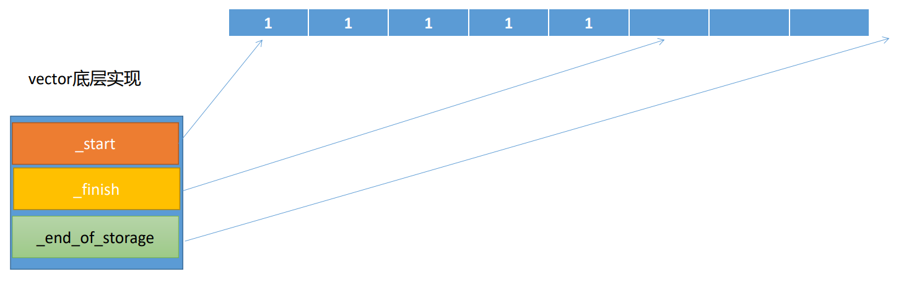

- # 一、再谈new/delete表达式
	- ## 1.new表达式的工作步骤 #面试常考
		- 1.调用库函数**operator new**申请未类型化的空间
			- 未类型化：就是void*的空间。
			- 与malloc函数功能类似
		- 2.在未类型化的空间上调用构造函数
		- 3.返回相应类型的一个指针
		- ```CPP
		  void *operator new(size_t);
		  void *operator new[](size_t);
		  返回值是申请空间的首地址
		  形参是对象所占据空间的大小
		  size_t我们不需要传递，编译器会自己确定大小。
		  因为new的时候就传了类型了，sizeof就求出来了
		  ```
	- ## 2.delete表达式的工作步骤 #面试常考
		- 1.调用相应类型的析构函数
			- 回收数据成员申请的堆空间等
		- 2.调用库函数**operator delete**回收对象本身所在的空间
			- 回收对象本身的空间
		- ```CPP
		  void operator delete(void*);
		  void operator delete[](void*);
		  ```
	- ## 3.new/delete的用法例子
		- `sizeof`是在编译时，就得到了类占据的空间的大小，并不是在运行时
			- 他不是一个函数，而是一个长度运算符
		- **如果放在全局的位置，所有的new/delete表达式都会起作用**
		- **如果放在类内，则只针对改类其作用**
		- ```CPP
		  //如果放在全局的位置，所有的new/delete表达式都会起作用
		    //如果放在Student类内部，只针对于Student类起作用。
		    void * operator new(size_t sz)
		    {
		      cout<<"new"<<endl;
		      return malloc(sz);//返回未类型化的空间
		    }
		    void * operator delete(void* ret)
		    {
		      cout<<"delete"<<endl;//打印信息可以查看验证new和delete的执行步骤
		      free(ret);
		    }
		  
		  class Student
		  {
		  public:
		    Student(const char* name,int id)
		      :_id(id)
		      ,_name(new char[strlen(name) + 1]())
		      {
		        strcpy(_name,name);
		      }
		    ~Student()
		    {
		      if(_name)
		      {
		        delete[] _name;
		        _name = nullptr;
		      }
		    }
		    void print() const
		    {
		      cout<<"name:"__name<<endl;
		      cout<<"id:"<<_id<<endl;
		    }
		    //自定义的new、delete实现
		    //如果放在全局的位置，所有的new/delete表达式都会起作用
		    //如果放在Student类内部，只针对于Student类起作用。
		    void * operator new(size_t sz)
		    {
		      cout<<"new"<<endl;
		      return malloc(sz);//返回未类型化的空间
		    }
		    void  operator delete(void* ret)
		    {
		      cout<<"delete"<<endl;//打印信息可以查看验证new和delete的执行步骤
		      free(ret);
		    }
		    
		  private:
		    int _id;
		    char* _name;
		    //因为内存对齐，64位下占据16字节。会取最长的数据的整数倍
		    //64位OS默认情况下按8字节对齐
		  }
		  
		  void test0()
		  {
		    Student* pstu = new Student("Jackie",100);
		    
		    delete pstu;
		  }
		  ```
		- 
	- ## 4.生成一个栈对象的条件
		- 
		- 同时要求构造函数和析构函数都要放在public区域才行，不然会报错。==10：53 √==
		  id:: 62eb34c6-1f19-49e1-8065-12ed4a3aecbb
		- ```CPP
		  Student stu("Rose",101);
		  ```
	- ## 5.一个类只能生成堆对象
		- 即：通过该类不能创建栈对象
		- 解决方案：将析构函数放在private区域
			- 这样就不能调用构造函数创建栈对象了，会报错
		- 所以又要一个函数来回收对象
		- ```CPP
		  void destroy()
		  {
		    //this->~Student();析构并不会销毁对象，所以需要调用delete
		    delete this;
		  }
		  不能在析构的末尾delete。会造成无穷递归的。
		  ```
	- ## 6.一个类只能生成栈对象
		- 即：通过该类不能创建堆对象
		- 解决方案：将operator new库函数放在private私有区域
			- 在类体内，也就只对该类有效
			- =delete删除掉也可以
		- 只需要声明为私有，都不需要实现
		- ```CPP
		  private:
		  	void * operator new(size_t sz);
		  	void  operator delete(void* ret);
		  ```
- # 二、std::string---C++风格字符串
	- 头文件位于<string>。C的头文件<string.h>
	- string是一个类，创建的自然是对象。而C的是char*。
	- 双引号表示的字符串的类型为`const char*`
		- `string s("hello,world!);`
		- 把C风格的字符串转换成C++风格的字符串
	- `size()`成员函数不包含'\0'的长度。
	- **区分两个概念：**
		- 1.字符串内容首地址
			- 'h'的地址
			- `const char* data = s.c_str();`
				- `c_str()`将C++风格字符串转化为C风格字符串。
				- `data()`同上
		- 2.字符串对象首地址
			- s的地址
				- `String *p = &s;`
- # 三、std::vector---C++中的动态数组
	- 头文件<vector>
	- vector在添加元素的过程中可以进行动态扩容。
	- **策略：**
		- 1.当发现size == capacity时，如果还要添加新的元素，此时，直接申请一个 2*capacity 的空间
		- 2.将原来空间的数据复制到新空间上
		- 3.释放原来的空间
		- 4.在新空间上添加新的元素。
	- ```CPP
	  using std::vector;
	  
	  void test0()
	  {
	    //无参构造
	    vector<int> numbers;
	    //size表示当前容器中元素的个数。capacity表示当前容器中最多能存放多少个元素
	    numbers.size();
	    numbers.capacity();
	    
	    //创建十个元素的数组
	    vector<int>numbers2(10);
	    vector<Point>points(10,Point(1,2));//用创建的临时对象，拷贝构造十个数组元素对象。
	    
	    //使用迭代器遍历，迭代器可以直接看成是指针
	    vetor<int>::iterator = numbers2.begin();
	    for(;it != numbers2.end();++it)
	    {
	      cout<<*it<<" ";
	    }
	    cout<<endl;
	    
	    //动态数组
	    int arr[5];//无法动态扩容
	    vector<int>numbers;
	    numbers.push_back(1);
	    
	    //emplace_back添加元素时，不需要显式调用构造函数。内部会自己构造，因为数组类型以及确定了
	    //元素的类型，所以不需要再传一次元素类型构造了。
	    vector<Point>points;
	    points.emplace_back(1,1);
	    points.push_back(Point(1,1));
	    
	    //为了不频繁扩容，所以需要先开空间，再填对象。
	    //初始化时，直接产生了10个元素
	    vector<int>numbers(10);//虽然开辟了空间，但是存放了10个对象push_back会从第11个开始
	    //要用reserve
	    vector<int>numbers;
	    numbers.reserve(100);//只开辟空间，并不产生对象
	    
	    //将剩余的未使用的空间回收
	    numbers.shrink_to_fit();
	    
	    //删除尾部的元素
	    numbers.pop_back();
	    
	  }
	  ```
	- ## vector底层实现
		- 
		- vector底层由三个指针实现，所以sizeof(vec) = 24;
			- _start：数据的第一个元素——begin()
			- _finish：数据的最后一个元素的后一个位置——end()
			- _end_of_storage：指向vector空间的末尾的后一个位置。
- # 四、输入输出机制
	- 流就是字节序列。类比如水管，相当于一种容器，存放数据
	- 流的类型
		- 标准IO
		- 文件IO
		- 字符串IO
	- 流中的基本单位是字节，因此称为字节流
	- 
	- 标准输入输出流：
		- istream cin      标准输入0 stdin
		- ostream cout  标准输出 1 stdout
		- ostream cerr   标准错误 2 stderr
		- ```CPP
		  /usr/include/c++/9目录下 iostream中：
		  
		   60   extern istream cin;       /// Linked to standard input
		   61   extern ostream cout;      /// Linked to standard output
		   62   extern ostream cerr;      /// Linked to standard error (unbuffered)
		   63   extern ostream clog;      /// Linked to standard error (buffered)
		  ```
	- 返回值是流对象本身。
	- 流都有四种状态。
		- goodbit
			- 有效状态，只有流有效时，才能正常使用。
		- badbit
			- 表示系统级别的错误，无法恢复。
		- eofbit
			- 到达了流的末尾（end of file）
		- failbit
			- 表示发生了可以恢复的错误
				- 如：输入格式错误
		- 所有的流都不能进行复制控制操作。表达的是对象语义（对象独一无二，不能复制）
			- 不能拷贝构造，不能赋值运算符函数。这两个函数在流中都被删除了。
			- ```CPP
			  using std::ifstream
			  void test0()
			  {
			    ifstream ifs1;
			    ifstream ifs = ifs1;//error
			    ifstream ifs2;
			    ifs2 = ifs1;//error
			  }
			  ```
			- 为什么不能复制？
				- ==9：46（√）==
				- 比如文件流一般对应一个文件，如果能够复制，那么就会有两个流对应同一个文件，就可能会发生一些异常，所以规定不能进行复制操作
		- C++天生支持值语义（值传递）
			- 即：自带拷贝构造、赋值运算符函数。
		- ```CPP
		  bool bad() const; //若流的badbit置位，则返回true;否则返回false
		  bool fail() const; //若流的failbit或badbit置位，则返回true;
		  bool eof() const; //若流的eofbit置位，则返回true;
		  bool good() const; //若流处于有效状态，则返回true;
		  ```
	- **流的状态在源码中的实现**
		- 都是枚举类型
		- sudo find / -name ios_base.h -print
		- ```CPP
		  /usr/include/c++/9/bits中ios_base.h文件
		   153   enum _Ios_Iostate
		   154     { 
		   155       _S_goodbit        = 0,
		   156       _S_badbit         = 1L << 0,
		   157       _S_eofbit         = 1L << 1,
		   158       _S_failbit        = 1L << 2,
		   159       _S_ios_iostate_end = 1L << 16,
		   160       _S_ios_iostate_max = __INT_MAX__,
		   161       _S_ios_iostate_min = ~__INT_MAX__
		   162     };
		  
		   398     typedef _Ios_Iostate iostate;
		  
		   402     static const iostate badbit =   _S_badbit;
		  
		   405     static const iostate eofbit =   _S_eofbit;
		  
		   410     static const iostate failbit =  _S_failbit;
		  
		   413     static const iostate goodbit =  _S_goodbit;
		  ```
	- **std::cin的测试**
		- ```CPP
		  //io.cc
		  void printStreamStatus(std::istream & is)
		  {
		    cout<<"is's goodbit "<<is.good()<<endl;
		    cout<<"is's badbit "<<is.bad()<<endl;
		    cout<<"is's eofbit "<<is.dof()<<endl;
		    cout<<"is's failbit "<<is.fail()<<endl;
		  }
		  void test0()
		  {
		    printStreamStatus(cin);
		    int number = -1;
		    cin>>number;//输入数字：正确  字符：failbit置1。number会变0
		    cout<<number<<endl;
		    printStreamStatus(cin);
		    
		    //failbit置1后，流就失效了，这里不会再卡住等待输入
		    string line;
		    cin>>line;
		    
		    cin.clear();//重置流的状态，就可以正常使用了
		    cin.ignore(1024,'\n');//1024固定的不合适，有的可能大得多，所以改为下面的
		    cin.ignore(std::numeric_limits<std::streamsize>::max(),'\n');//limits头文件
		    //std::numeric_limits:数字的极限。
		    //std::streamsize类型：即：long  16：25
		    //max()一个静态成员函数，获取该类型能表示的最大值
		  }
		  ```
			- ==16：25（√）==
				-
		- 重置流的状态（步骤）：
			- 1.调用clear方法，进行重置。
				- ```CPP
				  //clear的无参版本会复位所有错误标志位*(重置流的状态)
				  void clear(std::ios_base::iostate state = std::ios_base::goodbit);
				  ```
				- 不会清空缓冲区的值。流中是有缓冲区的。
			- 2.清空缓冲区
				- ignore
					- 
					- 丢弃掉count个字节数据，或丢弃过程中遇到delim分隔符就结束。
	- **对于输入的健壮实现**
		- ```CPP
		  int number = -1;
		  cin>>number;//这样是不健壮的，出错就无了
		  
		  int number = -1;
		  while(cin>>number,!cin.eof())//逗号表达式，以最后一个表达式的值，作为整个表达式的值
		  {
		    if(cin.bad())//无法恢复的错误
		    {
		      cout<<"cin has broken!"<<endl;
		      return;
		    }
		    else if(cin.fail())//失败，重置流的状态
		    {
		      cin.clear();
		      cin.ignore(std::numeric_limits<std::streamsize>::max(),'\n');
		      cout<<"pls input a valid integer!"<<endl;
		    }
		    else//正常情况
		    {
		      cout<<"number:"<<number<<endl;
		      break;
		    }
		  }
		  ```
		- 结束标准输入流的输入：ctrl + d
			- cin.eof()   ==16:40前（√）==
			- 读入文件末尾：eof就是前面的函数
		- 发中断信号：ctrl + c  2号
		- 发SIGSTOP信号：ctrl + z 19号
		- ctrl+\  发3号信号
	- **缓冲区**
		- C++流中的缓冲区类型
			- 全缓冲
			- 行缓冲
				- cout
			- 不带缓冲
				- cerr：错误信息要及时显示
	- 缓冲区内容被刷新的几种情况
		- 程序正常结束
		- 缓冲区满
		- 使用操作符显示刷新缓冲区
			- endl
			- flush(少用)
	- cout默认的缓冲区大小是1024，当超过缓冲区大小时，会自动刷新缓冲区。
		- cout是行缓冲，碰到换行符就立刻刷新缓冲区
	- ```CPP
	  void test0() 
	  {
	  	//碰到换行符，就立刻刷新缓冲区
	  	cout << "hello\n";//行缓冲
	  	//cout默认的缓冲区大小是1024,
	  	//当超过1024时，会自动刷新缓冲区
	  	for(int i = 0; i < 1024; ++i) {
	  		cout << 'a';
	  	}//for完不会输出
	  	cout << 'a';//者里超过缓冲区大小，进行输出。1024个。
	  	sleep(3);
	  
	  	cout << "hello" << endl;//行缓冲
	  	sleep(3);
	  } 
	   
	  int main(void)
	  {
	  	test0();
	  	return 0;
	  }
	  ```
- # 五、文件IO  笔记
	- filestream.cc
	- ```CPP
	  void test0()
	  {
	    ifstream ifs("test.txt");//打开一个文件流。文件输入流要求打开的文件必须存在，不然就gg
	    if(!ifs.good())
	    {
	      cout<<"ifstream open file error"<<endl;
	      return;
	    }
	    
	    string word;
	    //输入流运算符以空格或者换行符或者制表符作为分隔符
	    while(ifs >> word)//使用 >> 读入字符串。
	    {
	      cout<<word<<endl;
	    }
	    
	    ifs.close();//关闭流
	  }
	  
	  //每次读取一行数据
	  void test1()
	  {
	    string filename("io.cc");
	    ifstream ifs(filename);
	    if(!ifs.good())
	    {
	      cout<<"ifstream open file error"<<endl;
	      return;
	    }
	    
	    //第一种获取一行数据的方式:getline()成员函数
	    char buf[1024] = {0};
	    while(ifs.getline(buf,sizeof(buf)))
	    {
	      cout<<buf<<endl;//若不加endl换行，则源文件中的换行符就会被省略。
	      //即：getline成员函数不会读入换行符
	      memset(buf,0,sizeof(buf));
	    }
	    
	    //第二种方式：std::getline() 函数。这种方式更常用，不需要与指针打交道。
	    //std::getline()函数不会读入换行符。
	    string line;
	    while(std::getline(ifs,line))//<string>头文件中
	    {
	      cout<<buf<<endl;
	    }
	  }
	  
	  void test3()
	  {
	    //通过文件输入流读取确定的字节数
	    //一次性读取一篇文章的所有内容
	    //C++中就没有stat函数获取文件大小了
	    
	    //1.打开文件
	    ifstream ifs;
	    ifs.open("io.cc");
	    if(!ifs.good())
	    {
	      cout<<"ifstream open file error"<<endl;
	      return;
	    }
	    
	    //2.获取文件的大小
	    //2.1偏移读写指针到文件的末尾
	    ifs.seekg(0,std::ios::end);//相对位置
	    //2.2获取文件长度
	    size_t length = ifs.tellg();
	    //2.3还原文件指针到开头
	    ifs.seekg(0);//绝对位置
	    
	    //3.申请空间,在堆上，足够大
	    char* pbuf = new char[length + 1]();
	    
	    //4.读入
	    ifs.read(pbuf,length);
	    
	    //5.用string存储
	    string filecontent(pbuf);
	    
	    //6.释放空间
	    delete[] pbuf;
	  }
	  ```
	- test3后面搜索引擎也会用到。