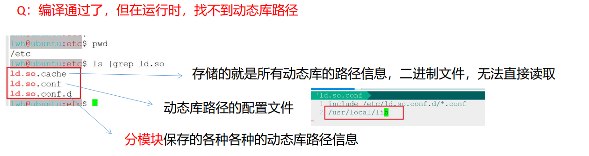
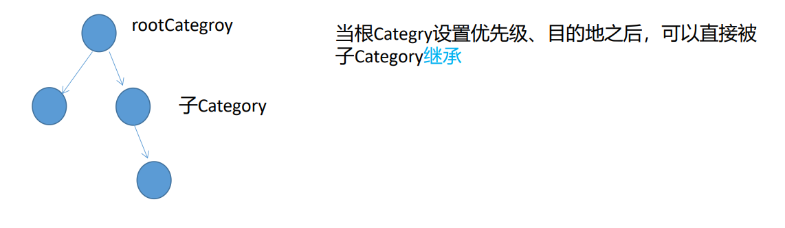
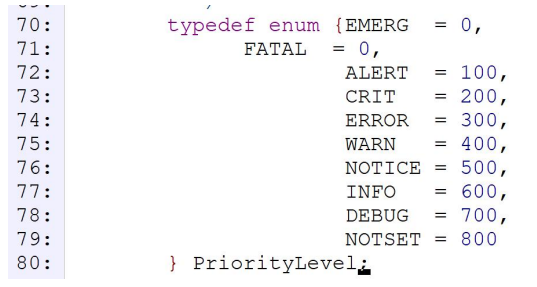
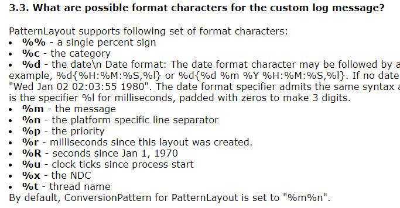
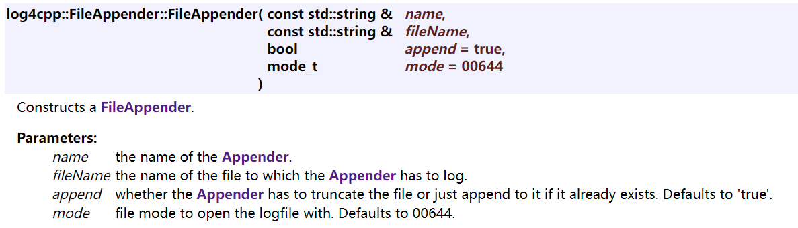
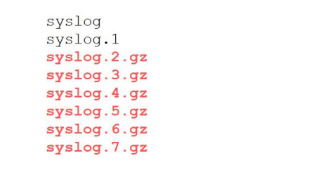

- # 一、文件的输出流oftream
	- ## 1.explicit
		- 强调要显式调用构造函数，禁止发生隐式转换
		- ```CPP
		  class Point
		  {
		  public:
		    Point(int val){};
		  };
		  void test0()
		  {
		    //把一个整型数据转换成Point类型的对象
		    //照理说不应该有这种转换的
		    //但是有Point(int val)的构造函数。
		    //编译器会生成一个临时对象Point(1)；编译器在背后偷偷完成的。隐式转换
		    Point pt = 1;
		    cout<<"pt"<<endl;
		    //如果不希望该操作正常进行，就需要禁止
		    //Point(int val)前加上explicit关键字。
		  }
		  ```
	- ## 2.ofstream例子
		- ```CPP
		  void test0()
		  {
		    //ofstream ofs = "test.txt";//explicit 防止这种写法
		    //文件不存在时，会创建一个文件
		    //如果文件存在，就直接清空文件流的内容
		    ofstream ofs("test.txt");//默认out模式，会直接清空文件流内容
		    if(!ofs.good())
		    {
		      return;
		    }
		    
		    ofs<<"this is a test";
		    
		    ofs.close();
		  }
		  ```
	- ## 3.ifstream、ofstream输入输出例子：
		- ```CPP
		  //filestream.cc
		  using std::vector;
		  using std::string;//C++倾向于将其当成是内置类型，不写头文件也行
		  
		  vector<string> file;//为了两个函数都能操作，将其设为全局
		  void test1()
		  {
		    string filename("ofstream.cc");
		    ifstream ifs(filename);
		    if(!ifs.good())
		    {
		      cout<<"ifstream open file error"<<endl;
		      return;
		    }
		    
		    file.reserve(100);
		    
		    string line;
		    while(std::getline(ifs,line))//<string>头文件中
		    {
		      file.emplace_back(line);
		    }
		  }
		  
		  void test0()
		  {
		    ofstream ofs("test.txt");//默认out模式，会直接清空文件流内容
		    if(!ofs.good())
		    {
		      return;
		    }
		    
		    //文件写入
		    for(auto &line:file)
		    {
		      ofs<<line<<endl;
		    }
		    
		    ofs.close();
		  }
		  ```
	- ## 4.改变ofstream打开的模式
		- ```CPP
		  //保留原有的数据，同时要添加新的内容
		  void test0()
		  {
		    ofstream ofs("test.txt",std::ios::out | std::ios::app);//默认out模式，会直接清空文件流内容
		    //app模式可以保证每次写入操作都在文件末尾，即使对文件指针进行了偏移操作
		    //每次写都会在内部会先把指针偏移到末尾，再写
		    if(!ofs.good())
		    {
		      return;
		    }
		    
		    size_t pos = ofs.tellp();//输出流是tellp函数。输入流是tellg
		    ofs.seekp(0);
		    
		    char buf[] = "this is a new line\n";
		    ofs.write(buf,sizeof(buf));//还可以用write写入
		    
		    ofs.close();
		  }
		  ```
		- **动态观察文件写入的内容，**==工作中动态查看日志文件==
			- `tail -f test.txt`
- # 二、文件输入输出流fstream
	- ## 文件输入输出流：既能输入也能输出
		- ofstream.cc
		- ```CPP
		  //先从标准输入中读取五个数字，写入一个文件中，之后再从该文件中读取所有的整型数据
		  void test3()
		  {
		    fstream fs("test2.txt");//文件输入输出流，要求文件必须存在
		    if(!fs.good())
		    {
		      cout<<"fstream open file error"<<endl;
		      return;
		    }
		    
		    //从标准输入读出并写入
		    int number = -1;
		    for(int i = 0;i < 5;++i)
		    {
		      std::cin>>number;
		      fs<<number<<" ";
		    }
		    
		    //偏移指针
		    fs.seekg(0);//fstream继承了ifstream和ofstream，所以seekp和seekg都有。
		    //后面做读取，所以就用seekg吧。
		    
		    //读取
		    for(int i = 0;i < 5;++i)
		    {
		      fs >> number;
		      cout<<number<<" ";
		    }
		    //关闭
		    fs.close();
		  }
		  ```
- # 三、字符串IO
	- 头文件位置<sstream>
	- 字符串IO作用：
		- 在字符串与其他类型之间进行格式转换。
		- 类似`sprintf`、`sscanf`。
	- 没有close方法，不需要关闭。
	- ## 1.字符串输入流 istringstream
	- ## 2.字符串输出流 ostringstream
		- ```CPP
		  //stringstream.cc
		  #include <sstream>
		  using std::ostringstream;
		  using std::istringstream;
		  using std::string;
		  
		  void test0()
		  {
		    ostringstream oss;
		    int number = 1;
		    double dnumber = 11.11;
		    
		    //把其他类型转成字符串
		    oss<<"number= "<<number<<",dnumber= "<<dnumber;
		    string str = oss.str();//拼接成了字符串
		    
		    //字符串转换成其他类型
		    istringstream iss(str);//可以看成是一个缓冲区、容器
		    
		    string word1,word2;
		    iss>>word1>>number>>word2>>dnumber;//知道str格式
		    //空格分割了数字和string，所以可以用>>分隔开
		    //别忘了>>以空格或换行为分隔符
		  }
		  ```
		- **常用于配置文件的解析**
			-
			- ```CPP
			  测试文件内容：
			  ip 127.0.0.1
			  port 8888
			  threadNum 5
			  pagelib /home.wangdao.Network/pagelib.dat
			  
			  void readConfiguration(const string& filename)
			  {
			    ifstream ifs(filename);
			    if(!ifs.good())
			    {
			      cout<<"ifstream open file "<<filename<<" error"<<endl;
			      return;
			    }
			    string line;
			    string key,value;
			    while(getline(ifs,line))
			    {
			      istringstream iss(line);//解析每一行数据
			  	iss>>key>>value;//因为用空格做分隔符，所以就用>>
			      cout<<key<<"--->"<<value<<endl;
			    }
			    
			    ifs.close();
			  }
			  
			  //上面还需要一个字符串转数字
			  int str2int(const string& number)
			  {
			    istringstream iss(number);
			    int num = -1;
			    iss>>num;
			    return num;
			  }
			  ```
- # 四、日志系统
	- Why有日志系统？
		- 标准IO在实际开发时，根本就没有用武之地
		- 服务器程序的特点：
			- 以**守护进程**的方式在进行
				- 守护进程：没有终端、7*24h服务
			- 所以需要了解服务器程序发生了那些事情
		- **日志系统**是服务器程序的非常重要的模块。
	- 日志分类：
		- 1.业务日志
			- 比如记录用户的一些操作
		- 2.系统日志
	- 日志系统的设计
		- 1.日志来源：分模块记录日志，可以分清是谁记录的日志 Category
		- 2.日志布局/格式：日志记录要有格式 Layout
		- 3.日志优先级：Priority
			- 研发人员、产品用户关注的日志信息不同：对日志进行过滤
			- 可以有的日志专门给研发人员开，有的专门给用户看
		- 4.日志的目的地 Appender
			- 日志存储的位置
			- 本地 发送给远程服务器
	- ## 库的安装
		- ==**在公司中，库基本都是采用源码安装的。必须掌握**==
		- 
		- Linux中库文件由以上三个文件进行管理。
		- 找不到库时，就需要在`ld.so.conf`中添加库的目录。然后执行`sudo ldconfig`命令更新`ld.so.cache`文件，把所有的动态库路径信息更新到该文件中。
		- **当报找不到动态库错误时：**
			- 1.在动态库路径配置文件中添加动态库的目录
			- 2.`sudo ldconfig`更新`ld.so.cache`文件。
	- ==ctrl+r可以搜索已经执行过的命令==
	- **软件的使用方式**
		- 1.图形化界面
		- 2.命令行方式
		- **3.源码**
			- 头文件+实现文件
			- 头文件+静态库
			- 头文件+动态库
	- **阅读源码的工具**
		- VS（C++最强大的IDE：集成开发环境 适合大型项目）
		- VSCode
		- notepad++
		- UltraEdit
		- Source Insight（Windows 专用）
			- 比较好用
		- SlickEdit（跨平台）推荐
	- 读源码：看不懂的先不看，挑看得懂的看
	- ## 1.Category
		- 叫日志来源或日志记录器
		- {:height 217, :width 716}
	- ## 2.Priority
		- 作用：进行日志过滤
			- 如：调试时，可以打印DEBUG优先级的调试信息，正式运行时，将打印优先级提升到DEBUG以上，就不会打印调试信息了。
		- **Category**是拥有优先级的，**每一条日志**也拥有一个优先级
		- Categpry的成员函数以优先级来指定每一条日志的优先级。
			- 
		- ==**当每一条日志的优先级大于等于Category优先级时，该条日志才会被记录；否则就会被忽略。**==
		- 
		- ```CPP
		  enum  	PriorityLevel {
		    EMERG = 0, 
		    FATAL = 0, 
		    ALERT = 100, 
		    CRIT = 200,
		    ERROR = 300, 
		    WARN = 400, 
		    NOTICE = 500, 
		    INFO = 600,
		    DEBUG = 700, 
		    NOTSET = 800
		  }
		  ```
		- **优先级的数值越小，优先级越高。**
	- ## 3.Layout
		- log4cpp::BasicLayout
		- log4cpp::**PatternLayout**：自定义日志格式/布局
			- 
			- ```CPP
			  virtual void 	setConversionPattern (const std::string &conversionPattern) throw (ConfigureFailure)
			   	设置此模式布局处理的日志行的格式。更多。。。
			  ```
		- log4cpp::SimpleLayout
	- ## 3.Appender
		- 日志目的地
		- log4cpp::FileAppender
		- log4cpp::RollingFileAppender   **回卷文件**
		- log4cpp::OstreamAppender
		- 
		- `OstreamAppender (const std::string &name, std::ostream *stream)`
			- 第一个参数指定OstreamAppender的名称，第二个参数指定它关联的流的指针。
	- **测试用例：**
		- ```CPP
		  log4cpp2.cc
		  不同的Appender需要设置一个单独的Layout布局对象，不能共用一个Layout对象，否则会段错误
		  
		  //PatternLayout自定义日志格式
		  //1.定义日志格式
		  //1.1new一个PatternLayout对象
		  //1.2setConversionPattern设置日志格式
		  //2.new一个appender，设置他的Layout setLayout
		  //3.定义一个catory类对象，设置优先级，添加appender。
		  #include <iostream>
		  using std::cout;
		  using std::endl;
		  
		  #include <log4cpp/Category.hh>
		  #include <log4cpp/Appender.hh>
		  #include <log4cpp/FileAppender.hh>
		  #include <log4cpp/OstreamAppender.hh>
		  #include <log4cpp/PatternLayout.hh>
		  #include <log4cpp/Priority.hh>
		  
		  int main(int argc, char** argv) {
		  
		  	log4cpp::PatternLayout * ptnLayout1 = new log4cpp::PatternLayout();
		  	ptnLayout1->setConversionPattern("%d %c [%p] %m%n");
		  
		  	log4cpp::PatternLayout * ptnLayout2 = new log4cpp::PatternLayout();
		  	ptnLayout2->setConversionPattern("%d %c [%p] %m%n");
		  
		  	//不同的Appender需要设置一个单独的Layout对象，不能共用一个Layout对象
		  	//否则就会报错
		  	log4cpp::Appender *appender1 = new log4cpp::OstreamAppender("console", &std::cout);
		  	appender1->setLayout(ptnLayout1);
		  
		  	log4cpp::Appender *appender2 = new log4cpp::FileAppender("default", "program.log");
		  	appender2->setLayout(ptnLayout2);
		  
		  	log4cpp::Category& root = log4cpp::Category::getRoot();
		  	root.setPriority(log4cpp::Priority::DEBUG);
		  	root.addAppender(appender1);
		  
		  	//一个Category对象可以设置多个Appender对象
		  	//根Category的相关信息是可以被子Category继承的
		  	log4cpp::Category& sub1 = log4cpp::Category::getInstance(std::string("testmodule"));
		  	sub1.setPriority(log4cpp::Priority::ERROR);
		  	sub1.addAppender(appender2);
		  
		  	// use of functions for logging messages
		  	root.emerg("root emermg");
		  	root.fatal("root fatal");
		  	root.alert("root alert");
		  	root.crit("root crit");
		  	root.error("root error");
		  	root.notice("root notice");
		  	root.info("root info");
		  	root.debug("root debug");
		  	sub1.emerg("root emermg");
		  	sub1.fatal("root fatal");
		  	sub1.alert("root alert");
		  	sub1.crit("root crit");
		  	sub1.error("root error");
		  	sub1.notice("root notice");
		  	sub1.info("root info");
		  	sub1.debug("root debug");
		  
		  	//回收所有的堆对象的操作
		  	log4cpp::Category::shutdown();
		  
		  	return 0;
		  }
		  
		  ```
	- **回卷文件**
		- 如果不使用回卷文件，一个文件就会不断写入信息，会不断膨胀，这样带来的问题是该日志文件会越来越大，占据大量的存储空间。后续对该文件进行分析时，也会很不方便
		- 因此使用回卷文件的意义在于：**节省空间**。
			- 就是文件达到一定大小，就开另一个文件。而且过一段时间，前面的文件就删除。
			- 假如设计一个系统最多只能由有1G的空间来存储系统日志，就需要考虑使用回卷文件了
				- 可以限制10个日志文件，每一个设计100M
				- 这样每次写入的是第一个文件，第一个满了，就备份出一个文件，然后清空继续写第一个文件。如：syslog满了备份到syslog1，继续写，满了再备份到syslog1，原syslog1变为syslog2
				- 
		- ```CPP
		  RollingFileAppender (
		    const std::string &name, 
		    const std::string &fileName, 
		    size_t maxFileSize=10 *1024 *1024, 
		    unsigned int maxBackupIndex=1, 
		    bool append=true, 
		    mode_t mode=00644)
		  - name：给该对象取一个名字  
		  - filename：保存到文件中的名字  
		  - maxFileSize：设置文件最多能够存储的字节数  
		  - maxBackupIndex：备份文件的个数  
		  
		  log4cpp3.cc
		  //回卷文件示例：
		  int main(int argc, char** argv) {
		  
		  	log4cpp::PatternLayout * ptnLayout1 = new log4cpp::PatternLayout();
		  	ptnLayout1->setConversionPattern("%d %c [%p] %m%n");
		  
		  	log4cpp::PatternLayout * ptnLayout2 = new log4cpp::PatternLayout();
		  	ptnLayout2->setConversionPattern("%d %c [%p] %m%n");
		  
		  	log4cpp::PatternLayout * ptnLayout3 = new log4cpp::PatternLayout();
		  	ptnLayout3->setConversionPattern("%d %c [%p] %m%n");
		  	//不同的Appender需要设置一个单独的Layout对象，不能共用一个Layout对象
		  	//否则就会报错
		  	log4cpp::OstreamAppender *appender1 = new log4cpp::OstreamAppender("console", &std::cout);
		  	appender1->setLayout(ptnLayout1);
		  
		  	log4cpp::FileAppender *appender2 = new log4cpp::FileAppender("default", "program.log");
		  	appender2->setLayout(ptnLayout2);
		  
		  	log4cpp::RollingFileAppender *appender3 = new log4cpp::RollingFileAppender(
		  			"rollingFile",
		  			"rollingwd.log",
		  			5000,
		  			3); 
		  
		  	log4cpp::Category& root = log4cpp::Category::getRoot();
		  	root.setPriority(log4cpp::Priority::DEBUG);
		  	root.addAppender(appender1);
		  
		  	//一个Category对象可以设置多个Appender对象
		  	//根Category的相关信息是可以被子Category继承的
		  	log4cpp::Category& sub1 = log4cpp::Category::getInstance(std::string("testmodule"));
		  	sub1.setPriority(log4cpp::Priority::ERROR);
		  	sub1.addAppender(appender2);
		  	sub1.addAppender(appender3);
		  
		  	for(int i = 0; i < 100; ++i) {
		  		sub1.emerg("root emermg, %d", i);
		  		sub1.fatal("root fatal, %d", i);
		  		sub1.alert("root alert, %d", i);
		  		sub1.crit("root crit, %d", i);
		  		sub1.error("root error, %d", i);
		  		sub1.notice("root notice, %d", i);
		  		sub1.info("root info, %d", i);
		  		sub1.debug("root debug, %d", i);
		  	}
		  
		  	//回收所有的堆对象的操作
		  	log4cpp::Category::shutdown();
		  
		  	return 0;
		  }
		  ```
	- 我们平时调试信息就是DEBUG级别的优先级，当不需要输出的时候，就将输出的优先级调高，就不会输出调试信息了。
	- 可以通过配置文件来完成日志系统
		- 用宏去变名字sub1.DEBUG，在另一个.h中，定义category
	- **配置文件示例：**
		- 通过配置文件来设置日志
		- ```CPP
		  //log4cpp.conf
		  # log4cpp.properties
		  
		  //.指出了继承的关系：root->sub1->sub2
		  //后面rootAppender是名字，相当于别名了
		  log4cpp.rootCategory=DEBUG, rootAppender
		  log4cpp.category.sub1=DEBUG, A1, A2
		  log4cpp.category.sub1.sub2=DEBUG, A3
		  
		  log4cpp.appender.rootAppender=ConsoleAppender
		  log4cpp.appender.rootAppender.layout=PatternLayout
		  log4cpp.appender.rootAppender.layout.ConversionPattern=%d %c [%p] %m%n 
		  
		  log4cpp.appender.A1=FileAppender
		  log4cpp.appender.A1.fileName=A1.log
		  log4cpp.appender.A1.layout=BasicLayout
		  
		  log4cpp.appender.A2=FileAppender
		  log4cpp.appender.A2.threshold=WARN	//优先级
		  log4cpp.appender.A2.fileName=A2.log
		  log4cpp.appender.A2.layout=PatternLayout
		  log4cpp.appender.A2.layout.ConversionPattern=%d %c [%p] %m%n 
		  
		  log4cpp.appender.A3=RollingFileAppender
		  log4cpp.appender.A3.fileName=A3.log
		  log4cpp.appender.A3.maxFileSize=200
		  log4cpp.appender.A3.maxBackupIndex=1
		  log4cpp.appender.A3.layout=PatternLayout
		  log4cpp.appender.A3.layout.ConversionPattern=%d %c [%p] %m%n 
		  
		  ```
		- ```CPP
		  //log4cppConfigure.cc
		  #include <iostream>
		  using std::cout;
		  using std::endl;
		  
		  #include <log4cpp/Category.hh>
		  #include <log4cpp/PropertyConfigurator.hh>
		  
		  int main(int argc, char* argv[])
		  {
		  	std::string initFileName = "log4cpp.conf";//读取配置文件
		  	log4cpp::PropertyConfigurator::configure(initFileName);
		  
		  	log4cpp::Category& root = log4cpp::Category::getRoot();
		  
		  	log4cpp::Category& sub1 = 
		  		log4cpp::Category::getInstance(std::string("sub1"));
		  
		  	log4cpp::Category& sub2 = 
		  		log4cpp::Category::getInstance(std::string("sub1.sub2"));
		  
		  	root.warn("Storm is coming");
		  
		  	sub1.debug("Received storm warning");
		  	sub1.info("Closing all hatches");
		  
		  	sub2.debug("Hiding solar panels");
		  	sub2.error("Solar panels are blocked");
		  	sub2.debug("Applying protective shield");
		  	sub2.warn("Unfolding protective shield");
		  	sub2.info("Solar panels are shielded");
		  
		  	sub1.info("All hatches closed");
		  
		  	root.info("Ready for storm.");
		  
		  	log4cpp::Category::shutdown();
		  
		  	return 0;
		  }
		  ```