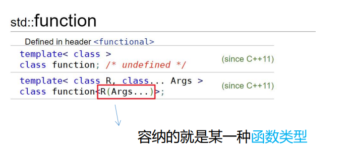

- # 一、日志封装
	- ```CPP
	  #ifndef __WD_MYLOGGER_HPP
	  #define __WD_MYLOGGER_HPP
	  
	  #include <log4cpp/Category.hh>
	  
	  
	  namespace wd
	  {
	  
	  class Mylogger
	  {
	  public:
	  	static Mylogger * getInstance()
	  	{
	  		if(nullptr == _pInstance) {
	  			_pInstance = new Mylogger();
	  		}
	  		return _pInstance;
	  	}
	  
	  	static void destroy()
	  	{
	  		if(_pInstance) {
	  			delete _pInstance;
	  			_pInstance = nullptr;
	  		}
	  	}
	  
	  	void warn(const char *msg);
	  	void error(const char *msg);
	  	void debug(const char *msg);
	  	void info(const char *msg);
	  	
	  private:
	  	Mylogger();
	  	~Mylogger();
	      
	  private:
	  	static Mylogger * _pInstance;
	  	log4cpp::Category & _mycat;
	  };
	  
	  
	  }//end of namespace wd
	   
	  //要用宏函数替换，不然__FUNCTION__、__LINE__会不一样的。
	  #define prefix(msg)	string("[").append(__FILE__).\
	  		   append(":").append(__FUNCTION__).\
	  		   append(":").append(std::to_string(__LINE__)).\
	  		   append("] ").append(msg).c_str()
	  
	  
	  #define LogWarn(msg) wd::Mylogger::getInstance()->warn(prefix(msg))
	  #define LogError(msg) wd::Mylogger::getInstance()->error(prefix(msg))
	  #define LogDebug(msg) wd::Mylogger::getInstance()->debug(prefix(msg))
	  #define LogInfo(msg) wd::Mylogger::getInstance()->info(prefix(msg))
	   
	   
	  #endif
	  
	  ```
	- ```CPP
	  #include "Mylogger.hpp"
	  
	  #include <iostream>
	  using std::cout;
	  using std::endl;
	  
	  #include <log4cpp/PatternLayout.hh>
	  #include <log4cpp/OstreamAppender.hh>
	  #include <log4cpp/FileAppender.hh>
	  #include <log4cpp/Priority.hh>
	  
	  namespace wd
	  {
	  Mylogger * Mylogger::_pInstance = nullptr;
	  
	  Mylogger::Mylogger()
	  : _mycat(log4cpp::Category::getRoot().getInstance("mycat"))
	  {
	  	auto ptnLayout1 = new log4cpp::PatternLayout();
	  	ptnLayout1->setConversionPattern("%d %c [%p] %m%n");
	  
	  	auto ptnLayout2 = new log4cpp::PatternLayout();
	  	ptnLayout2->setConversionPattern("%d %c [%p] %m%n");
	  
	  	auto ostreamApp = new log4cpp::OstreamAppender("console", &cout);
	  	ostreamApp->setLayout(ptnLayout1);
	  
	  	auto fileApp = new log4cpp::FileAppender("fileApp", "wd.log");
	  	fileApp->setLayout(ptnLayout2);
	  
	  	_mycat.setPriority(log4cpp::Priority::DEBUG);
	  	_mycat.addAppender(ostreamApp);
	  	_mycat.addAppender(fileApp);
	  
	  	cout << "Mylogger()" << endl;
	  }
	  
	  Mylogger::~Mylogger()
	  {
	  	//Category类的shutdown会自动回收相关的堆对象
	  	log4cpp::Category::shutdown();
	  	cout << "~Mylogger()" << endl;
	  }
	  
	  void Mylogger::warn(const char *msg)
	  {
	  	_mycat.warn(msg);
	  }
	  
	  void Mylogger::error(const char *msg)
	  {
	  	_mycat.error(msg);
	  }
	  
	  void Mylogger::debug(const char *msg)
	  {
	  	_mycat.debug(msg);
	  }
	  
	  void Mylogger::info(const char *msg)
	  {
	  	_mycat.info(msg);
	  }
	  
	  }//end of namespace wd
	  
	  ```
- # 二、友元
	- 1.什么叫友元？语法知识：**friend关键字**
	- 2.**解决了什么问题：**
		- 在类之外，是无法访问到private成员的，但是友元除外，友元可以在类之外访问私有成员
	- 3.友元的特点
		- 1.友元不受**类中访问权限的限制**
		- 2.友元破坏了类的封装性
		- 3.不能滥用友元，友元的使用受到限制
			- 友元是单向的
				- A是B的友元，B不一定是A的友元
			- 不具备传递性
				- A是B的友元，B是C的友元，A不具备传递为C的友元
			- 不能被继承
				- 父类的友元不一定是子类的友元
	- 4.友元的形式
		- 1.普通函数
		- 2.成员函数
		- 3.另一个类中=>友元类
	- 5.测试：
		- 1.友元之普通函数
			- ```CPP
			  #include <math>
			  
			  class Point
			  {
			  public:
			    explicit
			    Point(int ix = 0,int iy = 0)
			      :_ix(ix)
			      ,_iy(iy){}
			    ~Point(){}
			    void print()const
			    {
			      cout<<"("<<_ix
			        <<","<<_iy
			        <<")"<<endl;
			    }
			    friend float destance(const Point& lhs,const Point& rhs);
			  private:
			    int _ix;
			    int _iy;
			  }
			  
			  float destance(const Point& lhs,const Point& rhs)
			  {
			    return sqrt((lhs._ix - rhs._ix) * (lhs._ix - rhs._ix) + 
			    (lhs._iy - rhs._iy) * (lhs._iy - rhs._iy));
			  }
			  
			  void test0()
			  {
			    Point pt1(11,11),pt2(1,1);
			    pt1.print();
			    pt2.print();
			    cout<<distance(pt1,pt2)<<endl;
			  }
			  
			  int main(void)
			  {
			    
			  }
			  ```
		- 2.友元之成员函数
			- ```cpp
			  //他可以解决头文件之间的循环依赖的问题
			  class Point;//对于Line类中的Point进行前向声明，因为前面定义实现前，没有实现定义
			  //类的前向声明，只有类名，没有具体实现。
			  
			  class Line
			  {
			  public:
			    float destance(const Point& lhs,const Point& rhs);
			  }
			  
			  class Point
			  {
			  public:
			    friend float Line::destance(const Point& lhs,const Point& rhs);
			  }
			  
			  //实现放到Point类定义后面，不然会报未定义Point的错误
			  float Line::destance(const Point& lhs,const Point& rhs)
			  {
			    return sqrt((lhs._ix - rhs._ix) * (lhs._ix - rhs._ix) + 
			    (lhs._iy - rhs._iy) * (lhs._iy - rhs._iy));
			  }
			  void test0()
			  {
			    //创建一个Line的匿名对象，通过他去调用distance函数
			    cout<<Line().distance(pt1,pt2)<<endl;
			  }
			  ```
		- 3.友元类
			- ```CPP
			  class Point
			  {
			  public:
			    //如果使用的是该语句，表示之前已经出现过Line的声明
			    friend Line;//将整个类都设置为Point的友元，
			    //那Line类中的每一个成员函数都是Point的友元
			    friend class Line;//如果当前语句前，没定义Line，就可以这样写，表示Line是类
			    //如果使用该语句，表示之前没有出现过Line的声明。
			    
			    void setZ(Line& line,int z)
			    {
			      lin._z = 1;//无法操作。说明了友元是单向的
			    }
			  }
			  
			  class Line
			  {
			  public:
			    void setPoint(Point& pt,int ix,int iy);
			  private:
			    int _z;
			  }
			  void Line::setPoint(Point& pt,int ix,int iy)
			  {
			    pt._ix = ix;
			    pt._iy = iy;
			  }
			  ```
- # 三、运算符重载 operator
	- ## 1.为什么需要进行运算符重载？
		- **运算符**表达含义的时候很简洁，一看就懂，当定义了自定义类型时，也希望这些运算符能被自定义类型使用，因此就有了运算符重载的需求：**希望自定义类类型在操作时与内置类型保持一致**
		- 本质：
			- 将运算符泛化成函数
			- 函数重载
	- ## 2.能够重载的运算符42个
	- ## **3.不能重载的运算符5个**    记住这五个，其他的都能重载 #选择题
		- `.` 成员访问运算符
		- `.*`成员指针访问运算符
		- `?;`三目运算符
		- `::`作用域限定符
		- `sizeof()`长度运算符
		- **口诀：带点的都不能重载。**
	- ## 4.运算符重载的规则
		- 1.运算符重载时，其类型必须要是自定义类型或者是枚举类型，**不能是内置类型**。
		- 2.其优先级和结合性还是保持固定不变 `a == b + c`
		- 3.操作符的操作数个数是保持不变的。
		- 4.因此运算符重载时，不能设置默认参数（不然操作数的个数就可以改变了）。
		- 5.逻辑与`&&`和逻辑或`||`就不再具备短路求值特性，会直接执行函数体，不推荐重载。
		- 6.不能臆造一个并不存在的运算符。
			- 如：`@`、`$`...
	- ## 5.测试 ==17:34视频==
		- ### 1.经典例子：复数的实现
			- 复数分为实部和虚部：i^2 = -1
			- **双目运算符推荐以友元函数（普通函数）形式进行重载**
				- +-*/%
			- 复合运算符才建议用成员函数重载，因为他要返回对象本身
				- a += b;a = a + b;要返回a本身
				- **即：当运算符执行完毕之后，对象本身发生变化的，一般情况下，建议以成员函数形式进行重载**
		- ### 1.加法运算符
			- ```CPP
			  //Complex.cc
			  class Complex
			  {
			  public:
			      //1.友元实现重载（比法2更好：破坏了封装性但没有法2破坏那么严重，因为
			    	//法2中get系列函数相当于将private变为了public了）
			    	friend Complex operator+(const Complex& rhs,const Complex& rhs);
			    	//2.类必须要提供get系列函数
			      double getReal()const {return _dreal;}
			    	double getImage()const {return _dimag;}
			    	//3.成员函数实现运算符重载
			    	Complex operator+(const Complex& rhs)
			      {
			        	return Complex(this->_dreal,rhs._dreal,this->_dimag,rhs._dimag);
			      }
			    	Complex(double dreal,double dimag)
			        :_dreal(dreal)
			        ,_dimag(dimag)
			        {
			          
			        }
			    	void print()const
			      {
			        	cout<<_dreal<<" + "<<_dimag<<endl;
			      }
			    	
			  privavte:
			    double _dreal;
			    double _dimag;
			  }
			  //1.普通函数的实现:友元函数
			  Complex operator+(const Complex& rhs,const Complex& rhs)
			  {
			    	return Complex(lhs._dreal+rhs._dreal,lhs._dimag+rhs._dimag);
			  }
			  //2.普通函数实现：类必须要提供get系列函数
			  Complex operator+(const Complex& rhs,const Complex& rhs)
			  {
			    	return Complex(lhs.getReal()+rhs.getReal(),lhs.getImage()+rhs.getImage());
			  }
			  //3.运算符重载之成员函数
			  
			  
			  void test0()
			  {
			    	Complex c1(1,2),c2(2,3);
			    	Complex c3 = c1 + c2;
			  }
			  ```
			- ```CPP
			  &(a++);//error 右值，表达式的值是一个临时变量
			  &(++a);//ok 左值
			  ```
		- ### 2.自增自减运算符
			- **前置形式的返回值为引用，后置形式的返回值为对象**
				- 在演示时为了与int类型做对比，前置的结果与后置的结果有了严格区分；但还要根据实际情况，进行取舍，有时，如果只是为了让某一个对象具有前置和后置的功能，有可能返回都是对象本身，比如后续要学到的迭代器的使用
			- 前置后置的区别
				- 效率
					- 前置效率更高，其返回值为引用，不需要保存临时变量，直接返回对象本身即可
					- 后置返回值是对象，会调用拷贝构造函数，而且需要保存变化前的值
				- 取地址
					- 前置可以取地址，是左值
					- 后置不可以取地址，是右值。因为返回的只是一个临时变量
			- ```CPP
			  //类的成员函数实现，因为对象本身发生了变化
			  //前置++
			  Complex& operator++()
			  {
			    	++_dreal;
			    	++_dimag;
			    	return *this;
			  }
			    
			  //后置++; C++规定：后置形式必须要在形参列表之中加上一个参数int类型
			  //以区分出前置形式，但该int型参数并不传递任何实参。
			  Complex operator++(int)
			  {
			    	Complex tmp(*this);
			    	++_dreal;
			    	++dimag;
			    	return tmp;
			  }
			  ```
		- ### 3.函数调用运算符
			- **重载了函数调用运算符的类创建的对象称为==函数对象==**
				- 因为它可以像调用函数那样使用。
				- 函数对象就是把函数当成一个对象来看待
			- 函数对象可以携带状态，但是普通函数没有
			- 函数对象的产生就是为了减少函数指针的使用
			- ```cpp
			  test0(2);//test0看为一个对象，则为：test0.operator()(2)
			  
			  typedef void(*pf)();
			  pf pfunc = add;
			  //将pf理解为class新类型，那么可以用class实现函数指针的功能
			  //函数指针就是重定义一个类型
			  //pfunc为对象
			  
			  class FunctionObject
			  {
			  public:
			    	void operator()(int x)
			      {
			        	++_count;
			        	cout<<"x:"<<x<<endl;
			      }
			    	//可以重载
			    	void operator()(int x,int y)
			      { 
			        	++_count;
			        	return x+y; 
			      }
			    	int _count = 0;//函数对象的状态 ==> 闭包==>lambda表达式==>匿名函数
			  };
			  
			  //无状态的函数
			  int add(int x,int y)
			  {
			    	return x+y;//虽然可以用一个静态局部变量static来记录，但是对象是可以创建无数个的
			  }
			  void test0()
			  {
			    	FunctionObject fo;
			    	fo(1);//fo.operator()(1);
			  	fo(1,2);//fo.operator()(1,2);
			    	add(1,2);
			  }
			  ```
		- ### 4.函数指针访问运算符
			- ```cpp
			  int add(int x,int y)
			      {
			        	return x+y;
			      }
			  
			  class Foo
			  {
			  public:
			    	int add(int x,int y)
			      {
			        	return x+y;
			      }
			    	int multiply(int x, int y)
			      {
			        	return x*y;
			      }
			  }
			  //没有域的限制
			  typedef int(*Function)(int,int);//C的函数指针只能指向普通函数
			  
			  //定义C++的成员函数指针
			  typedef int(Foo::*MemberFunction)(int,int);
			  void test0()
			  {
			    	Function f = add;
			    	f = &Foo::add;//error. C语言的函数指针不能指向C++的成员函数
			      //要定义出一个来
			    	MemberFunction f1 = &Foo::add;//对于成员函数而言，取地址符号不能少
			    	
			    	//成员函数指针需要通过对象，或者对象指针进行调用
			    	f1(3,4);//error
			    
			    	Foo foo;
			    	(foo.*f1)(3,4);//f1是指针，要加*解引用得到原来的函数
			    	
			    	Foo* fp = &foo;
			    	(fp->*f1)(3,4);
			  }
			  ```
			- 函数的调用形式
				- 1.普通函数调用
				- 2.C的函数指针调用
				- 3.成员函数指针
				- 4.函数对象
			- **由于在C++中，函数调用的写法有多种形式，因此急需要一种可以统筹所有形式的函数形态，在这样的背景之下，`std::function`应运而生，同时还要结合`std::bind`的配合使用。头文件<functional>** #面试常考
				- 
			- 把函数当成是一种类型，那函数类型由什么决定？
				- **由返回值和参数列表决定**
			- ==17：34：晚上敲代码==
				- bind的参数类型
			- ```CPP
			  #include <functional>
			  void test1()
			  {
			    	//函数类型                   函数对象
			    	std::function<int(int,int)> f;
			    
			    	//1.普通函数
			    	f = add;
			    	f(3,4);
			    
			    	//2.函数指针
			    	Function fo = add;
			    	f = fo;
			    	f(3,4);
			    
			    	//3.成员函数，需要传this指针，才能通过this指针调用对应的对象的函数呀
			    	//如果针对成员函数，需要提前绑定this指针
			    	Foo foo;
			    	//对于成员函数的第二三个参数不需要提前绑定，因此需要使用占位符填满
			    	//std::placeholders
			    	//&Foo::add成员函数要取地址
			    	//&foo就是this指针呀。
			    	f = std::bind(&Foo::add,&foo,std::placeholders::_1,std::placeholders::_2);
			    	也可以：
			    	using std::placeholders
			    	f = std::bind(&Foo::add,&foo,_1,_2);
			    	f(3,4);
			    	//实际传参时_1与3绑定，_2与4绑定
			    	
			    	//4.函数对象
			    	FunctionObject f1;
			    	f = f1;
			    	f(3,4);
			  }
			  ```
			- ==在面向对象的世界里，一切皆对象==
				- 函数也是对象。
- # 四、类域
- # 五、std:string底层实现 #面试亮点 #面试常考
-