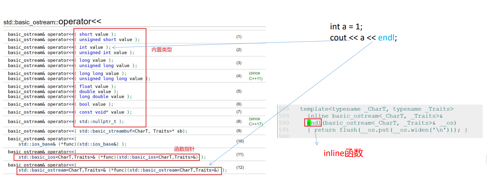

- # 一、下标访问运算符
	- `arr[0]-->arr.operator[](0);`
	- 对于下标的类型，可以是任意类型。如：哈希表
	- string、vector、map、unordered_map都重载了
	- ```CPP
	  //operator[].cc
	  class CharArray
	  {
	  public:
	    	CharArray(int capacity)
	        :_capacity(capacity)
	        ,_data(new char[capacity]()){}
	    	
	    	char& operator[](int idx)
	      {
	        	if(idx >=0 && idx <= _capacity)
	          {
	            	return _data[idx];
	          }
	        	else
	          {
	            	static char nullchar = '\0';
	            	return nullchar;
	          }
	      }
	    
	    	~CharArray()
	      {
	        	if(_data)
	          {
	          	delete[] _data;
	           	_data = nullptr;
	          }
	      }
	  private:
	    int _capacity;
	    	char* _data;
	  }
	  ```
- # 二、输出流运算符
	- Complex.cc
	- 返回流对象是为了实现链式编程
		- ```CPP
		  cout<<a<<b<<c<<d<<endl;
		  1.cout<<a返回cout
		  2.然后就可以继续cout  <<b
		  ```
	- 1.输入输出流运算符不能以成员函数形式进行重载
		- 不符合使用习惯，与常规写法相违背
		- ```CPP
		  cout<<a;//分左操作数和右操作数
		  a<<cout;//error  左操作数必须是流对象
		  
		  //如果以成员函数进行重载，就只能写成以下的写法，不符合习惯。所以输入输出流运算符不能以
		  //成员函数形式重载
		  class Complex
		  {
		    	std::ostream& operator<<(std::ostream& os)//第一个参数是this指针
		      {
		        	os<<"你好";
		        	return os;//流对象不能复制，只能返回引用
		      }
		  }
		  //调用
		  Complex c1;
		  c1.operator(cout);
		  //即:c1<<cout;
		  ```
	- 2.以友元普通函数实现
		- ```CPP
		  std::ostream& operator<<(std::ostream& os,const Complex& rhs)
		  {
		    	os<<rhs._ptr<<endl;
		    	return os;
		  }
		  
		  //调用
		  Complex c1;
		  cout<<c1<<endl;
		  ```
	- 对自定义类类型重载输出流运算符，用友元函数，在类内只声明，不实现
- # 三、输出流类型内部函数介绍
	- 因为是输出流内部，所以成员函数第一个this参数就是流对象本身，所以可以用成员函数实现。
	- endl：endline是一个inline函数。
	- 
- # 四、输入流运算符 ==11：29==
	- ```CPP
	  std::istream& operator>>(std::istream& is,Complex& rhs)
	  {
	    	is >> rhs._ptr;
	    	return is;
	  }//这样写没有考虑异常情况
	  //因为要修改rhs，所以不加const。输入流加了const
	  
	  //使用前面所学健壮的输入
	  void readDouble(std::istream & is, double & number)
	  {
	  	cout << "pls input a valid double!\n";
	  	//逗号表达式:以最后一个表达式的值作为整个表达式的值
	  	while(is >> number, !is.eof()) {
	  		if(is.bad()) {
	  			cout << "is has broken\n";
	  			return;
	  		} else if(is.fail()) {
	  			is.clear();//重置流的状态
	  			is.ignore(std::numeric_limits<std::streamsize>::max(), '\n');
	  			cout << "pls input a valid double!\n";
	            //头文件：#include <limits>
	  		} else {
	  			break;
	  		}
	  	}
	  }
	   
	  std::istream & operator>>(std::istream & is, Complex & rhs)
	  {
	  	cout << ">> pls input real part" << endl;
	  	readDouble(is, rhs._dreal);
	  	cout << ">> pls input imag part" << endl;
	  	readDouble(is, rhs._dimag);
	  	return is;
	  }
	  ```
	- 若类中有char等指针，则重载cin时，输入这个指针数据时，一定要先开辟出空间，不然会出bug，而且要考虑输入流的长度，不然可能超出开辟空间的长度。
		- 所以更好的实现是实现一个缓冲区，先拿到缓冲区，然后取对应长度字符进入指针存储
		- `vector<char> _buf;`vector可以动态扩容，方便作为缓冲区？ ==11：29==
- # 五、箭头（指针）运算符 解引用运算符
	- 箭头运算符的返回值是一个指针或者是重载了箭头运算符的对象
	- ==**掌握自动释放堆空间的方法**== #重点
	- ```cpp
	  //arrow.cc
	  class Data
	  {
	  public:
	    	Data(int data)
	        :_data(data){}
	    	int getData()const{ return _data; }
	  private:
	    	int _data;
	  };
	  class MiddleLayer
	  {
	  public:
	    	MiddleLayer(Data* p)
	        :_pdata(p){}
	      ~MiddleLayer()
	      {
	        	if(_pdata)
	          {
	            	delete _pdata;
	            	_pdata = nullptr;
	          }
	      }
	    	//重载箭头运算符
	    	Data* operator->()
	      {
	        	return _pdata;
	      }
	    	//重载解引用运算符
	    	Data& operator&()
	      {
	        	return *_pdata;
	      }
	  private:
	    	Data* _pdata;//指向的是堆空间的对象
	  }
	  
	  void test0()
	  {
	    	Data* p1 = new Data(10);
	    	cout<<p1->getData()<<endl;
	    	cout<<(*p1).getData()<<endl;
	    
	    	//ml本身是一个对象，但可以像一个指针去使用
	    	//ml是一个局部对象（栈对象），当test0()函数执行结束时，就会自动销毁堆空间的。
	    
	    	//就是一个智能指针的雏形，利用对象的声明周期管理资源
	    	MiddleLayer ml(new Data(11));
	    	//希望能向上面一样用：所以需要重载箭头运算符
	    	cout<<ml->getData()<<endl;//简化形式，编译器会自动完善成完整形式（它就这么写。）
	    	//即：
	    	(ml.operator->())->getData();//完整形式
	    
	    	//也希望能像p1一样：需要重载解引用运算符
	    	cout<<(*ml).getData()<<endl;
	    
	    	delete p1;
	    	p1 = nullptr;
	  }
	  ```
	- ```CPP
	  class ThirdLayer
	  {
	  public:
	    	ThirdLayer(MiddleLayer *ml)
	        :_ml(ml){}
	    
	    	//箭头运算符的返回值是一个指针或者是重载了箭头运算符的对象
	    	MiddleLayer& operator->()
	      {
	        	return *_ml;
	      }//第二层的->重载调用是通过对象，所以第三层返回的不能是指针，也得是对象。
	    	//不然就会出错
	    
	    	~ThirdLayer()
	      {
	        	if(_ml)
	          {
	            	delete _ml;
	            _ml = nullptr;
	          }
	      }
	  private:
	    	MiddleLayer* _ml;
	  };
	  
	  void test1()
	  {
	    	ThirdLayer tl(new MiddleLayer(new Data(10)));
	    	tl->getData();//简化形式
	    	//第三层的简化形式要建立在第二层的基础之上
	    	//即：
	    	((tl.operator->()).operator->())->getData();
	  }
	  ```
- # 六、类型转换
	- ## 1.其他类型向自定义类型转换
		- 就是一个隐式转换
		- ```CPP
		  class Complex
		  {
		  public:
		    	//explicit
		    	Complex(double x)
		        :_x(x){}
		    
		    	Complex(const Point& rhs)
		      :_x(rhs._ix)
		      {}
		  private:
		    	double _x;
		  };
		  
		  void test0()
		  {
		    	//将其他类型向自定义类型转换
		    	Complex c1 = 1.1;//能否转换取决于构造函数
		    	//如果不希望能够进行，就禁止隐式转换。加explicit关键字
		    
		    	//这里的其他类型可以是其他自定义类型吗？
		    	//可以，也需要构造函数的支持
		    	Point pt(15);
		    	Complex c2 = pt;
		  }
		  ```
	- ## 2.自定义类型向其他类型转换
		- 类型转换函数
			- 1.是成员函数
			- 2.没有返回值类型
			- 3.没有参数
			- 4.在函数执行体中必须要返回目标类型的变量
		- 形式：`operator 目标类型(){}`
		- ```CPP
		  class Complex
		  {
		  public:
		    	//explicit
		    	Complex(double x)
		        :_x(x){}
		    	
		    	//类型转换函数
		    	operator int()
		      {
		        	return _x;
		      }
		    	operator Point()
		      {
		        	return Point(_X);
		      }
		  private:
		    	double _x;
		  };
		  
		  void test1()
		  {
		  	Complex c1(13);
		    	int x = c1;//需要类型转换函数的支持
		    
		    	//注意：尽管功能很强大，但是违背了常规思维，一般情况下不去使用它。
		    	Point pt = c1;
		  }
		  ```
- # 七、类域
	- 类定义在全局位置，称为全局类
	- Line.cc
	- 嵌套类优点：
		- 1.对外不能直接创建内部类的对象
		- 2.在一定程度上实现了信息隐藏
			- 还不彻底，现在还看得到内部类的实现源码
	- 可以在外面加一个类，将所有Line实现嵌套到该类中，这样Line中所有信息就都隐藏下来了。
	- ## 就是：设计模式PIMPL
		- 交给别人去使用时，只有头文件+动态库文件，对方是绝对不知道具体的实现
			- 在公司与公司之间进行开发，为了保护自己的源码，采用PINPL设计模式。就是在自己代码外面再套个壳儿
		- 好处：
			- 1.实现了信息的隐藏。
			- 2.当实现文件LineImpl.cc进行任何的修改时，只要头文件不发生任何变化，保持接口的稳定性，那么根本就感受不到实现文件变化的过程。这样可以做到平滑的升级新的库，只需要将新库替换掉旧库就可以了。
			- 3.当库发生变化时，也不需要对已经生成的程序重新进行编译。（编译防火墙）
		- ```CPP
		  //Line.hpp
		  #include<iostream>
		  using std::cout;
		  using std::endl;
		  using std::cin;
		  
		  class Line
		  {
		      public:
		          Line(int x1,int y1,int x2,int y2);
		          ~Line();
		          void printLine()const;
		    //嵌套类；类的前向声明
		          class LineImpl;
		      private:
		          LineImpl* _pimpl;
		  };
		  ```
		- ```CPP
		  //LineImpl.cc
		  #include "Line.hpp"
		  
		  class Line::LineImpl
		  {
		    	//Point称为类中类/嵌套类/成员类型
		      class Point//内部类就是为外部类进行服务的
		      {
		          public:
		              Point(int x,int y)
		                  :_x(x)
		                   ,_y(y){}
		              void print()const
		              {
		                  cout<<"("<<_x<<","<<_y<<")";
		              }
		          private:
		              int _x;
		              int _y;
		      };
		  
		      public:
		      void print()const
		      {
		          _pt1.print();
		          cout<<"--->";
		          _pt2.print();
		          cout<<endl;
		      }
		      LineImpl(int x1,int y1,int x2,int y2)
		          :_pt1(x1,y1)
		           ,_pt2(x2,y2){  cout<<"LineImpl()"<<endl;   }
		  
		      private:
		      Point _pt1,_pt2;
		  };
		  
		  Line::Line(int x1,int y1,int x2,int y2)
		  :_pimpl(new Line::LineImpl(x1,y1,x2,y2))
		  {}
		  
		  Line::~Line()
		  {
		      if(_pimpl)
		      {
		          cout<<"~Line"<<endl;
		          delete _pimpl;
		          _pimpl = nullptr;
		      }
		  }
		  
		  void Line::printLine()const
		  {
		      _pimpl->print();
		  }
		  
		  void test0()
		  {
		      Line line(1,1,2,2);
		      line.printLine();
		  }
		  
		  int main()
		  {
		      test0();
		  }
		  ```
- # 八、单例模式自动释放 #面试常考
	- 改进为自动释放堆空间
	- 1.单例对象需要进行自动释放吗？
		- **肯定需要**，
			- **单例对象并不是真正发生内存泄漏的地方**，但程序在执行过程中需要判断有那些地方真正发生了内存泄漏，此时需要工具valgrind的使用，来确定。
			- 假设单例对象没有进行自动释放，那么**valgrind工具会认为单例对象是内存泄漏**。
				- 内存泄漏就是一片内存空间无法回收回来了。单例对象的生命周期是整个程序运行期间。这期间其堆空间是不能收回的，程序结束后OS会回收，但是会被工具误认为内存泄漏。
			- 程序员接下来得再次去确认到底是不是内存泄漏，**增加了程序员的额外的工作**
	- 2.怎么实现自动释放呢？
		- **看到自动就应该想到当对象被销毁时，析构函数会被自动调用**
		- #### 第一种方式：抛砖引玉
			- ```CPP
			  class AutoRelease
			  {
			  public:
			    	AutoRelease(Singleton *p)
			        :_p(p){}
			    	~AutoRelease();
			  private:
			    	Singleton* _p;
			  };
			  
			  class Singleton
			  {
			  public:
			    	static Singleton* getInstance()
			      {
			        	if(nullptr == _pInstance)
			          {
			            	_pInstance = new Singleton();
			          }
			        	return _pInstance;
			      }
			    	void init(int ix,int iy)
			        :_ix(ix)
			        ,_iy(iy){}
			    
			    	void print()const
			      {
			        	cout<<"_ix:"<<_ix<<"_iy:"<<_iy<<endl;
			      }
			    	Singleton(const Singleton&) = delete;
			    	Singleton& operator=(const Singleton&) = delete;
			  private:
			    	Singleton(){}
			    	~Singleton()
			      {}
			    	friend class AutoRelease;
			    
			  private:
			    	int _ix,_iy;
			    	static Singleton* _pInstance;
			  };
			  Singleton* Singleton::_pInstance = nullptr;
			  
			  AutoRelease::~AutoRelease()
			      {
			        	if(_p)
			          {
			            	delete _p;
			            	_p = nullptr;
			          }
			      }
			  
			  void test0()
			  {
			    	AutoRelease ar(Singleton::getInstance());
			    	Singleton::getInstance()->print();
			  }
			  ```
		- 现在的调用方式还很麻烦，需要先创建一个ar对象`AutoRelease ar(Singleton::getInstance());`，想使他像`Singleton::getInstance()->print();`一样调用。
		- 所以可以用**嵌套类+静态对象**进行优化
			- 类AutoRelease是只为Singleton类服务的，所以可以将其嵌套入Singleton类中，并且加一个AutoRelease对象，以免每次都要创建。
				- 如果是我，我会将Singleton嵌入AutoRelease。hhhh，但是这样调用起来就不好看，貌似。
		- #### 第二种方式：嵌套类+静态对象
			- ```CPP
			  class Singleton
			  {
			    	class AutoRelease
			  	{
			  	public:
			    		AutoRelease(){}
			        	~AutoRelease()
			      	{
			        		if(_pInstance)
			          	{
			            		delete _pInstance;
			            		_pInstance = nullptr;
			          	}
			      	}
			  	};
			  public:
			    	static Singleton* getInstance()
			      {
			        	if(nullptr == _pInstance)
			          {
			            	_pInstance = new Singleton();
			          }
			        	return _pInstance;
			      }
			    	void init(int ix,int iy)
			      {
			        	_ix = ix;
			        	_iy = iy;
			      }
			    
			    	void print()const
			      {
			        	cout<<"_ix:"<<_ix<<"_iy:"<<_iy<<endl;
			      }
			    	Singleton(const Singleton&) = delete;
			    	Singleton& operator=(const Singleton&) = delete;
			  private:
			    	Singleton(){}
			    	~Singleton()
			      {}  
			  private:
			    	int _ix,_iy;
			    	//AutoRelease _ar;不能这样，这样单例模式对象包含了ar对象，单例又是new出来的，
			    	//那么只有单例对象回收了，ar对象才能回收了，就不满足需求了。
			    	static AutoRelease _ar;//所以要拿出来，就放到静态全局区。这样就是ar中指针_p = Singleton中指针_pInstance，指向单例对象。
			    //疑问：放在静态全局区就不是栈对象了，还如何自动回收呢？
			    //别忘了，静态对象会在main函数退出后调用析构函数回收空间！而且定义成静态，就不用每次使用Singleton对象就重新定义一个AutoRelease对象了
			    	static Singleton* _pInstance;
			  };
			  Singleton* Singleton::_pInstance = nullptr;
			  //在类之外进行初始化
			  Singleton::AutoRelease Singleton::_ar;
			  
			  void test0()
			  {
			    	Singleton::getInstance()->init(1,2);
			    	Singleton::getInstance()->print();
			  }
			  ```
		- #### 第三种方式atexit函数--->跨平台推荐使用
			- 需求：自动调用`Singleton::destroy()`函数
			- `atexit`函数
				- 作用：对于注册的函数，在程序退出时，会被自动调用。
				- 注册N个函数就执行N次，对于注册的函数是用栈的结构进行存储，后注册的函数先被调用。
			- ```CPP
			  //单例对象的自动释放
			  //方式三: 自动调用destroy方法，就可以回收单例对象
			  class Singleton
			  {
			  public:
			  	//在多线程环境下，并不能保证是线程安全的
			  	static Singleton * getInstance()
			  	{
			  		if(nullptr == _pInstance)
			  		{
			  			atexit(destroy);
			  			_pInstance = new Singleton();
			  		}
			  		return _pInstance;
			  	}
			  
			  	static void destroy()
			  	{
			  		cout << "Singleton::destroy()" << endl;
			  		if(_pInstance) {
			  			delete _pInstance;
			  			_pInstance = nullptr;
			  		}
			  	}
			  
			  	void init(int ix, int iy)
			  	{
			  		_ix = ix;
			  		_iy = iy;
			  	}
			  
			  	void print() const
			  	{
			  		cout << "_ix: " << _ix << ","
			  			 << "_iy: " << _iy << endl;
			  	}
			  private:
			  	Singleton() {	cout << "Singleton()" << endl;	}
			  	~Singleton() {	
			  		cout << "~Singleton()" << endl;
			  	}
			  
			  	Singleton(const Singleton&) = delete;
			  	Singleton & operator=(const Singleton&) = delete;
			  
			  private:
			  	int _ix, _iy;
			  	static Singleton * _pInstance;
			  };
			  
			  //饱汉模式(懒汉模式 -- 懒加载)
			  //Singleton * Singleton::_pInstance = nullptr;
			  
			  //饿汉模式, 在进入main函数之前直接创建对象
			  Singleton * Singleton::_pInstance = getInstance();
			  //保证在main之前已经atexit了destroy函数，不然创建线程之后再弄就晚了。
			   
			  
			  void test0() 
			  {
			  	Singleton::getInstance()->init(1, 2);
			  	Singleton::getInstance()->print();
			  } 
			   
			  int main(void)
			  {
			  	test0();
			  	return 0;
			  }
			  ```
			- 饱汉模式优点：如果直接创建了对象，但是整个程序执行过程都没有用到，就浪费空间了
			- 饿汉模式是多线程安全的，因为在main之前就创建了对象。
			- main前创建，则所有线程都会共享该对象了。
		-
		- #### 第四种方式：多线程安全的写法pthread_once + atexit-->Linux环境下推荐使用
			- `pthread_once`：在多线程环境之下，可以保证`init_routine`函数只会被执行一次
			- ```CPP
			  //单例对象的自动释放
			  //方式四: pthead_once + atexit，就可以回收单例对象
			  class Singleton
			  {
			  public:
			  	static Singleton * getInstance()
			  	{
			  		//pthread_once可以保证init_routine被执行一次
			  		pthread_once(&_once, init_routine);
			  		return _pInstance;
			  	}
			  
			  	static void destroy()
			  	{
			  		cout << "Singleton::destroy()" << endl;
			  		if(_pInstance) {
			  			delete _pInstance;
			  			_pInstance = nullptr;
			  		}
			  	}
			  	static void init_routine()
			  	{
			  		_pInstance = new Singleton();
			  		atexit(destroy);
			  	}
			  
			  	void init(int ix, int iy)
			  	{
			  		_ix = ix;
			  		_iy = iy;
			  	}
			  
			  	void print() const
			  	{
			  		cout << "_ix: " << _ix << ","
			  			 << "_iy: " << _iy << endl;
			  	}
			  private:
			  	Singleton() {	cout << "Singleton()" << endl;	}
			  	~Singleton() {	
			  		cout << "~Singleton()" << endl;
			  	}
			  
			  	Singleton(const Singleton&) = delete;
			  	Singleton & operator=(const Singleton&) = delete;
			  
			  private:
			  	int _ix, _iy;
			  	static pthread_once_t _once;
			  	static Singleton * _pInstance;
			  };
			  
			  //饱汉模式(懒汉模式 -- 懒加载)
			  Singleton * Singleton::_pInstance = nullptr;
			  pthread_once_t Singleton::_once = PTHREAD_ONCE_INIT;
			   
			  
			  void test0() 
			  {
			  	Singleton::getInstance()->init(1, 2);
			  	Singleton::getInstance()->print();
			  } 
			   
			  int main(void)
			  {
			  	test0();
			  	return 0;
			  }
			  ```