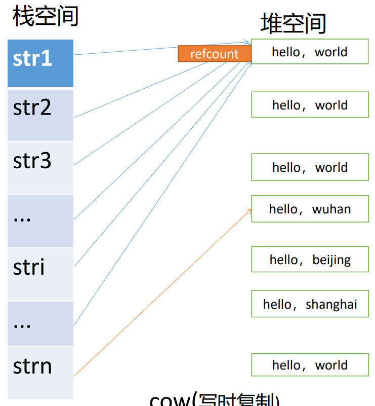

- # 一、std::string底层实现 #面试亮点 #面试常考
	- ## 1.深拷贝
		- 
		- **这种情况没有优化的空间**
			- ```CPP
			  String str1 = "heallo,world;
			  String str2 = "heallo,world;
			  ```
			- 这是两个没有任何联系的单独的对象。
		- **进行复制控制操作，才有优化的空间**
			- ```CPP
			  String str3 = str1;//调用拷贝构造函数
			  str3 = str2;//调用赋值运算符函数
			  ```
			- 
		- 当字符串对象进行复制控制时，**可以优化为指向同一个堆空间的字符串，问题就是何时回收堆空间的字符串内容呢？**
			- 我们需要知道当前是有多少个对象指向同一个字符串内容的空间，称为引用计数`refcount`
			- 进行复制控制操作时，只需要将引用计数+1即可。不需要进行深拷贝。
			- 当对象被销毁时，引用计数先-1，直到引用计数减为0时，才真正执行回收操作
			- ==时间复杂度为O(1)==
		- **引用计数应该放到什么地方？**
			- 普通数据成员int不行，不然每次复制都需要更改每一个对象的值，静态成员static int也不行，所有对象共享了。可以用一个指针指向堆空间，堆空间存放引用计数。
			- 优化：int型固定4字节，所以可以和申请字符串的空间一起申请。
				- 如果放在末尾，字符串拼接之类的就需要移动了。所以放前面，方便访问。
		- 现在的模型，当进行复制控制时，不需要进行深拷贝，只需要浅拷贝就可以了。那什么情况下才需要深拷贝呢？
			- 此时如果修改字符串，则会造成共享该空间的其他字符串内容都被修改，很显然这不是我们想要的结果。
			- 此时应该**先对字符串内容进行复制（深拷贝）**，之后在该控件之中进行写（修改）操作
		- 实现如下：
	- ## 2.写时复制（COW-CopyOnWrite）
		- 是对深拷贝实现的优化
		- **原理：浅拷贝+引用计数**
			- 只有真正需要修改共享字符串时，才需要进行深拷贝
			- 如果只是读操作，不进行修改，就直接进行浅拷贝。
		- 实现：
		- 在类中直接实现声明的函数都是inline函数
		- ```CPP
		  //CowString.cc
		  class CowString
		  {
		  public:
		    	CowString()//无参构造
		        :_pstr(new char[refCountCapacity + 1]() + refCountCapacity)
		          //引用计数4 + '\0'。向后偏移4字节指向内容的首地址。
		      {
		      	//对引用计数初始化
		          initRefcount();
		      }
		    	//有参构造
		    	CowString(const char* pstr)
		        :_pstr(new char[refCountCapacity + strlen(pstr) + 1]() + refCountCapacity)
		      {
		          strcpy(_pstr,pstr);
		          initRefcount();
		      }
		    	//拷贝构造
		    	//拷贝构造是浅拷贝，所以把rhs._pstr的指针值赋给_pstr就可以了，也就可以直接操作引用计数了
		    	CowString(const CowString& rhs)
		        :_pstr(rhs._pstr)
		      {
		      	increaseRefcount();  
		      }
		    	//赋值运算符
		    	CowString& operator=(const CowString & rhs)
		      {
		        	//1.自复制判断
		        	if(this != &rhs)
		          {
		            	//现在不能直接delete，要判断当前对象是否是共享字符串，引用计数
		            	//2.回收左操作数空间
		            	release();//发现操作和析构相同，所以将析构提取出一个函数.
		            	//3.进行浅拷贝即可
		            	_pstr = rhs._pstr;
		            	increaseRefcount();
		          }
		        	//4.返回新地址
		        	return *this;
		      }
		    
		    	void release()
		      {
		        	decreaseRefcount();
		        	if(refCount() == 0)
		          {
		            	delete[] (_pstr - refCountCapacity);//注意：这里要向前偏移
		            //不然引用计数的堆就没有释放
		            	cout<<">>delete heap data"<<endl;
		          }
		      }
		    	
		    	~CowString()
		      {
		        	release();
		      }
		    	
		    	//版本1：当前版本缺点：只要引用计数大于1就会深拷贝，可能我只是读一下，并不会写
		    	//问题：下标访问运算符无法区分接下来要做的是读操作还是写操作。
		    	char& operator[](int idx)
		      {
		        	if(idx >= 0 && idx < length())
		          {
		            //当引用计数的值大于1时，要进行深拷贝
		            	if(refCount() > 1)
		              {
		                	char* ptmp = new char[refCountCapacity + length() + 1]() + refCountCapacity;
		                	strcpy(ptmp,_pstr);
		                	//原来堆空间引用计数-1
		                	decreaseRefcount();
		                	//指向新的堆空间
		                	_pstr = ptmp;
		                	//初始化新的空间的引用计数
		                	initRefcount();
		              }
		            	return _pstr[idx];
		          }
		        	else
		          {
		            	static char nullchar = nullptr;
		            	return nullchar;
		          }
		      }
		    	
		    	int length()const {	return strlen(_pstr);	};
		    
		    	const char* c_str()const
		      {	return _pstr;	}
		  	
		    	int refCount()const
		      {
		        	return *reinterpret_cast<int*>(_pstr - refCountCapacity);
		      }
		    	
		    	friend std::ostream& operator<<(std::ostream os,const CowString& rhs);
		  private:
		    	void initRefcount()
		      {
		        	*reinterpret_cast<int*>(_pstr - refCountCapacity) = 1;
		      }
		    
		    	void increaseRefcount()
		      {
		        	++*reinterpret_cast<int*>(_pstr - refCountCapacity);
		      }
		    	
		    	void decreaseRefcount()
		      {
		        	--*reinterpret_cast<int*>(_pstr - refCountCapacity);
		      }
		  private:
		    	char* _pstr;//永远指向字符串内容的首地址 _pstr;
		    //而不是字符串对象的首地址 &s1;
		    	static const int refCountCapacity = 4;
		  };
		  
		  std::ostream& operator<<(std::ostream os,const CowString& rhs)
		  {
		    	os<<rhs._pstr;
		    	return os;
		  }
		  
		  void test0()
		  {
		    	CowString s1;
		    	CowString s2 = s1;
		  }
		  ```
		- 改进：让\[]能区分读写
			- 从后面的运算符着手，重载\[]后面的<<和=运算符。又char内置运算符无法重载，所以需要自定义类型
		- 嵌套类内部可以直接访问外部类的私有成员
		- **解法一**
		- ```CPP
		  class CowString
		  {
		    	//代理模式---就是增加一个中间层
		    	class CharProxy//该类为CowString而生，因为只有它会用到
		      {
		      public:
		        	CharProxy(int idx,CowString& self)
		            :_idx(idx)
		            ,_self(self){}
		        	char& operator=(const char& ch);//连登，需要char类型，所以返回char
		        	friend ostream& operator<<(ostream &os,const CharPeoxy &rhs);
		        	//该函数同时是CowString的友元函数。因为CharProxy是private的，外部不能直接访问。
		      private:
		      	int _idx;
		        	CowString& _self;
		      };
		    	friend ostream& operator<<(ostream &os,const CharPeoxy &rhs);
		    	CharProxy operator[](int idx)
		    	{
		      		return CharProxy(idx,*this);
		    	}
		    
		  };
		  
		  char& CharProxy::operator=(const char& ch)
		  {
		    	if(idx >= 0 && idx < _self.length())
		      {
		        	if(_self.refCount() > 1)
		          {
		            	char* ptmp = new char[refCountCapacity + _self.length() + 1]() + refCountCapacity;
		            	strcpy(ptmp,_self._pstr);
		            	_self.decreaseRefcount();
		            	_self._pstr = ptmp;
		            	_self.initRefcount();
		          }
		        	//进行写操作
		        	_self._pstr[_idx] = ch;
		        	return _self._pstr[idx];
		      }
		      else
		      {
		        	static char nullchar = nullptr;
		         	return nullchar;
		      }
		  }
		  ostream& operator<<(ostream &os,const CowString::CharPeoxy &rhs)
		  {
		    	os<<rhs._self._pstr[rhs._idx];
		    	return os;
		  }
		  ```
		- **解法二**
			- `cout<<s[0];`读操作中，s[0]是一个CharProxy对象，但最终得到一个char类型对象就可以了。所以可以用类型转换解决这一步：自定义类型转换为内置类型。而不用重载`<<`运算符
			- ```CPP
			  class CowString
			  {
			    	//代理模式---就是增加一个中间层
			    	class CharProxy//该类为CowString而生，因为只有它会用到
			      {
			      public:
			        	CharProxy(int idx,CowString& self)
			            :_idx(idx)
			            ,_self(self){}
			        	char& operator=(const char& ch);//连登，需要char类型，所以返回char
			  		operator char()
			          {	return _self._pstr[_idx];	}
			        //此时cout<<s[0];发生了隐式转换：s[0]:调用CowString的[]重载函数，[]重载函数调用CharProxy(int idx,CowString& self)构造函数。
			        //然后cout<<输出时，不支持CharProxy，因为没有重载<<。所以会发生CharProxy到char的隐式转换。以char类型输出。
			        	
			      private:
			      	int _idx;
			        	CowString& _self;
			      };
			    	CharProxy operator[](int idx)
			    	{
			      		return CharProxy(idx,*this);
			    	}
			  };
			  
			  char& CharProxy::operator=(const char& ch)
			  {
			    	if(idx >= 0 && idx < _self.length())
			      {
			        	if(_self.refCount() > 1)
			          {
			            	char* ptmp = new char[refCountCapacity + _self.length() + 1]() + refCountCapacity;
			            	strcpy(ptmp,_self._pstr);
			            	_self.decreaseRefcount();
			            	_self._pstr = ptmp;
			            	_self.initRefcount();
			          }
			        	//进行写操作
			        	_self._pstr[_idx] = ch;
			        	return _self._pstr[idx];
			      }
			      else
			      {
			        	static char nullchar = nullptr;
			         	return nullchar;
			      }
			  }
			  
			  ```
	- ## 3.短字符串优化