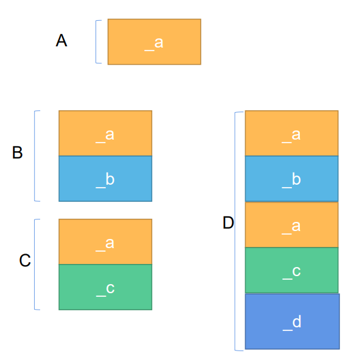

- # 一、改进COW String
	- 前一天笔记
	- COWString不保证多线程安全，更适用于单核
		- 多线程操作引用计数，导致引用计数不准
	- 解决方法：
		- 加锁（其他线程就需要等待锁了，浪费资源）
		- 设置为原子操作
			- 虽然比互斥锁好多了，但是仍然会带来性能损失。见课件。
- # 二、SSO String
	- CPU多核时代：COW不太适合，用SSO。
	- 进行复制时，直接采用深拷贝，只针对于短字符串进行了优化。
	- 具体见课件。
	- ## 最佳策略
		- facebook开源的folly库中，实现了一个fbstring, 它根据字符串的不同长度使用不同的拷贝策略， 最终每个fbstring对象占据的空间大小都是24字节。
			- 1.很短的（0~22）字符串用SSO，23字节表示字符串（包括'\0'）,1字节表示长度
			- 2.中等长度的（23~255）字符串用eager copy，8字节字符串指针，8字节size，8字节capacity.
			- 3.很长的(大于255)字符串用COW, 8字节指针（字符串和引用计数），8字节size，8字节capacity.
- # 三、继承
	- ## 1.继承的基本概念
		- 需求：复用原有代码的功能，希望添加新的成员，实现新的功能
		- 一个类如果不希望被继承就用`final`关键字修饰一下。
		- **不能继承的有哪些？**
			- 1.构造函数（包括 拷贝构造函数）
			- 2.析构函数
				- 基类对象与派生类对象的创建和销毁是独立的
			- 3.赋值运算符函数
				- 所以基类对象和派生类对象的复制控制操作是独立的
			- 4.operator new/operator delete
				- 对象申请空间时的处理方式可以是独立进行的。
					- 如子类有自己的新堆区成员，当然就不能用基类的operator delete了
			- 5.友元不能被继承
		- **定义一个派生类的过程**
			- 1.吸收基类的成员
			- 2.添加新的成员
			- 3.改造基类成员-----隐藏
				- 不推荐使用
		- 定义：
			- ```CPP
			  class 派生类
			  :public/protected/private 基类
			  {
			  //protected 将其访问权限开放给派生类
			  protected:
			  };
			  protected成员不能直接在类之外访问。
			  只有public成员可以在类之外直接访问
			  
			  class A final	//不能被继承
			  {
			    
			  };
			  ```
	- ==三种继承方式：==
		- 对于基类的私有成员，不管以哪一种方式继承，都无法在派生类内部进行访问
			- private：完美诠释私有，类内才能访问。
		- 对于基类的非私有成员，
			- public继承，在派生类内部的访问权限都是保持不变的。
				- 故**公有继承**又被称为**接口继承**。
			- protected继承，在派生类内部的访问权限是protected。（派生的子类仍旧可以访问）
			- private继承，在派生类内部的访问权限是private。（派生的子类就不能继续访问了）
				- **保护继承和私有继承**都称为**实现继承**。
				- protected和priate继承之后的访问权限，在类内部都可以访问，其区别在于子类继续派生的类的访问权限不一样了。
	- ==**三种继承的区别**==
		- 派生类在类之外对于基类成员的访问，具有什么样的限制？
			- **1.只有公有继承自基类的公有成员可以通过派生类对象直接访问，其他情况一律都不可以进行访问。**
		- 派生类在类内部对于基类成员的访问，具有什么样的限制？
			- **2.对于基类的私有成员，不管以哪种方式继承，在派生类内部都不能访问。**
			- **3.对于基类的非私有成员，不管以哪种方式继承，在派生类内部都可以访问。**
			- **4.保护继承与私有继承的区别：如果继承层次中，都采用的是保护继承，任意层次都可以访问顶层基类的非私有的成员；但如果采用私有继承之后，这种特性会被打断**
	- **派生类对象的创建**
		- ==总的原则：先初始化基类部分，再初始化派生类部分==
		- ```CPP
		  class Base
		  {
		  public:
		    	Base(long base = 0)
		        :_base(base)
		      {	cout<<"Base()"<<endl;	}
		  	void print()const
		      {	cout<<"Base::_base:"<<_base<<endl;	}
		  private:
		    	long _base;
		  };
		  
		  class Derived
		  //: Base	//默认的继承权限是private。和成员默认访问权限一样
		  :public Base
		  {
		  public:
		  	Derived()
		      {
		      	cout<<"Derived()"<<endl;
		      }
		  };
		  定义一个派生类对象：会先调用Base构造，再调用Derived构造。
		  ```
		- 1.在派生类中，如果没有显式定义任何构造函数时，会调用基类默认构造函数
		- 2.在派生类中，如果没有显式定义任何构造函数时，但基类中有显式定义有参构造函数，此时要创建派生类对象，基类必须要提供一个默认构造函数
		- 3.在派生类中，如果有显式定义有参构造函数时，基类也有显式定义构造函数，当希望对调用相应的基类构造函数初始化基类部分时，必须要在派生类初始化表达式中显式调用基类相应构造函数，否则只会调用基类的默认构造函数。
		- ```CPP
		  public:
		  	Derived(long base,int iderived)
		        :Base(base)//针对于基类部分的初始化，使用的就是基类类名调用
		        ,_iderived(iderived)  //针对派生类的类对象成员，使用的是子对象名调用构造函数。
		        ,_bobj(22){}
		  private:
		  	int _iderivec;
		  	Base _bobj;
		  ```
			- ==注意：基类初始化和派生类对象成员的初始化的区别。==
		- **说法**：派生类对象的创建是，**先调用基类的构造函数，再调用派生类构造函数**，该说法正确吗？
			- ==错误说法==
		- ==正确说法是：==
			- ==_派生类对象创建时，首先调用的是派生类的构造函数，在执行派生类构造函数的过程中，需要执行初始化表达式，在执行初始化表达式的过程中，要调用基类构造函数，完成基类部分的初始化；之后再去初始化派生类部分，最后再执行派生类的构造函数的函数执行体。_==
				- 没写初始化也会调默认构造函数，即：不写也一样会调
			- 从**打印信息的结果来看**，现象好像是先调用了基类构造函数，再调用了派生类构造函数；但并不能这样认为。
			- 如果面试中遇到了选择题，体重提供了**先调用基类的构造函数，再调用派生类构造函数**的选项，必须得选他，因为hr都这么做的。
		- **单基派生，成员的调用顺序** #面试重点
			- 1.首先是基类成员的初始化
			- 2.其次是派生类特殊成员：对象成员、引用成员、const成员、static成员
				- 初始化表达式
			- 3.最后是派生类的构造函数体
	- **单重派生类对象的销毁**
		- 当派生类对象被销毁时，与其创建时的顺序相反。
			- 和静态全局对象的回收顺序一样，就像是栈实现。
		- ==我们看到析构函数被执行的过程：==
			- **派生类的析构函数**
			- **类对象成员的析构函数**
			- **基类部分的析构函数**
		- 当**派生类的析构函数执行完毕**后，==会自动调用基类析构函数==，完成基类部分的销毁
	- **多重继承**
		- C++支持多重继承
		- Java/C# 并不支持多重继承
		- 继承关系本质上是一个IS A的关系
		- ```CPP
		  class C
		  :public B
		  ,public C
		  ,public D//多重继承时，每继承一个类都得显式指定继承方式，
		  //否则，没写就是默认私有继承
		  {
		  public:
		  	D()
		      :B()
		      ,C()
		      A()
		      {
		      	cout<<"D()"<<endl;
		          //先按继承顺序初始化B、C、D
		      }
		  };
		  ```
		- **多重继承下：基类部分初始化的顺序，与其在派生类构造函数初始化表达式中的顺序无关，而只与其在被继承时的顺序有关。**
			- 先继承的先初始化。与初始化表达式中初始化成员数据一样。
		- **注意：**多重继承下，继承多个空类，派生类空类大小仍旧为为1字节。
	- **多重继承的问题**
		- 1.成员名访问冲突的二义性
			- 
			- 若基类中有相同名函数，则派生类调用时，会出现成员名访问冲突二义性。
			- 解决方案：通过作用域限定符解决
				- `d.A::print();`
		- 2.存储二义性的问题
			- 
			- 
			- 这样，在派生类D中就会有两份基类A的成员数据。
			- 因此直接访问`_a`，就不知道访问哪一个`_a`
				- 将这种继承称为菱形继承或钻石型继承
				- 
			- **解决方案：虚拟继承**
				- ```CPP
				  class B
				  :virtual public A
				  {
				  
				  };
				  ```
				- 
				- 将顶端基类A的成员数据放在派生类数据成员的末尾，在开头增加虚基指针，使用虚基指针记录偏移信息。
				- 虚基指针中存储的是偏移信息。如B中就是偏移16字节为_a，所以存16.
		- **如果可能的话，尽量不要使用多继承，而使用单重继承或组合**
	- **基类与派生类之间的转化**
		- 一般情况下，基类对象==占据的空间==小于派生类。
		- typecast.cc
		- ```CPP
		  void test0()
		  {
		    	Base base(100);
		    	Derived derived(1,11);
		    	//可以将派生类对象赋值给基类对象
		    	//调用Base的拷贝构造函数
		    	//Base(const Base& rhs)
		    	Base b = derived;//ok
		    
		    	//调用Derived的拷贝构造函数
		    	//Derived(const Derived& rhs)
		    	Derived d = base;//error.
		    	//如果这个操作能成功，就意味着base能够操作另外的不属于base的空间了。
		    	//派生类有其他数据嘛
		    	const Derived& rhs = base;//error.
		    
		    	//基类引用可以绑定到派生类对象
		    	const Base& rhs = derived;
		    	//基类的指针可以绑定到派生类对象：后面多态呀。
		    	Base *pbase = &derived;//只能拿到derived的基类的部分。
		    
		    	Derived* pderived = &base;//error
		    	//强制转换又可以
		    	Derived* pderived = (Derived*)pbase;//ok,因为pbase就是指向derived对象的
		    	//但这样要人为确定pbase是不是指向derived对象的。可以用dynamic_cast判断
		    	//如果pbase指向基类，就会自动判断转换失败。指向derived会自动转换成功
		    	//动态转换。现在会报错，需要类中有虚函数才能用。
		    	Derived* pderived = dynamic_cast<Derived*>pbase;
		    	if(pderived)
		      {
		        	...
		      }
		    	else
		      	cout<<"转换失败"<<endl;
		  }
		  ```
		- **`dynamic_cast`：见《C++primer》19.2.1运行时类型识别，有详细使用介绍**。
		- ==**结论**==
			- 1.可以用派生类对象赋值给基类对象
			- 2.可以用基类指针指向派生类对象
			- 3.可以用基类引用绑定派生类对象
				- ```CPP
				  func(Base* base)
				  func(Base& base)
				  func(Base base)
				  都可以用派生类对象做参数赋值。
				  ```
		- ==**派生类可以替换基类=》向上转型。**==
			- 向上转型是绝对安全的
		- 向上转型
			- 将派生类转换为基类类型
			- 测试：
				- ```CPP
				  Base* pbase = &derived;
				  ```
		- 向下转型
			- 将基类类型转换为派生类类型
				- 安全的：
					- ```CPP
					  Base* pbase = &derived;
					  Derived* p1 = (Derived*)pbase;
					  ```
				- 不安全的
					- ```CPP
					  Base *pbase2 = &base;
					  Derived* p2 = (Derived*)pbase2;
					  ```
					- 编译器不报错，但运行时错误，可能会踩内存
					- 可以用`dynamic_cast`进行转换
						- 转换成功时，是有值的。
						- 转换失败时，是空指针。
	- **派生类与派生类对象之间的复制控制**
		- 1.拷贝构造函数
		- 2.赋值运算符函数
			- ```CPP
			  //一个类如果不希望被继承，就用final关键字修饰一下
			  class Base //final
			  {
			  public:
			  	Base()
			  	: _pstr(new char[1]())
			  	{	cout << "Base()" << endl;	}
			  	Base(const char *pstr)
			  	: _pstr(new char[strlen(pstr) + 1]())
			  	{
			  		cout << "Base(const char*)" << endl;
			  		strcpy(_pstr, pstr);
			  	}
			  	Base(const Base &rhs)
			  	: _pstr(new char[strlen(rhs._pstr) + 1]())
			  	{
			  		cout << "Base(const Base &)" << endl;
			  		strcpy(_pstr, rhs._pstr);
			  	}
			  
			  	Base &operator=(const Base &rhs)
			  	{
			  		cout << "Base & operator=(const Base &)" << endl;
			  		if(this != &rhs) {
			  			delete [] _pstr;
			  			_pstr = new char[strlen(rhs._pstr) + 1]();
			  			strcpy(_pstr, rhs._pstr);
			  		}
			  		return *this;
			  	}
			  
			  	~Base()
			  	{
			  		if( _pstr) {
			  			delete [] _pstr;
			  			_pstr = nullptr;
			  		}
			  		cout << "~Base()" << endl;
			  	}
			  	void print()
			  	{
			  		if(_pstr) {
			  			cout << _pstr << endl;
			  		}
			  	}
			  
			      size_t length() const
			  	{	return strlen(_pstr);	}
			  
			      const char * c_str() const
			  	{	return _pstr;	}
			  
			  private:
			  	char * _pstr;
			  };
			  
			  class Derived
			  : public Base
			  {
			  public:
			  	//当派生类中没有显式定义复制控制函数时，
			  	//执行派生类对象间的复制控制操作时，会自动调用
			  	//基类相应的复制控制函数
			  	Derived(const char * pbase)
			  	:Base(pbase)
			  	{	cout << "Derived(const char*)" << endl;}
			  
			  };
			   
			  void test0() 
			  {
			  	Derived d("hello");
			  	d.print();
			  
			  	Derived d1 = d;
			  	cout << "d1:";
			  	d1.print();
			  
			  	cout << endl;
			  	Derived d2("wuhan");
			  	cout << "d2:";
			  	d2.print();
			  
			  	cout << "fuzhi:" << endl;
			  	d2 = d1;
			  	cout << "d2:";
			  	d2.print();
			  
			  } 
			   
			  int main(void)
			  {
			  	test0();
			  	return 0;
			  }
			  
			  结果：
			  Base(const char*)
			  Derived(const char*)
			  hello
			  Base(const Base &)
			  d1:hello
			  
			  Base(const char*)
			  Derived(const char*)
			  d2:wuhan
			  fuzhi:
			  Base & operator=(const Base &)
			  d2:hello
			  ~Base()
			  ~Base()
			  ~Base()
			  ```
			- ```CPP
			  ostream & operator<<(ostream & os, const Base & rhs)
			  {
			  	os << rhs._pstr;
			  	return os;
			  }
			  
			  class Derived
			  : public Base
			  {
			  public:
			  	//当派生类中没有显式定义复制控制函数时，
			  	//执行派生类对象间的复制控制操作时，会自动调用
			  	//基类相应的复制控制函数
			  	Derived(const char * pbase, const char * pdata)
			  	: Base(pbase)
			  	, _pdata(new char[strlen(pdata) + 1]())
			  	{	
			  		cout << "Derived(const char*)" << endl;
			  		strcpy(_pdata, pdata);
			  	}
			  
			  	Derived(const Derived & rhs)
			  	: Base(rhs) //手动调用  //Base(const Base &);
			  	, _pdata(new char[strlen(rhs._pdata) + 1]())
			  	{
			  		cout << "Derived(const Derived&)" << endl;
			  		strcpy(_pdata, rhs._pdata);
			  	}
			  
			  	Derived & operator=(const Derived & rhs)
			  	{
			  		if(this != &rhs) {
			  			Base::operator=(rhs);//需要显式手动调用
			  			delete [] _pdata;
			  			_pdata = new char[strlen(rhs._pdata) + 1 ]();
			  			strcpy(_pdata, rhs._pdata);
			  		}
			  		cout << "Derived & operator=(const Derived&)" << endl;
			  		return *this;
			  	}
			  
			  	friend ostream & operator<<(ostream & os, const Derived&);
			  
			  private:
			  	char * _pdata;
			  };
			   
			  ostream & operator<<(ostream & os, const Derived & rhs)
			  {
			  	os << (Base &)rhs << " ";//需要基类重载的<<输出运算符输出基类成员的部分
			  	os << rhs._pdata;
			  	return os;
			  }
			  ```
		- ==**总结：基类部分与派生类部分要单独处理**==
			- 1.当派生类中没有显式定义复制控制函数时，就会自动完成基类部分的复制控制操作---->即：派生类会执行编译器生成的函数；调用基类对应的函数
			- 2.当派生类中有显式定义复制控制函数时，就不会再自动完成基类部分的复制控制操作，必须手动进行。
				- 如果基类有显式定义复制控制函数，则需要手动调用
				- 如果基类没有显式定义复制控制函数，会自动调用默认的。
		- DerivedCopyControl.cc
		- 当派生类中没有显式定义复制控制函数时，执行派生类对象间的复制控制操作时，会自动调用基类相应的复制控制函数。
		-