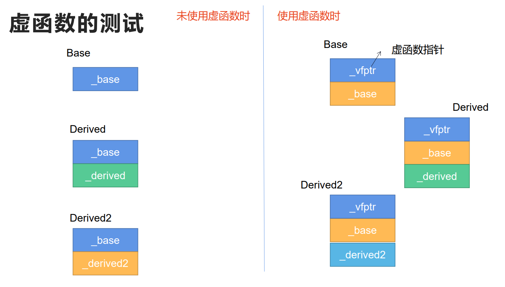
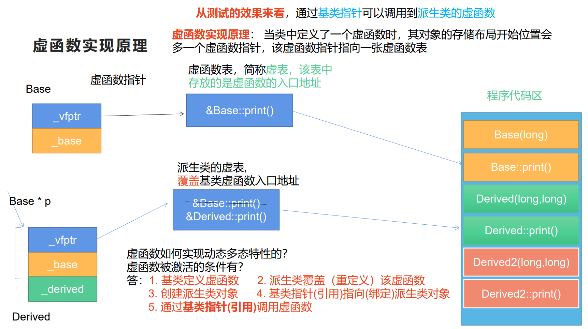

- # 一、改造基类成员   --隐藏
	- 只要派生类中定义一个**与基类同名的函数**，那么**基类中的同名函数就会被隐藏**，**不管参数列表是否相同**
		- 同名数据成员也会发生隐藏。
	- **隐藏发生在父子类之间，函数名相同。**
	- 显式调用基类的同名函数、数据成员，需要用作用域运算符。
	- **函数重载**：发生在同一个类内部。函数名相同但参数的类型、顺序、个数不同
- # 二、多态
	- ## 1.多态的基本概念
		- 定义
			- 客观现实世界：不同的对象，面对同一个指令，产生不同的行为。
		- 多态的分类：
			- 静态多态
				- ==编译时可以确定下来==，函数重载、运算符重载、函数模板
			- 动态多态
				- ==运行时可以确定下来==，C++中采用**虚函数**
	- ## 2.虚函数
		- 定义：
			- 在一个成员函数的前面，加上`virtual`关键字，该函数就成为虚函数。
		- 虚函数的限制：
			- ==构造函数不能设置为虚函数==  _WHY_ #面试常考
				- 构造函数的作用是用来创建对象，并初始化成员。这意味着只有当构造函数执行完毕之后，对象才算创建成功了。
				- 而虚函数被激活的条件之一就是先要创建对象
				- 如果将构造函数设计成虚函数，意味着对象还没有创建完成，就需要表达动态多态特性，这与虚函数被激活的条件矛盾。
				- 因此，构造函数不能设置为虚函数。
			- 静态成员函数不能设置虚函数
				- 静态成员函数由于没有this指针，不需要通过对象调用，因此无法表现动态多态特性。
			- inline函数不能设置为虚函数
				- inline和virtual同时出现时，inline失效。
			- 普通函数不能设置为虚函数
				- 他都没有对象啊喂。
		- 虚函数如何表现动态多态特性？
		  id:: 62f5c1c5-0718-4361-a5ff-050c8a831068
			- ```CPP
			  class Base
			  {
			  public:
			    	Base(long base)
			        :_base(base){}
			    	virtual
			    	void print()
			      {
			        	cout<<_base;
			      }
			  protected:
			    	long _base;
			  };
			  class Drived
			  :public Base
			  {
			  public:
			  	Derived(long base,long derived)
			      //:_base(base)//error 不能直接去对基类成员进行初始化
			      :Base(base)//对于基类成员，必须要通过基类构造函数完成初始化。
			      ,_derived(derived){}
			      //基类定义一个虚函数之后，派生类覆盖该虚函数
			      //派生类覆盖的虚函数要与基类的虚函数在形式上完全一致
			      //即使派生类没有在该函数前加上virtual关键字，该函数依然是虚函数
			      void print() override
			      {
			        	cout<<_derived;
			      }
			      //override关键字，可以显式告诉我们嘎嘎i虚函数是覆盖的基类虚函数
			      //如果发现与基类虚函数形式不一样，编译就会报错提示。
			  private:
			  	long _derived;
			  };
			  void display(Base *pbase)
			  {
			    	pbase->print();
			  }
			  void display(Base &base)
			  {
			    	base.print();
			  }
			  void test0()
			  {
			    	Base base(1);
			    	Derived derived(10,11);
			    	display(&base);
			    	display(&derived);
			    	
			    	derived.print();//通过对象调用虚函数时，与virtual无关
			    	//发生的是隐藏
			  }
			  ```
			- 11：31（√）
			- 
			- 定义虚函数后，该类数据首地址地方会多一个虚函数指针，指向一个虚函数表，简称虚表，虚表中存放的是虚函数的入口地址。
		- 
		- ==虚函数实现原理：== #面试必考
			- 当类中定义了一个虚函数时，其对象的存储布局开始位置会多一个虚函数指针，该虚函数指针指向一张虚函数表，简称虚表，该表中存放的是虚函数的入口地址。
			- 子类继承的时候会复制一份虚函数表，然后子类如果不覆盖虚函数，就还是会调用父类的 print 虚函数，如果子类覆盖了父类的 print 虚函数，则会改变虚表中的函数入口地址，这样子类转化为父类时，会调用子类中父类数据部分的虚函数指针的函数，进而通过虚表找到子类定义的函数执行。实现多态。
			- 虚函数如何表现动态多态特性？即：==虚函数被激活的条件有那些？== #面试必考
				- 1.基类要定义虚函数
				- 2.派生类要覆盖（重定义）该虚函数
				- 3.创建派生类对象
				- 4.基类的指针指向或引用绑定派生类对象
				- 5.通过基类指针或引用调用虚函数
		- virtual的含义：存在、间接、共享
		- **虚函数表存在什么地方？**
			- 在程序执行过程中，虚函数表是不希望被修改的，应该存放在**只读段**
				- 在编译的时候虚表就重新修改了，并不是实时动态的修改覆盖，说覆盖是为了更好的理解。
		- **一个类中虚函数表有几张？**
			- **一个类中可以有多张虚表，取决于继承的类是否含有虚函数**
- # 三、三个概念
	- 重载（overload）
		- 发生在同一个类中，当函数名称相同时，函数参数的个数、类型、顺序不同
	- 隐藏（oversee）
		- 发生在父子类之间，函数名相同时，就构成隐藏。
	- 覆盖
		- 发生在父子类之间，基类与派生类中同时定义相同的**虚函数，覆盖的是虚函数表中的入口地址，==并不是覆盖函数本身==**
- # 四、
  id:: 62f5f980-73c2-4415-a7b6-6fe0cc02da37
	- 在构造函数和析构函数中调用虚函数
	- VirtualFunction.cc
	- ==下午第一节课==
	- ```CPP
	  class Grandpa
	  {
	  public:
	    	Grandpa(){};
	    	~Grandpa(){};
	    	virtual void func1()
	      {	cout<<"Grandpa func1()"<<endl;	}
	    	virtual void func2()
	      {	cout<<"Grandpa func2()"<<endl;	}
	  };
	  class Parent
	  :public Grandpa
	  {
	    	Parent(){	
	        	func1();//在构造函数中调用虚函数,发生的是静态连编
	          //无法表现动态多态特性。
	          /*创建Son对象时，会先调用Person构造函数，此时Son对象还未创建，所以可以想象此时只有Parent对象成员数据，调用func1，虚表中自然是Parent的函数入口
	          因为将Grandpa的覆盖了，如果Parent中不覆盖，则会调用Grandpa的。*/
	      };
	    	~Parent(){
	        	func2();//在析构函数中调用虚函数,发生的是静态连编
	          //无法表现动态多态特性。
	          /*销毁时，先回收Son对象的部分成员数据，然后回收Parent部分，此时可以想象对象为Parent类型了，因为Son部分回收了，所以调用Parent的func2*/
	      };
	    	virtual void func1()
	      {	cout<<"Parent func1()"<<endl;	}
	    	virtual void func2()
	      {	cout<<"Parent func2()"<<endl;	}
	  };
	  class Son
	  :public Parent
	  {
	    	Son(){	
	      };
	    	~Son(){
	      };
	    	virtual void func1()
	      {	cout<<"Son func1()"<<endl;	}
	    	virtual void func2()
	      {	cout<<"Son func2()"<<endl;	}
	  };
	  void test0()
	  {
	    	Son son;
	  }
	  int main()
	  {
	    	test0();
	  }
	  ```
	- MemberFunction.cc
	- 在普通的成员函数中调用虚函数，表现为动态多态特性，这是后续会经常使用的方式。
		- 关键就在于拥有this指针，this指针指向的是不同的对象，因而取决于this指针的类型
- # 五、纯虚函数
	- 什么叫纯虚函数？
		- 纯虚函数==只作为接口存在，没有实现；其实现要交给派生类完成==
	- 其形式：`virtual returntype func(Params...) = 0;`
	- 定义了纯虚函数的类称为抽象类，**抽象类不能实例化对象**
	- 当某一个派生类没有实现完所有的纯虚函数时，该类自然也会变成一个抽象类
	- Figure.cc
	- **抽象类**
		- 抽象类有两种形式：
			- 1.定义了纯虚函数的类，称为抽象类
			- 2.定义了protected型构造函数的类，也称为抽象类
				- 抽象类就是不能实例化对象，那么protected就保证了类外不能实例化对象，而且派生子类后，子类仍旧可以调用其构造函数。
- # 六、接口
	- 类中放在public区域的成员，称为接口
	- 纯虚函数
	- 普通函数
	-
	- 接口与实现可以分离
- # 七、虚析构函数
	- ```CPP
	  class Base
	  {
	  public:
	    	Base(long base)
	        :_base(base){}
	    	~Base(){}
	  private:
	    	long _base;
	  }
	  class Derived
	  :public Base
	  {
	  public:
	  	Derived(long base,long derived)
	      :Base(base)
	      ,_derived(derived)
	      ,_data(new char[20]()){}
	      //virtual
	      ~Derived(){delete _data;...}
	  private:
	  	long _derived;
	      char* _pdata;
	  };
	  void test0()
	  {
	    	Base* pbase = new Derived(1,10);
	    	//申请的是一个派生类的堆对象，但是用delete表达式回收对象时，发生了内存泄漏
	    	//只调用了Base的析构，没有调用Derived的析构。
	    	delete pbase;
	    	//产生了一个需求：能通过基类的指针pbase调用派生类析构函数
	    	//很明显这就是虚函数的特性，而析构函数只有一个，因此设定
	    	//当基类的析构函数设置为虚函数之后，其派生类析构函数自然能也成为虚函数。
	  }
	  ```
-