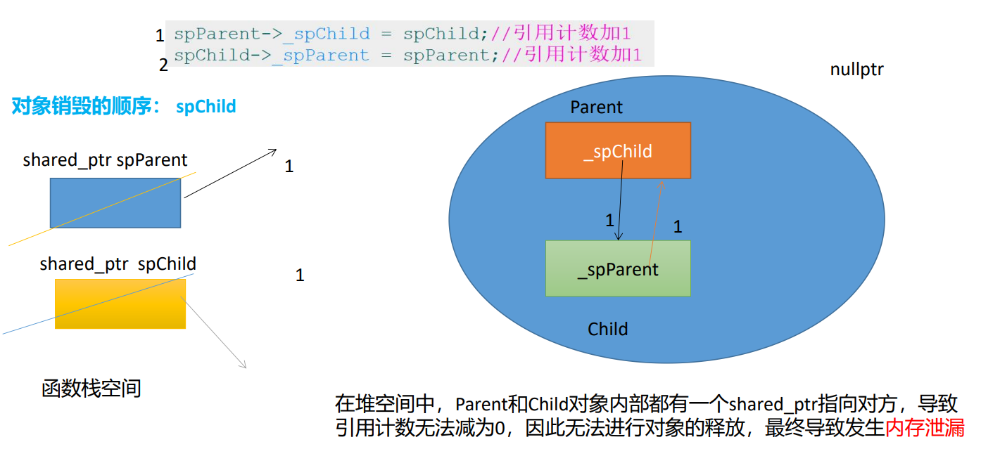
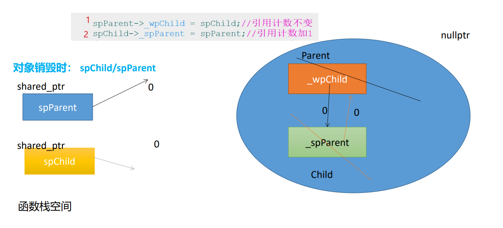

- # 一、具有移动语义的函数（由于停电一天，接上一天内容）
	- 当传递右值时，如果类中同时有拷贝构造函数和移动构造函数，此时并不会造成二义性冲突的问题，原因在于C++规定：移动构造函数优先调用。
		- **优先级：在类中同时定义了两种语义的函数时，具有移动语义的函数要优先于具有复制控制语义的函数的调用。**
	- 调用拷贝构造函数：
		- 
	- 调用移动拷贝构造函数：
		- 
		- 直接利用临时对象的空间。因为是重复利用，一定会修改，所以不会采用const修饰
	- ## 移动赋值运算符函数
		- 普通赋值函数
			- 
		- 移动赋值函数
			- {:height 322, :width 765}
			- 进行浅拷贝，直接利用临时对象指向的堆空间
		- ```CPP
		  String &operator=(String && rhs)
		  {
		    	if(this != &rhs)//自移动判断-->防止s3 = std::move(s3);
		        //为什么是这样？首先rhs右值引用且有名字，所以可以取地址了，将rhs的地址与this的指向
		        //的地址对比，相同就是自己，不同就可以了。
		      {
		        	//回收左操作数空间
		        	delete[] _pstr;
		        	//浅拷贝
		        	_pstr = rhs._pstr;
		        	//修改右值的数据
		        	rhs._pstr = nullptr;
		      }
		    	//返回
		    	return *this;
		  }
		  ```
		- 新的需求
			- 如果一个左值接下来都不再使用了，希望将他作为右值来使用，该怎么办呢？
		- 解决方案：
			- 显式的将一个左值转换为右值，可以使用`std::move()`函数
				- 当我们显式使用move函数时，表示我们知道接下来不会再使用被操作的对象。
			- ```CPP
			  //显式的将s2转换为右值，将其指向的值转移到s3下，且接下来不会再使用s2，而不是赋值给s3，s3要重新申请空间。
			  String s3 = std::move(s2);
			  //之后s2对象还在，但是其内部的数据已经被转移给了s3。
			  ```
	- ## 右值引用还是右值吗？
		- **此时右值引用本身是一个左值**
		- ```cpp
		  //String("hello")本身是一个右值/临时对象/匿名对象
		  //但是使用右值引用进行绑定之后，可以理解为强制将一个
		  //右值转化为了一个左值
		  String &&ref = String("hello");
		  &ref;//OK
		  ```
		- 右值引用作为返回值
			- ```CPP
			  String&& getValue()
			  {
			    	String s("wuhan");
			    	return std::move(s);
			  }
			  &getValue();//error
			  //getValue的返回值是一个右值引用，但本身无法取地址，是一个右值。函数返回值本身其实就是一个匿名对象了。
			  String && s1 = getValue();
			  &s1;//OK
			  ```
			- ==从这两个例子来看，一个右值引用是左值还是右值，取决于其有没有名字。==
				- ==匿名的就是右值，有名字的就是左值==
	- ## 例子
	  id:: 62fc50ac-f542-48ff-92eb-8855b8ab602c
		- 当返回值是对象时，会发生什么？
		- ```CPP
		  String func()
		  {
		    	String s("wuhan");
		    	cout<<"s:"<<s<<endl;
		    	return s;//返回时调用的不再是拷贝构造，而是移动函数
		  }
		  
		  void test5()
		  {
		    	func();
		  }
		  ```
			- 在没有引入移动语义之前，该函数在执行return语句时会调用拷贝构造函数复制s对象。
			- 但当定义了移动语义函数之后，在执行该语句时会调用移动构造函数转义s对象，而不是拷贝构造函数
		- ```CPP
		  String s("wuhan");//不再是临时对象
		  String func1()
		  {
		    	cout<<"s:"<<s<<endl;
		    	return s;//返回时调用的是拷贝构造
		  }
		  
		  void test5()
		  {
		    	func1();
		  }
		  ```
			- 在同时定义了复制控制函数和移动语义函数时，此时执行return语句时，只会调用拷贝构造。
		- ==结论：==
			- 在以上的测试中，观察到：func函数中的s对象是一个局部对象，其生命周期在函数执行结束后就销毁了；func1函数中的s对象是一个全局对象，其生命周期大于函数，其生命周期大于函数。
			- **当函数的返回对象生命周期即将被销毁时，调用移动构造函数；**
			- **当函数的返回对象生命周期大于函数时，调用拷贝构造函数。**
		- 即：当返回值是对象时，调用什么函数取决于返回对象的生命周期。
			- 这是==对原来拷贝构造函数调用时机规则的补充==。
- # 二、资源管理
	- >C语言中堆空间对象的管理：`malloc/free`
	  >C语言中文件指针的管理：`FILE* fp;  fclose(fp)`
	  >Linux系统中文件描述符的管理：`close(fd)`
	  >Linux系统中多线程互斥机制：`lock/unlock`
		- 对于资源的回收其实很困难，很容易忘记。尤其是在一个函数有多个出口的情况。
	- 在JAVA语言中的解决方案是**垃圾回收机制，有一个单独的线程一直在做检测工作**
		- C++天生支持值语义的语言，JAVA天生支持对象语义的语言
	- C++之父倾向于将资源回收的操作交给程序员来处理，需要程序员自己搞定
	- C++可以用过**对象的生命周期**来管理资源-->**RAII**技术
		- ==**全称叫：Resource Acquisition Is Initialization---资源获取即初始化时机**== #面试常考
	- **RAII技术实现原理**
		- 利用对象的生命周期来管理资源
			- 在构造函数托管资源
			- 在析构函数释放资源
	- **RAII技术特点：**
		- 对象创建时，托管获取的资源
		- 对象销毁时，释放托管的资源
		- 提供若干访问资源的方法
		- 表达对象语义，不能进行拷贝或赋值操作。
	- ## 例子1：SafeFile类控制文件指针FILE
		- ```CPP
		  class SafeFile
		  {
		  public:
		    	SafeFile(FILE *fp)
		        :_fp(fp){}
		    	~SafeFile()
		      {
		        	if(_fp)
		          {
		            	fclose(_fp);
		            	_fp = nullptr;
		          }
		      }
		    	void write(const string& msg)
		      {
		        	fwrite(msg.c_str(),1,msg.size(),_fp);
		      }
		    
		    	//禁止赋值
		    	SafeFile(const SafeFile&) = delete;
		    	SafeFile& operator=(const SafeFile&) = delete;
		  private:
		    	FILE* _fp;
		  }
		  void test()
		  {
		  	SafeFile sf(fopen("test.txt", "a+"));
		    	//当文件指针被托管之后，不需要思考啥时候进行回收，直接用就好了，
		    	//当sf对象被销毁时，会自动回收文件指针的，这样程序员就只需要专心处理业务逻辑就可以了
		  	sf.write("hello,raii\n");
		  }
		  ```
	- ## 例子2：RAII类的实现
		- ```CPP
		  template<typename T>
		  class RAII
		  {
		  public:
		  	//通过构造函数托管资源
		  	RAII(T *data)
		  	: _data(data)
		  	{	cout << "RAII(T *)" << endl;	}
		  	//访问资源的方法
		  	T *operator->()
		  	{	return _data;	}
		  	T &operator*()
		  	{	return *_data;	}
		  	T *get() const
		  	{	return _data;	}
		  	void reset(T *data)
		  	{
		  		if(_data)
		  		{
		  			delete _data;
		  			_data = nullptr;
		  		}
		  		_data = data;
		  	}
		  	RAII(const RAII &rhs) = delete;
		  	RAII &operator=(const RAII &rhs) = delete;
		  	//通过析构函数释放资源
		  	~RAII()
		  	{
		  		cout << "~RAII()" << endl;
		  		if(_data)
		  		{
		  			delete _data;
		  			_data = nullptr;
		  		}
		  	}
		  private:
		  	T *_data;
		  };
		  void test()
		  {
		  	/* Point *pt = new Point(1, 2); */
		  	/* delete pt; */
		  	//vector<Point>
		  	//ppt本身是一个RAII的栈对象
		  	//ppt他的使用类似于一个指针
		  	RAII<Point> ppt(new Point(1, 2));
		  	cout << "ppt = ";
		  	ppt->print();
		  	//ppt.operator->().print();
		  	cout << endl;
		  	/* RAII<Point> ppt2 = ppt; */
		  }
		  
		  ```
	- ## C++已经提供了四种智能指针
		- ### 1.auto_ptr
			- C++0x提供，目前已经被弃用，过时了
			- 头文件<memory>
			- ```CPP
			  void test()
			  {
			  	int *pt = new int(10);
			  	auto_ptr<int> ap(pt);
			  	cout << "*ap = " << *ap << endl;
			  	cout << "ap.get() = " << ap.get() << endl;
			  	auto_ptr<int> ap2(ap);//在语法形式上来说是拷贝构造函数,
			    	//但是在底层已经发生了所有权(资源的)的转移
			  	//该智能指针存在缺陷
			  	cout << "*ap2 = " << *ap2 << endl;
			  	cout << "*ap = " << *ap << endl;//段错误 core dump
			  }
			  ```
			- 特点：
				- 可以进行复制构造或者赋值操作，但是有bug的（会发生所有权转移）
					- 拷贝构造函数源码：
						- {:height 53, :width 668}
						- 
						- 从auto_ptr的源码来看，当执行拷贝构造的过程中，右操作数所托管的对象已经转移给了新的auto_ptr对象。
						- 从实现的角度来看，执行的是移动语义，但上述`auto_ptr<int> ap2(ap);`语句，**从语法层面来看**，是对象的复制，复制完毕之后，ap和ap2应该都能正常运行的，**因此表达的是值语义**。
						- 因此存在缺陷，现在也不再使用它了。
							- 就是说语句层面是值语义，但是底层实现用的移动语义
		- **C++11标准提供，推荐使用：**
		- ### 2.unique_ptr
			- 1.独享所有权的智能指针
			- 2.不具有值语义，不能进行拷贝构造或者赋值操作
			- 3.具有移动语义，可以发生转移。
				- 就是内部定义了移动构造函数和移动赋值函数。
			- 4.可以作为容器的元素
				- **容器中每一个元素都是独立的拷贝（copy）副本**
				- vector的push_back函数会调用拷贝构造函数拷贝副本。
				- ```cpp
				  unique_ptr<Point> up2(new Point(11,11));
				  vector<unique_ptr<Point>> vec;
				  vec.push_back(up2);//error		在容器内部调用拷贝构造，但是unique_ptr不允许拷贝
				  vec.push_back(std::move(up2));//ok.在容器内部调用移动构造函数
				  ```
			- 
			- Deleter：可以自定义回收方式。
			- 不能执行拷贝构造和赋值运算符函数。移动函数可以。
			- unique_ptr.cc
		- ### 3.shared_ptr
			- 1.**共享**所有权的智能指针
				- 有多个指针可以指向同一个堆空间对象
			- **2.具有值语义，可以进行拷贝构造或者赋值操作（主打特点）**
				- 引入了==引用计数==；执行复制或者赋值操作时，引用计数+1.当一个shared_ptr对象被销毁时，引用计数-1，直到为0时，才真正释放托管的对象。
			- 3.具有移动语义，可以发生转移。
			- 4.可以作为容器的元素
			- 5.又称为**强引用**的智能指针
			- `use_count()`成员函数可以得到引用计数的值
			- **shared_ptr的问题---循环引用**-->最终导致内存泄漏-->可以将后一个改为weak_ptr，先释放的那个
				- {:height 397, :width 1124}
					- 自动回收释放栈对象时，可以分别释放对应的堆空间的数据。
				- 
					- 当发生互指时，首先回收spChild，_spParent的引用计数-1，但是不为0，所以不会回收_spParent，_spChild同理。
					- 
				- 将先释放的对象_spParent修改为weak_ptr类型
					- 
				- 此时可以正确释放
					- 
				- 1.类的循环依赖-->解决：**类的前向声明**
					- 头文件的循环引用：我include你，你include我，预处理展开就会无穷递归。
		- ### 4.weak_ptr-->解决shared_ptr的循环引用问题
			- 1.weak_ptr是一个弱引用的智能指针
			- 2.当**weak_ptr执行拷贝构造或赋值操作**时，不会导致引用计数+1
			- 3.weak_ptr**知道所托管的对象是否还存活**
				- expired函数完成
			- **4.weak_ptr不能直接访问对象，没有重载->和*运算符**
				- 内部都没有重载箭头运算符、解引用运算符、get函数
			- **5.weak_ptr如要访问资源，必须提升成为shared_ptr才行**
				- lock函数完成
			- ```CPP
			  void test0()
			  {
			  	weak_ptr<Point> wp;
			  	{//语句块
			  		shared_ptr<Point> sp(new Point(1, 2));
			  		wp = sp;//不会导致引用计数加1
			  		cout << "wp.use_count = " << wp.use_count() << endl;
			  		cout << "sp.use_count = " << sp.use_count() << endl;
			  		//weak_ptr不能直接获取资源
			        	//当expired返回值为true时，表示托管的对象已被销毁。
			  		cout << "wp.expired = " << wp.expired() << endl;//此方法等同于
			  		//use_count()==0
			        	//当需要使用weak_ptr访问资源时，必须要先提升称为shared_ptr，否则无法访问资源
			  		shared_ptr<Point> sp2 = wp.lock();//判断共享的资源是否已经销毁的方式就是从wp提升为sp
			  		//lock方法的返回值有两个：
			        	//1.当对象还存活时，返回的就是一个可以正常使用的shared_ptr对象
			        	//2.当对象已经被销毁时，返回的就是一个托管了空指针的shared_ptr对象
			        	//if(sp2.get())
			        	if(sp2)//简写，相当于一个隐式转换将sp2转换为了指针。
			  		{
			  			cout << "提升成功" << endl;
			  		}
			  		else
			  		{
			  			cout << "提升失败" << endl;
			  		}
			  	}
			    	//在语句块之外，所托管的对象已经被销毁了。
			  	cout << endl << "当块语句执行结束之后 : " << endl;
			  	cout << "wp.expired = " << wp.expired() << endl;
			  	//weak_ptr不能直接获取资源
			  	shared_ptr<Point> sp2 = wp.lock();
			  	if(sp2)
			  	{
			  		cout << "提升成功" << endl;
			  	}
			  	else
			  	{
			  		cout << "提升失败" << endl;
			  	}
			  }
			  ```
		-