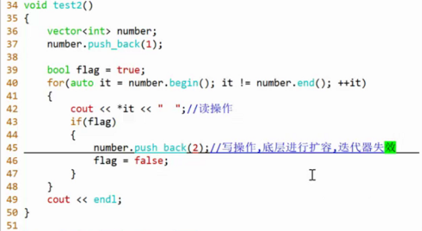
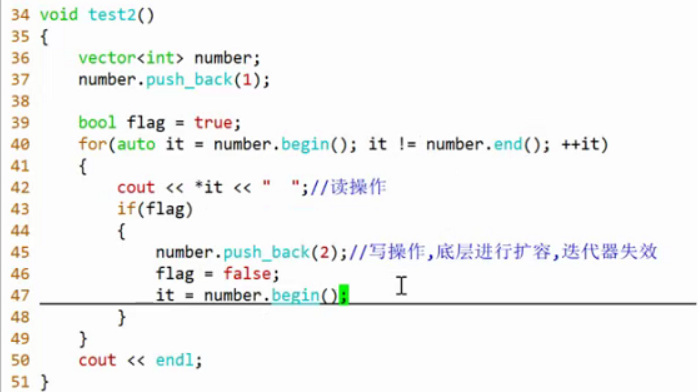

- 又多一个容器遍历的方法
- epoll底层红黑树
- 回调函数：延迟了函数的调用
- 分回调函数的注册和执行回调函数。
- C++虚函数就延迟了执行，将注册和执行分开。可以猜测**C++多态就是通过函数指针**实现的。
- # 一、for\_each算法
	- 一元函数：函数的参数只有一个。二元函数：函数的参数有两个
	- 一元断言/谓词：函数的参数只有一个，函数的返回类型是bool
	- 二元断言/谓词：函数的参数有两个，函数的返回类型是bool
	- ```CPP
	  #include<algorithm>
	  using std::for_each;
	  
	  void print(int value)
	  {
	  	cout << value << " ";
	  }
	  
	  void test0()
	  {
	  	vector<int> number = {1,2,3,5,6};
	  	for_each(number.begin(),bunber.end(),print);
	  	//这里要去查print的实现，很不方便。所以可以直接写进来：
	  
	  	{//将函数体写入到for_each：lambda表达式，匿名函数
	  for_each(number.begin(),bunber.end(),[]（int value）{
	  	cout << value << " ";
	  	}
	  );//这样表意更明确
	  	}
	  }
	  ```
	-
	- lambda表达式：\[捕获列表](参数列表)->返回类型{函数体}。
	- 捕获列表和函数体必写，其他可以省略。   
	  想在函数体内访问外部的变量，就需要在捕获列表内进行捕获。如：
	- ```cpp
	  int a = 10;
	  [a](int value)->void
	  { cout << a << endl; }
	  但是无法修改a
	  可以加上：
	  [a](int value)mutable->void
	  或
	  [&a](int value)->void
	  就可以修改a
	  ```
-
- # 二、count
	- ```cpp
	  size_t cnt = std::count(number.begin(),number.end(),5);
	  cout << cnt << endl;
	  ```
- # 三、find
	- ```cpp
	  auto it = std::find(number.begin(),number.end(),5);
	  if(it != number.end())
	  {
	  	cout << *it << endl;
	  }
	  ```
- # 四、remove\_if
	- 实现源码：
	- ```CPP
	  template<class ForwardIt, class UnaryPredicate>
	  ForwardIt remove_if(ForwardIt first, ForwardIt last, UnaryPredicate p)
	  {
	    first = std::find_if(first, last, p);
	    if (first != last)
	        for(ForwardIt i = first; ++i != last; )
	            if (!p(*i))
	                *first++ = std::move(*i);
	    return first;
	  }
	  template<class InputIt, class UnaryPredicate>
	  constexpr InputIt find_if(InputIt first, InputIt last, UnaryPredicate p)
	  {
	    for (; first != last; ++first) {
	        if (p(*first)) {
	            return first;
	        }
	    }
	    return last;
	  }
	  
	  ```
	- ```CPP
	  bool func(int value)
	  {
	  	return value > 4;
	  }
	  void test0()
	  {
	  	vector<int>number = {1,2,3,4,5,6};
	  	//删除大于4的元素
	  	std::remove_if(number.begin(),number.end(),func);
	  	//此时会出错，结合源码分析
	  	//remove_if并没有把需要删除的元素删除掉，只是把符合条件的元素交换到前面去，但是他返回待删除的元素的首迭代器。需要使用erase删除。
	  	auto it = std::remove_if(number.begin(),number.end(),func); 
	  	number.erase(it,number.end());
	  }
	  ```
	- > 为什么remove_if不删除元素呢？
		- 因为remove\_if不是针对某一种容器的算法，而是适用所有容器的。如果删除元素：在是vector的时候，删除一个元素时，迭代器++，会跳过一个元素；而list中迭代器++则不会跳过元素。救火出错，所以就交换到前面去，自己在外面删除。   
		  remove\_if再次体现了泛型编程的思想，不是针对于某一个具体的容器，而是针对与所有的容器的适用。
		- 
		- 
		- 函数只使用了一次，所以可以使用lambda表达式：
		- ```cpp
		  auto it = std::remove_if(number.begin(),number.end(),[](int value)
		  	{
		  return value > 4;
		  	}
		  );
		  ```
		  而这里用了比较运算符，就想到前面的less、greater函数定制：   
		  std::less就相当于一个二元断言   
		  ```cpp
		  std::less
		  {
		  	bool operator()(const T &lhs = 4,const T &rhs)const//如果将一个参数固定，就变成了一元断言
		  	{
		  return 4 < rhs;
		  	}
		  }
		  
		  std::greater
		  {
		  	bool operator()(const T &lhs,const T &rhs = 4)const
		  	{
		  return lhs < 4;
		  	}
		  }
		  
		  ```
		- 但是我们默认参数只能从右往左绑定，所以引入了新的函数打破这个机制：bind1st、bind2nd.
- # bind
	- bind1st：绑定一个二元函数对象的第一个参数
	- bind2nd：绑定一个二元函数对象的第二个参数
	- ```cpp
	  std::remove_if(number.begin(),number.end(),bind1st(std::less<int>,4)); 
	  
	  std::remove_if(number.begin(),number.end(),bind2nd(std::greater<int>,4)); 
	  
	  ```
	  **但是在多元情况下就不行了，所以要学更加通用的bind函数模板。可以绑定n元**   
	  ```cpp
	  int add(int a,int b)
	  {
	  	return a + b;
	  }
	  void test()
	  {
	  	//bind可以绑定add，可以改变函数add的形态（类型：返回类型+参数列表）
	  	//变为：int(int,int)--->int()
	  	auto f = bind(add,1,2);//返回的是函数，用auto接。C的函数：add退化成函数指针
	  	cout << "f()" << f() << endl;//3
	  	//也可以
	  	cout << f(2,3) << endl;
	  }
	  ```
	  绑定成员函数：   
	  ```cpp
	  class Example
	  {
	  public:
	  	int add(int a,int b)
	  	{
	  return a + b;
	  	}
	  };
	  void test0()
	  {
	  	Example ex;
	  	auto f2 = bind(&Example::add,&ex,3,5);//C++成员函数要取地址，要传地址，他不会退化成指针。
	  	//对于成员函数有三个参数：this指针。所以要传一个&ex；
	  	//静态成员函数就不需要this指针了。
	  	cout << f2() << endl;//8
	  	//类似函数指针了
	  }
	  ```
	  没懂：ex只是简单的作为参数吗？内部怎么调用出add呢？   
	  
	  ```cpp
	  class Example
	  {
	  public:
	  	int add(int a, int b)
	  	{
	  return a + b;
	  	}
	  };
	  auto f2 = bind(&Example::add,&ex,3,5);
	  cout << f2() << endl;
	  
	  那其实就是相当于通过ex对象调用的add函数？：ex.add(3，5)？
	  ```
		- 并不是这样的，成员函数add经过bind函数绑定参数后，返回了一个普通函数 f2 ，之后就可以像使用普通C函数那样使用 f2 函数。这也是bind函数可以改变函数性态的含义