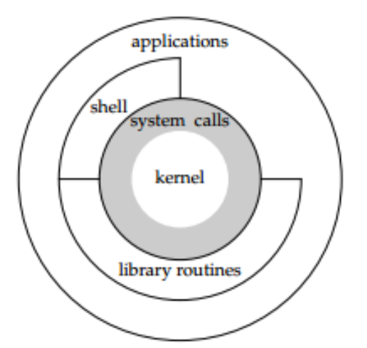

# 一、Unix&Linux
- # 二、Linux的发行版本
  collapsed:: true
	- Linux内核的发行版本：Linux内核+其他的支撑软件。
	- | Debian               | 收费版 | 免费版                     | 包管理器  |
	  | -------------------- | ------ | -------------------------- | --------- |
	  |                      | debian | ubantu（教育）             | apt       |
	  | Redhat               | redhat | centos（创业公司、小公司） | yum-->yum |
	  | Opensuse（德国研发） |        |                            |           |
- # ==Linux的系统架构图==
  id:: 62b18709-e780-4355-aac7-5892b3caf722
  collapsed:: true
	- 
	- ## 1.内核
		- 1. 管理硬件资源
		  	1. CPU
		  	2. 内存
		  	3. 外部设备
		  	4. 文件管理、内存管理、进程调度、网络通信、硬件驱动管理...
		  2. 为上层应用提供运行环境
	- ## 2.系统调用
		- **系统调用**：内核给上层应用程序提供的接口。
	- ## 3.库函数
		- **库函数**：对系统调用进行封装，方便程序员使用。
		  ```ad-note
		  scanf和printf就是库函数，进行系统调用输入输出。
		  ```
	- ## 4.shell
		- **shell**：命令行解释器
		  命令：一些简单的程序。
		  脚本（script）：命令的集合
		  
		  ```ad-note
		  有三种方式使用内核功能。系统调用、shell、库函数
		  ```
- # 三、man
  collapsed:: true
	- 翻页：
	  1. d（down）----往下翻半页
	  2. u（up）---往上翻半页
	  3. f（forward）---往下翻一页
	  4. b（backward）---往上翻一页
	  5. q（quit）---退出
		- ````ad-note
		  color:250 0 0
		  ```markdown
		       1   Executable programs or shell commands
		       2   System calls (functions provided by the kernel)
		       3   Library calls (functions within program libraries)
		       4   Special files (usually found in /dev)
		       5   File formats and conventions, e.g. /etc/passwd
		       6   Games
		       7   Miscellaneous (including macro packages and conventions), e.g. man(7), groff(7)
		       8   System administration commands (usually only for root)
		       9   Kernel routines [Non standard]
		  ```
		  ````
		  
		  
		  
		  ```ad-note
		  color:250 250 0 
		  title:推荐书籍
		  **C语言**：
		  1. 《C语言程序设计现代方法》
		  2. 《C Primer Plus》
		  
		  **数据结构和算法**：
		  1. 《算法导论》
		  
		  **操作系统（Linux）**
		  1. 《操作系统导论》
		  2. 《Unix环境高级编程》
		  ```
- # 四、用户子系统 #card
	- 用户分为：
		- 特权用户（超级用户，根用户）：root--->拥有所有权限
		- 普通用户
			- sudoers：可以临时拥有特权用户的权限。（就是可以用sudo）
				- 安装OS时创建的用户默认为sudoers
			- 其他用户
	- 查看所有用户：`cat /etc/passwd`
	- `ubuntu:x:1000:1000:ubuntu:/home/ubuntu:/bin/bash`以`:`分割
		- x：密码（已废弃）
		- 第一个1000：用户id
		- 第二个1000：用户组id
		- `/home/ubuntu`：家目录
		- `/bin/bash`：shell
	- 添加用户：`useradd`
		- `useradd luyimin`
		- 添加后：
			- `luyimin:x:1002:1002::/home/luyimin:/bin/sh`
				- 没有自动创建家目录，使用-m参数
				- 默认的shell程序是sh，使用-s参数
				- `sudo useradd -m -s /bin/bash luyimin`
					- -s和bash不能分开。
	- 删除用户：`userdel`
		- `userdel luyimin`
			- 但是删除的时候不会删除用户文件和家目录。要加-r
			- `sudo userdel luyimin -r`
	- 切换用户：`SU`：
		- S：switch
		- U：user
		- 
		- 
	- 退出切换：`exit`：
		- 和`switch`组成栈的结构
	- 设置用户密码：`passwd`
		- `sudo passwd test`
		- 也可以更改root用户的密码
	- 修改sudoers
		- 
		-
- # 五、文件子系统 #card
	- **虚拟文件系统**：
	- Linux的文件不是按程序分的，而是按功能，比如日志文件，全放一个文档
	- bin：binay：可执行程序
	- etc：配置文件
		- 如：/etc/passwd、/etc/sudoers
	- lib：（library）：库函数
	- proc：process：进程文件。
	- var：variable：容易发生变化的文件，所以是日志文件
	- dev：device：设备文件
	- home：普通用户家目录的父目录
		- home/ubuntu、home/luyimin
	- root：根用户的家目录
	- sbin：system binary：和系统相关的可执行程序
	-
	- ## pwd
		- `print working directory`：打印当前工作目录
	- ## cd
		- 改变当前目录
		- cd /：切换到根目录
		- cd ~：切换到用户的家目录
		- cd .：当前目录，`.`代表当前目录
		- cd ..：返回上级目录，`..`代表上一层目录
		- cd -：切换到上一次目录
			- env查看环境变量
			- 最后一行OLDPWD环境变量记录了上一次访问的目录
	- ## mkdir
		- 可以一次性创建多个文件夹
	- ## rmdir
		- `rmdir - remove empty directories`，只能删除空的文件夹，防止误删数据
	- ## ^^通配符^^
		- wild card。
		- `*`：可以匹配任意多个字符，包括0个
		- `?`：可以匹配任意一个字符
		- `[集合]`：可以匹配集合内任意一个字符
			- `[abc]`：可以匹配a、b、c中任意一个。
		- `[!集合]`：可以匹配集合外任意一个字符
		- 类：
			- `[0-9]`：匹配十进制数字
			- `[a-z]`：小写字母
			- `[A-Za-z]`：匹配所有字母
			- `[a-c]`
			-
			-