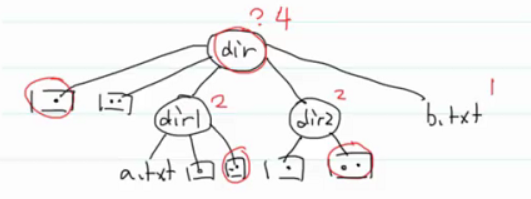

- # 一、目录的原理 #card
  card-last-interval:: 4
  card-repeats:: 1
  card-ease-factor:: 2.36
  card-next-schedule:: 2022-07-13T01:09:20.092Z
  card-last-reviewed:: 2022-07-09T01:09:20.094Z
  card-last-score:: 3
  collapsed:: true
	- 目录的本质：文件，这个文件里面的内容是一些目录项（文件名称，inode）
		- 
	- **如果想在目录中添加或删除文件，一定要获取这个目录的写权限**
- # 二、链接 #card
  card-last-interval:: 4
  card-repeats:: 1
  card-ease-factor:: 2.6
  card-next-schedule:: 2022-07-12T00:08:23.076Z
  card-last-reviewed:: 2022-07-08T00:08:23.077Z
  card-last-score:: 5
  collapsed:: true
   inode怎么和磁盘关联起来的？存一个磁盘块地址很容易就找到了。
	- ## 1.`ln - make links between files`
		- ### 1.`ln file link_hard`硬链接
			- 
			- 在虚拟文件系统中创建一个名称，并关联到file的inode，删除就是断开一个链接，当链接数为0时就删除inode。所以inode中有一个引用计数refcount，当其为0时，才会真正删除文件--->引用计数法
			- **缺陷：**
				- 硬链接只能链接文件，不能硬链接到目录
					- 
					- 如果链接了，那么-r递归就会死循环了
				- **不能够链接到另外的磁盘分区**
					- 每个物理磁盘的分区都有自己的inode
		- ### 2.`ln -s file/dir lin_sym`软链接
			- 软链接就是创建了一个文件，只是他的磁盘空间存的file/dir的路径，结果就相当于指向被链接的文件。
			- 
			- 操作符号链接，相当于操作它指向的文件。
				- 软连接有inode结点吗？有
			- 可以指向任何位置的文件或目录
			- **缺陷：**可能出现悬空链接问题
				- 就是把源文件删了，但是软链接还在，不会被删，就悬空链接了。
			- 
				- .和..是硬链接。dir1之所以硬链接有两个是因为：
					- dir1自己有一个硬链接到它的inode结点，然后.有一个硬链接到他的inode结点。所以是两个。dir有四个是因为：自己有硬链接、加一个.，再加上两个子目录的..就是四个了。
					- 
					-
	-
- # 三、创建文件 #card
  card-last-interval:: 4
  card-repeats:: 1
  card-ease-factor:: 2.6
  card-next-schedule:: 2022-07-12T00:01:25.149Z
  card-last-reviewed:: 2022-07-08T00:01:25.150Z
  card-last-score:: 5
  collapsed:: true
	- ## 1.touch
		- `touch - change file timestamps`
			- 若文件不存在，就创建一个新的空文件
			- 若文件存在，则改变最近修改时间。
	- ## 2.echo
		- `echo - display a line of text`
			- `echo hello > b.txt`
				- `>`：重定向，echo是从stdin读取输入的数据，显示到stdout，但是使用重定向，可以把数据输入到文件，若没有文件就创建那个文件，然后输入。
	- ## 3.vim
	-
- # 四、查找文件 #card
  collapsed:: true
	- ## 1.which
		- `which - locate a command`
			- 查找可执行程序，通过PATH环境变量查找命令的具体位置
				- 当你执行一个可执行程序，然后不知道是哪个版本时，可以which
			- `PATH=/usr/local/sbin:/usr/local/bin:/usr/sbin:/usr/bin:/sbin:/bin:/usr/games:/usr/l`
				- env打开环境变量，运行一个命令时，OS就从环境变量的PATH一个一个路径的找命令，没找到就报错了，找到就执行。
	- ## 2.find
		- `find - search for files in a directory hierarchy`
			- 在某个目录的层次结构中去查找文件（子目录都要查）
				- 相当于在win的文件管理器里面，在某个具体文件路径下搜索。
		- `find 目录 查找条件`
			- `-name`：根据名字查找
				- 可以用通配符进行模糊查找`find /usr/include -name std*.h`
			- `-type`
				- 
					- man进入之后输入/ 查找，点n查找下一个。
				- ```
				  ubuntu@VM-16-2-ubuntu:~/My_Code$ find . -type l
				  ./wangdao/LinuxDay03/linktotest
				  ```
			- **组合查找**
				- `-a (and)`
					- ```
					  ubuntu@VM-16-2-ubuntu:~/My_Code/wangdao/LinuxDay03$ find . -name "link*" -a -type f
					  ./linkTotest
					  ```
				- `-o (or)`
					- ```
					  ubuntu@VM-16-2-ubuntu:~/My_Code/wangdao/LinuxDay03$ find . -name "link*" -o -type f
					  ./linktotest
					  ./linkTotest
					  ./test
					  ./test.c
					  ```
				- `! (not)`
					- ```
					  ubuntu@VM-16-2-ubuntu:~/My_Code/wangdao/LinuxDay03$ find . ! -type f
					  .
					  ./linktotest
					  ```
					- 注意`!`的位置
			- 根据用户名和组名查找
				- ```
				  ubuntu@VM-16-2-ubuntu:~/My_Code/wangdao/LinuxDay03$ find . -user luyimin
				  ./test.txt
				  ```
				- ```
				  ubuntu@VM-16-2-ubuntu:~/My_Code/wangdao/LinuxDay03$ find -uid 1002
				  ./test.txt
				  //cat /etc/passwd查看uid
				  ```
			- 根据权限查找：`-perm (permission)`
				- 用户：u，组：g，其他人：o，a=all
				- **用三个八进制数可以表示权限**
				- 常见的：
					- 664：rw-rw-r--
					- 775：rwxrwxr-x
				- ```
				  ubuntu@VM-16-2-ubuntu:~/My_Code/wangdao/LinuxDay03$ find . -perm 777
				  ./linktotest
				  ```
			- 根据大小查找：`-size`
				- 
				- rounding up：向上取整
				- b不是byte是block，c才是
				- 默认以b为单位
				- ```
				  ubuntu@VM-16-2-ubuntu:~/My_Code/wangdao/LinuxDay03$ ls -lh
				  total 32K
				  lrwxrwxrwx 1 ubuntu  ubuntu    6 Jun 23 10:11 linktotest -> test.c
				  -rw-rw-r-- 2 ubuntu  ubuntu   49 Jun 23 09:10 linkTotest
				  -rwxrwxr-x 1 ubuntu  ubuntu  17K Jun 23 09:10 test
				  -rw-rw-r-- 2 ubuntu  ubuntu   49 Jun 23 09:10 test.c
				  -rw-rw-r-- 1 luyimin luyimin   6 Jun 23 11:18 test.txt
				  ubuntu@VM-16-2-ubuntu:~/My_Code/wangdao/LinuxDay03$ find . -size 1k
				  ./linktotest
				  ./test.txt
				  ./linkTotest
				  ./test.c
				  //向上取整，所以有这么多
				  ```
				- ```
				  ubuntu@VM-16-2-ubuntu:~/My_Code/wangdao/LinuxDay03$ find . -size +30c
				  .
				  ./linkTotest
				  ./test
				  ./test.c
				  //+表示大于，不包含30bytes
				  //-表示小于
				  //find . -size 30c  =30c精确查找11：35
				  ```
				- ```
				  //找空文件
				  ubuntu@VM-16-2-ubuntu:~/My_Code/wangdao/LinuxDay03$ find . -size 0
				  ./a.txt
				  //但是这样找不到空目录，因为任何目录都有.和..两个目录，是有大小的。
				  ```
				- `-empty`：查找空目录和文件
					- `find . -empty`
			- 按照时间查找：
				- ```
				  -amin n
				                File was last accessed n minutes ago.
				                //a：access
				                //min：minute
				                访问时间
				  -atime n
				                File was last accessed n*24 hours ago.  When find figures out how many
				                24-hour periods ago the file was last accessed, any fractional part is
				                ignored, so to match -atime +1, a file has to have  been  accessed  at
				                least two days ago.
				                //time：天
				  -mmin、-mtime
				  	//m：modified，修改--->文件内容发生修改
				  -cmin、-ctime
				  	//c：status change--->文件数据元（例如权限等）最后一次修改时间。如文件权限状态发生修改
				  
				  ```
				- 
			-
- # 五、查看文件内容 #card
  collapsed:: true
	- ## 1.cat
		- `cat - concatenate files and print on the standard output`
			- 将文件流拼接到stdout末尾。会显示全部
	- ## 2.more 和 less
		- 分页浏览。
		- q：quit。
		- `more/less 文件`
	- ## 3.head
		- `head - output the first part of files`
			- 显示文件开头，默认显示10行
		- 
		- -n改变显示行数
	- ## 4.tail
		- `tail - output the last part of files`
		- 同上
- # 六、搜索文件内容 #card
  collapsed:: true
	- ## 1.`grep`
	  collapsed:: true
		- `grep, egrep, fgrep, rgrep - print lines that match patterns`
			- 打印符合正则表达式的所有行
		- G：gloabally：全局的
		- R：regular expression：正则表达式
		- P：print：打印
		- ```
		  -E, --extended-regexp
		                Interpret PATTERNS as extended regular expressions (EREs, see below).
		  -n, --line-number
		                Prefix each line of output with the 1-based  line  number  within  its
		                input file.
		                打印行号，行号从1开始
		  ```
		- **正则表达式：**
			- 基本单位：字符、转义序列、[abc] (类似集合)、(另一个正则expr)、. (匹配任意一个字符)
			- 基本操作：操作的对象是基本单位。
				- 1.连接 ：“ab”、”[abc]x“-->匹配ax、bx、cx、".txt"-->匹配四个字符?txt，要匹配.txt后缀需要转义："\\.txt"
					- \[^abc]-->取反
				- 2.重复
					- +：至少重复一次
					- ？：重复0次或者1次
					- *：重复任意次数--->".\*" 匹配所有数据：贪婪式的匹配，每次尽量匹配多的字符
					- {m,n}：至少重复m次，至多重复n次
					- {m}：重复m次     [m,n]
					- {m,}：至少重复m次
					- {,n}：至多重复n次
			- 指定基本单位出现的位置
				- ^：行首："^abc"
				- \$：行尾：“abc$”
				- \\<：词首
				- \\>：词尾
			- 
				- 匹配以f开头t结尾的单词  15：00
			-
	- ## 2.管道
	  collapsed:: true
		- 
			- sort排序，uniq去除相邻的重复行
			- 把前一个命令的结果当作后一个命令的输入。
		- 
			- xargs把前面命令的每一行当作后面命令的参数。
				- 如果不加，那么前面命令的结果只会是后面命令的输入操作对象，而不是参数；故对于grep来说，就是在前面的输出的结果里面找main(，结果肯定没有。
			-
	- ## 3.命令的组合
	  collapsed:: true
		- cmd1 ; cmd2
			- 执行cmd1后执行cmd2，即顺序执行
		- cmd1 | cmd2
			- cmd2的输入是cmd1的结果
		-
		- cmd1 |xargs cmd2
			- 会把cmd1的结果的每一行作为cmd2的参数去使用
		-
		-
		-
	- **小结：**查看文件内容、搜索文件内容时会使用正则，其他时候一般是通配符
- # 七、重定向 #card
  card-last-interval:: 4
  card-repeats:: 1
  card-ease-factor:: 2.36
  card-next-schedule:: 2022-07-11T12:57:05.788Z
  card-last-reviewed:: 2022-07-07T12:57:05.792Z
  card-last-score:: 3
  collapsed:: true
	- |        | 默认关联 | 文件描述符 | 重定向符号                |
	  | ------ | -------- | ---------- | ------------------------- |
	  | stdin  | 键盘     | 0          | <                         |
	  | stout  | 显示器   | 1          | >(会清空原文件)  >>(追加) |
	  | stderr | 显示器   | 2          | 2>                        |
	-
		- 
		- fd：file descriptor：文件描述符
	- 
	-
- # 八、VIM（编辑文件内容）
  collapsed:: true
	- 编辑器
		- 所见即所得：word、markdown、notepad...
		- 命令编辑器：vim，emacs
	- VI-->VIM
		- VI improved：vi改进版
	- **模式**
		- 
		- `i`：在光标前插入
		- `I`：在行首插入
		- `a`：在光标后面插入，after
		- `A`：在行尾插入。
		- `o`：在下一行插入（另开一行）
		- `O`：在上一行插入（另开一行）
	- ## 1.命令模式
	  collapsed:: true
		- **长命令**：以`:`开头，以[ENTER]结尾的命令
		- **短命令**：i、a、o...（直接敲就可以）
		-
		- 移动光标：
			- 
		- 翻页：
			- `ctrl+f`：下一页（forward）
			- `ctrl+b`：下一页（backward）
			- `ctrl+d`：下半页（down）
			- `ctrl+u`：下半页（up）
			- `[n]-`：往上走n行
			- `[n]+`：往下走n行
			- `[n]G/:[n]`：去往n行
			- `gg`：去往文件的开头
			- `G`：去往文件的末尾
			- `H`：页首（head）
			- `L`：页的最后一行行首，（tail）
			- `^`：行首
			- `$`：行尾
			- `w`：下一个单词
			- `b`：上一个单词
		- 在命令模式下编辑文本：
			- 删除（相当于剪切）：--->d：delete
			- `x`：删除一个字符
			- `dw`：删除一个单词
			- `[n]dw/d[n]w`：删除多个单词
			- `dd`：删除一行
			- `[n]dd/d[n]d`：删除多行
			- `:x,yd`：删除[x,y]行
			- `d^`：删除到行首
			- `d$`：删除到行尾
			- `dt?`：删除到？这个字符。t：to
				- `dt)`：删除到)
				- `dt"`：删除到"
		- 粘贴
			- `p`-->paste：粘贴
			- `u`-->undo：撤销
			- `ctrl+r`：恢复上一次的操作：r：recovery
		- 拷贝
			- y-->yank：拷贝
			- `yy`：拷贝一行
			- `[n]yy/y[n]y`：拷贝n行
			- `:x,yy`：拷贝[x,y]行
			- `yw`：拷贝一个单词
			- `[n]yw/y[n]w`：拷贝n个单词
		- 查找和替换
			- 查找：
				- /pattern：匹配正则表达式
					- n：下一个匹配项
					- N：上一个匹配项
			- 替换：
				- `:s/pattern/substitute/选项`
					- pattern：正则表达式
					- substitute：替换的表达式
					- 默认只会替换光标所在行的第一个匹配项
					- 选项：
						- g（globally）：全局：替换光标所在行的所有匹配项
							- 替换的单位是行，所以g的全局代表的就是行 04：10：06
						- `:x,ys/pattern/substitute/g`：替换[x,y]行所有匹配项
						- `:%s/pattern/substitute/g`：对全文进行替换
						-
	- ## 2.视图模式
	  collapsed:: true
		- 作用：选择范围--->目的：复制和删除
		-
		- 行选模式：`v`
		- 竖选模式：`ctrl+v`
		-
		- 批量注释：
			- 1.`ctrl+v`进入竖选模式
			- 2.选择范围
			- 3.输入大写`I`
			- 4.输入`//`
			- 5.[ESC]
		- 删除注释：
			- 1.`ctrl+v`进入竖选模式
			- 2.选择范围
			- 3.d删除
		- 全文代码对齐：`gg=G`
		-
	- ## 3.对文件的操作
	  collapsed:: true
		- `:w`：保存。^^**千万不要按 ctrl+s ，不然vim会进入僵死状态，按啥都没用， ctrl+k 退出僵死状态**^^
		- `:q`：退出
		- `:q!`：不保存退出，强制退出
		- `:wq`：保存退出
		-
		-
		-
	- ## 4.多窗口
	  collapsed:: true
		- 上下分屏
			- `:new`
			- `:split`：分割
			- `:sp`
		- 切换窗口：`ctrl+ww`
		- 退出：
			- `:q`：退出光标所在的窗口
			- `:qa`：退出所有窗口
		-
		- 上下分屏的命令前加 v ，可以左右分屏
			- `:vnew`、`:vsplit`、`:vsp`
		-
	- ## 5.多标签
	  collapsed:: true
		- `:tabnew`
		-
		- 如何切换标签？
			- `gt`：下一个标签：goto？
			- `gT`:上一个标签
		-
	- ## 6.配置vim
	  collapsed:: true
		- `~/.vimrc`：rc结尾：配置文件
			- rc：running command
		- 每次启动vim时，会执行.vimrc里面的命令，（相当于脚本）
		-
	- ## 7.练习手册
		- vimtutor
	-
-