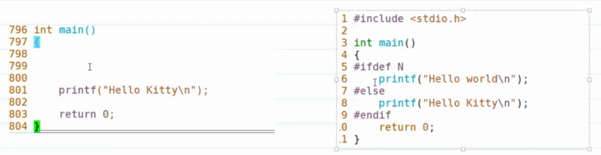
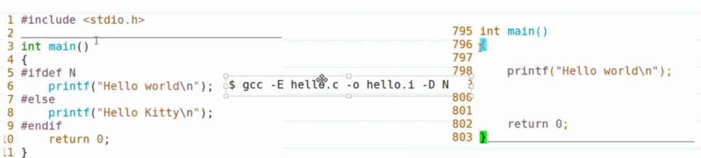
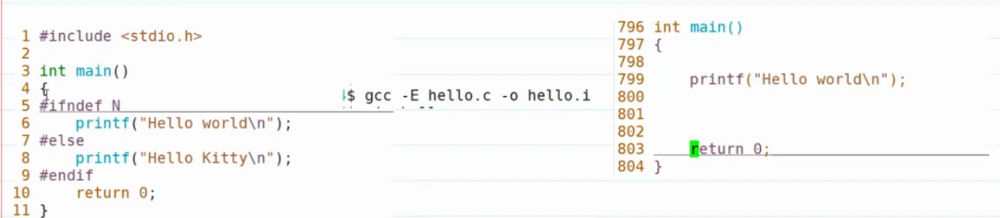
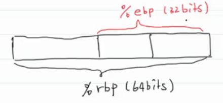

- # 零、关闭虚拟机
  collapsed:: true
	- reboot重启
	- poweroff关机
	- shutdown
		- ```C
		  -r, --reboot
		             Reboot the machine.
		  
		  -h
		             Equivalent to --poweroff, unless --halt is specified.
		  ```
		- 默认一分钟，要立马关闭就：shutdown -now
- # 一、查看文件元数据 #card
  card-last-interval:: 4
  card-repeats:: 1
  card-ease-factor:: 2.6
  card-next-schedule:: 2022-07-11T23:56:15.149Z
  card-last-reviewed:: 2022-07-07T23:56:15.151Z
  card-last-score:: 5
  collapsed:: true
	- ## 1.stat
		- `stat - display file or file system status`
		- ```
		  ubuntu@VM-16-2-ubuntu:~/hexo/source/_posts$ stat hello-world.md 
		    File: hello-world.md
		    Size: 838//大小    	Blocks: 8//占用多少块       IO Block: 4096//每次IO读多少数据   regular file//普通文件
		  Device: fc02h/64514d//设备号	Inode: 650818      Links: 1//硬链接
		  Access: (0664/-rw-rw-r--)  Uid: ( 1000/  ubuntu)   Gid: ( 1000/  ubuntu)
		  Access: 2022-06-24 10:12:48.801315522 +0800//最近访问时间
		  Modify: 2022-06-22 22:33:43.808425130 +0800//最近内容改动时间
		  Change: 2022-06-22 22:33:43.808425130 +0800//state chage权限状态改变时间
		   Birth: -//创建时间
		  ```
		-
- # 二、修改文件权限 #card
  collapsed:: true
	- ## 1.chmod
		- `chmod - change file mode bits`
		- bitmap--->位图
		- ### 1.文字设定法
			- `chmod [ugoa][+=-] [rwx] file/dir`
			- `+`：增加权限
			- `=`：将权限设置为
			- `-`：减少权限
		- ### 2.数字设定法
			- 比较方便，可以一次设定完所有用户权限
			- `775`->`rwxrwxr-x`
			- `664`->`rw-rw-r--`
	- ## 2.文件创建掩码
		- `umask`查看文件创建掩码 002
		- 创建普通文件时，会有一个默认权限666，他会受文件掩码的影响，经过文件掩码变为664：666&( ! umask)
		- 创建目录时，默认权限为777：777&(!umask)=775
		-
		- 可以通过`umask 值`临时修改umask值
			- `umask 0000`0八进制
	- ## 3.权限如何影响目录？
		- 目录也是文件，其内放的是目录项
		- r：影响ls
			- ls要查看目录项，然后展示，也就是读目录文件了
		- w：影响创建和删除文件
			- 写目录项
		- x：影响cd
			- 打开不就是执行目录文件
- # 三、scp #card
  collapsed:: true
	- `scp — OpenSSH secure file copy`
		- s：secure，cp：copy
		- 文件的安全上传和下载
	- 上传：将本地文件复制到远程
	- 下载：将远程的文件复制到本地
	-
	- 本地路径：
		- 相对路径
		- 绝对路径
	- 远程路径：
		- `用户名@IP:路径`
	-
	- ==scp src dest==
	-
	- scp底层用的协议是SSH，会进行加密处理，所以它是一个安全的传输数据的协议
- # 四、git(待补充笔记)
  collapsed:: true
	- 11：10
	- {:height 537, :width 705}
- # 五、编译工具链 #card
  collapsed:: true
	- IDE：visual studio（Integrated Development Environment）
	- 编译工具链（SDK）：Software Development Kit
		- GCC
		- Clang
	- `gcc - GNU project C and C++ compiler`
	-
	- `gcc -v`查看gcc版本信息
	- `target=x86_64-linux-gnu`
		- x86：x86架构处理器。
			- 交叉编译：在x86架构上编译arm架构软件。
			- 就是用PC编写安卓等手机的软件，交叉编译
		- 64-linux：64位LinuxOS
		- -gnu：gnu的64位LinuxOS
	- `Thread model: posix`
		- 遵循posix协议
	-
	-
- # 六、预处理 #card
  card-last-interval:: 4
  card-repeats:: 1
  card-ease-factor:: 2.36
  card-next-schedule:: 2022-07-11T00:49:37.230Z
  card-last-reviewed:: 2022-07-07T00:49:37.231Z
  card-last-score:: 3
  collapsed:: true
	- **作用：执行预处理命令**
		- \#include
		- \#define N 5
		- \#define SIZE(a) (sizeof(a)/sizeof(a[0]))
		- 宏开关
			- \#if  ... \#else   ... \#endif（一般很少用，因为不好用）
				- 条件编译
					- 根据不同的条件，生成不同的源代码。
					- ```C
					    1 #include<stdio.h>                      
					    2                                        
					    3 int main()                             
					    4 {                                      
					    5 #if 1                                  
					    6         printf("helloworld\n");        
					    7 #else                                  
					    8         printf("HelloKitty\n");        
					    9 #endif                                 
					   10         return 0;                      
					   11 }
					  ```
					- ```C
					  729 int main()
					  730 {
					  731 
					  732  printf("helloworld\n");
					  733 
					  734 
					  735 
					  736  return 0;
					  737 }
					  ```
					- **作用：**
						- 1.可以更加一步增强代码的可移植性
							- 针对不同平台，编写不同的if条件，执行不同的语句
						- 2.利用系统的特殊的接口
			- \#ifdef  ...  \#else  ...  \#endif--->一般用于条件编译
				- 
				- {:height 132, :width 549}
					- `-D N`--->在文件开头`#define N`
			- \#ifndef  ...  \#else  ...  \#endif--->一般用于防御式声明
				- 防御式声明：防止一个同文件被包含多次
				- ```C
				  #ifndef __FOO_H__
				  	#define __FOO_H__
				  	...头文件里面的内容
				  #endif
				  ```
				- 
				-
- # 七、编译 #card
  collapsed:: true
	- **作用：将源代码编译成汇编代码**
	- gcc -S hello.c -o hello.s
	- ```C
	    1 #include<stdio.h>
	    2 
	    3 int main()
	    4 {
	    5         printf("hello\n");
	    6 }
	  
	  ```
	- ```c
	    1         .file   "hello.c"
	    2         .text
	    3         .section        .rodata
	    4 .LC0:
	    5         .string "hello"
	    6         .text
	    7         .globl  main
	    8         .type   main, @function
	    1         .file   "hello.c"
	    2         .text
	    3         .section        .rodata
	    4 .LC0:
	    5         .string "hello"
	    6         .text
	    7         .globl  main
	    8         .type   main, @function
	    1         .file   "hello.c"
	    2         .text
	    3         .section        .rodata
	    4 .LC0:
	    5         .string "hello"
	    6         .text
	    7         .globl  main
	    8         .type   main, @function
	    9 main://汇编中以.开头的都是注释
	   10 .LFB0://相当于比一个标签
	   11         .cfi_startproc
	   12         endbr64
	   13         pushq   %rbp//rbp寄存器的值入栈，保存上一个栈帧的基地址
	   //q就表示占用栈64位空间
	   14         .cfi_def_cfa_offset 16
	   15         .cfi_offset 6, -16
	   16         movq    %rsp, %rbp//把rsp的值移入rbp，栈帧的大小=%rbp-%rsp
	     //因为栈是减小的。main的栈帧大小就为0。这一步就是main栈帧入栈
	   17         .cfi_def_cfa_register 6
	   18         leaq    .LC0(%rip), %rdi//15：15.把"hello"的地址赋给rdi
	   19         call    puts@PLT//调用puts函数，这是编译器的优化，不用printf，
	     //put函数将会从rdi读取参数
	   20         movl    $0, %eax//把0放入eax，作为返回值
	   21         popq    %rbp//恢复rbp的值，就是恢复上一个栈帧的地址
	   22         .cfi_def_cfa 7, 8
	   23         ret//返回
	  ```
	- ## 汇编指令
		- PUSH、pop、mov、call、ret、lea(load effictive address加载有效地址)
	- ## 数据长度
		- 汇编里面没有类型概念，只有数据长度
		- word(字长)固定为16bits
			- 8086cpu架构数据总线为16位，历史沿留
		- `l`：long word：32位
		- `q`：quadra word：64位
		-
		- double、triple、quadra、penta
	- ## 寄存器
		- 以\%开头的就是寄存器
		- `%rbp`：base pointer：栈帧基址寄存器
		- `%rsp`：stack pointer：栈寄存器，保存栈顶所在地址
		- `%rdi`：参数寄存器，存第一个参数
			- `%edi`：32位小的哪个寄存器
		- `%esi`：第二个参数寄存器，一般存第二个参数
		- `%eax`：存放返回值。
		- 
		-
		- 
		- ```C
		  16：12
		  subq $48,%rsp//rsp-48,栈顶下移48字节
		    //所以main栈帧大小为48字节
		  movq %rax,-8(%rbq)
		  (%fs：40)内存中的某一片只读区域：金丝雀值
		  最后用来检查数组是否越界16：30
		  存放在数组的末尾的吗?。
		  
		  xorl %eax,%eax//eax和eax异或，就是将eax清0
		  
		  leaq没有访问内存，直接放入了rax里
		  ```
		-
			- nop：不执行，空指令
			- leave：清零
			- jmp：无条件跳转
			- jle：有条件跳转：j跳转l小于e等于
			- add：加
				- add之后继续往下执行cmp，符合就jle，不符合就继续往下
		- ```C
		    1 #include<stdio.h>
		    2 
		    3 void foo(int i)
		    4 {
		    5         printf("from foo: i = %d\n",i);
		    6 }
		    7 
		    8 int main()
		    9 {
		   10         int j = 10;
		   11         int arr[]={1,2,3};
		   12         warr[2]=30;
		   13         int *p =arr;
		   14 
		   15         foo(j);
		   16 
		   17         for(int i =0;i<10;i++)
		   18         {
		   19                 printf("I love xixi,\n");
		   20         }
		   21 
		   22         return 0;
		   23 }
		  ```
		- ```C
		    1         .file   "foo.c"
		    2         .text
		    3         .section        .rodata
		    4 .LC0:
		    5         .string "from foo: i = %d\n"
		    6         .text
		    7         .globl  foo
		    8         .type   foo, @function
		    9 foo:
		   10 .LFB0:
		   11         .cfi_startproc
		   12         endbr64
		   13         pushq   %rbp
		   14         .cfi_def_cfa_offset 16
		   15         .cfi_offset 6, -16
		   16         movq    %rsp, %rbp
		   17         .cfi_def_cfa_register 6
		   18         subq    $16, %rsp
		   19         movl    %edi, -4(%rbp)//将参数从寄存器取出
		   20         movl    -4(%rbp), %eax
		   21         movl    %eax, %esi//最终存入esi中，esi存第二参数
		   22         leaq    .LC0(%rip), %rdi//取第一个参数，存入rdi，也就是printf的参数的地址，
		   //可以看出他没有访问内存，而是直接就取了地址
		   23         movl    $0, %eax//存返回值
		   24         call    printf@PLT//call
		   25         nop		//空指令
		   26         leave	//清零
		   27         .cfi_def_cfa 7, 8
		   28         ret
		   29         .cfi_endproc
		   30 .LFE0:
		   31         .size   foo, .-foo
		   32         .section        .rodata
		   33 .LC1:
		   34         .string "I love xixi,"
		   35         .text
		   36         .globl  main
		   37         .type   main, @function
		   38 main:
		   39 .LFB1:
		   40         .cfi_startproc
		   41         endbr64
		   42         pushq   %rbp//保存上一个栈帧的基地址
		   43         .cfi_def_cfa_offset 16
		   44         .cfi_offset 6, -16
		   45         movq    %rsp, %rbp
		   46         .cfi_def_cfa_register 6
		   47         subq    $48, %rsp//确定main栈帧的大小：48字节。rsp-48,栈顶下移48字节
		     //刚开始rsprbp
		   48         movq    %fs:40, %rax//%fs:40是一片只读的内存空间，用于检验数组是否越界的
		     //用rax作为中转寄存器保存在栈基址了。
		   49         movq    %rax, -8(%rbp)//就是栈的基址的第一个内存空间，因为栈是向下生长
		   50         xorl    %eax, %eax//xor：异或，就是将eax清零了
		   51         movl    $10, -36(%rbp)//-36(%rbp)就是相当于偏移，rbp基址-36字节，存入10，也就是j
		   52         movl    $1, -20(%rbp)//arr[1]
		   53         movl    $2, -16(%rbp)
		   54         movl    $3, -12(%rbp)
		   55         movl    $30, -12(%rbp)//更改arr[2]的值为30
		   56         leaq    -20(%rbp), %rax//取rbp-20的地址存入rax，就是arr的地址存入指针p
		   57         movq    %rax, -32(%rbp)//rax是中转寄存器
		   58         movl    -36(%rbp), %eax
		   59         movl    %eax, %edi//edi是参数寄存器，32位，就是小的那个，用于传参，这里存的就是j了
		   60         call    foo//运行foo
		   61         movl    $0, -40(%rbp)
		   62         jmp     .L3//jmp跳转
		   63 .L4:
		   64         leaq    .LC1(%rip), %rdi	//取.LC1的地址，也就是"I love xixi,"
		     //的地址到rdi寄存器作为第一个参数
		   65         call    puts@PLT		//打印
		   66         addl    $1, -40(%rbp)	//i+1，然后这里没有ret，所以继续顺序执行，
		     //从而与jle形成循环
		   67 .L3:				//为什么这里能循环？而foo哪里不是的？因为foo那里有ret
		   68         cmpl    $9, -40(%rbp)//cmp比较9和i的值
		   69         jle     .L4		//jle：jmp less equal，小于等于就跳转
		   70         movl    $0, %eax//结束循环后，返回值
		   71         movq    -8(%rbp), %rdx	//将原来存放%fs:40值的地方放入rdx
		   72         xorq    %fs:40, %rdx	//将现在的存放的%fs:40值与原来的值相对比。如果一样，那么数组没有越界
		     //如果不一样，那么数组越界。
		   73         je      .L6	//je 相等则跳转
		   74         call    __stack_chk_fail@PLT//不相等则报栈越界。
		   75 .L6:
		   76         leave	//清零
		   77         .cfi_def_cfa 7, 8
		   78         ret		//返回
		   79         .cfi_endproc
		   80 .LFE1:
		   81         .size   main, .-main
		   82         .ident  "GCC: (Ubuntu 9.4.0-1ubuntu1~20.04.1) 9.4.0"
		   83         .section        .note.GNU-stack,"",@progbits
		   84         .section        .note.gnu.property,"a"
		   85         .align 8
		   86         .long    1f - 0f
		   87         .long    4f - 1f
		   88         .long    5
		   89 0:
		   90         .string  "GNU"
		   91 1:
		   92         .align 8
		   93         .long    0xc0000002
		   94         .long    3f - 2f
		   95 2:
		   96         .long    0x3
		   97 3:
		   98         .align 8
		   99 4:
		  
		  ```
	- ## 小结
		- **汇编指令：**
			- mov, push, pop, cal, ret, lea, add, sub, xor, jmp, jle(jmp less equal), je(jmp equal).
		- **寄存器：**
			- rbp:栈帧基址寄存器
			- rsp：栈寄存器，存放栈顶地址
				- ^^**要清楚入栈和出栈的过程**^^
			- rdi:存放第一个参数
			- rsi:存放第二个参数
			- eax:返回值寄存器（4B）
			- rax:8B返回值寄存器
		- **在汇编中没有变量名，所有的变量名都替换成了内存中的地址**
		- **在汇编中没有数据类型的概念，所有类型都转换成了数据的长度**
		- **在汇编中没有循环相应的指令，都是用跳转实现的循环**
		- **函数调用（栈帧独立，参数传递方式--->值传递，因为是寄存器传的）**
		-
- # 八、汇编 #card
  collapsed:: true
	- `AS - the portable GNU assembler.`
		- assembler：汇编器
		- 可以用as执行汇编
	- 文件只包含了.h文件啊，所以只有函数声明，没有实现的，所以之后还要链接啊
	- 所以汇编之后是找不到一些符号的地址的。
	-
- # 九、链接 #card
  collapsed:: true
	- 作用：为符号（全局变量、函数名）找到对应的地址
	- `ld - The GNU linker`
		- 古老的链接器，后来都集成到了gcc里，所以用gcc就好了
	- `./hello`
		- 如果没有`./`那么OS就会去PATH环境变量里面去找
		- 加上`./`表示当前目录。即执行当前目录下hello程序。
		- `hello`是一个二进制文件，所以想要`./`就需要他可以执行。
			- 所以别的地方来的文件，注意要改执行权限才能执行。
	- ```C
	  gcc -c hello.c -o hello.o//c-compile编译
	  gcc hello.c -o hello//生成可执行程序
	  ```
	-
- # 十、库文件（轮子） #card
  collapsed:: true
	- 库文件：目标文件的集合。（*.o）
		- 库文件是别人造的轮子，计算机运行的是二进制文件。所以里面是目标文件的集合
			- 制作的时候也是.o目标文件的集合啊
	- 静态库和动态库
		- 静态库：打包到程序里面的
		- 动态库：在运行时才会加载
	- **比较：**
		- 静态库的可执行程序更大。
		- 动态库部署更难
			- 部署：把一个程序安装到另一台机器上执行
		- 升级上静态库更难
			- 动态库不用重新编译，只需要更新动态库本身就好了
			- 静态库要对可执行程序重新编译
	-
- # 十一、生成静态库 #card
  collapsed:: true
	- 1.生成目标文件。
	- 2.把目标文件打包成静态库
	- `ar - create, modify, and extract from archives`
		- ar：打包
		- ```C
		  ubuntu@VM-16-2-ubuntu:~/My_Code/wangdao/LinuxDay04$ ar crsv libalgs.a add.o sub.o mul.o div.o
		  a - add.o
		  a - sub.o
		  a - mul.o
		  a - div.o
		  //crsv:参数，记一下
		  //libalgs.a
		  //lib前缀
		  //.a后缀
		  //algs：库的名字
		  ```
	- 3.把生成的库文件移动到`/usr/lib`目录下
	- 4.链接时加上库文件的名称即可。
		- `gcc main.c -o main -lalgs`
	-
	-