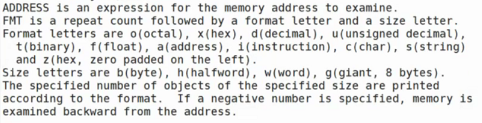

- # 一、生成动态库
  collapsed:: true
	- 1.编译生成目标文件
	  collapsed:: true
		- 加上`-fpic`：Generate position-independent code (PIC)
		- `gcc -c *.c -fpic`
	- 2.把目标文件打包成动态库
	  collapsed:: true
		- `gcc -shared *.o -o libalgs.so`
	- 3.将动态库移动到/usr/lib目录下
	- 4.链接时加上`-lalgs`
	  collapsed:: true
		- `algs`是库文件的名字
	-
	- **升级**：（就像游戏打补丁升级，就是更新动态库文件）
	  collapsed:: true
		- 用软连接，链接到新的版本就可以了。
- # 二、GCC的其他选项
  collapsed:: true
	- `-E`：预处理
	- `-S`：编译
	- `-c`：广义上的编译，生成目标文件
	- 不加参数：生成可执行程序。
	- `-shared`：生成动态库
	- `-D`：条件编译，相当于在文件开头加上`# define`
	- **优化：**
	  collapsed:: true
		- `-O`：后面要加数字表示优化级别
		  collapsed:: true
			- `-O0`：不优化： optimise，默认0级别
			- `-O1`：产品
			- `-O2`：开源产品
			- `-O3`：极端的优化。可能运行结果逻辑上会有出入。
			  collapsed:: true
				- 优化可能会导致指令的执行顺序会发生改变。所以debug一定不能优化，不然可能指令顺序就发生改变了。
	- `-Wall`：显示所有的警告
	  collapsed:: true
		- w：waring
		- 建议开启
- # 三、GDB调试
	- `gdb - The GNU Debugger`
	  collapsed:: true
		- 1.一定不要优化：`-O0`
		- 2.补充调试信息：`-g`
	- `gcc -o main main.c -O0 -g`：生成可执行程序。
	- `gdb main`：进入调试
	-
	- **命令：**
	  collapsed:: true
		- `l/list [文件名:][行号|函数名]`：查看源代码
		  collapsed:: true
			- 
		- `run/r`：运行程序
		-
	- **1.断点**
	  collapsed:: true
		- `break/b [文件名:][行号|函数名]`
		  collapsed:: true
			- 
		- `delete/d [n]`：删除所有断点/n号断点
	- **2.单步调试**
	  collapsed:: true
		- `step/s`
	- **3.逐过程调试**
	  collapsed:: true
		- `next/n`
	- **4.继续执行到下一个断点**
	  collapsed:: true
		- `continue/c`
	- **5.监视**
	  collapsed:: true
		- `print/p 表达式`：打印某个表达式
		- `display 表达式`：一直跟踪显示某个表达式
		  collapsed:: true
			- `info display`：查看监视点
			- 
		- `undisplay [n]`：删除 所有/n号 监视点
	- **6.内存**
	  collapsed:: true
		- `help x`：查看帮助手册：x：查看内存
		  collapsed:: true
			- 给定的ADDRESS是内存的起始地址
			- 
			- 
			  collapsed:: true
				- 4xb中的x：结果展示格式，十六进制
				- 4b：表示展示的结果所占空间大小
			- 
			- 大端表示法
			  collapsed:: true
				- 低地址存放高有效位
			- 小端表示法
			  collapsed:: true
				- 低地址存放低有效位
				- 人类可直观阅读的表示方法
	- **7.跳出**
	  collapsed:: true
		- `finish`：执行完本次函数调用后跳出
	- **8.跳到指定次数的循环**
	  collapsed:: true
		- `ignore [n][count]`：忽略n号断点count次：用于跳到指定次数的循环
		  collapsed:: true
			- 之后没有立即执行，需要按`c`键执行。
	- **9.查看断点信息**
	  collapsed:: true
		- `info break/i b`
		  collapsed:: true
			- 
	- **10.命令行参数**
	  collapsed:: true
		- 
		- `set args`：命令，设置命令行参数
		- main的\[]第一个参数是可执行文件的路径
- # 四、GDB查看core文件
  collapsed:: true
	- core：“黑匣子”。
	  collapsed:: true
		- 程序崩溃**瞬间**堆栈的情况。只有这一瞬间。
		  collapsed:: true
			- **内存快照**，保存了程序崩溃瞬间站的调用情况
		- `ulimit -a`：查看是否开启core文件
		- ```C
		  ubuntu@VM-16-2-ubuntu:~$ ulimit -a
		  core file size          (blocks, -c) 0	//0表示其大小为0，没有开启core文件
		  //因为程序崩溃瞬间可能所用堆栈空间很大，超过磁盘空间，所以一般没开启就设置为0了。
		  ```
		- `ulimit -c unlimited`：改变core文件的大小
		- 编译时加上 `-O0 -g`
		- 将`ulimit (core filesize) -c `设为`unlimited`（不限制大小）
		- 执行程序
		- `gdb 可执行程序 core`：查看core文件
		  collapsed:: true
			- 
			- 野指针错误：
			  collapsed:: true
				- 
			- 栈溢出错误：
			  collapsed:: true
				- 
			-