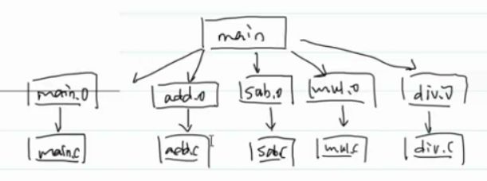
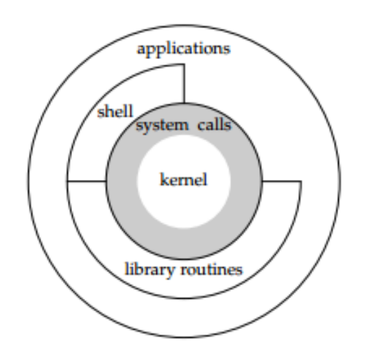

- # 一、make（原理：管理文件之间的依赖关系） #card
  collapsed:: true
	- make是一个工具：作用：实现增量编译
	  collapsed:: true
		- `Generate position-independent code (PIC)`
	- 执行makefile脚本，**实现增量编译**
	  collapsed:: true
		- 增量编译：修改了哪一个源文件，我就对那一个源文件进行进行重新编译。
	- 管理文件之间的依赖关系：.o依赖于.c文件，最后的可执行程序依赖于.o文件，所以make是管理文件之间的依赖关系。
	- 
	- `makefile`是由规则（rules）组成的。**即：规则的集合**
	  collapsed:: true
		- ```MAKEFILE
		  //规则：
		  target:dependcies//目标：依赖
		  	commands//命令
		  ```
		- 为什么当成规则？因为commands不是一定会执行的。只有符合某个规则才会执行
		- 什么情况下才会执行命令？
		  collapsed:: true
			- target文件不存在
			- 依赖文件比目标文件更新。
	- DAG(directed acyclic graph):有向无环图数据结构实现
	  collapsed:: true
		- 箭头可以实现依赖关系
		- 无环不会出现循环依赖
		- 
		- 拓扑排序---深度优先搜索实现
	- 如果make后面不加目标，默认执行第一个目标
	  collapsed:: true
		- 
	- ## 伪目标11：00
	  collapsed:: true
		- 伪目标意思是不会创建目标文件。若不加就会创建目标文件，再次make clean就不行了
		- 伪目标即：不管如何，目标下的命令都会执行。
		- 类比：画饼
		- 
		  collapsed:: true
			- PHONY：假的
		- 
		- {:height 262, :width 611}
		-
		-
- # 二、make进阶 #card
  collapsed:: true
	- ## 1.变量
		- 1.自定义变量
			- `变量名:=值`
				- makefile中所有的值都是字符串
			- 引用变量：`${变量名}`，`$^`
		- 2.预定义变量
			- 事先已经定好的值。
		- 3.自动变量
			- 自动会发生变化的变量，随规则的不同具有不同的值。
			- 可见讲义
	- ## 2.内置函数
		- `wildcard`：通配符
			- 可以从目录中查找出符合要求的文件名
			- `SRC:=${wildcard *.c}`
			- 可以加上
				- ```makefile
				  print:
				  	echo $(SRC)
				      //make print 进行查看变量
				  ```
		- `patsubst`
			- pat：pattern：正则表达式
			- subst：substitute替换
			- `OBJ:=$(patsubst %.c,%.o,$(SRC))`
				- SRC中的.c替换为.o
		- `%`：查找上面一个目标的依赖文件
	- **练习：**test1.c、test2.c、test3.c，把每一个.c文件编译成一个可执行程序
		-
- # 三、文件系统课程纲要
  collapsed:: true
	- 文件系统：
	  collapsed:: true
		- 目录
		- ^^**文件读取：unbuffered I/O**^^
		  collapsed:: true
			- 不缓冲的 I/O
		- ^^**文件重定向**^^
		- ^^**I/O 多路复用**^^
	- 进程：
	  collapsed:: true
		- ^^**CPU虚拟化**^^
		- ^^**内存虚拟化**^^
		- ^^进程控制原语^^
		- 进程之间的关系
		- 进程间的通信机制。==^^信号^^==
	- 线程：
	  collapsed:: true
		- 线程的概念
		- ==**线程控制**==（thread_create thread_join）
		- ==**锁**==
		- ==**条件变量**==
		- ==**死锁问题**==
	- 网络：星空老师
	- 项目
- # 四、Linux系统编程
  collapsed:: true
	- 
	- APP：最上面一层
	- 库函数：方便程序员编程、跨平台。
	  collapsed:: true
		- ISO C（文件流）
		- printf/scanf
	- 
	- 《Unix环境高级编程》
	- 系统编程就是APP进行系统调用
- # 五、如何学习系统编程
  collapsed:: true
	- man 查看2 3 7三个手册
	  collapsed:: true
		- NAME
		- SYNOPSIS
		  collapsed:: true
			- 包含的头文件
			- 返回值类型
			  collapsed:: true
				- int--->往往表示系统调用是否发生错误
				  collapsed:: true
					- 一般0表示成功，非0表示失败
				- 指针类型-->要注意指针指向的对象
				  collapsed:: true
					- 堆区：需要自己free
					- 静态区：不需要care
			- 指针类型的参数
			  collapsed:: true
				- const：传入参数--->指向常量
				- 无const：传入传出参数-->不能够指向常量
		- RETURN VALUE
		  collapsed:: true
			- 哪些情况下发生错误
			- 是否设置errno
		- DESCRIPTION
		  collapsed:: true
			- 不要从头到尾看，找自己要的部分
	- 《Unix环境高级编程》
- # 六、目录
  collapsed:: true
	- **int类型的返回值往往表示调用状态，即：调用成功与否**
	- **指针类型的返回值，需要注意是否需要自己free**
	-
	- ## 1.mkdir：
	  collapsed:: true
		- ```C
		  NAME
		         mkdir, mkdirat - create a directory
		  
		  SYNOPSIS
		         #include <sys/stat.h>
		         #include <sys/types.h>
		  
		         int mkdir(const char *pathname, mode_t mode);//pathname传入参数，
		         //在函数内不能修改指针变量指向的值，可以指向常量。传入传出参数。
		         //在函数内很可能改变指针指向的内容。指针不可以指向一个常量
		         //int类型的返回值往往表示调用状态，即：调用成功与否
		  		//mode：权限，八进制那个
		  
		         //指针类型的返回值
		         		//指针指向堆：自己free
		              //指针指向数据段：不需要care
		  
		         #include <fcntl.h>           /* Definition of AT_* constants */
		         #include <sys/stat.h>
		         
		  RETURN VALUE
		         mkdir()  and mkdirat() return zero on success, or -1 if an error
		         occurred (in which case, errno is set appropriately).
		         
		  DESCRIPTION//还不会就找这个
		  ```
		- 这个创建的目录也会受umask掩码的影响
		- ```C
		  #include<func.h>
		  
		  int main(int argc,char *argv[])
		  {       
		      // ./mkdir dir
		      ARGS_CHECK(argc,2);
		  
		      int retval = mkdir(argv[1], 0777);
		      
		      ERROR_CHECK(retval,-1,"mkdir");
		  
		          return 0;
		  }
		  ```
	- ## 2.rmdir：
	  collapsed:: true
		- ```C
		  NAME
		         rmdir - delete a directory
		  
		  SYNOPSIS
		         #include <unistd.h>//uni：unix；std：standard
		  
		         int rmdir(const char *pathname);
		  
		  DESCRIPTION
		         rmdir() deletes a directory, which must be empty.//只可以删除空目录
		         
		  RETURN VALUE
		         On success, zero is returned.  On error, -1 is returned, and er‐
		         rno is set appropriately.
		  ```
		- ```C
		    1 #include<func.h>
		    2 
		    3 int main(int argc,char* argv[])
		    4 {
		    5     ARGS_CHECK(argc,2);
		    6 
		    7     int retval = rmdir(argv[1]);
		    8     ERROR_CHECK(retval,-1,"rmdir");
		    9 
		   10     return 0;
		   11 }
		   12 
		  ```
	- ## 3.pwd:
	  collapsed:: true
		- ```C
		  NAME
		         getcwd, getwd, get_current_dir_name - get current working direc‐
		         tory
		  
		  SYNOPSIS
		         #include <unistd.h>
		  
		         char *getcwd(char *buf, size_t size);//存到buf指向的位置。
		         //即：返回的char*指向的就是buf
		         //size：buf的大小
		         //char *：小心要不要free
		  
		         char *getwd(char *buf);
		         
		  RETURN VALUE
		         On success, these functions return a pointer to  a  string  con‐
		         taining  the  pathname of the current working directory.  In the
		         case of getcwd() and getwd() this is the same value as buf.
		  
		         On failure, these functions return NULL, and errno is set to in‐
		         dicate  the  error.  The contents of the array pointed to by buf
		         are undefined on error.
		         
		  char *get_current_dir_name(void);//获得刚好差不多大的空间，而不是设太大或太小
		  
		  		get_current_dir_name() will malloc(3) an  array  big  enough  to
		         hold the absolute pathname of the current working directory.  If
		         the environment variable PWD is set, and its value  is  correct,
		         then that value will be returned.  The caller should free(3) the
		         returned buffer.
		  ```
		- **倘若参数buf为NULL，getcwd()会依参数size的大小自动配置内存(使用malloc())，如果参数size也为0，则getcwd()会依工作目录绝对路径的字符串程度来决定所配置的内存大小，进程可以在使用完此字符串后自动利用free()来释放此空间**。所以常用的形式：
		- `getcwd(NULL,0);`
		- //数组越界错误，就是数组太小了不够存:`getcwd: Numerical result out of range`
		- ```C
		  ubuntu@VM-16-2-ubuntu:~/My_Code/wangdao/LinuxDay06/dir$ ./getcwd 
		  getcwd: Numerical result out of range
		  
		    1 #include<func.h>
		    2 
		    3 int main(void)
		    4 {
		    5     char buf[1024];
		    6     char* pathname = getcwd(buf,SIZE(buf));
		    7     ERROR_CHECK(pathname,NULL,"getcwd");
		    8     puts(buf);
		    9     puts(pathname);
		   10 
		   11     printf("pathname:%p, buf:%p\n",pathname,buf);
		   12         return 0;
		   13 }
		  ```
	- ## 4.cd：
	  collapsed:: true
		- ```C
		  NAME
		         chdir, fchdir - change working directory
		  
		  SYNOPSIS
		         #include <unistd.h>
		  
		         int chdir(const char *path);
		         
		  RETURN VALUE
		         On success, zero is returned.  On error, -1 is returned, and er-
		         rno is set appropriately.
		  ```
		- collapsed:: true
		  ```C
		    1 #include<func.h>
		    2 
		    3 int main(int argc,char* argv[])
		    4 {
		    5     // ./chdir path
		    6     ARGS_CHECK(argc,2);
		    7 
		    8     //打印当前目录
		    9     char buf[1024];
		   10     puts(getcwd(buf,SIZE(buf)));
		   11 
		   12     int retval = chdir(argv[1]);
		   13     ERROR_CHECK(retval,-1,"chdir");
		   14     puts(getcwd(buf,SIZE(buf)));
		   15 
		   16         return 0;
		   17 }
		  
		  chdir() changes the current working directory of the calling process to 
		  the directory specified in path.
		  
		  ubuntu@VM-16-2-ubuntu:~/My_Code/wangdao/LinuxDay06/dir$ ./chdir ~
		  /home/ubuntu/My_Code/wangdao/LinuxDay06/dir
		  /home/ubuntu
		  //当前目录没变,why?
		  ubuntu@VM-16-2-ubuntu:~/My_Code/wangdao/LinuxDay06/dir$ cd ~
		  ubuntu@VM-16-2-ubuntu:~$ 
		  
		  ```
			- **进程之间是隔离的**。
			- 当前工作目录是进程的一个属性，每个进程都有自己的当前工作目录。
			  collapsed:: true
				- 当前显示的`ubuntu@VM-16-2-ubuntu:~/My_Code/wangdao/LinuxDay06/dir$`是shell这个进程的当前工作目录。所以chdir这个进程是改变不了他的目录的，只能改变他自己的。而cd并不是一个程序。他是一个内置命令`which cd`都找不到，所以可以改变。
				- ```C
				  ubuntu@VM-16-2-ubuntu:~/My_Code/wangdao/LinuxDay06/dir$ which cd
				  ubuntu@VM-16-2-ubuntu:~/My_Code/wangdao/LinuxDay06/dir$ which ls
				  /usr/bin/ls
				  ```
	- ## 5.目录流
	  collapsed:: true
		- 文件流：流动的数据是字节或者是字符（二进制文件和字符文件）
		- 目录流：流动的数据是目录项
		- | 文件流 | 目录流        |
		  | ------ | ------------- |
		  | fopen  | opendir       |
		  | fclose | closedir      |
		  | fread  | readdir       |
		  | fwrite | (×)不能直接写（要创建和删除文件才能写呀） |
		  | fseek  | seekdir       |
		  | ftell  | telldir       |
		  | rewind | rewinddir     |
		- opdir：
		  collapsed:: true
			- ```C
			  NAME
			         opendir, fdopendir - open a directory
			  
			  SYNOPSIS
			         #include <sys/types.h>
			         #include <dirent.h>
			  
			         DIR *opendir(const char *name);//类比FILE*
			  
			  RETURN VALUE
			         The  opendir() and fdopendir() functions return a pointer to the
			         directory stream.  On error, NULL is returned, and errno is  set
			         appropriately.
			  ```
		- closedir：
		  collapsed:: true
			- ```C
			  NAME
			         closedir - close a directory
			  
			  SYNOPSIS
			         #include <sys/types.h>
			  
			         #include <dirent.h>
			  
			         int closedir(DIR *dirp);
			  
			  RETURN VALUE
			         The closedir() function returns 0 on success.  On error,  -1  is
			         returned, and errno is set appropriately.
			  ```
		- readdir：16：45（√）
		  collapsed:: true
			- ```C
			  NAME
			         readdir - read a directory
			  SYNOPSIS
			         #include <dirent.h>
			  
			         struct dirent *readdir(DIR *dirp);
			  //struct dirent：目录项
			  //DIR：目录流。目录流里流动的就是目录项
			  //DIR称为目录流，类似于标准输入输出，每次使用readdir以后，它会将位置移动到下一个文件
			  
			  struct dirent {
			                 ino_t          d_ino;       /* Inode number */
			                 off_t          d_off;       /* Not an offset; see below */
			  //16：45（√）到下一个目录项的偏移量
			    			   unsigned short d_reclen;    /* Length of this record */
			    //这个结构体的大小。
			                 unsigned char  d_type;      /* Type of file; not supported
			                                                by all filesystem types */
			    //文件类型
			                 char           d_name[256]; /* Null-terminated filename */
			   //他只是名字，不是路径！名字有长有短，所以Linux会根据名字的长度决定这个数组
			    //的大小
			    //一个变长数组，根据filename长度而变
			    //dirent当中采用了类似于变长数组的形式来存放文件名，但是会提供一些冗余的空间，这样当调整
			  //文件名的时候，如果新文件名的长度不超过原来分配的空间，则不需要调整分配的空间
			  
			             };
			  
			  RETURN VALUE
			         On success, readdir() returns a pointer to a  dirent  structure.
			         (This  structure  may be statically allocated; do not attempt to
			         free(3) it.)
			    //成功返回一个不用free的指向目录项的指针
			  
			         If the end of the directory stream is reached, NULL is  returned
			         and  errno is not changed.  If an error occurs, NULL is returned
			         and errno is set appropriately.  To distinguish  end  of  stream
			         and  from  an  error, set errno to zero before calling readdir()
			         and then check the value of errno if NULL is returned.
			           //不需要自己free
			  ```
			- **目录项相当于一个链式结构，d_off相当于next指针。它是到下一个目录项的偏移量**
			- **readdir读到末尾会返回NULL。出错也会返回NULL，但是会设置errno。所以要区分它们需要设置errno，然后检查errno**
			- ls：
			  collapsed:: true
				- ```C
				  #include<func.h>
				  
				  int main(int argc,char* argv[])
				  {       
				      ARGS_CHECK(argc,2);
				      //打开目录
				      DIR *pdir = opendir(argv[1]);
				      ERROR_CHECK(pdir,NULL,"opendir");
				  
				      //读目录项
				      struct dirent* pdirent;
				  
				      //设置errno判断是否出错
				      errno = 0;
				  
				      while(pdirent = readdir(pdir))
				      {
				          //忽略隐藏文件
				          //如果之忽略"."和".."，则要用字符串比较strcmp(pdirent->d_name,".")==0
				          if(pdirent->d_name[0]=='.')
				          {
				              continue;
				          }
				          printf("%s ",pdirent->d_name);
				      }
				      printf("\n");
				  
				      //检查是否出错
				      if(errno != 0)
				      {
				          printf("error in readdir!\n");
				          exit(1);
				      }
				  
				      //关闭目录:不要忘记是closedir！
				      closedir(pdir);
				  
				      return 0;
				  }
				  
				  
				  ```
				- 
				- 
			- ls -l：见下
			  collapsed:: true
				-
	-
- # 七、实现ls -l
  collapsed:: true
	- stat：获取文件元数据
	  collapsed:: true
		- ```c
		  NAME
		         stat, fstat, lstat, fstatat - get file status
		  SYNOPSIS
		         #include <sys/types.h>
		         #include <sys/stat.h>
		         #include <unistd.h>
		  
		         int stat(const char *pathname, struct stat *statbuf);
		  //statbuf：传入传出参数
		  RETURN VALUE
		         On success, zero is returned.  On error, -1 is returned, and er‐
		         rno is set appropriately.
		  
		  struct stat {
		                 dev_t     st_dev;         /* ID of device containing file 
		  */17：28
		                 ino_t     st_ino;         /* Inode number */
		                 mode_t    st_mode;        /* File type and mode */
		                 nlink_t   st_nlink;       /* Number of hard links */
		                 uid_t     st_uid;         /* User ID of owner */
		                 gid_t     st_gid;         /* Group ID of owner */
		                 dev_t     st_rdev;        /* Device ID (if special file) */
		                 off_t     st_size;        /* Total size, in bytes */
		                 blksize_t st_blksize;     /* Block size for filesystem I/O
		   */
		                 blkcnt_t  st_blocks;      /* Number of 512B blocks allocat
		  ed */
		  				  /* Since Linux 2.6, the kernel supports nanosecond
		                    precision for the following timestamp fields.
		                    For the details before Linux 2.6, see NOTES. */
		  
		                 struct timespec st_atim;  /* Time of last access */
		                 struct timespec st_mtim;  /* Time of last modification */
		                 struct timespec st_ctim;  /* Time of last status change */
		  
		             #define st_atime st_atim.tv_sec      /* Backward compatibility */
		             #define st_mtime st_mtim.tv_sec
		             #define st_ctime st_ctim.tv_sec
		             };
		  
		  ubuntu@VM-16-2-ubuntu:~$ stat My_Code/
		    File: My_Code/
		    Size: 4096      	Blocks: 8          IO Block: 4096   directory
		  Device: fc02h/64514d	Inode: 654909      Links: 5
		  Access: (0775/drwxrwxr-x)  Uid: ( 1000/  ubuntu)   Gid: ( 1000/  ubuntu)
		  Access: 2022-06-26 18:30:15.823809813 +0800
		  Modify: 2022-06-26 18:28:11.233260216 +0800
		  Change: 2022-06-26 18:28:11.233260216 +0800
		   Birth: -
		  ```
		- getpwuid：
		  collapsed:: true
			- ```C
			  struct passwd *getpwuid(uid_t uid);
			  getpw：
			  	getpw - reconstruct password line entry
			  struct passwd {
			                 char   *pw_name;       /* username */
			                 char   *pw_passwd;     /* user password */
			                 uid_t   pw_uid;        /* user ID */
			                 gid_t   pw_gid;        /* group ID */
			                 char   *pw_gecos;      /* user information */
			                 char   *pw_dir;        /* home directory */
			                 char   *pw_shell;      /* shell program */
			             };
			  
			  getgrgid：
			  struct group *getgrgid(gid_t gid);
			  struct group {
			                 char   *gr_name;        /* group name */
			                 char   *gr_passwd;      /* group password */
			                 gid_t   gr_gid;         /* group ID */
			                 char  **gr_mem;         /* NULL-terminated array of pointers
			                                            to names of group members */
			             };
			  ```
			- 
			- man getgrgid、char \*ctime(const time_t \*timep);、struct tm \*localtime(const time_t \*timep);
			  collapsed:: true
				- ```C
				  struct tm {
				                 int tm_sec;    /* Seconds (0-60) */
				                 int tm_min;    /* Minutes (0-59) */
				                 int tm_hour;   /* Hours (0-23) */
				                 int tm_mday;   /* Day of the month (1-31) */
				                 int tm_mon;    /* Month (0-11) */
				                 int tm_year;   /* Year - 1900 */
				                 int tm_wday;   /* Day of the week (0-6, Sunday = 0) */
				                 int tm_yday;   /* Day in the year (0-365, 1 Jan = 0) */
				                 int tm_isdst;  /* Daylight saving time */
				             };
				  ```