- # 一、实现ls-l #card
  card-last-interval:: 4
  card-repeats:: 1
  card-ease-factor:: 2.6
  card-next-schedule:: 2022-07-11T04:54:41.906Z
  card-last-reviewed:: 2022-07-07T04:54:41.908Z
  card-last-score:: 5
  collapsed:: true
	- **记住设置errno，我每次都忘记设置了**
	- **最后的打印格式控制，我也忘记了**
	- [[CDay02#^ea8a53|printf格式化输出]]
	- ((62bc0330-e9ee-4247-8be6-8b1605fe65ba))
	- ```C
	  #include <func.h>
	  
	  int main(int argc, char* argv[])
	  {
	      // ./ll dir 
	      ARGS_CHECK(argc, 2);
	      // 打开目录
	      DIR *pdir = opendir(argv[1]);
	      ERROR_CHECK(pdir, NULL, "opendir");
	  
	      // 读目录项
	      struct dirent* pdirent;
	      struct stat statbuf;
	      errno = 0;
	      while((pdirent = readdir(pdir)) != NULL) {
	          char *name = pdirent->d_name;
	          char pathname[1024];
	          sprintf(pathname, "%s/%s", argv[1], name);
	          // 显示详细信息
	  
	          int retval = stat(pathname, &statbuf);
	          ERROR_CHECK(retval, -1, "stat");
	          
	          // 打印类型
	          switch (statbuf.st_mode & S_IFMT) {
	          case S_IFREG:   printf("-");    break;
	          case S_IFDIR:   printf("d");    break;
	          case S_IFBLK:   printf("b");    break;
	          case S_IFCHR:   printf("c");    break;
	          case S_IFIFO:   printf("p");    break;
	          case S_IFLNK:   printf("l");    break;
	          case S_IFSOCK:  printf("s");    break;
	          default:        printf("?");    break;
	          }
	          // 打印权限
	          for(int i = 0; i < 3; i++) {
	              int m = (statbuf.st_mode >> 3 * (2 - i)) & 0x7;
	              switch(m) {
	              case 0:     printf("---");  break;
	              case 1:     printf("--x");  break;
	              case 2:     printf("-w-");  break;
	              case 3:     printf("-wx");  break;
	              case 4:     printf("r--");  break;
	              case 5:     printf("r-x");  break;
	              case 6:     printf("rw-");  break;
	              case 7:     printf("rwx");  break;
	              }
	          }
	  
	          struct passwd *pwd = getpwuid(statbuf.st_uid);
	          ERROR_CHECK(pwd, NULL, "getpwuid");
	          struct group *grp = getgrgid(statbuf.st_gid);
	          ERROR_CHECK(grp, NULL, "getgrgid");
	  
	          printf(" %3ld %s %s %8ld ", 
	                 statbuf.st_nlink,
	                 pwd->pw_name,
	                 grp->gr_name,
	                 statbuf.st_size);
	          // 处理时间
	         struct tm* ptime = localtime(&statbuf.st_atime);
	         ERROR_CHECK(ptime, NULL, "localtime");
	         printf("%d/%.2d/%.2d %.2d:%.2d:%.2d ",
	                ptime->tm_year + 1900,
	                ptime->tm_mon + 1,
	                ptime->tm_mday,
	                ptime->tm_hour,
	                ptime->tm_min,
	                ptime->tm_sec);
	         // 打印文件名
	         puts(name);
	      }
	      // 错误处理
	      if (errno != 0) {
	          perror("readdir");
	          exit(1);
	      }
	      // 关闭目录流
	      closedir(pdir);
	      return 0;
	  }
	  ```
	- 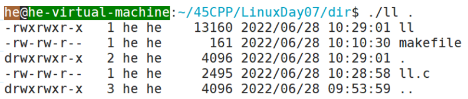
- # 二、实现类似tree #card
  card-last-interval:: 4
  card-repeats:: 1
  card-ease-factor:: 2.36
  card-next-schedule:: 2022-07-13T01:14:50.659Z
  card-last-reviewed:: 2022-07-09T01:14:50.661Z
  card-last-score:: 3
  collapsed:: true
	- `man readdir`
		- ```c
		   			  DT_BLK      This is a block device.
		  
		                DT_CHR      This is a character device.
		  
		                DT_DIR      This is a directory.
		  
		                DT_FIFO     This is a named pipe (FIFO).
		  
		                DT_LNK      This is a symbolic link.
		  
		                DT_REG      This is a regular file.
		  
		                DT_SOCK     This is a UNIX domain socket.
		  
		                DT_UNKNOWN  The file type could not be determined.
		  ```
	- ```C
	  // 这里写a的代码
	    1 #include<func.h>
	    2 
	    3 int directories = 0,file = 0;
	    4 
	    5 void dfs_tree(char* pathname,int width);
	    6 
	    7 int main(int argc,char* argv[])
	    8 {
	    9     if(argc!=2)
	   10     {
	   11         printf("error in argc!\n");
	   12         exit(1);
	   13     }
	   14     printf("%s\n",getcwd(NULL,0));
	   15     dfs_tree(argv[1],4);
	   16     printf("%d directories  %d file",directories,file);
	   17     return 0;
	   18 }
	   19 
	   20 void dfs_tree(char* pathname,int width)
	   21 {
	   22    DIR* dir = opendir(pathname);
	   23    if(dir == NULL)
	   24    {
	   25         printf("error in opendir!\n");
	   26         exit(1);
	   27    }
	   28    struct dirent* pdirent;
	   29    while(pdirent=readdir(dir))
	   30    {
	   31        if(pdirent->d_name[0]=='.')continue;
	   33        for(int i = 0;i<width-1;i++)
	   34        {
	   35            printf(" ");
	   36        }
	   38 
	   39        printf("%s\n",pdirent->d_name);
	   40        if(pdirent->d_type==DT_DIR)
	   41        {
	   42            directories++;
	   43            char name[1024];
	   44            sprintf(name,"%s/%s",pathname,pdirent->d_name);
	   45            dfs_tree(name,width+4);
	   46        }
	   47        else{
	   48            file++;
	   49        }
	   50 
	   51    }
	   52 }
	  ```
- # 三、chmod #card
  collapsed:: true
	- 改变文件和文件夹的权限
	- ```C
	  NAME
	         chmod, fchmod, fchmodat - change permissions of a file
	  
	  SYNOPSIS
	         #include <sys/stat.h>
	  
	         int chmod(const char *pathname, mode_t mode);
	  //mode_t是一个整数
	  
	  RETURN VALUE
	         On success, zero is returned.  On error, -1 is returned, and er‐
	         rno is set appropriately.
	  ```
	- ==**linux里面如何查看一个数据的类型？**==
		- 先创建一个.c包含头文件，然后预处理
		- 对预处理后的文件，用grep查找需要查看的类型名从而找到定义。
		- 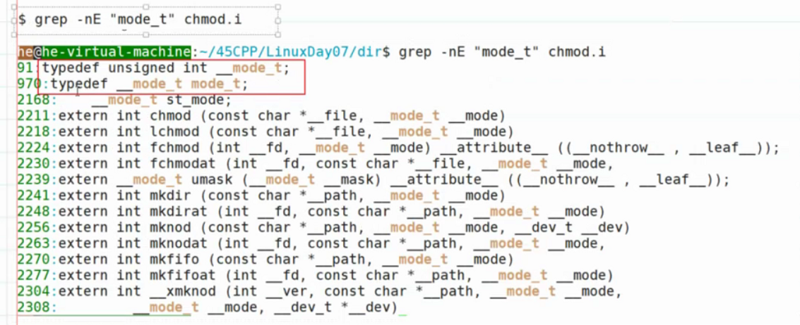{:height 259, :width 615}
	- 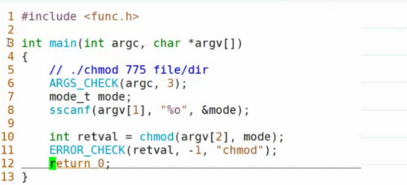
	- ```C
	    1 #include<stdio.h>
	    2 #include<sys/stat.h>
	    3 #include<stdlib.h>
	    4 
	    5 int main(int argc,char* argv[])
	    6 {
	    7     if(argc != 3)
	    8     {
	    9         printf("error in argc!\n");
	   10         exit(1);
	   11     }
	   12     mode_t mode;
	   13 
	   14     sscanf(argv[2],"%o",&mode);
	   15     int retval = chmod(argv[1],mode);
	   16     if(retval==-1)
	   17     {
	   18         printf("chmod error!\n");
	   19         exit(1);
	   20     }
	   21         return 0;
	   22 }
	  ```
	- **sscanf的用法和scanf的用法差不多的，只是源不一样而已！**
		- s所以里面的sscanf(argv[1],"%o",&mode)。就是从argv[1]以八进制方式读入数据到mode！
		- 看我们从stdin输入的也是char*，但是scanf会当作int型处理，因为ASCⅡ也是int型。
	-
- # ==四、CPU虚拟化== #card
  collapsed:: true
	- ## 共享资源
		- 时分共享（CPU）
		- 空分共享（内存）
	- 通过让一个进程运行一段时间，然后切换到其他进程。实现CPU虚拟化
	- 代价：
		- （上下文切换）：性能损失
	- 如何实现CPU的十分共享
		- 底层机制--->如何进行上下文切换
		- 上层策略--->调度策略（停止那个进程，调度那个进程。）（今天不讲）
	-
	- 抽象：进程
		- CPU：寄存器的状态（PC、SP、BP...） ，**寄存器的状态就是上下文**
		- 可以读写的内存：地址空间
		- 持久性的存储设备：打开的文件列表
		- （这些东西要记录下来）
	- 进程状态
		- 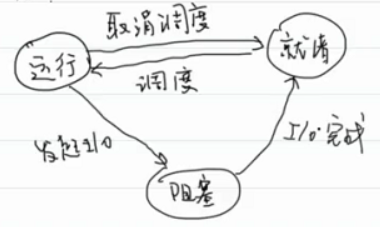
	- xv6教学OS进程结构体：
	- 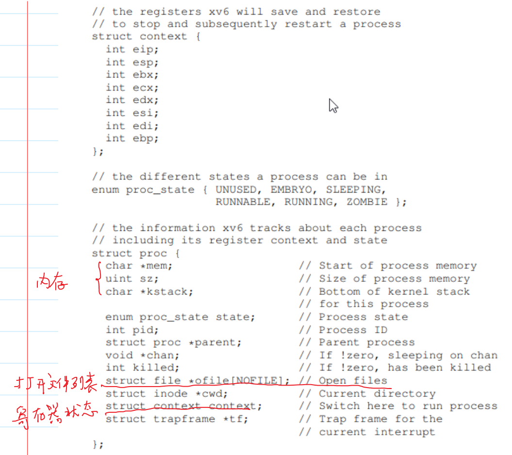
	- context：上下文
	- ## 底层机制
		- 机制好坏评价标准：
			- 性能：不应该增加太多的系统开销
			- 控制权：控制权要在OS，不能给程序太多的权限
		-
		- ### V1:直接运行协议
			- 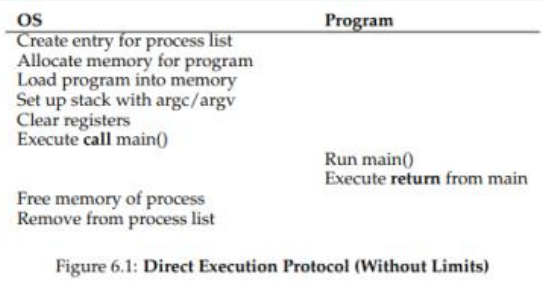
			- 进程列表添加一个条目，申请内存空间，把程序加载到内存中
			-
			- 好处：快
			- 坏处：
				- 控制权在程序手里（程序运行的时候，没办法控制程序）
				- 不安全（程序权限太大了）
			- 如何限制应用程序的权限（不能访问非法的内存和执行特权指令）
				- 需要硬件的帮忙（因为CPU只有一个，别的下去了，现在就只有他在上面运行，其他软件是无法终止他的）
					- CPU模式：（引入CPU模式进行限制）（指CPU处于那个状态）
						- 用户态：运行的就是应用程序（不能够访问非法的内存空间，不能执行特权指令）
						- 内核态：运行的就是操作系统（可以访问机器的所有资源）
					- 问题：那么在这个模式下应用程序如何执行特权操作？
						- 系统调用
						- 
					- 程序员不能够指定系统调用的位置，OS怎么知道进入内核调用哪里呢？
						- OS在启动时，会初始化设置陷阱表记录系统调用函数的位置--->表明系统调用这些函数所在的位置
		- ### V2：受限的直接运行协议
			- 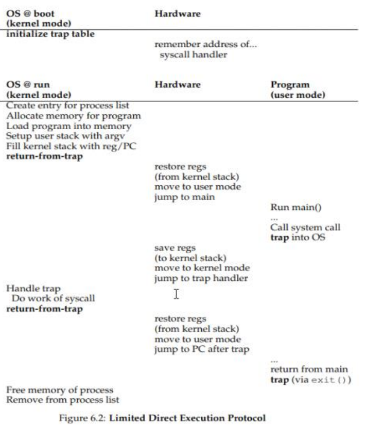
			- 为了效率，OS启动时硬件会直接记住系统调用函数的地址，这样不需要寻址，直接就可以去对应地址调用。
			- 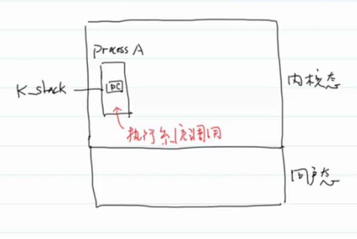
			- 陷阱表可以理解为一个数组，其内存放指针，指向每一个系统调用函数
			- 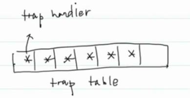
			- trap handler就是系统调用。
			- 进入内核态，会使用内核栈执行程序。里面存PC寄存器的值、系统调用函数的栈帧
			- trap时，硬件会保存PC寄存器的值。因为硬件保存了系统调用的地址。所以可以直接跳转到trap handler系统调用函数的位置。
			- 14：57（√）
			- 问题：现在能够限制应用程序的一些权限，但是控制权仍然在程序手里，因为什么时候切回OS，全由程序说了算，即：如何实现进程间的切换？（这个协议如果应用不主动系统调用，就永远不会回到OS代码）
				- 协作方式：等待系统调用（system call），（yield礼让）。就是这个V2协议
				- 非协作方式：操作系统进行控制（需要硬件的帮忙）
					- 时钟中断（时钟设备可以每隔几毫秒产生一次硬件时钟中断）
						- 中断表会记录中断处理函数的位置
						- 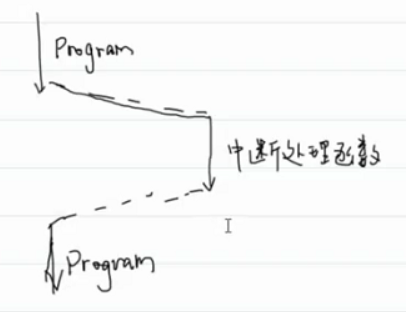
		- V3：带时钟中断的受限直接运行协议
			- 现在用的就是这个协议
			- timer handler：15：17（√）时钟中断处理函数。
			- 每隔Xms发出一个时钟中断。
			- 硬件保存PC寄存器的值，OS保存其他寄存器的值，比如保存到上面的xv6学习OS里的context结构
			- 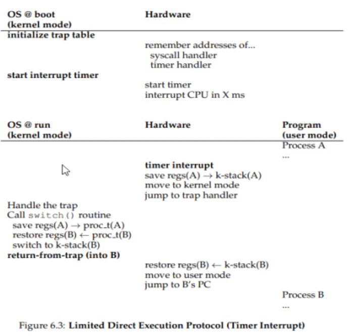
			- 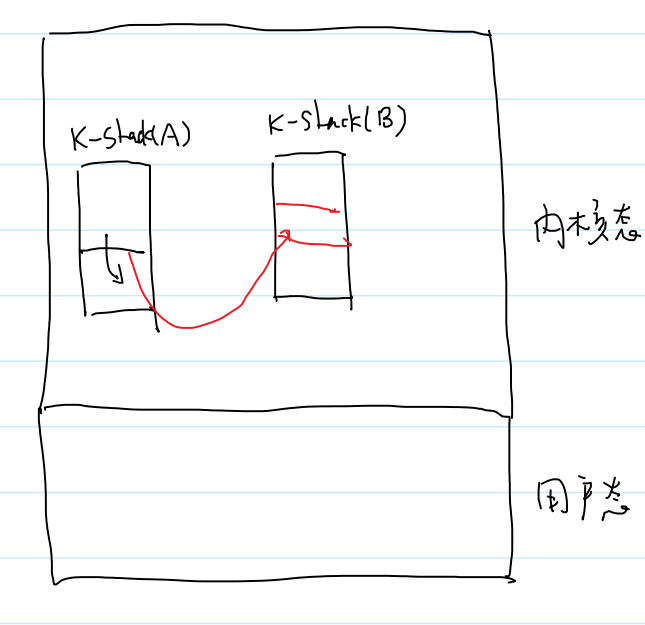
		- switch那段是因为有时候OS不切换进程，可以直接返回，下次再处理。
	-
- # ==五、Unbuffered I/O== #card
  card-last-interval:: 4
  card-repeats:: 1
  card-ease-factor:: 2.36
  card-next-schedule:: 2022-07-11T23:48:16.452Z
  card-last-reviewed:: 2022-07-07T23:48:16.454Z
  card-last-score:: 3
  collapsed:: true
	- 文件流--->ISO C标准（库函数）一个跨平台的标准
	- file结构体：文件对象。由OS管理
	- 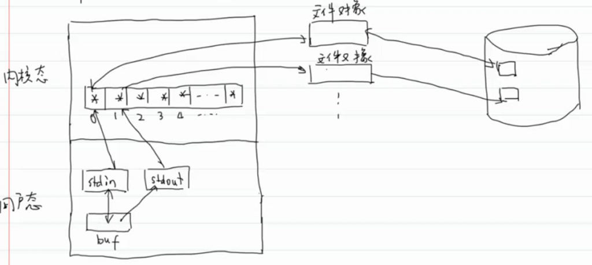
	- 文件流拷贝两次15：58（√）
	- `buf`在栈区，因为它是进程运行时创建的，在栈帧里面。
	- 这里的`STDIN`和`STDOUT`就是读写缓冲区的意思。因为读写是需要进行系统调用的，所以设置缓冲区，可以降低频繁的系统调用所带来的效率问题
	- 用户态缓冲区OS启动进程时自动创建，结束进程时，自动释放
	- **不带缓冲的I/O：没有用户态缓冲区** ^e05ee2
		- 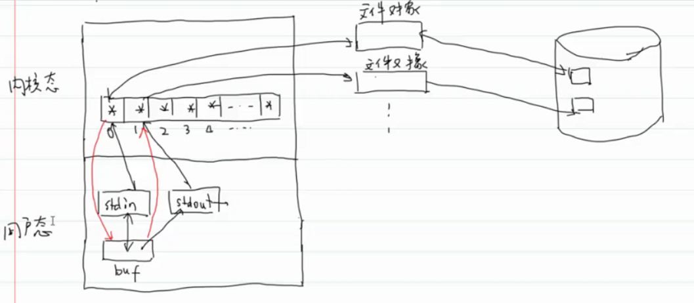{:height 277, :width 615}
		- **文件流的读写**：是通过流找到对应的文件描述符，然后通过文件描述符的指针找到对应的文件对象，然后开始操作。
			- 写：将缓冲区内容写入文件对象
			- 读：先从文件对象读入OS设置的缓冲区，然后读入buf
			- `fread(stream)`
				- `fileno`
					- `文件对象`
		- 缓冲区的大小一般4k，一页的大小，由OS设置。
	- **文件描述符**：打开文件列表的下标
	  id:: 62bac140-d6c4-4776-b6a3-a24a8e7107a0
		- 改变内核态打开文件表指针指向就可以重定向
	- OPEN：
		- ```c
		  NAME
		         open, openat, creat - open and possibly create a file
		  
		  SYNOPSIS
		         #include <sys/types.h>
		         #include <sys/stat.h>
		         #include <fcntl.h>//file control
		  
		         int open(const char *pathname, int flags);
		         int open(const char *pathname, int flags, mode_t mode);
		  //flags一个标志（位图的方式）
		  //O_CREAT要加mode
		  //mode：创建文件时，文件应该包含哪些权限
		  
		  RETURN VALUE
		         open(), openat(), and creat() return the new file descriptor, or
		         -1  if  an error occurred (in which case, errno is set appropri‐
		         ately).
		           
		  	   The  file descriptor returned by a successful call
		         will be the lowest-numbered file descriptor not  currently  open
		         for the process.//返回的是最小可用的文件描述符
		  ```
			- `O_EXCL`：exclusive
			- 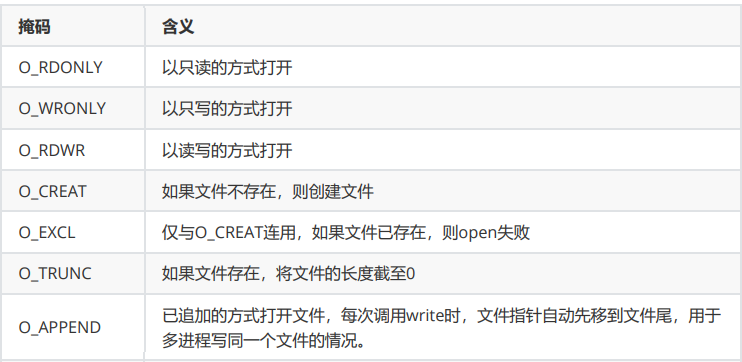
			- 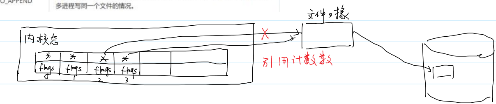
			- 这里和xv6不一样是因为这是Linux系统的表，不是xv6的了。
			- flags在open的时候设置。
			- flags是一个打开方式，而文件对象哪里验证的是对文件的操作权限。
			- 当我们在读写文件的时候，首先会通过文件描述符找到并查看flags。看是否有权限（如用读的模式打开，就不能写；写的模式打开就不能读；追加模式就只能在末尾写）。有权限之后根据指针找到关联的文件对象，然后在文件对象中查看用户是否有对这个文件进行读写之类的权限。
			- **一共有两次验证**
			- 验证：a.txt有读写权限，以只读打开。write会报错
				- flags验证的是打开模式，进入文件对象验证的是文件的读写权限。比如用追加模式打开，就需要在文件的末尾写。所以需要一个打开模式flags。
				- ```C
				    1 #include<func.h>
				    2 
				    3 int main()
				    4 {
				    5     int fd = open("./a.txt",O_RDONLY);
				    6     if(fd == -1)
				    7     {
				    8         printf("error in open\n");
				    9         exit(1);
				   10     }
				   11     char buf[]="test";
				   12     int retval = write(fd,buf,sizeof(buf)/sizeof(buf[0]));
				   13     if(retval == -1)
				   14     {
				   15         printf("error in write\n");
				   16         exit(1);
				   17     }
				   18     return 0;
				   19 }
				  ```
			- 见讲义
				- w打开底层的系统调用就有O_TRUNC清空文件
				- a打开就有O_APPEND
				- 16：13（√）
				- close断掉的是打开文件表的指针，而不是干掉文件对象，类似硬链接，也是用的引用计数法。
				- **O_CREAT要加mode**
	- CLOSE：
		- ```C
		  NAME
		         close - close a file descriptor
		  
		  SYNOPSIS
		         #include <unistd.h>
		  
		         int close(int fd);
		  
		  RETURN VALUE
		         close()  returns zero on success.  On error, -1 is returned, and
		         errno is set appropriately.
		  ```
	- 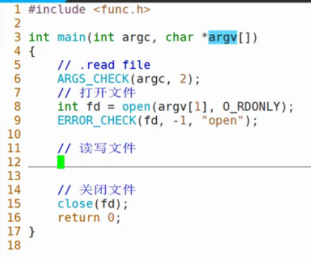
	- READ：
		- ```c
		  NAME
		         read - read from a file descriptor
		  
		  SYNOPSIS
		         #include <unistd.h>
		         
		         ssize_t read(int fd, void *buf, size_t count);
		  
		  RETURN VALUE
		         On success, the number of bytes read is returned (zero indicates
		         end  of file), and the file position is advanced by this number.
		    //指针自动后移
		         It is not an error if this number is smaller than the number  of
		         bytes requested; this may happen for example because fewer bytes
		         are actually available right now (maybe because we were close to
		         end-of-file,  or  because  we are reading from a pipe, or from a
		         terminal), or because read() was interrupted by a  signal.   See
		         also NOTES.
		  
		         On  error,  -1  is returned, and errno is set appropriately.  In
		         this case, it is left unspecified whether the file position  (if
		         any) changes.
		  ```
	- Write：
		- ```c
		  NAME
		         write - write to a file descriptor
		  
		  SYNOPSIS
		         #include <unistd.h>
		  
		         ssize_t write(int fd, const void *buf, size_t count);
		  
		  RETURN VALUE
		         On success, the number of bytes written is returned.  On  error,
		         -1  is  returned,  and errno is set to indicate the cause of the
		         error.
		  
		         Note that a successful write() may  transfer  fewer  than  count
		         bytes.   Such  partial writes can occur for various reasons; for
		         example, because there was insufficient space on the disk device
		         to  write  all  of  the  requested  bytes,  or because a blocked
		         write() to a socket, pipe, or similar was interrupted by a  sig‐
		         nal  handler  after  it  had transferred some, but before it had
		         transferred all of the requested bytes.  In the event of a  par‐
		         tial write, the caller can make another write() call to transfer
		         the remaining bytes.  The subsequent call will  either  transfer
		         further  bytes  or  may result in an error (e.g., if the disk is
		         now full).
		  
		         If count is zero and fd refers to a regular file,  then  write()
		         may  return  a  failure status if one of the errors below is de‐
		         tected.  If no errors are detected, or error  detection  is  not
		         performed,  0 will be returned without causing any other effect.
		         If count is zero and fd refers to a file other  than  a  regular
		         file, the results are not specified.
		  ```
	- lseek: l :表示返回值为long
		- ```C
		  NAME
		         lseek - reposition read/write file offset
		  
		  SYNOPSIS
		         #include <sys/types.h>
		         #include <unistd.h>
		  
		         off_t lseek(int fd, off_t offset, int whence);
		  
		  RETURN VALUE
		         Upon successful completion, lseek() returns the resulting offset
		         location as measured in bytes from the beginning  of  the  file.
		         On  error,  the value (off_t) -1 is returned and errno is set to
		         indicate the error.
		  ```
		- whence在末尾，offset为正，则会扩大文件的范围
	- ftell可以用lseek实现，因为lseek返回当前的off_t。所以可以设为lseek(fd, 0, int SEKK_CUR)
- # 六、文件流的底层用到了Unbuffered I/O #card
  collapsed:: true
	- gcc 预处理然后找FILE的定义
	- 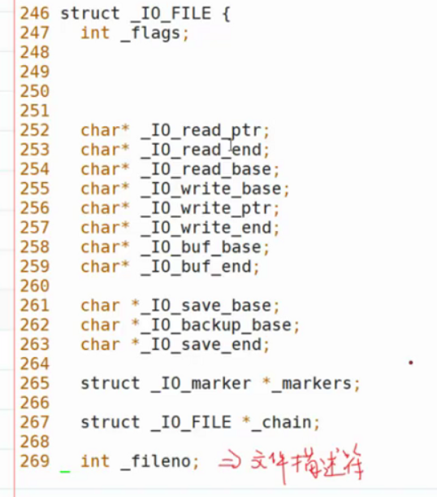
	- 查看 man fopen 手册可以找到：
	- ```C
	  The file descriptor associated with the stream is opened  as  if
	         by a call to open(2) with the following flags:
	  
	                ┌─────────────┬───────────────────────────────┐
	                │fopen() mode │ open() flags                  │
	                ├─────────────┼───────────────────────────────┤
	                │     r       │ O_RDONLY                      │
	                ├─────────────┼───────────────────────────────┤
	                │     w       │ O_WRONLY | O_CREAT | O_TRUNC  │
	                ├─────────────┼───────────────────────────────┤
	                │     a       │ O_WRONLY | O_CREAT | O_APPEND │
	                ├─────────────┼───────────────────────────────┤
	                │     r+      │ O_RDWR                        │
	                ├─────────────┼───────────────────────────────┤
	                │     w+      │ O_RDWR | O_CREAT | O_TRUNC    │
	                ├─────────────┼───────────────────────────────┤
	                │     a+      │ O_RDWR | O_CREAT | O_APPEND   │
	                └─────────────┴───────────────────────────────┘
	  
	  ```
	-
- # 七、文件流和Unbuffered I/O的效率比较 #card
  collapsed:: true
	- 文件流底层调用了unbuffered IO的接口
	- 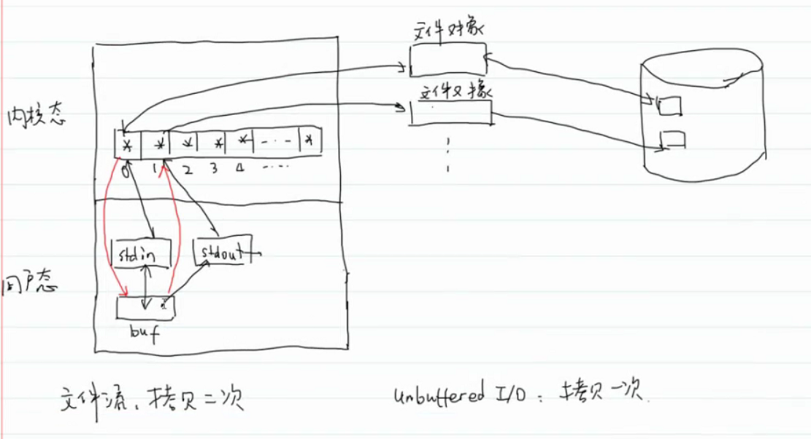
	- 文件对象到磁盘不算拷贝，是正常的文件IO，从磁盘读到内存，从内存写到磁盘
		- 文件流：从文件对象到std一次，从std到buf又一次，共两次
	- Unbuffered IO：复制的数据少
		- **每次只读写少量的数据，频繁的读写**（每次读写都需要进入内存，那么就会有频繁的上下文切换，效率降低，而文件流可以在用户区有缓冲区，效率反而会更高）
	- 文件流：复制两次，复制数据多
		- 缓冲区：满、行、无缓冲区
- # 八、ftruncate #card
  collapsed:: true
	- 将文件截断到指定的长度
	- ```C
	  NAME
	         truncate, ftruncate - truncate a file to a specified length
	  
	  SYNOPSIS
	         #include <unistd.h>
	         #include <sys/types.h>
	  
	         int truncate(const char *path, off_t length);
	         int ftruncate(int fd, off_t length);
	  
	  RETURN VALUE
	         On success, zero is returned.  On error, -1 is returned, and er‐
	         rno is set appropriately.
	  ```
	- 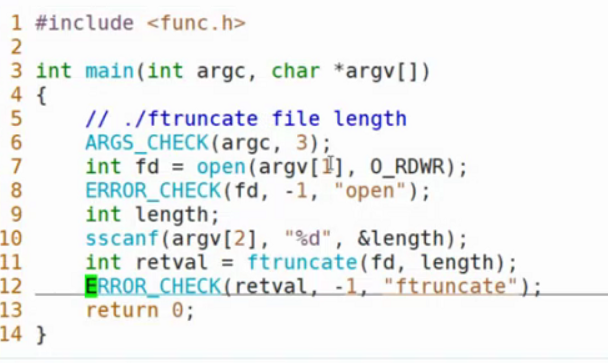
	- 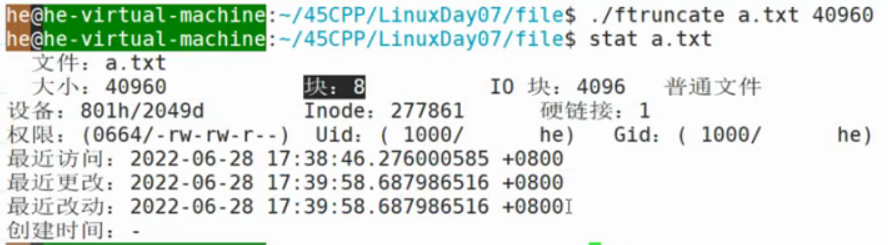
	- ftruncate扩充文件时，会填充空字符，并且可能会出现文件空洞现象
	- 
	-
- # 九、mmap #card
  card-last-interval:: 4
  card-repeats:: 1
  card-ease-factor:: 2.36
  card-next-schedule:: 2022-07-13T01:23:26.039Z
  card-last-reviewed:: 2022-07-09T01:23:26.039Z
  card-last-score:: 3
  collapsed:: true
	- 第一个m：memory
	- map：映射
	- 直接内存映射
	- 零拷贝技术（一次拷贝都没有）
	-
	- ```C
	  NAME
	         mmap, munmap - map or unmap files or devices into memory
	  
	  SYNOPSIS
	         #include <sys/mman.h>
	  
	         void *mmap(void *addr, size_t length, int prot, int flags,
	                    int fd, off_t offset);
	         int munmap(void *addr, size_t length);
	  ```
	- **创建程序的时候，会自动创建0、1、2三个标准缓冲区**
	- 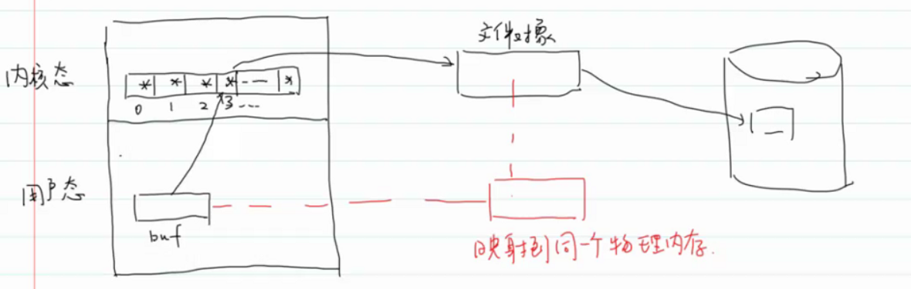
	- 
	- 将虚拟内存地址映射到同一个物理内存地址，可以实现零拷贝
	- mmap前要进行ftruncacte就是因为要固定文件的大小，因为我们open的时候，是没有规定文件的大小的，所以一般通过ftruncate来固定文件的大小，以适应内存大小。
	- 限制条件
		- 1.文件的大小不能改变：17：56（√）
			- 因为mmap的时候固定了内存的大小，那么文件的大小就不能变了呀。变得话可能变小了，就截断了，丢失了数据。
		- 2.只能够读写磁盘文件（不能读写网络）
	-