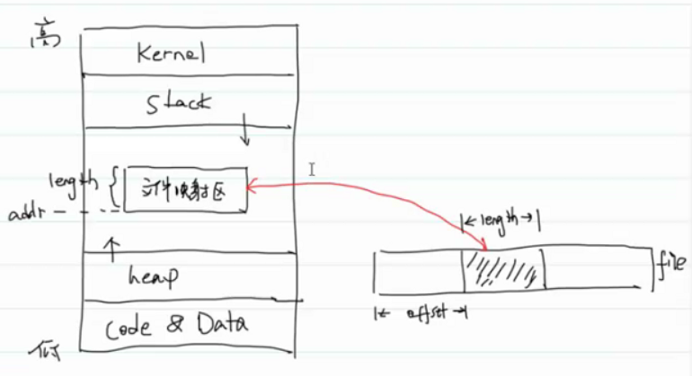
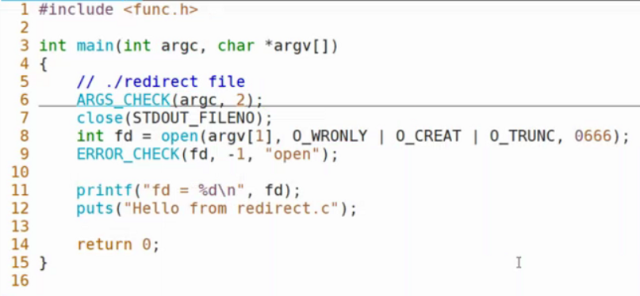
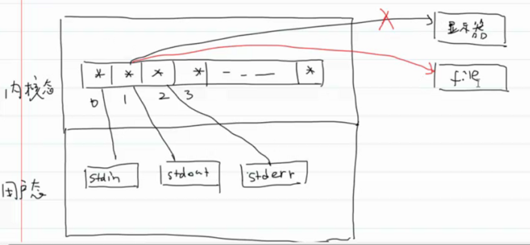
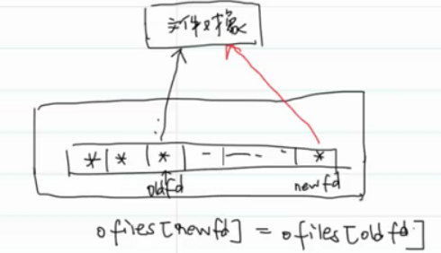
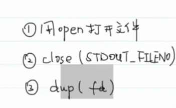
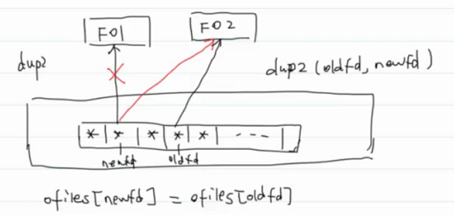

- # 一、mmap
  collapsed:: true
	- ```C
	  NAME
	         mmap, munmap - map or unmap files or devices into memory
	  
	  SYNOPSIS
	         #include <sys/mman.h>
	         //memory manege管理
	  
	         void *mmap(void *addr, size_t length, int prot, int flags,
	                    int fd, off_t offset);
	         int munmap(void *addr, size_t length);
	  
	  RETURN VALUE
	         On success, mmap() returns a pointer to the mapped area.  On er?
	         ror,  the  value  MAP_FAILED (that is, (void *) -1) is returned,
	         and errno is set to indicate the cause of the error.
	  
	         On success, munmap() returns 0.  On failure, it returns -1,  and
	         errno  is  set  to  indicate the cause of the error (probably to
	         EINVAL).
	  ```
		- addr：内存的起始地址
			- `If addr is NULL, then the kernel chooses the (page-aligned)  address  at which to create the mapping;`
		- length：映射区的长度
		- prot：protection：
			- ```C
			  	   PROT_EXEC  Pages may be executed.
			  
			         PROT_READ  Pages may be read.
			  
			         PROT_WRITE Pages may be written.
			  
			         PROT_NONE  Pages may not be accessed.
			  ```
		- flags：表明多进程间是否共享
			- ```C
			  	   MAP_SHARED
			                Share this mapping.  Updates to the mapping  are  visible
			                to  other  processes mapping the same region, and (in the
			                case of file-backed mappings) are carried through to  the
			                underlying  file.  (To precisely control when updates are
			                carried through to the underlying file requires  the  use
			                of msync(2).)
			  //共享
			         MAP_PRIVATE
			                Create  a  private copy-on-write mapping.  Updates to the
			                mapping are not visible to other  processes  mapping  the
			                same  file, and are not carried through to the underlying
			                file.  It is unspecified whether changes made to the file
			                after the mmap() call are visible in the mapped region.
			    //读时共享,写时复制，每个文件复制自己的一份，写自己的那一份
			  ```
		- fd：文件描述符
		- offset：偏移量
		- 
	- 写文件映射区必须有读写权限，只有写不行
	- ```c
	  #include <func.h>
	  
	  #define LENGTH 4096
	  
	  int main(int argc, char *argv[])
	  {
	      // ./mcp src dst
	      ARGS_CHECK(argc, 3);
	  
	      int fdr = open(argv[1], O_RDONLY);
	      ERROR_CHECK(fdr, -1, "open");
	  
	      int fdw = open(argv[2], O_RDWR | O_CREAT | O_TRUNC, 0666);
	      ERROR_CHECK(fdw, -1, "open");
	  
	      // 事先确定大小
	      struct stat statbuf;
	      fstat(fdr, &statbuf);
	  
	      ftruncate(fdw, statbuf.st_size);
	      off_t fsize = 0;
	      int cp_size;
	  
	      while(fsize < statbuf.st_size) {
	          if (statbuf.st_size - fsize >= LENGTH) {
	              cp_size = LENGTH;
	          } else {
	              cp_size = statbuf.st_size - fsize;
	          }
	  
	          char *src = (char *)mmap(NULL, cp_size, PROT_READ, MAP_SHARED, fdr, fsize);
	          ERROR_CHECK(src, MAP_FAILED, "mmap");
	  
	          char *dst = (char *)mmap(NULL, cp_size, PROT_READ | PROT_WRITE, MAP_SHARED, fdw, fsize);
	          ERROR_CHECK(dst, MAP_FAILED, "mmap");
	  
	          memcpy(dst, src, cp_size);
	          munmap(src, cp_size);
	          munmap(dst, cp_size);
	  
	          fsize += cp_size;
	      }
	      return 0;
	  }
	  ```
	- `fork`会复制指向mmap内存区域的指针，所以父子进程共享该片内存空间。
	- ```C
	  #include<func.h>
	  
	  int main(int argc,char* argv[])
	  {
	      int fd = open("./test.txt",O_RDWR);
	      if(fd == -1)
	      {
	          printf("error in open\n");
	          exit(1);
	      }
	      ftruncate(fd,4096);
	      char* pmmap = (char*)mmap(NULL,4096,PROT_READ | PROT_WRITE,MAP_SHARED,fd,0);
	      if(pmmap == MAP_FAILED)
	      {
	          printf("mmap error!\n");
	          exit(1);
	      }
	      pid_t pid = fork();
	      if(pid == 0)
	      {
	          for(int i = 0;i<10;i++)
	          {
	              pmmap[i]='c';
	          }
	      }
	      else{
	          sleep(2);
	          for(int i = 10;i<20;i++)
	          {
	              pmmap[i]='p';
	          }
	      }
	  }
	  
	  //结果：
	  /*
	  ccccccccccpppppppppp
	  */
	  ```
- # 二、文件重定向 #card
  collapsed:: true
	- duplicate：复制
	- ```C
	  NAME
	         dup, dup2, dup3 - duplicate a file descriptor
	  
	  SYNOPSIS
	         #include <unistd.h>
	  
	         int dup(int oldfd);
	         int dup2(int oldfd, int newfd);
	  
	  ETURN VALUE
	         On  success,  these system calls return the new file descriptor.
	    //一般也是最小可用文件描述符
	         On error, -1 is returned, and errno is set appropriately.
	  ```
	- 不用dup实现重定向：
		- 
		- 
		- （再写个进程尝试是否打开表唯一？）
		- 缺点：多线程环境下容易出错，其他线程打开文件占用了1号
	- dup原理：
		- 
		- 
		- ```C
		  #include <func.h>
		  
		  int main(int argc, char *argv[])
		  {
		      // ./dup file
		      ARGS_CHECK(argc, 2);
		      int fd = open(argv[1], O_WRONLY | O_CREAT | O_TRUNC);
		      ERROR_CHECK(fd, -1, "open");
		  
		      // 关闭STDOUT_FILENO
		      close(STDOUT_FILENO);
		      int newfd = dup(fd);
		      ERROR_CHECK(newfd, -1, "dup");
		  
		      printf("newfd = %d\n", newfd);
		      puts("Hello from dup.c");
		      return 0;
		  }
		  ```
	- dup2原理：
		- 
		- 若FO1引用计数到0，OS会删除，我们不用管
		- ```C
		  #include <func.h>
		  
		  int main(int argc, char *argv[])
		  {
		      ARGS_CHECK(argc, 2);
		      int oldfd = open(argv[1], O_WRONLY | O_CREAT | O_TRUNC, 0666);
		      ERROR_CHECK(oldfd, -1, "open");
		  
		      int newfd = dup2(oldfd, STDOUT_FILENO);
		      ERROR_CHECK(newfd, -1, "dup2");
		  
		      printf("newfd = %d\n", newfd);
		      puts("Hello from dup2.c");
		      return 0;
		  }
		  ```