- # 一、有名管道 #card
  collapsed:: true
	- named pipe/FIFO
	- 管道就是一块内存空间，是进程间通信的一种机制。
	- 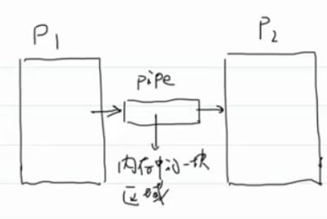
	- 匿名管道
	- 有名管道：管道在文件系统上的一种映射
		- 所以可以像操作文件一样操作管道
	- mkfifo命令：也有对应函数 man 3 mkfifo
		- ```c
		  NAME
		         mkfifo - make FIFOs (named pipes)
		  
		  ubuntu@VM-16-2-ubuntu:~/My_Code/wangdao/LinuxDay09$ mkfifo 1.pipe
		  ubuntu@VM-16-2-ubuntu:~/My_Code/wangdao/LinuxDay09$ ls
		  1.pipe
		  ubuntu@VM-16-2-ubuntu:~/My_Code/wangdao/LinuxDay09$ ll
		  total 8
		  drwxrwxr-x  2 ubuntu ubuntu 4096 Jun 30 09:45 ./
		  drwxrwxr-x 10 ubuntu ubuntu 4096 Jun 30 09:45 ../
		  prw-rw-r--  1 ubuntu ubuntu    0 Jun 30 09:45 1.pipe|
		    //大小为0，因为还没有数据
		  ```
	- 通信的方式：
		- 单工
		- 半双工
		- 全双工
	- **管道至少是半双工的**
	- 如何用管道实现全双工通信？
		- 两个管道
		- 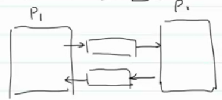
	- ## 如何用程序操作有名管道
		- ### 单工
			- 读进程：
				- ```C
				  int main(void)
				  {
				    int fd = open("1.pipe",O_RDONLY);//阻塞点
				    //error check
				    //一切皆文件，操作有名管道就像操作文件一样
				    puts("pipe open!");
				    
				    //读
				    char buf[1024] = {0};
				    read(fd,buf,SIZE(buf));
				    
				    //打印
				    printf("from pipe: %s",buf);
				  }
				  ```
			- 写进程：
				- ```C
				  int main(void)
				  {
				    int fd = open("1.pipe",O_WRONLY);
				    //error check
				    //一切皆文件，操作有名管道就像操作文件一样
				    puts("pipe open!");
				    
				    //写
				    const char* msg = "hello from write"
				    write(fd,msg,strlen(msg));
				    
				  }
				  ```
				- ```C
				  ./read //刚开始会阻塞在open，因为只有管道的读写两端都就绪后open才会返回
				    //现在写端未建立，所以会阻塞
				    
				    //另一个页面
				  ./write //建立起管道，当然后面的read和write也可能会阻塞
				  ```
		- ### 全双工
			- 点对点聊天：注意死锁（open顺序）
				- 阿妹：阻塞在读，不主动聊天
				- ```C
				  int main(int argc,char* argv[])
				  {
				    int fd1 = open("1.pipe",O_RDONLY);
				    //check
				    //写端
				    int fd2 = open("2.pipe",O_WRONLY);
				    //check;
				    
				    char buf[1024] = {0};
				    while(1)
				    {
				      //把buf所有数据清0。初始化buf
				      memset(buf,0,SIZE(buf));
				      
				      //其中一个先阻塞在读
				      read(fd1,buf,SIZE(buf));		//阻塞点
				      printf("from xing: %s\n",buf);
				      
				      memset(buf,0,SIZE(buf));
				      
				      //从键盘读入数据到buf
				      int len = read(STDIN_FILENO,buf,SIZE(buf));	//阻塞点
				      write(fd2,buf,len);//len 是因为可能读不到buf的大小呀
				    }
				    return 0;
				  }
				  ```
			- 两边pipe次序交换会阻塞吗？
				- 会死锁。
				- 
				- 一种解决方法：调整等待资源的顺序
			- 阿哥：主动写
			- ```C
			  int main(void)
			  {
			    //写端
			    int fd1 = open("1.pipe",O_WRONLY);
			    //check
			    //读端
			    int fd2 = open("2.pipe",O_RDONLY);
			    //check;
			    
			    char buf[1024] = {0};
			    while(1)
			    {
			      //把buf所有数据清0。初始化buf
			      memset(buf,0,SIZE(buf));
			      
			      //从键盘读入数据到buf，先写数据
			      int len = read(STDIN_FILENO,buf,SIZE(buf));
			      write(fd1,buf,len);//len 是因为可能读不到buf的大小呀
			      
			      memset(buf,0,SIZE(buf));
			      
			      //读数据
			      read(fd2,buf,SIZE(buf));
			      printf("from mei: %s\n",buf);
			    }
			    return 0;
			  }
			  ```
			- 但是这样不能夺命连环call，那么如何改进呢？
			- 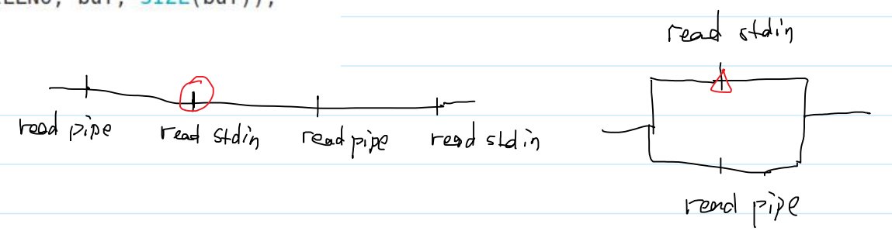
	-
- # ==二、I/O多路复用== #card
  card-last-interval:: -1
  card-repeats:: 1
  card-ease-factor:: 2.5
  card-next-schedule:: 2022-07-07T16:00:00.000Z
  card-last-reviewed:: 2022-07-07T00:48:46.561Z
  card-last-score:: 1
  collapsed:: true
	- I/O multiplexing
	- 
	- 把可能发生阻塞的点并联起来：
	- 
	- **select：**
	- ```C
	  NAME
	         select,  pselect,  FD_CLR, FD_ISSET, FD_SET, FD_ZERO -
	         synchronous I/O multiplexing
	         //syn：同步，asyn：异步
	         //chron：词根，与时间相关的东西。ous：adj后缀
	  
	  SYNOPSIS
	         /* According to POSIX.1-2001, POSIX.1-2008 */
	         #include <sys/select.h>
	  
	         /* According to earlier standards */
	         #include <sys/time.h>
	         #include <sys/types.h>
	         #include <unistd.h>
	  
	         int select(int nfds, fd_set *readfds, fd_set *writefds,
	                    fd_set *exceptfds, struct timeval *timeout);
	  
	  RETURN VALUE
	         On success, select() and pselect() return  the  number
	         of  file  descriptors  contained in the three returned
	         descriptor sets (that is, the  total  number  of  bits
	         that  are  set  in readfds, writefds, exceptfds) which
	         may be zero if the timeout expires before anything in‐
	         teresting  happens.  On error, -1 is returned, and er‐
	         rno is set to indicate the error; the file  descriptor
	         sets are unmodified, and timeout becomes undefined.
	  ```
		- nfds：监听的最大的文件描述符+1。
		- timeout：超时时间。最多阻塞timeout时间
			- （并不是精确的。因为select的时候进程是阻塞的，OS自然会切换其他进程运行，所以这只是告诉OS我最多等这么长时间，并不精确）
			- I/O多路复用是可能会发生阻塞的，但他的阻塞点在传回的路线
			- ```C
			  struct timeval {
			                 long    tv_sec;         /* seconds */
			                 long    tv_usec;        /* microseconds */
			             };
			  ```
			- 1.若他的值是NULL，则会永久等待，直到来信号
			- 2.若tv_sec!=0 || tv_usec != 0，则等待tv_sec秒+tv_usec毫秒。
			- 3.若tv_sec==0 || tv_usec == 0，不等待
			- ==**select会改变timeout。**==
		- fd_set *readfds：对那些文件描述符的读操作感兴趣。（de_set就是一个位图）
			- 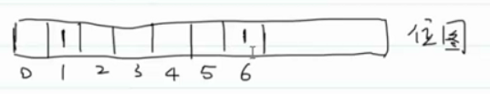
				- 下标表示文件描述符
		- fd_set *writefds：对那些文件描述符的写操作感兴趣。
			- 
		- fd_set *exceptfds：对那些文件描述符的读写异常感兴趣。
			- 
		- 11：20（√）
		- 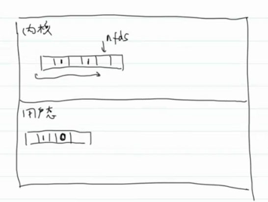
			- 内核会保留相应的fd_set位图，表明对那些文件描述符感兴趣。然后因为我这个进程在等嘛，就阻塞了，OS就可能会切换其他进程运行，然后过一会儿切换回来，对保存的位图从头到nfds进行遍历，看感兴趣的文件描述符的 I/O 流是否准备就绪（就是为 1 的那些文件描述符）；准备就绪了就不更改，没有就绪的就将用户态的位图对应位改变为0。（不是改变内核的位图）
			- 调用之前：fd_set表示监听的文件描述符
			- 调用之后：fd_set表示就绪的文件描述符
		- 为什么nfds要+1？
			- `ulimit -a`查看总的可用的文件描述符的个数
			- `open files                      (-n) 1024`
			- +1表示监听的数目，fd从0开始的。
			- 因为只需要监听这么多，后面那些文件描述符都没用。就不用每次都遍历1024个
		- `select(1,NULL,NULL,NULL,timeout)`：可以以ms为单位
		- `sleep`：以s为单位
			- 这两者等价，但select可以表示到ms。
	- ```C
	  	   宏函数
	  	   void FD_CLR(int fd, fd_set *set);//删除一个文件描述符
	         int  FD_ISSET(int fd, fd_set *set);//测试一个指定的文件描述符是否设置
	         void FD_SET(int fd, fd_set *set);//设置一个文件描述符--把位图对应位设为1
	         void FD_ZERO(fd_set *set);//清空所有的文件描述符
	  ```
	- I/O多路复用实现：
		- chat1.c
		- ```C
		  int main(int argc,char* argv[])
		  {
		    int fd1 = open("1.pipe",O_RDONLY);
		    //check
		    //写端
		    int fd2 = open("2.pipe",O_WRONLY);
		    //check;
		    
		    //设置readfds
		    fd_set readfds;
		    
		    FD_ZERO(&readfds);			//先清空readfds
		    
		    char buf[1024] = {0};
		    while(1)
		    {
		      //每次都需要重新设置监听的文件描述符
		      FD_SET(STDIN_FILENO,&readfds);
		      FD_SET(fd1,&readfds);
		      
		      select(fd1+1, &readfds, NULL, NULL,NULL);	//设置select，永久等待
		      
		      //依次检查哪一个文件描述符就绪了
		      if(FD_ISSET(STDIN_FILENO, &readfds))//如果stdin就绪了
		      {
		        memset(buf,0,SIZE(buf));
		        int len = read(STDIN_FILENO,buf,SIZE(buf));
		        write(fd2,buf,len);
		      }
		      if(FD_ISSET(fd1,&readfds))//管道就绪
		      {
		        memset(buf,0,SIZE(buf));
		        int len = read(fd1,buf,SIZE(buf));
		        if(len == 0)
		        {
		          break;
		        }
		        printf("from xing: %s",buf);
		      }
		    }
		    return 0;
		  }
		  ```
		- chat2.c
		- ```C
		  int main(int argc,char* argv[])
		  {
		    int fd1 = open("1.pipe",O_WRONLY);
		    //check
		    //读端
		    int fd2 = open("2.pipe",O_RDONLY);
		    //check;
		    
		    //设置readfds
		    fd_set readfds;
		    
		    char buf[1024] = {0};
		    while(1)
		    {
		      FD_ZERO(&readfds);			//先清空readfds
		      FD_SET(STDIN_FILENO,&readfds);
		      FD_SET(fd2,&readfds);
		      
		      select(fd2+1, &readfds, NULL, NULL,NULL);	//设置select，永久等待
		      
		      //依次检查哪一个readfds就绪了
		      if(FD_ISSET(STDIN_FILENO, &readfds))//如果stdin就绪了
		      {
		        memset(buf,0,SIZE(buf));
		        int len = read(STDIN_FILENO,buf,SIZE(buf));
		        write(fd1,buf,len);
		      }
		      if(FD_ISSET(fd2,&readfds))//管道就绪
		      {
		        memset(buf,0,SIZE(buf));
		        int len = read(fd2,buf,SIZE(buf));
		        if(len == 0)
		        {
		          break;
		        }
		        printf("from mei: %s",buf);
		      }
		    }
		    return 0;
		  }
		  ```
		- fd2,不会收到IO流就绪的信号，那么就不会进入if语句，为啥会一直读呢？
			- 因为管道关闭后，会一直有对应的IO流就绪的信号，所以就一直会有了。OS管的。
	- **缺陷**：
		- 每次都得遍历fd_set才能得知那些文件描述符就绪了（当需要监听大量文件描述符时，效率比较低）
			- epoll可以解决
	-
	- 聊天：1分钟未回话则结束进程：==select会重置timeout时间==
		- ```C
		  #include <func.h>
		  #include <sys/select.h>
		  #include <sys/time.h>
		  #include <sys/types.h>
		  //#define SIZE(a) (sizeof(a) / sizeof(a[0]))
		  
		  int main()
		  {
		      //打开读端
		      int fdr = open("./1.pipe", O_RDONLY);
		      if (fdr == -1)
		      {
		          printf("error in fdr open\n");
		          exit(1);
		      }
		      //打开写端
		      int fdw = open("./2.pipe", O_WRONLY);
		      if (fdw == -1)
		      {
		          printf("error in fdw open\n");
		          exit(1);
		      }
		      //定义readfds
		      fd_set readfds;
		      //初始化
		      FD_ZERO(&readfds);
		      //设置select timeout时间
		      struct timeval time={0,0};
		      
		      //计时
		      int timeusec = 0;
		      struct timeval timeOfmsec;
		  
		      //定义读写buf
		      char buf[1024] = {0};
		      //开始读写
		      while (1)
		      {
		          timeOfmsec.tv_sec=0;
		          timeOfmsec.tv_usec = 1000;
		          //设置readfds
		          FD_SET(STDIN_FILENO, &readfds);
		          FD_SET(fdr, &readfds);
		          select(fdr + 1, &readfds, NULL, NULL, &time);
		          //逐个检查是否有文件IO就绪
		          if (FD_ISSET(STDIN_FILENO, &readfds))
		          {
		              timeusec = 0;
		  
		              //初始化buf
		              memset(buf, 0, SIZE(buf));
		              // STDIN就绪
		              // ssize_t read(int fd, void *buf, size_t count);
		              int len = read(STDIN_FILENO, buf, SIZE(buf));
		              //写入
		              // ssize_t write(int fd, const void *buf, size_t count);
		              //这里设置len，是因为不知道读入多少数据，是有可能不足SIZE(buf)的
		              write(fdw, buf, len);
		          }
		          if (FD_ISSET(fdr, &readfds))
		          {
		              //初始化buf
		              memset(buf, 0, SIZE(buf));
		              int len = read(fdr, buf, SIZE(buf)); //这里设置len是为了=0时终止
		              if (len == 0)
		              {
		                  break;
		              }
		              printf("from Tom:%s", buf);
		          }
		  
		          select(1,NULL,NULL,NULL,&timeOfmsec);
		          if(++timeusec==60000)break;
		      }
		      close(fdw);
		      close(fdr);
		      return 0;
		  }
		  ```
- # 三、CPU的调度策略？ #card
  collapsed:: true
	- 假设：
		- 1.每个工作运行相同的时间
		- 2.所有的工作同时到达
		- 3.工作一旦开始，就一直运行直到完成
		- 4.所有的工作只用CPU（即：没有I/O操作）
		- 5.每个工作的运行时间是已知的
	- 评价指标：
		- T周转时间 = T完成时间-T到达时间
	-
	- ## 1.FIFO
	  collapsed:: true
		- 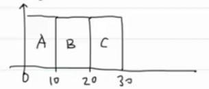
		- T平均周转时间 = （10+20+30）/3 = 20s
		- 放松条件①：
			- 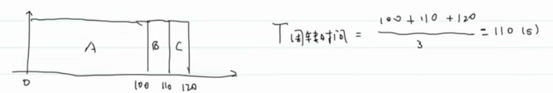
		-
	- ## 2.SJF（Shortest Job First）
	  collapsed:: true
		- 
		- 放松条件②：可能长进场比短进程先到，这样就没办法短进程优先了
			- 
		- 放松条件③：（上下文切换）
	- ## 3.STCF（Shortest Time-to-completion First）
	  collapsed:: true
		- 最短完成任务优先
		- 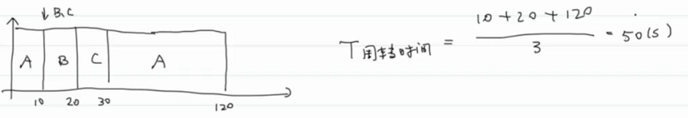
		- **增加一个新指标：响应时间**
			- **T响应时间 = T首次运行时间 - T到达时间**
	- ## 4.RR（Round Robin）轮转
	  collapsed:: true
		- 时间片轮转
		- 0同时到达：
		- 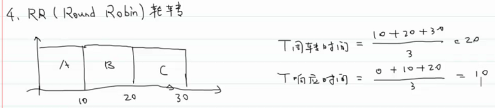
		- RR：
		- 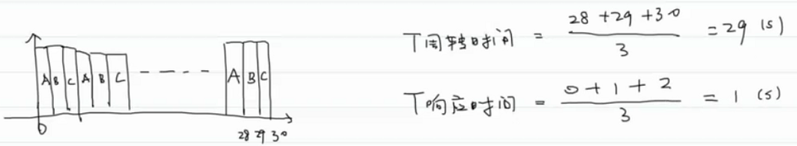
		- 时间片：必须是时钟周期的整数倍
			- **为什么上下文切换会导致巨大的性能损失？**（**切换进程**）
				- **CPU高速缓存失效**
				- **TLB失效**
		-
	- ## 5.结合I/O
	  collapsed:: true
		- 放松条件④
		- 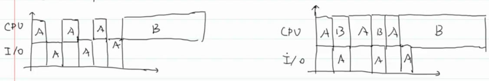
		-
		- 放松条件⑤
		-
		- 现在的关键问题是：现在有没有一个调度策略，有SJF/STCF的周转时间的优势，也有RR响应时间的优势，还要解决OS无法预知未来的难题（无法预知每个工作的运行时间）（根据最近的历史预测未来），还需要考虑如何结合I/O操作。
		-
	- ## 6.MLFQ（Multi-level Feedback Queue）
	  collapsed:: true
		- 多级反馈队列
			- 单CPU上运行比较好
		- 1.优化周转时间：可以通过先执行短任务实现。
			- 如何得知一个任务是短的？
		- 2.给用户很好的交互体验：降低响应时间。
			- 任务分两类：
				- 1.运行时间短，频繁放弃时间片的交互型任务
				- 2.需要很多的CPU时间，响应时间不那么重要的计算密集型任务。
		- 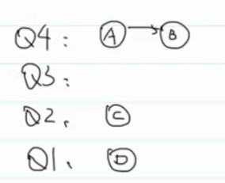
		- Rule1：如果Priority(A)>Priority(B),运行A
		- Rule2：如果Priority(A)==Priority(B)，RR轮转
			- 只会运行A和B，不会运行C、D，可能导致饥饿
		- **1.改变优先级**
			- Rule3：工作进入系统时，会放在最高优先级的队列上（即：一开始认为你是一个短任务）。
			- Rule4a：如果工作用完整个时间片，降低其优先级。
			- Rule4b：如果工作在其时间片内主动放弃CPU，则优先级不变。（就是还放在这条队列上）（短时间任务完成，认为是交互型任务，优先级不变）
			- **问题：**
				- 1.存在饥饿问题，一直有短的交互型任务，那么低优先级的任务就会饥饿
				- 2.愚弄调度策略。（√）
					- 程序员编程在时间片内放弃CPU，就会一直占用该优先级。
		- **2.如何解决饥饿性问题**
			- 周期性的提高所有工作的优先级（重新放到最高优先级）
				- 引入新的问题：周期设为多长？-->voo-doo constant（巫毒常量），即：没办法通过理论计算出是多少，玄学值，只能通过子集的工程实践得出大概。
				- **顺便解决任务的行为可能发生改变的问题（16：12√）**
					- 某些任务，可能刚开始是计算密集型任务，后来可能行为发生改变，变为交互型任务。这就是任务的行为发生改变。这时如果周期性提升优先级，就不会一直待在低优先级，而是会提升到高优先级运行。这就能检测到这种变化。
			- 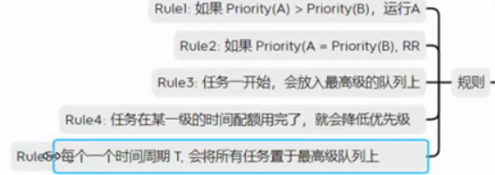
		- **3.解决愚弄调度策略的问题**
			- Rule4a和Rule4b-->Rule4：一旦工作用完了在某一层的时间配额就降低其优先级
				- 每一层优先级队列对每一个工作配置了一个总的可以待在这一级的时间-->时间配额
		- **难点**：配置问题
			- 1.应该设置多少队列？
			- 2.每一层队列的时间片应该设置为多大？
			- 3.提升所有任务优先级的周期应该设置为多少？
		- 多处理器调度策略的基础
	- ## 7.Linux多处理调度
	  collapsed:: true
		- ### 1.O(1)调度程序
		- ### 2.完全公平调度程序（CFS）
		- ### 3.BF调度程序（BFS）
			- Brain Fucking
- # 四、内存虚拟化 #card
  collapsed:: true
	- 底层机制
	- 上层策略（不讲）
	-
	- ## 1.方式一：独占
		- 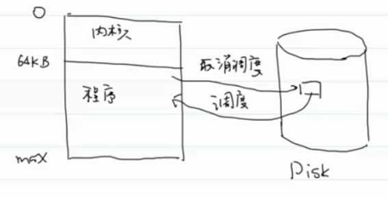
			- 程序整个交换，独占内存，交换整个程序效率太慢了
	- ## 2.方式二：共享内存
		- 每个程序交换到固定的内存地址（固定分区分配）
		- 
		  collapsed:: true
			- 缺点
				- Protection Problem。保护性问题，比如：加载错了内存
				- 程序员必须面对物理内存地址进行编程
	-
	- ## 3.虚拟内存空间
		- 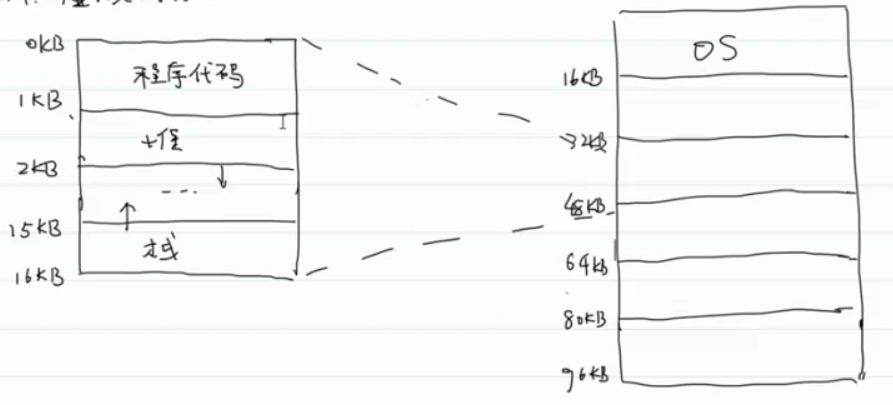
		-
- # 五、底层机制 #card
  collapsed:: true
	- 关键问题：操作系统如何在单一的内存上为多个进程创建一个进程私有的、可能非常大的地址空间的抽象
	- MMU：虚拟地址转换
	- OS：内存管理
	- 目标：
		- 1.透明：应用程序员不知道这个结构的存在，无法感知到
		- 2.效率：
			- 时间上，不花太多时间
			- 空间上，不占用太多内存
		- 3.保护性问题：进程之间隔离，不能访问其他进程的内存空间
	- 如何实现内存虚拟化？
		- 底层机制（重点）
		- 上层策略（不讲）
	- **关键**：基于硬件的地址转换
		- 
			- 内存管理单元
		- 操作系统必须能够管理物理内存
	-
	- **假设：**
		- 1.地址空间必须连续的存放在物理内存中。
		- 2.地址空间必须小于物理内存大小。
		- 3.每一个进程的物理地址空间都一样大
	- base/bound register直接实现：
	- 
		- 好处：
			- OS管理物理内存空间非常方便；（因为每个进程占用相同的内存空间，就像管理数组一样，比较简单）
			- 硬件电路非常简单
		- 缺陷：
			- 存在大量内部碎片。这里指：程序占据了内存，但是没有使用到。
			- 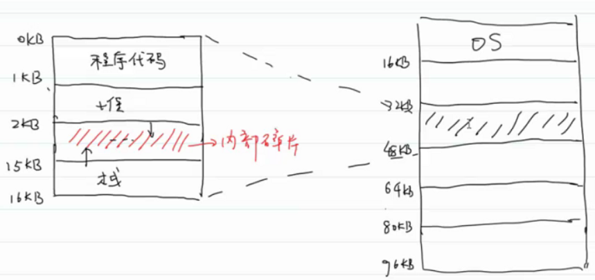
		- MMU怎样设置？
			- CPU得额外增加两个寄存器
				- base register：记录进程的起始内存地址
					- 物理地址 = 虚拟地址 + 基址寄存器的值
				- bound register：提供访问保护。
					- 设置为进程的物理地址空间的大小，这里就是16KB。
					- 虚拟地址<0 || 虚拟地址≥16KB 就越界了。
		- return from trap(from A)返回进入到A的main函数
		- 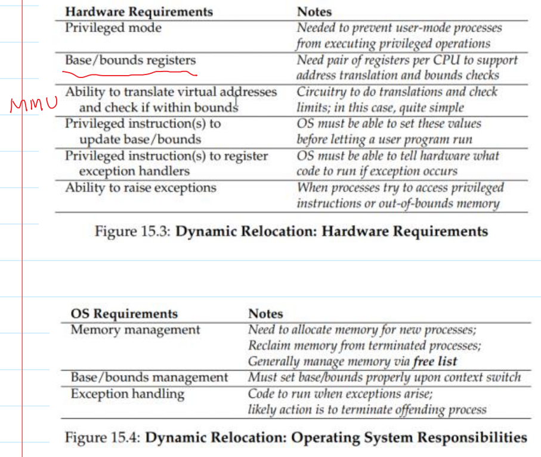
		- P ... to register exception handlers：有记录异常处理系统调用的特权指令。就像前面的陷阱表一样。
		- 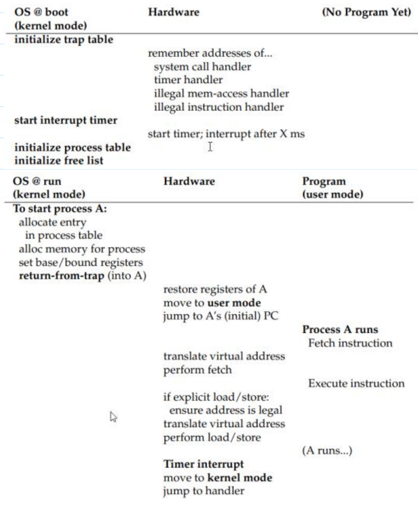
		- 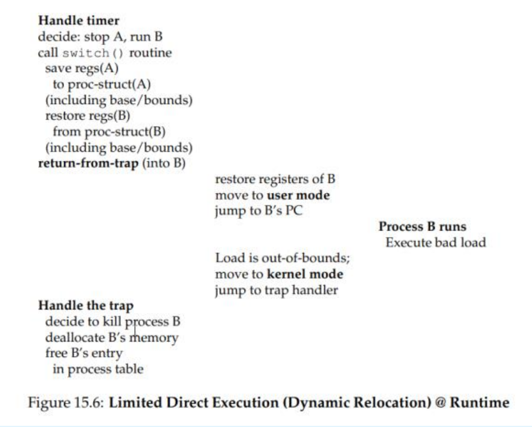
- # 六、分段
  collapsed:: true
	- 。
-