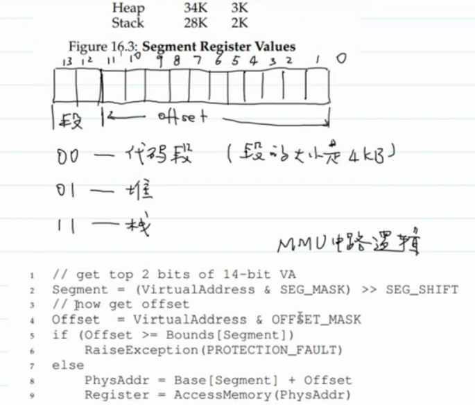
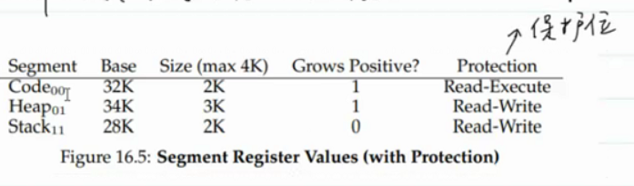
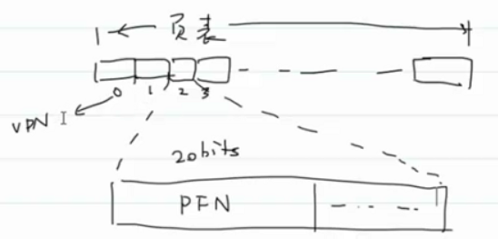
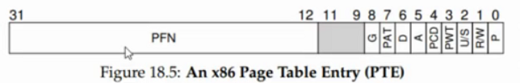
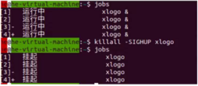
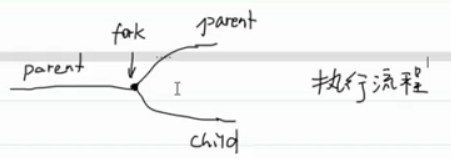

- # 一、分段
  collapsed:: true
	- 好处：避免内部碎片，并且可以支持大的地址空间
	- 坏处：
		- （每个段的大小不一样），OS管理物理内存会比较麻烦
			- 一般会有一个free-list保存内存的空闲区域，用一个链表链接起来。
				- 高德纳提出伙伴算法
		- 可能会导致大量的外部碎片
		- 要为每一段引入一组base/bound register
	- 如何设计MMU？
		- 1.为每一个段引入base/bound register
	- 11：00（√）
	- 
		- 栈怎么办？栈是反向增长的。
		-
	- 引入新功能：共享内存（代码段都一样，所以可共享）
		- 
		- Read-Executive : 多个进程可以共享
	-
- # 二、分页
  collapsed:: true
	- OS必须为每一个进程保留管理一个数据结构：页表
	-
	- 如何进行地址转换?
		- 页表
	- 问题：
		- 1.页表放在那里？
			- 内存
		- 2.页表有多大？
			- 
			- 一页一般是4MB
			- 又可以引入多级页表，从而减少页表所需的存储空间。
				- 真实的程序，往往有一大片连续的无效页，所以多级页表可以大大减少页表所占的内存空间（无效的就可以不存那么多项，只存一个表示无效就可以）
		- 3.页表里具体有什么？
			- 
				- valid bit：虚拟页是否有效（是否有对应的物理页），无效的话，无需为他分配物理页 A
				- protection bits：可读，可写，可执行 R/W
				- president bit：表示是否在内存中，还是被交换到磁盘上了。P
				- dirty bit：表示页面是否被修改过 D
				- reference bit：访问位（用于追踪页面是否被访问过，置换参考）-->交换到磁盘
		- 4.会不会使系统变慢？
			- 会。因为需要访问页表，页表在内存，最差就是缺页，访问磁盘。
				- 解决-->TLB：页表的缓存
	- **段错误不是表示底层采用分段机制，而是凡是内存访问错误都报段错误**
	- 好处：
		- OS管理内存比较方便
		- 消除了外部碎片
		- MMU设计并不复杂
	- 坏处：
		- 必须保留管理对应的页表，在性能上会有一些损耗
			- 时间上：需要两次访存
			- 空间上：存储页表，若页表大，就需要占用很多空间
		- 会存在内部碎片
	-
- # 三、查看进程的命令 #card
  collapsed:: true
	- ## ps
		- ```C
		  NAME
		         ps - report a snapshot of the current processes.
		  ```
		- 单独`ps`只会显示和这个控制终端相连的进程
			- ```C
			  ubuntu@VM-16-2-ubuntu:~$ ps
			      PID TTY          TIME CMD
			   405207 pts/0    00:00:00 bash
			   405371 pts/0    00:00:00 ps
			  ```
			- `TTY`：远程控制终端，teletype
			- `TIME`：进程消耗CPU的总时间
		- `ps  x`：BSD风格
			- ```C
			  ubuntu@VM-16-2-ubuntu:~$ ps x
			      PID TTY      STAT   TIME COMMAND
			   405102 ?        Ss     0:00 /lib/systemd/systemd --user
			   405103 ?        S      0:00 (sd-pam)
			   405206 ?        S      0:00 sshd: ubuntu@pts/0
			   405207 pts/0    Ss     0:00 -bash
			   405980 pts/0    R+     0:00 ps x
			  ```
			- 只会显示和该用户关联的进程信息。`？`表示没有控制终端和这个进程关联
			- ```C
			  PROCESS STATE CODES
			         Here are the different values that the s, stat and
			         state output specifiers (header "STAT" or "S") will
			         display to describe the state of a process:
			  
			                 D    uninterruptible sleep (usually IO)
			                   //不能被中断的睡眠 D:deepsleep
			                   //深度睡眠
			                 I    Idle kernel thread
			                 R    running or runnable (on run queue)
			                   //处于就绪队列，可以运行或正在运行
			                 S    interruptible sleep (waiting for an event
			                      to complete)
			                   //可中断的睡眠
			                 T    stopped by job control signal
			                 //被工作控制信号终止
			                 t    stopped by debugger during the tracing
			                 W    paging (not valid since the 2.6.xx
			                      kernel)
			                 X    dead (should never be seen)
			                 Z    defunct ("zombie") process, terminated
			                      but not reaped by its parent
			  
			         For BSD formats and when the stat keyword is used,
			         additional characters may be displayed:
			  
			                 <    high-priority (not nice to other users)
			                 N    low-priority (nice to other users)
			                 L    has pages locked into memory (for
			                      real-time and custom IO)
			                   //有些页被锁死在内存，不能换去磁盘（对一些实时和IO）
			                 s    is a session leader
			                 //会话leader
			                 l    is multi-threaded (using CLONE_THREAD,
			                      like NPTL pthreads do)
			                 +    is in the foreground process group
			                 //位于前台进程组，意思是它是一个前台进程
			  ```
		- `ps aux`：
			- ```C
			  USER         PID %CPU %MEM    VSZ   RSS TTY      STAT START   TIME COMMAND
			  root           1  0.0  0.2 101912 11424 ?        Ss   Jun29   0:03 /sbin/init
			  root           2  0.0  0.0      0     0 ?        S    Jun29   0:00 [kthreadd]
			  //进程所属用户
			  //在这一时刻CPU占比，因为这是静态的
			  //vsz：virtual memory size of the process in KiB (1024-byteunits).  
			  //Device mappings are currently excluded; this is subject to change.  (alias vsize).
			  //RSS：resident set size, the non-swapped physical memory that a task has used (in
			  //kilobytes).  (alias rssize, rsz).
			  //[内核进程/系统进程]
			  ```
		- `top`：类似windows下的任务管理器
			- ```C
			  top - 15:19:48 up 1 day, 17:57,  5 users,  load average: 0.00, 0.00, 0.00
			  Tasks: 125 total,   1 running, 124 sleeping,   0 stopped,   0 zombie
			  %Cpu(s):  0.2 us,  0.2 sy,  0.0 ni, 99.7 id,  0.0 wa,  0.0 hi,  0.0 si,  0.0 st
			  MiB Mem :   3931.2 total,   1991.9 free,    577.0 used,   1362.3 buff/cache
			  MiB Swap:      0.0 total,      0.0 free,      0.0 used.   3074.7 avail Mem 
			  //Swap：交换到磁盘上的内存
			  //概述
			  //VIRT：虚拟内存大小
			  //RES：驻留在内存中的大小
			  //SHR：shared，共享的内存
			      PID USER      PR  NI    VIRT    RES    SHR S  %CPU  %MEM     TIME+ COMMAND                                 
			     1371 root      20   0 1006256  50008  31288 S   0.3   1.2  14:36.81 YDService
			     //进程
			  ```
			- 工作负载<1，比较空闲。>1，比较忙
			-
- # 四、控制进程的相关的命令 #card
  collapsed:: true
	- `xlogo`：在前台启动xlogo
	- `xlogo &`：在后台启动xlogo
	- `ctrl c`：对前台所有进程发送`SIGINT`信号
	- `jobs`：显示所有后台任务
	- `fg`：把一个后台任务置于前台
		- `fg $1`：1是jobs后获取的编号
	- `ctrl z`：停止一个进程，并不是杀死
		- `bg $1`：把前台任务置于后台。1是停止后获取的编号
	- `kill`：-->`kill -9 pid`、`kill -SIGINT pid`两种发送信号方式
		- ```C
		  NAME
		         kill - send a signal to a process
		  ```
		- `kill -l`：可以查看所有信号
			- ```C
			  ubuntu@VM-16-2-ubuntu:~$ kill -l
			   1) SIGHUP	 2) SIGINT	 3) SIGQUIT	 4) SIGILL	 5) SIGTRAP
			   6) SIGABRT	 7) SIGBUS	 8) SIGFPE	 9) SIGKILL	10) SIGUSR1
			  11) SIGSEGV	12) SIGUSR2	13) SIGPIPE	14) SIGALRM	15) SIGTERM
			  16) SIGSTKFLT	17) SIGCHLD	18) SIGCONT	19) SIGSTOP	20) SIGTSTP
			  21) SIGTTIN	22) SIGTTOU	23) SIGURG	24) SIGXCPU	25) SIGXFSZ
			  26) SIGVTALRM	27) SIGPROF	28) SIGWINCH	29) SIGIO	30) SIGPWR
			  31) SIGSYS	34) SIGRTMIN	35) SIGRTMIN+1	36) SIGRTMIN+2	37) SIGRTMIN+3
			  38) SIGRTMIN+4	39) SIGRTMIN+5	40) SIGRTMIN+6	41) SIGRTMIN+7	42) SIGRTMIN+8
			  43) SIGRTMIN+9	44) SIGRTMIN+10	45) SIGRTMIN+11	46) SIGRTMIN+12	47) SIGRTMIN+13
			  48) SIGRTMIN+14	49) SIGRTMIN+15	50) SIGRTMAX-14	51) SIGRTMAX-13	52) SIGRTMAX-12
			  53) SIGRTMAX-11	54) SIGRTMAX-10	55) SIGRTMAX-9	56) SIGRTMAX-8	57) SIGRTMAX-7
			  58) SIGRTMAX-6	59) SIGRTMAX-5	60) SIGRTMAX-4	61) SIGRTMAX-3	62) SIGRTMAX-2
			  63) SIGRTMAX-1	64) SIGRTMAX
			  ```
			- 2号信号：`ctrl c`发送的就是2号信号
			- `ctrl+z`：SIGTSTP：终端停止信号    ？
			- 3号：`ctrl \`
			- 6号：终止。一般是自己给自己发。相当于自杀。。
			- 8：除0异常
			- 9：终止进程，一定会执行默认操作终止进程
				- 进程对信号有三种处理方式
					- 忽略
					- 执行默认操作
					- 捕获信号，执行自定义操作。
			- 11：访问非法内存，段错误
			- 13：如果管道读端关闭，但是写端还在写，OS就会给写端发送这个信号表示读端已经关闭了
			- 19：停止进程，不能别忽略和捕获，只能执行默认操作，保证OS能够停止任何一个进程。
			- 17：子进程终止时会向父进程发送SIGCHLD信号，告知父进程回收自己，但该信号的默认处理动作为忽略，因此父进程仍然不会去回收子进程，需要捕捉处理实现子进程的回收    16：17（√）
	- `killall`：
		- ```C
		  NAME
		         killall - kill processes by name
		         
		  killall [-u user] [-signal] name(进程的名字)
		  ```
		- 
	- `关机`：
		- `halt`：挂起
		- `poweroff`：关机
		- `reboot`：重启
		- `shutdown`
			- 不加参数：关机，类似`poweroff`
			- `shutdown -h`：相当于`halt`
			- `shutdown -r`：`reboot`
			-
- # 五、进程相关的其他命令 #card
  collapsed:: true
	- `vmstat`：
		- ```c
		  NAME
		         vmstat - Report virtual memory statistics
		  ```
		- `vmstat 3`：每隔3s会刷新以下
		- ```C
		  ubuntu@VM-16-2-ubuntu:~$ vmstat 3
		  procs -----------memory---------- ---swap-- -----io---- -system-- ------cpu-----
		   r  b   swpd   free   buff  cache   si   so    bi    bo   in   cs us sy id wa st
		   1  0      0 1789808 148308 1259756    0    0     3     9   66  105  0  0 99  0  0
		  
		  
		     Procs
		         r: The number of runnable processes (running or waiting for run time).
		         b: The number of processes in uninterruptible sleep.
		           
		     Memory
		         These are affected by the --unit option.
		         swpd: the amount of virtual memory used.
		         free: the amount of idle memory.
		         buff: the amount of memory used as buffers.
		         cache: the amount of memory used as cache.
		         inact: the amount of inactive memory.  (-a option)
		         active: the amount of active memory.  (-a option)
		           
		     Swap
		         These are affected by the --unit option.
		         si: Amount of memory swapped in from disk (/s).
		         so: Amount of memory swapped to disk (/s).
		  ```
	- `pstree`：展示进程之间的关系
		- ```C
		  ubuntu@VM-16-2-ubuntu:~$ pstree
		  systemd─┬─YDLive─┬─YDService─┬─sh───8*[{sh}]
		          │        │           └─23*[{YDService}]
		          │        └─9*[{YDLive}]
		          ├─accounts-daemon───2*[{accounts-daemon}]
		          ├─acpid
		          ├─2*[agetty]
		          ├─atd
		          ├─barad_agent─┬─barad_agent
		          │             └─barad_agent───2*[{barad_agent}]
		          ├─cron
		          ├─dbus-daemon
		          ├─2*[iscsid]
		          ├─multipathd───6*[{multipathd}]
		          ├─mysqld───37*[{mysqld}]
		          ├─named───7*[{named}]
		          ├─networkd-dispat
		          ├─ntpd───{ntpd}
		          ├─polkitd───2*[{polkitd}]
		          ├─rpcbind
		          ├─rsyslogd───3*[{rsyslogd}]
		          ├─sgagent───{sgagent}
		          ├─sh───node─┬─node───10*[{node}]
		          │           ├─node───11*[{node}]
		          │           └─10*[{node}]
		          ├─sshd─┬─2*[sshd───sshd───bash───man───pager]
		          │      ├─22*[sshd───sshd───bash]
		          │      ├─sshd───sshd───bash───man─┬─man
		          │      │                          └─pager
		          │      └─sshd───sshd───bash───pstree
		          ├─systemd───(sd-pam)
		          ├─systemd-journal
		          ├─systemd-logind
		          ├─systemd-network
		          ├─systemd-resolve
		          ├─systemd-udevd
		          ├─tat_agent───7*[{tat_agent}]
		          └─unattended-upgr───{unattended-upgr}
		  ```
	-
- # 六、getpid、getppid #card
  collapsed:: true
	- `getpid`：获取一个进程的pid
	- `getppid`：获取进程的父进程的pid
	- ```C
	  NAME
	         getpid, getppid - get process identification
	  
	  SYNOPSIS
	         #include <sys/types.h>
	         #include <unistd.h>
	  
	         pid_t getpid(void);
	         pid_t getppid(void);
	  
	  ERRORS
	         These functions are always successful.
	  ```
	- ```C
	  //getpid.c
	  int main(void)
	  {
	    //为了可移植性，我们不知道getpid返回值类型，可以强转long  int。
	    //这样可移植性强。
	    printf("pid = %ld\n",(long int)getpid());
	    printf("ppid = %ld\n",(long int)getppid());
	    return 0;
	  }
	  ```
	- **进程销毁，pid会被回收，但是UNIX采用的是延迟复用算法**
		- 就是隔一段时间之后才会再复用这个pid
	- [[LinuxDay12#^118540|进程组pid延迟复用、会话id延迟复用]]
- # 七、进程控制原语 #card
  collapsed:: true
	- ==创建新进程：fork==
	- ==执行程序文件==：`exec` 簇
	- ==进程终止==：`exit`、`wait`
	- 原语：primitives
- # 八、fork #card
  collapsed:: true
	- ```c
	  NAME
	         fork - create a child process
	  
	  SYNOPSIS
	         #include <sys/types.h>
	         #include <unistd.h>
	  
	         pid_t fork(void);
	  
	  RETURN VALUE
	         On success, the PID of the child process  is  returned
	         in  the  parent,  and  0 is returned in the child.  On
	         failure, -1  is  returned  in  the  parent,  no  child
	         process is created, and errno is set appropriately.
	  ```
	- 
	- 流程就像一把叉子，所以叫fork
	-
	- ```C
	  int main(void)
	  {
	    printf("before fork.\n");
	    pid_t pid = fork();
	    //错误检查 -1
	    
	    if(pid > 0)
	    {
	      printf("parent: who's your daddy?\n");
	      printf("pid = %ld,ppid = %ld",(long int)getpid(),(long int)getppid());
	    }
	    else
	    {
	      printf("child: I'm a baby\n");
	      printf("pid = %ld,ppid = %ld",(long int)getpid(),(long int)getppid());
	    }
	  }
	  ```
	- **注意事项**：`fork`返回时，先运行父进程还是子进程是不确定的。
		- 因为fork是系统调用，OS切回时，谁也不知道它切给谁
	- 
		- 页表都会基本上完全复制，对进程B也是复制进程A，只会修改一些进程独有的信息(pid、ppid等),pc寄存器的值都会copy
		- 只有代码段是父子进程共享的，其余都不是共享的。
		- 1.复制A的进程结构体（xv6的proc），并且修改结构体的一些数据（改变pid和ppid、阻塞信号等进程独有信息）
		- 2.复制页表（不会复制具体页面）。所以子进程不会运行fork前的代码了。
			- 代码段--父子进程共享
			- 堆栈-----父子进程私有，写时复制
			- 用户态缓冲区--父子进程私有，写时复制
			- 打开文件列表--进程私有，写时复制
				- ==文件对象是共享的==
		- 3.把子进程加入进程表中
		- 进程是内存中的数据结构，fork的时候直接把他复制一份，只会修改一些进程独有的信息（pid、ppid等）
	- 1.验证堆栈数据段是否复制：
		- ```C
		  int gloabalval = 10;
		  int main(void)
		  {
		    int val = 1;
		    int* heapval = (int *)malloc(sizeof(int));
		    *heapval = 100;
		    
		    pid_t pid = fork();
		    //check
		    
		    if(pid == 0)
		    {
		      //child
		      gloabalval++;
		      val++;
		      (*heapval)++;
		    }
		    else
		    {
		      //parent
		      sleep(2);//休眠2s，等孩子进程先运行完，但不能保证一定
		    }
		    //打印
		    printf("gloabalval = %d,val = %d,*heapval = %d\n",gloabalval,val,*heapval);
		  }
		  ```
		- **进程私有的**，一开始是指向同一片内存的，在写的时候，利用写时复制，延迟复制的时机。
			- 数据段、堆栈刚开始是共享的。但是写的时候就会复制一份再写。
	- 2.用户态文件缓冲区：(进程私有的，写时复制)
		- ```C
		  int main(void)
		  {
		    printf("hello ");
		    pid_t pid = fork();
		    //check
		    
		    if(pid == 0)
		    {
		      printf("child:worked.\n");
		    }
		    else
		    {
		      printf("parent:kitty.\n");
		    }
		    return 0;
		  }
		  //hello输出两次
		  //hello child:worked.
		  //hello parent:kitty.
		  ```
		- 用户态文件缓冲区stdout是行缓冲，需要\\n才会清空缓冲。所以没有\\n，里面写时复制，就都有了。
	- 下面代码一共输出多少个 - ？8
		- 循环展开技术
		- ```C
		  int main()
		  {
		    for(int i = 0;i<2;i++)
		    {
		      fork();
		      printf("-");
		    }
		    return 0;
		  }
		  ```