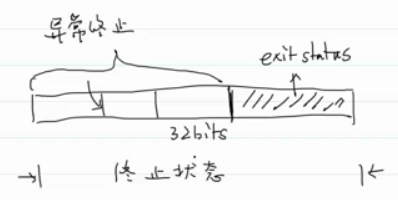
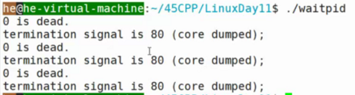

- # 一、fork #card
  collapsed:: true
	- ## 打开文件列表是否复制
		- ```C
		  int main()
		  {
		    int fd = open("file",O_RDWR | O_CREAT | O_TRUNC,0666);
		    //check
		    write(fd,"hello",5);
		    
		    pid_t pid = fork();
		    if(pid == 0)
		    {
		      const char* msg = "I am a baby\n";
		      write(fd,msg,strlen(msg));
		    }
		    else
		    {
		      const char* msg = "Who is your daddy\n";
		      write(fd,msg,strlen(msg));
		    }
		    return 0;
		  }
		  //结果
		  /*
		  helloWho is your daddy
		  I am a baby
		  */
		  //父子进程写的同一个文件
		  ```
		- **打开文件列表是每一个进程私有的，但是父子进程共享同一个文件对象**。（因为打开文件列表只是存的指针，最后写文件，就会写同一个文件了）
	- ==总结：子进程会复制父进程那些数据==
		- 1.堆栈、数据段
		- 2.用户态文件缓冲区
		- 3.打开文件列表
		- 4.进程组ID
		- 5.会话ID
		- ...
	- ==子进程和父进程的区别==
		- 1.fork返回值不同
		- 2.pid和ppid不一样。
		- ...
	- 具体的可以`man fork`
	-
- # 二、进程的终止 #card
  collapsed:: true
	- 进程有五种正常终止，三种异常终止
	- 正常终止：
		- 1.从main函数返回      `return -1;`
			- 区别终止和退出
				- 终止状态
				- 退出状态
		- 2.执行exit函数
			- 一般用来做进程资源回收的，执行exit退出就会回收资源
		- 3.执行_exit和_Exit函数
			- ```C
			  NAME
			         _exit, _Exit - terminate the calling process
			  
			  SYNOPSIS
			         #include <unistd.h>
			  
			         void _exit(int status);
			  
			         #include <stdlib.h>
			  
			         void _Exit(int status);
			  
			  RETURN VALUE
			         These functions do not return.
			  ```
			- ```C
			  //exit.c
			  void exit_handler(void)
			  {
			    printf("I am going to dead\n");
			  }
			  int main(void)
			  {
			    int retval = arexit(exit_handler);
			    //check
			    exit(1);
			  }
			  //I am going to dead
			  ```
				- `exit`：
					- 1.执行`atexit`注册的函数
					- 2.刷新用户态缓冲区
					- 3.执行`_exit`退出。
			- ```C
			  //_exit.c
			  void exit_handler(void)
			  {
			    printf("I am going to dead\n");
			  }
			  int main(void)
			  {
			    int retval = arexit(exit_handler);
			    //check
			    printf("_exit");
			    //fflush(STDOUT);
			    _exit(1);
			  }
			  //不会输出任何东西。
			  ```
			- `_exit`
				- 不会执行atexit
				- 也不会刷新用户态缓冲区
			- `atexit`
				- ```C
				  NAME
				         atexit - register a function to be called at normal process termination
				  
				  SYNOPSIS
				         #include <stdlib.h>
				  
				         int atexit(void (*function)(void));//函数指针
				         
				  RETURN VALUE
				         The atexit() function returns the value 0 if successful; otherwise it returns a nonzero value.
				  ```
		- 4.最后一个线程返回
		- 5.最后一个线程执行pthread_exit
	- 异常终止：
		- 1.执行abort    自杀
			- ```C
			  void exit_handler(void)
			  {
			    printf("I am going to dead\n");
			  }
			  int main(void)
			  {
			    int retval = arexit(exit_handler);
			    //check
			    printf("abort");
			    //fflush(stdout);
			    abort();
			  }
			  ```
			- 1.不会执行`atexit`注册的函数
			- 2.不会刷新用户态缓冲区
			- 本质上就是自己给自己发送`SIGABRT`信号
		- 2.进程接收到信号，信号的处理函数会让进程终止。
		- 3.最后一个线程响应取消请求
- # 三、孤儿进程、僵尸进程 #card
  collapsed:: true
	- **孤儿进程**：
		- 子进程还在运行，父进程已经终止（爹没了）。（树结构被破坏，重新构建树结构，重新找爹）孤儿进程会被1号进程（盘古进程）收养
	- **僵尸进程**：
		- 子进程死了，但是父进程没有给子进程收尸。
			- 当进程终止时，Linux内核会为终止的进程保留一些常有的信息（如：pid、终止状态、cpu总时间（进程的一生..）...）。父进程可以调用`wait`或者是`waitpid`获取这些信息，并清空数据结构。 11：08（√）
				- 当一个进程执行结束时，它会向它的父进程发送一个SIGCHLD信号，从而父进程可以根据子进程的终止情况进行处理。在父进程处理之前，内核必须要在进程队列当中维持已经终止的子进程的PCB。如果僵尸进程过多，将会占据过多的内核态空间。并且僵尸进程的状态无法转换成其他任何进程状态。
			- 僵尸进程太多，Linux内核就需要保留很多进程信息，占用大量内核空间。
			- 当子进程终止时，内核会给父进程发送`SIGCHLD`信号，父进程默认会忽略该信号，所以父进程想要获取信息，就需要调用wait或waitpid
- # 四、wait、waitpid #card
  collapsed:: true
	- ```c
	  NAME
	         wait, waitpid, waitid - wait for process to change state
	  
	  SYNOPSIS
	         #include <sys/types.h>
	         #include <sys/wait.h>
	  
	         pid_t wait(int *wstatus);//传入传出参数
	  
	         pid_t waitpid(pid_t pid, int *wstatus, int options);
	  
	         WIFEXITED(wstatus)
	                returns true if the child terminated  normally, 
	         WEXITSTATUS(wstatus)
	                returns  the  exit  status of the child.
	           ...
	  ```
	- wstatus：位图结构，int有32位
		- 
		- 正常退出状态：1字节
		- 异常退出信息：3字节
		- wait会把信息放入位图中
	- ```C
	  //wait.c
	  print_wstatus(int watatus)
	  {
	    if(WIFEXITED(wstatus))
	    {
	      printf("exit code is %d\n",WEXITSTATUS(wstatus));
	    }
	    else if(WIFSIGNALEN(wstatus))
	    {
	      printf("termination signal is %d",WTERMSIG(wstatus));
	      #ifdef WCOREDUMP
	      	printf("{core dumped;}\n");
	      #else
	      	printf("\n");
	      #endif
	    }
	  }
	  int main(void)
	  {
	    pid_t pid;
	    int wstatus;
	    //1
	    pid = fork();
	    if(pid == 0)
	    {
	      exit(123);//正常退出
	    }
	    int wpid = wait(&wstatus);//阻塞，直到有一个孩子状态发生改变;
	    printf("%d is dead\n",wpid);
	    print_wstatus(wstatus);
	    //2
	    pid = fork();
	    if(pid == 0)
	    {
	      abort();//自杀
	    }
	    wpid = wait(&wstatus);
	    printf("%d is dead\n",wpid);
	    print_wstatus(wstatus);
	    //3
	    pid = fork();
	    if(pid == 0)
	    {
	      int a = 10/0;//除0异常，发送除0异常信号
	    }
	    wpid = wait(&wstatus);
	    printf("%d is dead\n",wpid);
	    print_wstatus(wstatus);
	    
	    return 0;
	  }
	  ```
	- waitpid:
	- ```c
	  pid_t waitpid(pid_t pid, int *wstatus, int options);
	  
	  	   The value of pid can be:
	  
	         < -1   meaning  wait  for any child process whose process group ID is
	                equal to the absolute value of pid.
	  //对它取反或取绝对值，就表示进程组号了
	         -1     meaning wait for any child process.
	  
	         0      meaning wait for any child process whose process group  ID  is
	                equal  to  that of the calling process at the time of the call
	                to waitpid().
	  
	         > 0    meaning wait for the child whose process ID is  equal  to  the
	                value of pid.
	           
	  WNOHANG：不阻塞的意思。。w:wait。NO：no，HANG:hang up
	  ```
	- ```C
	  //wait.c
	  print_wstatus(int watatus)
	  {
	    if(WIFEXITED(wstatus))
	    {
	      printf("exit code is %d\n",WEXITSTATUS(wstatus));
	    }
	    else if(WIFSIGNALEN(wstatus))
	    {
	      printf("termination signal is %d",WTERMSIG(wstatus));
	      #ifdef WCOREDUMP
	      	printf("{core dumped;}\n");
	      #else
	      	printf("\n");
	      #endif
	    }
	  }
	  int main(void)
	  {
	    pid_t pid;
	    int wstatus;
	    //1
	    pid = fork();
	    if(pid == 0)
	    {
	      exit(123);//正常退出
	    }
	    int wpid = waitpid(pid,&wstatus,WNOHANG);//不阻塞，直到pid孩子状态发生改变;
	    //int wpid = waitpid(pid,&wstatus,0);//0表示会阻塞
	    printf("%d is dead\n",wpid);
	    print_wstatus(wstatus);
	    //2
	    pid = fork();
	    if(pid == 0)
	    {
	      abort();//自杀
	    }
	    wpid = waitpid(pid,&wstatus,WNOHANG);
	    printf("%d is dead\n",wpid);
	    print_wstatus(wstatus);
	    //3
	    pid = fork();
	    if(pid == 0)
	    {
	      int a = 10/0;//除0异常，发送除0异常信号
	    }
	    wpid = waitpid(pid,&wstatus,WNOHANG);
	    printf("%d is dead\n",wpid);
	    print_wstatus(wstatus);
	    
	    return 0;
	  }
	  ```
	- 
	- 0表示没有孩子死亡。