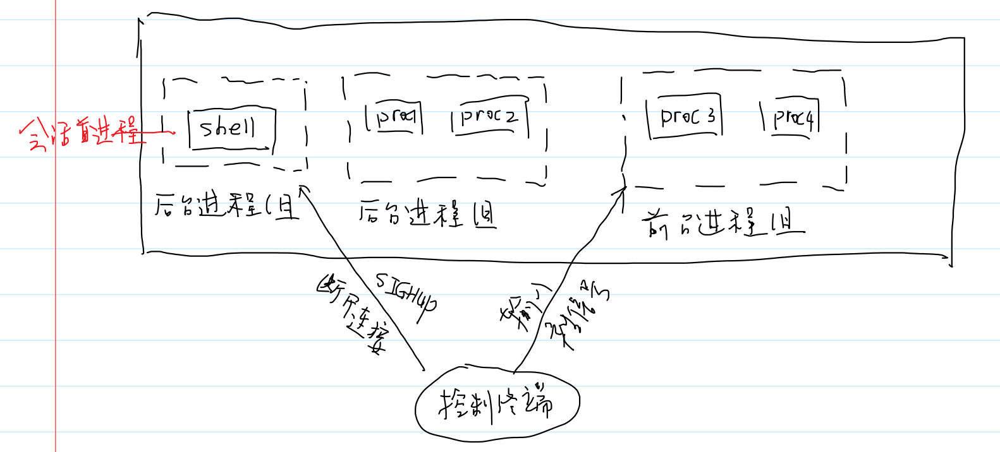
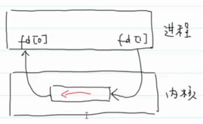
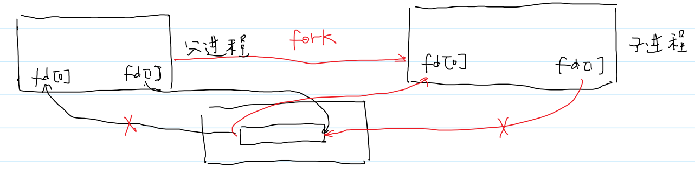
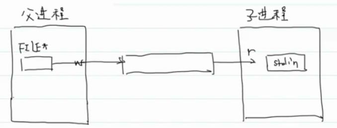
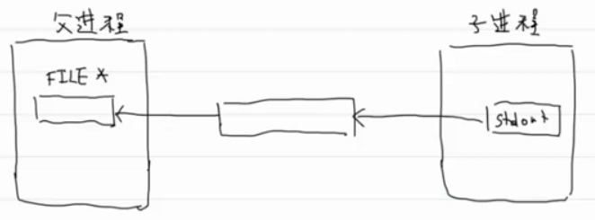

- # 一、竞态条件（race condition）
  collapsed:: true
	- ```C
	  int main(void)
	  {
	    pid_t pid = fork();
	    //check
	    
	    if(pid == 0)
	    {
	      pid = fork();
	      //check
	      
	      if(pid > 0)
	      {
	        exit(0);
	      }
	      //孙子
	      printf("second child: parent pid = %d",getppid());
	      exit(0);
	    }
	    waitpid(pid,NULL,0);//wait first child;
	    
	    return 0;
	  }
	  ```
		- 考虑孙子是孤儿的情况
	- 竞态条件是什么？：
		- 1.多进程共享数据（原子性问题等）
		- 2.最终结果依赖进程的执行顺序
	- **fork是竞态条件的滋生地**
	- **同步**：互通有无（把你知道的事情告诉我，我知道的事情告诉你。就是交流信息再做）
		- **前提**：进程之间能够进行通信
	- **异步**：各干各的，不进行交流
- # 二、exec函数簇 #card
	- 执行程序文件
	- ```C
	  NAME
	         execl, execlp, execle, execv, execvp, execvpe - execute a file
	  
	  SYNOPSIS
	         #include <unistd.h>
	  
	         extern char **environ;
	  
	         int execl(const char *pathname, const char *arg, ...
	                         /* (char  *) NULL */);
	         int execlp(const char *file, const char *arg, ...
	                         /* (char  *) NULL */);
	         int execle(const char *pathname, const char *arg, ...
	                         /*, (char *) NULL, char *const envp[] */);
	         int execv(const char *pathname, char *const argv[]);
	         int execvp(const char *file, char *const argv[]);
	         int execvpe(const char *file, char *const argv[],
	                         char *const envp[]);
	  
	  RETURN VALUE
	         The  exec() functions return only if an error has occurred.  The re‐
	         turn value is -1, and errno is set to indicate the error.
	  ```
	- `execl`：l：list，可变长参数（提供可执行文件的命令行参数）
	- p：`PATH`环境变量：可执行程序位于`PATH`环境变量的目录下面
	- e：`environment`：子进程会继承父进程的环境变量，用这个给子进程提供一个新的运行环境
	- v：`vector`：命令行参数位于数组中。
	-
	- ==**exec函数原理**==
		- 调用exec函数时，该进程的程序会替换成新的程序。而新程序是从main函数开始执行。调用exec函数时并不会创建新的进程，所以pid不会发生改变，只是从磁盘上加载了一个程序，并且替换了当前进程的代码段、数据段、堆栈信息。
	- ```C
	  //echoall.c
	  int main()
	  {
	    for(int i = 0;i<argc;i++)
	    {
	      printf("argv[%d]: %s\n",i,argv[i]);
	    }
	    extern char **environ;(environ可以看为char*类型的指针(char*) (*))
	    char **ptr;
	    for(ptr = environ;*prt != NULL;ptr++)
	    {
	      printf("%s\n",*ptr);
	    }
	  }
	  ```
	- ```C
	  //调用echoall.c
	  char* init_env[]={"USER=root","PATH=/tmp",NULL};//因为是可变参数所以需要
	  //以NULL结尾，exec族函数同
	  int main()
	  {
	    pid_t pid = fork();
	    //check
	    if(pid == 0)
	    {
	      execle("./echoall","myargs1","myargs2","NULL",init_ebv);
	      printf("Can you see me?\n");
	    }
	    waitpid(pid,NULL,0);
	  }
	  ```
	- exec成功，printf是不会执行的，如果执行，则exec替换失败
- # 三、system #card
	- ```c
	  NAME
	         system - execute a shell command
	  
	  SYNOPSIS
	         #include <stdlib.h>
	  
	         int system(const char *command);
	  ```
	- ```C
	  int mysystem(char* cmd);
	  int main(int argc,char* argv[])
	  {
	    // ./mysystem cmd
	    //check argc
	    mysystem(argv[1]);
	    return 0;
	  }
	  int mysystem(char* cmd)
	  {
	    pid_t pid = fork();
	    //check
	    if(pid == 0)
	    {
	      execlp("bash","bash","-c",cmd,NULL);
	      //-c:下一个参数就是bash要执行的命令 c：cmd
	      //第一个参数是可执行文件名。默认会从环境变量PATH中去找
	      
	      //表示没有替换成功，退出
	      _exit(127);
	      //_exit是为了避免刷新从父进程复制过来的用户态缓冲区。
	    }
	    waitpid(pid,NULL,0);
	    return 0;
	  }
	  ```
	- system用fork和exec组合实现
- # 四、进程组 #card
	- 每一个进程都属于一个进程组
		- 进程组：一个或多个进程的集合（并且一个进程只能隶属于一个进程组）
	- ```c
	  NAME
	         setpgid, getpgid, setpgrp, getpgrp - set/get process group
	  
	         pid_t getpgrp(void);                 /* POSIX.1 version */
	         int setpgid(pid_t pid, pid_t pgid);
	  
	         int setpgrp(pid_t pid, pid_t pgid);  /* BSD version */
	  //pid=0：表示该进程的pid
	  //pgid=0：创建新的进程组，并且当前进程为进程组的组长
	  //权限限制：只能设置自己或者子进程
	  //常用：setpgrp(0,0)--->自立为王。一般是组的成员进程去用，
	  //组长已经是一个组的组长了，当然不能用
	  ```
	- 每个一进程都有一个组长进程（group leader），进程组的id等于组长进程的PID
	- 如果组长进程死亡，只要进程组中有一个进程存在，该进程组就存在。（群龙无首）（组长进程死亡，如果进程组存在，那么PID不会被回收利用---延迟复用）
- # 五、会话 #card
	- 会话是一个或多个进程组的集合。
	- ```C
	  NAME
	         setsid - creates a session and sets the process group ID
	  
	  SYNOPSIS
	         #include <sys/types.h>
	         #include <unistd.h>
	  
	         pid_t setsid(void);
	  //创建新的会话，自立为王
	  //要求不是组长进程进行调用，自立为王。
	  ```
	- 如果调用这个函数的进程不是进程组的组长，那么此函数会创建一个新的会话
		- 1.该进程会变成会话的首进程（session leader）
			- sid就是会话首进程的pid
		- 2.该进程会成为一个新进程组的组长进程
		- 3.新会话没有控制终端
	- ```C
	  NAME
	         getsid - get session ID
	  
	  SYNOPSIS
	         #include <sys/types.h>
	         #include <unistd.h>
	  
	         pid_t getsid(pid_t pid);
	  //pid = 0，返回调用进程的sid
	  //如果pid！=0，要求调用进程和pid进程位于同一个会话中。
	  ```
	- ```C
	  int main()
	  {
	    pid_t pid = fork();
	    
	    if(pid == 0)
	    {
	      printf("groupid = %d,sessionid = %d\n",getpgid(0),getsid(0));
	      setsid();
	      printf("groupid = %d,sessionid = %d\n",getpgid(0),getsid(0));
	      exit(0);
	    }
	    printf("parent:pid = %d,pgid = %d,sid = %d\n",getpid(),getpgid(0),getsid(0));
	    waitpid(pid,NULL,0);//清子进程的资源
	  }
	  ```
	- 控制终端会和一个会话关联，这个会话的id就是前台进程的会话id。
	- ```C
	  //终端1
	  ubuntu@VM-16-2-ubuntu:~/My_Code/wangdao/LinuxDay12$ ./getsid sessionid = 1093969
	  ubuntu@VM-16-2-ubuntu:~/My_Code/wangdao/LinuxDay12$ ./getsid sessionid = 1093969
	  ubuntu@VM-16-2-ubuntu:~/My_Code/wangdao/LinuxDay12$ ./getsid sessionid = 1093969
	  
	  //终端2
	  ubuntu@VM-16-2-ubuntu:~/My_Code/wangdao/LinuxDay12$ ./getsid sessionid = 1095402
	  ubuntu@VM-16-2-ubuntu:~/My_Code/wangdao/LinuxDay12$ ./getsid sessionid = 1095402
	  ubuntu@VM-16-2-ubuntu:~/My_Code/wangdao/LinuxDay12$ ./getsid sessionid = 1095402
	  ```
- # 六、控制终端 #card
	- 1.一个会话可以有零个或一个控制终端。
	- 2.如果会话有控制终端，那么会话的首进程也被称为控制进程。
	- 3.与终端相连的会话有一个前台控制组，有零个或多个后台控制组
	- 4.前台进程组的成员（进程）可以响应键盘中断信号，可以读取终端输入。后台进程组则不会。
	- 5.会话与终端断开连接，会话首进程会收到`SIGHUP`信号（终止当前所有进程）
	-
	- **演示**：14：48（√）
		- 后台开启xlogo，再前台开启xlogo，他们属于一个会话。ctrl+c只会终止前台进程，因为只有前台进程收得到键盘中断信息。后台进程需要终端断开连接。首进程才会收到sighup信号，首进程会终止当前会话里的所有进程。
	- 
- # 七、守护进程
	- 就是一个进程位于会话中，但是这个会话没有与当前终端相关联。
	- ```C
	  //while.c
	  int main()
	  {
	    while(1)
	      ;
	  }
	  ```
	- ```C
	  int main()
	  {
	    //首先创建一个子进程，因为要用子进程创建新会话。我们没有手段去直接创建
	    //新会话
	    pid_t pid = fork();
	    
	    if(pid == 0)
	    {
	      //创建新的会话，终端即使关闭，while也不会受到影响
	      setsid();
	      execl("./while","./while",NULL);
	      //命令行第一个参数永远是可执行文件的路径
	      _exit(127);
	    }
	    
	    waitpid(pid,NULL,0);//当前会话的前台进程。ctrl+c关闭的就是这里，因为主进程阻塞在这里。
	    return 0;
	  }
	  ```
	- 关闭当前终端也无法关闭创建出的`./while`守护进程，需要使用`kill -9 pid`
		- 因为while在新的会话里面了
- # 八、进程间的通信
	- ## 1.概念
		- IPC：Interprocess Communication
		- IPC机制 #card
			- **管道**
				- 瀑布流型（流水线）    cmd1 | cmd2 | cmd3（ | 是匿名管道，1的结果交给2，2的结果交给3）
				- 执行这个命令时，父进程先fork，然后将父进程的stdout重定向为子进程的stdin重定向为管道，然后子进程`exec`执行命令。就可以实现`cmd1 | cmd2`
			- 消息队列--->短小的信息
				- 邮件
			- 信号量+共享内存
				- 信号量：保证进程依次访问共享内存，不会一起写
				- 联合开发
				- 大量数据，共用一块内存
			- ==信号==
				- 应急预案--来这个情况，我就这么做。
				- 来这个信号，我就那么做
			- 以上都是同一台主机内进程间的通信
			- ==套接字==
				- 网络
- # 九、管道 #card
	- 有名管道：fifo
		- 系统调用mkfifo可以创建man 3
	- 匿名管道：
		- 只能在具有公共祖先的进程之间通信，一般用于父子进程通信
			- 即有血缘关系的进程之间通信。因为需要fork出相同的文件描述符，来操纵相同的文件对象
	- ## 匿名管道
		- ```C
		  NAME
		         pipe, pipe2 - create pipe
		  
		  SYNOPSIS
		         #include <unistd.h>
		  
		         int pipe(int pipefd[2]);
		  //C只会传数组首地址，不会传数组大小，所以这个 [2] 是起提示作用，提示程序员，这是pipe
		  //pipefd[0]表示管道的读端
		  //pipefd[1]表示管道的写端
		  RETURN VALUE
		         On  success,  zero  is returned.  On error, -1 is returned, errno is
		         set appropriately, and pipefd is left unchanged.
		  ```
		- 管道由内核管理
		- ```C
		  int main(void)
		  {
		    int fd[2];
		    int retval = pipe(fd);
		    //check
		    char buf[1024] = {0};
		    char *msg = "hello form pipe.\n";
		    write(fd[1],msg,strlen(msg));
		    read(fd[0],buf,1024);
		    puts(buf);
		  }
		  ```
		- 
		- **父子进程间通信：**先pipe，再fork，建立了进程IPC通道，父进程关闭一端，子进程关闭另一端以保证单工通信。
		- 
		- ```C
		  int main(void)
		  {
		    int fd[2];
		    int retval = pipe(fd);
		    //check
		    pid_t pid = fork();
		    //父子进程的IPC通道建立了
		    //父写，孩读
		    if(pid == 0)
		    {
		      //关闭写端
		      close(fd[1]);
		      char buf[1024]={0};
		      read(fd[0],buf,1024);
		      printf("child:%s\n",buf);
		      exit(0);
		    }
		    //关闭读端
		    close(fd[0]);
		    char* msg = "Hello from parent";
		    write(fd[1],msg,strlen(msg));
		    return 0;  
		  }
		  ```
		- 管道两端是阻塞的。
		- **两根管道实现全双工通信：**
		- ```C
		  int main()
		  {
		    int fd1[2];
		    int fd2[2];
		    pipe(fd1);
		    pipe(fd2);
		    
		    pid_t pid = fork();
		    
		    char buf[1024];
		    if(pid == 0)
		    {
		      close(fd1[0]);
		      close(fd2[1]);
		      //...许多任务
		      printf("...\n");
		      //交换数据
		      char* msg = "homework done.\n";
		      write(fd1[1],msg,strlen(msg));
		      //等待对方数据
		      read(fd2[0],buf,1024);
		      printf("from parent: %s\n",buf);
		      //做其他的
		      printf("...\n")
		      exit(0);
		    }
		    close(fd1[1]);
		    close(fd2[0]);
		    
		    printf("...做其他的\n");
		    //等待数据
		    read(fd1[0],buf,1024);
		    //写信息
		    char* msg = "GOOD JOB!\n";
		    write(fd[2],msg,strlen(msg));
		    //继续做其他的
		    printf("...\n");
		    
		    exit(0);
		  }
		  ```
		- **poen**：p:pipe  利用pipe实现
			- ```C
			  NAME
			         popen, pclose - pipe stream to or from a process
			  
			  SYNOPSIS
			         #include <stdio.h>
			  
			         FILE *popen(const char *command, const char *type);
			  //返回文件流
			  //const char *type  为一个字符：“w” 或 “r”
			  //command：子进程要加载的程序文件。即：子进程运行command命令
			  //pipe fork dup2 exec实现
			         int pclose(FILE *stream);
			  ```
			- “w”：父进程是写段，子进程会将stdin重定向为管道
				- 
			- “r”：父进程是读端，子进程会将stdout重定向为管道
				- 
			- 例子：
			- ```C
			  int main(void)
			  {
			    //echoall前面自己写的
			    FILE* fp = popen("echoall","r");//放到PATH环境目录下哦
			    //底层exec实现，他就是在PATH找的
			    if(fp == NULL)exit(1);
			    
			    char buf[1024] = {0};
			    while(fgets(buf,1024,fp))
			    {
			      puts(buf);
			      memset(buf,0,1024);
			    }
			    return 0;
			  }
			  ```
		-
	-
- # 十、管道补充知识 #card
	- 1.如果写端关闭。读端可以读取管道中剩余的数据，如果管道中没有数据，会读到`EOF`，表示文件末尾
	- 2.如果读端关闭，写端写数据，该进程会收到`SIGPIPE`信号
	- 3.匿名管道是由内核管理的（引用计数法），如果引用计数为0，内核会自动删除管道。
- # 十一、不进行信号量同步的共享内存演示---原子性问题 #card
	- shm:share memory
	- ```C
	  NAME
	         shmget - allocates a System V shared memory segment
	  //在内核态创建一片共享内存
	  SYNOPSIS
	         #include <sys/ipc.h>
	         #include <sys/shm.h>
	  
	         int shmget(key_t key, size_t size, int shmflg);
	  ```
	- ```C
	  NAME
	         shmat, shmdt - System V shared memory operations
	  
	  SYNOPSIS
	         #include <sys/types.h>
	         #include <sys/shm.h>
	  
	         void *shmat(int shmid, const void *shmaddr, int shmflg);
	  //at：attach
	         int shmdt(const void *shmaddr);
	  //dt：detach 解除关联
	  ```
	- ```C
	  NAME
	         shmctl - System V shared memory control
	  
	  SYNOPSIS
	         #include <sys/ipc.h>
	         #include <sys/shm.h>
	  
	         int shmctl(int shmid, int cmd, struct shmid_ds *buf);
	  ```
	- shmget创建，shmat关联，shmdt解除关联，shmctl管理、释放
	- ```C
	  int main(void)
	  {
	    //创建共享内存
	    int shmid = shmget(IPC_PRIVATE,4096,0666 | IPC_CREAT);//,大小,权限 | 不存在就创建
	    //check -1
	    //和进程中某个虚拟页关联:NULL由内核自己决定映射到哪个位置
	    //虚拟页的有效位置为1
	    int *p = (int*)shmat(shmid,,NULL,0);
	    //得到这片共享内存的首地址 *p
	    
	    //将这片共享内存前四个字节置为0
	    p[0]=0;
	    
	    pid_t pid = fork();
	    if(pid == 0)
	    {
	      for(int i = 0;i < 100000000;i++)
	      {
	        p[0]++;
	      }
	      shmdt(p);//虚拟页的有效位置为0
	    }
	    else
	    {
	      for(int i = 0;i < 100000000;i++)
	      {
	        p[0]++;
	      }
	      waitpid(pid,NULL,0);
	      printf("p[0] = %d\n",p[0]);
	      
	      shmdt(p);//虚拟页的有效位置为0即可解除关联
	      
	      //删除共享内存
	      shmctl(shmid,IPC_RMID,NULL);
	    }
	  }
	  //运行结果 p[0] 远远小于两亿
	  
	  //问题在于p[0]++.
	  //p[0]++翻译成汇编并不是一条语句就能算出的，而是几条，那么最后的指令也会有好几条。
	  //指令执行周期在每条指令最后的中断处理周期是可以被中断的，从而使p[0]没有+1成功
	  //
	  ```
	- 并发问题的原因：
		- 竞态条件
	- 解决并发问题，需要同步机制（通信）