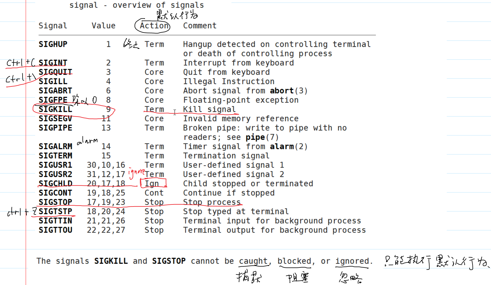
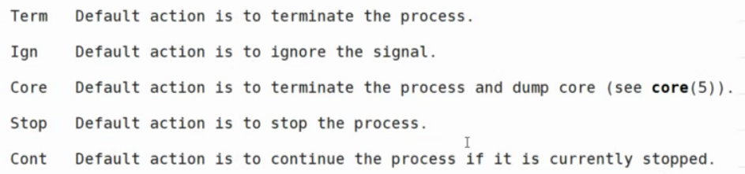
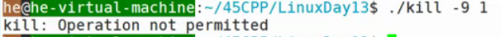
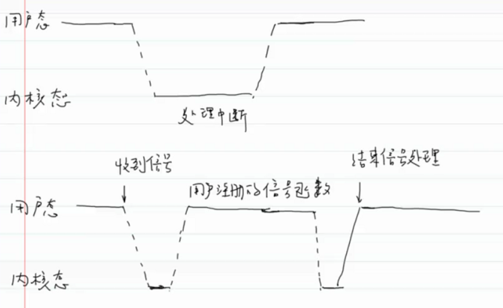
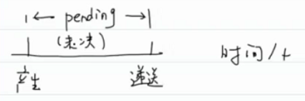
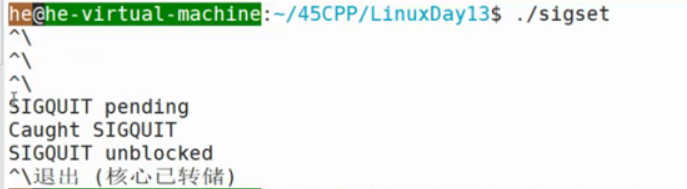
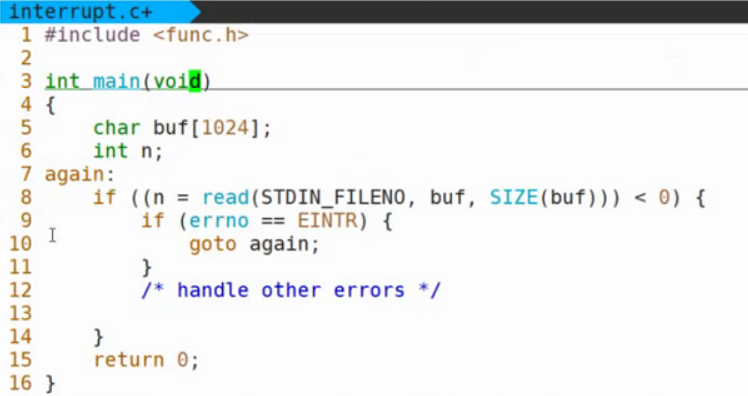
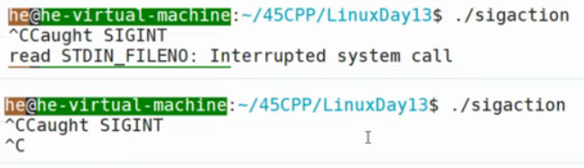

deck:: [[王道笔记/Linux13]]

- # 一、信号
  collapsed:: true
	- **信号的执行是异步的，什么时候会被递送，程序是不可预知的** #card
	- `kill -l`可以查看所有信号
	- ```C
	  The signals SIGKILL and SIGSTOP cannot be caught, blocked, or ignored.
	  只能执行默认行为
	  ```
	- 
- # 二、处理信号
  collapsed:: true
	- ## 1.执行默认操作
	  collapsed:: true
		- 
		- Core：终止进程并保存core文件
		- Stop：停止进程
		- Cont：continue：继续运行停止的进程
	- ## 2.捕捉信号
	  collapsed:: true
		- 自己定义一个信号处理函数。
		  collapsed:: true
			- 当信号产生的时候，捕获信号，执行我们自己定义的行为
	- ## 3.忽略信号
	- ## 4.信号处理流程
	  collapsed:: true
		- 1.注册信号处理函数
		- 2.发送信号
- # 三、注册信号处理函数（signal） #card
  collapsed:: true
	- ```C
	  //signal.c
	  int main(void)
	  {
	    printf("before\n");
	    sleep(5);
	    printf("after\n");
	  }
	  ```
	-
	- ```C
	  NAME
	         signal - ANSI C signal handling
	         
	  SYNOPSIS
	         #include <signal.h>
	  
	         typedef void (*sighandler_t)(int);
	  //sighandler_t是别名，类型void (*)(int)函数指针，返回值类型为void
	  //参数类型为int
	  //这一行编程时，需要自己定义写出来:typedef __sighandler_t sighandler_t;
	  
	         sighandler_t signal(int signum, sighandler_t handler);
	  //将handler函数和signum信号关联起来，当遇到这个信号时，就执行这个函数
	  
	  RETURN VALUE
	         signal() returns the previous value of the signal handler, or SIG_ERR  on  error.   In  the
	         event of an error, errno is set to indicate the cause.
	    //SIG_ERR是一个函数指针
	  
	  //sighandler_t handler取值：
	  If the signal signum is delivered to the process, then one of the following happens:
	  
	         *  If the disposition is set to SIG_IGN, then the signal is ignored.
	  
	         *  If the disposition is set to SIG_DFL, then the default action associated with the signal
	            (see signal(7)) occurs.
	  
	         *  If  the  disposition is set to a function, then first either the disposition is reset to
	            SIG_DFL, or the signal is blocked (see Portability below), and then  handler  is  called
	            with  argument  signum.   If  invocation of the handler caused the signal to be blocked,
	            then the signal is unblocked upon return from the handler.
	  ```
	- 演示：
	- ```C
	  typedef __sighandler_t sighander_t;//func.h
	  
	  void sig_fun(int signo)
	  {
	    switch(signo)
	    {
	          case SIGINT:
	    			printf("Receive a signal -- SIGINT\n");
	    			break;
	    		case SIGQUIT:
	    			printf("Receive a signal -- SIGQUIT\n");
	    			break;
	    		case SIGTSTP:
	    			printf("Receive a signal -- SIGTSTP\n");
	    			break;
	        /*SIGKILL和SIGSTOP是不能捕获的
	        case SIGKILL:
	    			printf("Receive a signal -- SIGKILL\n");
	    			break;
	        case SIGSTOP:
	    			printf("Receive a signal -- SIGSTOP\n");
	    			break;
	        */
	    		default:
	    			printf("Receive a signal\n");
	    			break;
	    }
	  }
	  int main(void)
	  {
	    sighandler_t oldhandler = signal(SIGINT,sig_fun);
	    //check
	    oldhandler = signal(SIGQUIT,sig_fun);
	    //check
	    oldhandler = signal(SIGTSTP,sig_fun);
	    //check
	    
	    /*
	    oldhandler = signal(SIGkill,sig_fun);
	    //check
	    随编译通过，但是是无法运行的，无法被绑定在一起，被捕获。check无法通过
	    报Invalid argument错误
	    oldhandler = signal(SIGstop,sig_fun);
	    //check
	    */
	    
	    while(1)
	      ;
	    return 0;
	  }
	  ```
	-
- # 四、发送信号（kill & raise）
  collapsed:: true
	- **发送信号的方式** #card
	  id:: 62c3d35d-d2b8-449f-967e-b9f54df92e00
	  collapsed:: true
		- 1.键盘的一些组合键
		  collapsed:: true
			- 发送给的是前台进程组的进程
			- `ctrl+c`:`SIGINT`
			- `ctrl+\`:`SIGQUIT`
			- `ctrl+z`：`SIGTSTP`
		- 2.硬件也会发送信号
		  collapsed:: true
			- 除零异常：`SIGFPE`
			- 执行非法指令：`SIGILL`
			- 访问非法内存：`SIGSEGV`
		- 3.OS内核会发送信号
		  collapsed:: true
			- 写一个读端关闭的管道：`SIGPIPE`
			  collapsed:: true
				- 因为管道是OS内核管理的一片内存空间，所以OS会发送信号
			- 子进程终止：`SIGCHILD`
		- 4.`kill`、`killall`命令
		- 5.系统调用：`kill`或`raise`
		  collapsed:: true
			- ((62c3d35d-8f87-4e5e-845c-f48b4fcf2a65))
	- ## raise 自己给自己发送信号 #card
	  collapsed:: true
		- ```C
		  NAME
		         raise - send a signal to the caller
		  //自己给自己发送信号
		  SYNOPSIS
		         #include <signal.h>
		  
		         int raise(int sig);//sig：信号的编号
		  
		  RETURN VALUE
		         raise() returns 0 on success, and nonzero for failure.
		  ```
		- ```c
		  void sigusr1_func(int signo)
		  {
		    printf("receive a signal\n");
		  }
		  int main(void)
		  {
		    //注册绑定信号
		    signal(SIGUSR1,sigusr1_func);
		    
		    //自己给自己发送信号
		    int retval = raise(SIGUSR1);
		    //check
		  }
		  ```
		- `raise`等价于`kill(getpid(), sig);`
	- ## kill 可以给任何进程或进程组发信号 #card
	  id:: 62c3d35d-8f87-4e5e-845c-f48b4fcf2a65
	  collapsed:: true
		- ```C
		  NAME
		         kill - send signal to a process
		  
		  SYNOPSIS
		         #include <sys/types.h>
		         #include <signal.h>
		  
		         int kill(pid_t pid, int sig);
		  
		  RETURN VALUE
		         On success (at least one signal was sent), zero is returned.  On error, -1 is returned, and
		         errno is set appropriately.
		  //kill可以给进程组发送信号，所以成功进程组中的一个就算成功
		  
		  The kill() system call can be used to send any signal to any process group or process.
		  
		         If pid is positive, then signal sig is sent to the process with the ID specified by pid.
		  //If pid is positive pid>0
		         If  pid  equals  0,  then  sig is sent to every process in the process group of the calling
		         process.
		  
		         If pid equals -1, then sig is sent to every process for which the calling process has  per‐
		         mission to send signals, except for process 1 (init), but see below.
		  
		         If  pid is less than -1, then sig is sent to every process in the process group whose ID is
		         -pid.
		  
		         If sig is 0, then no signal is sent, but existence and permission  checks  are  still  per‐
		         formed;  this  can  be  used to check for the existence of a process ID or process group ID
		         that the caller is permitted to signal.
		           //可以检测该pid进程/进程组是否存在
		  ```
		- pid>0：发送给指定进程
		- pid=0：发送给同进程组的其他成员
		- pid=-1：发送给所有有权限发送的进程
		  collapsed:: true
			- 一般是同用户启动的进程
		- pid< -1：发送给进程组ID为-pid号进程组的成员
		- **发送信号需要权限，一般情况下只能发送给同用户启动的进程**
		  collapsed:: true
			- 不是想发给谁就发给谁。不然不是可以kill -9 杀死1号进程
			- 
		- 演示：
		- ```C
		  //运行前面的./signal，用这个进程去终止他
		  //4225是他的pid，用ps aux | grep -nE "./signal"查出来的
		  
		  int main(int argc,char* argv[])
		  {
		    // ./kill -sig pid
		    pid_t pid;
		    int signo;
		    //转换：int-->char*  (string)
		    sscanf(argv[2],"%u",&pid);
		    sscanf(argv[1],"-%d",&signo);
		    
		    int retval = kill(pid,signo);
		    //check
		    return 0;
		  }
		  ```
- # 五、信号的执行流程
  collapsed:: true
	- 信号和中断的区别：
	- 
	  collapsed:: true
		- 收到信号：信号递送的意思
		- 执行完用户注册的信号函数后会回到内核态，从内核态退出。
		- 忽略、默认行为都是一个注册的处理函数。捕捉信号是用户自定义的处理函数
	- **信号处理是异步的**。程序不知道信号何时到来，但是一旦收到信号会立马执行信号处理函数。
- # 六、信号的机制
  collapsed:: true
	- **内核管理的信号**
	  collapsed:: true
		- 那自然包括屏蔽字、阻塞信号、未决信号...
	- ## 信号的产生（generated）
	  collapsed:: true
		- ((62c3d35d-d2b8-449f-967e-b9f54df92e00))
	- ## 信号的递送（delivered）
	  collapsed:: true
		- 指进程收到信号，开始处理信号（执行信号处理函数）
	- ## 未决信号（pending）
	  collapsed:: true
		- 信号产生了，但还没有递送。
		- 
		- 15：00（√）
		- **信号产生表示内核已知信号发生并修改进程的数据结构；信号递送表示内核执行信号处理流程。已经产生但是还没有传递的信号被称为挂起信号（pending signal）或者是未决信号。**
		- http://47.94.147.94/
	- task_struct结构体中与信号相关的东西： #card
	  card-last-interval:: 4
	  card-repeats:: 1
	  card-ease-factor:: 2.6
	  card-next-schedule:: 2022-07-10T08:07:34.468Z
	  card-last-reviewed:: 2022-07-06T08:07:34.469Z
	  card-last-score:: 5
	  collapsed:: true
		- ```C
		  //sched.h
		  //task_struct结构体中
		  //与信号相关的东西：
		  928  	/* Signal handlers: */
		  929  	struct signal_struct		*signal;
		  930  	struct sighand_struct		*sighand;
		  931  	sigset_t			blocked;//屏蔽字：屏蔽的信号。告诉OS应该为我这个进程屏蔽那些信号
		  932  	sigset_t			real_blocked;//临时屏蔽字。real：实时的
		  933  	/* Restored if set_restore_sigmask() was used: */
		  934  	sigset_t			saved_sigmask;//可能是保存以前的屏蔽字，不用care
		  935  	struct sigpending		pending;//未决信号：包括阻塞的信号。
		  //对于需要递送的信号看是否位于屏蔽字和临时屏蔽字中，不在则可递送
		  ``` #card
	- ## 阻塞信号
	  collapsed:: true
		- 信号产生了，但是OS不递送。（故意的）
		- 忽略是递送了但是不采取任何措施
		- 未决：产生了但是没来得及递送
	- 信号执行什么操作看的是什么时候递送，所以可以先阻塞着，然后改变信号执行函数，再递送
	- **递送的时机：**系统调用/中断返回前，才会递送信号 #card
	  collapsed:: true
		- 信号是内核产生的，（都是系统调用）OS如何把一个信号告诉给进程？在执行系统调用或中断返回的时候，才能递送信号到用户态的进程啊，只有这个时候才有联系嘛。
		- 递送的时机就是会从pending中取一个信号递送。也就是递送的是未决信号的一个（从挂起的信号中取一个响应执行）
	- **阻塞的信号何时递送：** #card
	  collapsed:: true
		- 1.解开阻塞时会递送。
		  collapsed:: true
			- 信号没有解除阻塞就会一直位于阻塞信号里面，不会位于pending里面，自然就无法递送。
		- 2.将该信号的处理方式改为忽略的时候，也会递送信号 14：48、15：03（√）
		  collapsed:: true
			- 阻塞是推迟，而不是忽略。在将处理信号改为忽略后，那自然会解除阻塞，处理时忽略掉这些信号，也就是不放入pending信号里，忽略，这也就是处理完了嘛。
	- sigset_t结构： #card
	  collapsed:: true
		- collapsed:: true
		  ```c
		  //sigset_t结构：位图
		  19  typedef struct {
		  20  	/* next_signal() assumes this is a long - no choice */
		  21  	unsigned long sig[_NSIG_WORDS];
		  22  } sigset_t;
		  ```
			- 位图：其中的一位可以表示信后的有无。
			  collapsed:: true
				- 但因为是位图，所以在一个信号阻塞期间产生了多个相同的信号，最后也只会响应一次。
				- 阻塞的信号、屏蔽字是位图结构。
	- 未决信号结构： #card
	  collapsed:: true
		- collapsed:: true
		  ```C
		  30  struct sigpending {
		  31  	struct list_head list;//链式队列
		  32  	sigset_t signal;//位图
		  33  };//未决信号结构
		  ```
			- 未决信号的结构：位图+链式队列
			  collapsed:: true
				- 有一个信号在处理过程中，在执行期间有一段时间是不能响应其他信号的（ps命令中有一个D：深度睡眠状态（不能响应信号）），这时同一信号来了多个，会处于未决状态（不是阻塞信号），这时，如果信号放在位图里面就只会响应一次，如果放在队列里面就会响应多次
- # 七、信号集操作 #card
  collapsed:: true
	- 对信号集 sigset_t 位图的操作：
	- ```C
	  SYNOPSIS
	         #include <signal.h>
	  
	         int sigemptyset(sigset_t *set);
	  //清空所有信号，全部置0
	         int sigfillset(sigset_t *set);
	  //设置所有信号
	         int sigaddset(sigset_t *set, int signum);
	  //加入某个信号：把某一位置为一
	         int sigdelset(sigset_t *set, int signum);
	  //删除某个信号
	         int sigismember(const sigset_t *set, int signum);
	  //判断集合中是否存在某一个信号，看他是不是1
	  ```
- # 八、sigprocmask查看和改变屏蔽字 #card
  collapsed:: true
	- ```C
	  NAME
	         sigprocmask, rt_sigprocmask - examine and change blocked signals
	  
	  SYNOPSIS
	         #include <signal.h>
	  
	         /* Prototype for the glibc wrapper function */
	         int sigprocmask(int how, const sigset_t *set, sigset_t *oldset);
	  //set传入传出参数
	  ```
	- how：15：17（√）
	  collapsed:: true
		- ```C
		         SIG_BLOCK
		                The set of blocked signals is the union of the current set and the set argument.
		  //current set OS内核管理
		  //set内容需被阻塞。set和current set集合并运算
		         SIG_UNBLOCK
		                The  signals in set are removed from the current set of blocked signals.  It is per‐
		                missible to attempt to unblock a signal which is not blocked.
		  //set内容不能被阻塞，current set和set集合差运算
		         SIG_SETMASK
		                The set of blocked signals is set to the argument set.
		  //将原来的屏蔽字设置为set
		                  
		         If oldset is non-NULL, the previous value of the signal mask is stored in oldset.
		  //set非空，返回改变前的屏蔽字到oldset
		         If set is NULL, then the signal mask is unchanged (i.e., how is ignored), but  the  current
		         value of the signal mask is nevertheless returned in oldset (if it is not NULL).
		  //set为NULL，就获取当前的屏蔽字
		  ```
	-
- # 九、sigpending获取未决信号
  collapsed:: true
	- ```C
	  NAME
	         sigpending, rt_sigpending - examine pending signals
	  
	  SYNOPSIS
	         #include <signal.h>
	  
	         int sigpending(sigset_t *set);
	  //set传入传出参数，返回时，set里面就是pending的signals
	  RETURN VALUE
	         sigpending()  returns 0 on success and -1 on error.  In the event of an error, errno is set
	         to indicate the cause.
	  ```
- # 十、sigprocmask、sigpending的例子 #card
  collapsed:: true
	- ```C
	  void sigquit(int signo);
	  int main()
	  {
	    //注册
	    signal(SIGQUIT,sigquit);
	    
	    sigset_t newmask,oldmask,pendingmask;
	    //清零
	    sigemptyset(&newmask);
	    //设置
	    sigaddset(&newmask,SIGQUIT);
	    //屏蔽SIGQUIT，保留了原来的屏蔽字
	    int retval = sigprocmask(SIG_BLOCK,&newmask,&oldmask);
	    //check
	    sleep(5);
	    //从键盘虽然输入SIGQUIT，但是不会递送SIGQUIT
	    
	    //获取处于未决状态的信号
	    retval = sigpending(&pendingmask);
	    //check
	    if(sigismenber(&pendingmask,SIGQUIT))
	    {
	      printf("SIGQUIT pending\n");
	    }
	    
	    //解除阻塞,恢复原来的屏蔽字
	    retval = sigprocmask(SIG_SETMASK;&oldmaskk,NULL);//不需要获取原来的：NULL
	    //check
	    printf("SIGQUIT unblocked\n");
	    sleep(5);
	    //会递送SIGQUIT
	  }
	  void sigquit(int signo)
	  {
	    printf("Caught SIGQUIT\n");
	    
	    signal(SIGQUIT,SIG_DFL);//恢复默认行为，只会捕获一次。
	  }
	  ```
	- 
	- 当解开阻塞时，会递送一个阻塞的信号，所以Caught SIGQUIT在unblocked前面
	  collapsed:: true
		- 具体递送哪一个，OS决定
	- 最后退出，是因为`sigquit`函数内改变了`SIGQUIT`的处理，重新变为默认：退出，保存`core`文件
- # 十一、可中断的系统调用--会阻塞的系统调用
	- **概念：能够响应信号的系统调用**
		- 系统调用运行过程中被信号中断。
	- 不是所有系统调用都可以被中断
	- 有些系统调用是很慢的，若一个进程读阻塞(读文件是系统调用)了，必须能够中断它，不然就要一直等了。
		- **可中断是为了避免永久等待**
	- 有的不能中断：有的系统调用很快就能完成，这样的系统调用就不应该可以被中断
	- ## 包含那些系统调用？
		- 1.读/写低速设备（某些类型的文件）
			- 管道、终端设备、网络...这些可能发生永久的阻塞，所以他们应该能够被中断
		- 2.打开低速设备（某些类型的文件）
			- 打开管道
				- 需要建立连接，两端都建立连接了才能打开管道
			- 终端设备
			- 网络：不一定能连上呀
		- 3.pause
			- 等待一个信号就退出等待，那么可能后面就i没有任何信号了，就永久等待了
		- 4.wait/waitpid
		- ...
	- 问题：系统调用中断之后，我们该如何处理该系统调用？重新启动还是返回错误就行？
		- 1.返回错误码（System Ⅴ）
			- 认为本次系统调用失败，终止系统调用，返回错误码
			- 有些会把`errno`设置为`EINTR`，不重启。这就可能需要手动重启
			- 
		- 2.自动重启系统调用（BSD风格）
			- 对某些能够中断的系统调用进行自动重启，并不是所有的。
			- read/write/open->低速设备
				- 可能永久阻塞
			- wait/waitpid
	- 这样很麻烦
- # 十二、sigaction（自己决定信号的行为怎么处理，而不依赖于具体的函数） #card
  collapsed:: true
	- 上面两个方法可移植性差，也不能自己决定是否重启，也会有版本差异，尽量不用，用`sigaction`可以自己决定，自定义一些行为。
	- ```C
	  NAME
	         sigaction, rt_sigaction - examine and change a signal action
	  
	  SYNOPSIS
	         #include <signal.h>
	  
	         int sigaction(int signum, const struct sigaction *act,
	                       struct sigaction *oldact);
	  //oldact保留原来的行动
	  ```
	- ```C
	             struct sigaction {
	                 void     (*sa_handler)(int);
	                 void     (*sa_sigaction)(int, siginfo_t *, void *);//sa_flags有SA_SIGINFO则
	               //表示信号处理函数是这个
	               //这两个表示信号处理函数，只能二选一
	               
	                 sigset_t   sa_mask;//临时屏蔽字
	               //当我在执行这个信号处理函数的时候，我会屏蔽一些信号。处理完后会解除屏蔽
	                 int        sa_flags;
	                 void     (*sa_restorer)(void);
	               //The sa_restorer field is not intended for application  use.
	               //是OS内核用的，我们不用管
	             };
	  ```
	- `sa_flags`：
	- ```C
	             SA_NODEFER
	                    Do not prevent the signal from being received from within its  own  signal  han‐
	                    dler.   This flag is meaningful only when establishing a signal handler.  SA_NO‐
	                    MASK is an obsolete, nonstandard synonym for this flag.
	  //defer：推迟。表示在响应信号时，不屏蔽同类型的信号。最后就像一个函数调用栈，一层一层响应信号
	  //默认是屏蔽的
	             SA_RESETHAND
	                    Restore the signal action to the default upon entry to the signal handler.  This
	                    flag  is  meaningful  only when establishing a signal handler.  SA_ONESHOT is an
	                    obsolete, nonstandard synonym for this flag.
	  //reset：重设。hand：handler；只触发一次，然后设置为默认行为
	             SA_RESTART
	                    Provide behavior compatible with BSD signal semantics by making  certain  system
	                    calls  restartable across signals.  This flag is meaningful only when establish‐
	                    ing a signal handler.  See signal(7) for a discussion of system call restarting.
	  //自动重启可中断的系统调用
	  //控制粒度很细，信号级别的。当是这个信号的时候会重启，如果来了其他信号，它发生中断，他是不会重启的
	             SA_SIGINFO (since Linux 2.2)
	                    The signal handler takes three arguments, not one.  In this  case,  sa_sigaction
	                    should  be  set instead of sa_handler.  This flag is meaningful only when estab‐
	                    lishing a signal handler.
	  //有这个则表示信号处理函数用void     (*sa_sigaction)(int, siginfo_t *, void *);
	  ```
	- 演示：
	- ```C
	  void sigint_func(int signo);
	  int main(void)
	  {
	    //注册信号处理函数
	    signal(SIGINT,sigint_func);
	    
	    while(1)
	      ;
	    return 0;
	  }
	  void sigint_func(int signo)
	  {
	    printf("Caught SIGINT\n");
	  }
	  //这样每收到一个信号就会响应一次
	  ```
	- ```C
	  //sigaction处理：只执行一次自定义行为
	  void sigint_func(int signo);
	  int main(void)
	  {
	    struct sigaction act,oldact;
	    //初始化
	    act.sa_handler = sigint_func;
	    //清空mask
	    sigemptyset(&act.sa_mask);
	    //默认为0
	    act.sa_flags = 0;
	    //按位或设置
	    act.sa_flags |=SA_RESETHAND;//只执行一次，后恢复默认行为
	    
	    //注册
	    sigaction(SIGINT,&act,&oldact);
	    //这样接收到的信号就只会执行一次自定义的行为
	    
	    while(1)
	      ;
	    return 0;
	  }
	  void sigint_func(int signo)
	  {
	    printf("Caught SIGINT\n");
	  }
	  ```
	- 17：25(√)
	- ```C
	  //自定义信号的处理行为。
	  void sigint_func(int signo);
	  int main(void)
	  {
	    struct sigaction act,oldact;
	    //初始化
	    act.sa_handler = sigint_func;
	    //清空mask
	    sigemptyset(&act.sa_mask);
	    //默认为0
	    act.sa_flags = 0;
	    //按位或设置
	    act.sa_flags |=SA_RESETHAND;//只执行一次，后恢复默认行为
	    act.sa_flags |=SA_RESTART;
	    
	    //注册
	    sigaction(SIGINT,&act,&oldact);
	    //这样接收到的信号就只会执行一次自定义的行为
	    
	    char buf[1024] = {0};
	    int n = read(STDIN_FILENO,buf,1024);
	    ERROR_CHECK(n,-1,"read STDIN_FILENO");
	    
	    puts(buf);
	    
	    while(1)
	      ;
	    return 0;
	  }
	  void sigint_func(int signo)
	  {
	    printf("Caught SIGINT\n");
	  }
	  ```
	- 
	  collapsed:: true
		- 第一个：没有设置SA_RESTART标志，不会重启read系统调用
		- 第二个：设置了SA_RESTART标志，重启了read系统调用，但是有SA_RESETHAND，所以只会执行一次自定义行为，第二次会执行默认行为。
	- 但是这个函数使用起来太麻烦了，所以我们往往会封装它，然后像使用signal一样简单的使用它。
	- ```C
	  //重启可中断的系统调用封装
	  sighandler_t signal_restart(int signo,sighandler_t handler)//sighandler_t要注册的信号处理函数
	  {
	    struct sigaction act,oldact;
	    act.sa_handler = handler;
	    //清空mask
	    sigemptyset(&act.sa_mask);
	    //设置sa_flags,首先设为0，表示没有任何行为
	    act.sa_flags = 0;
	    
	    act.sa_flags |= SA_RESTART;
	    int retval = sigaction(sino,&act,&oldact);
	    //check
	    if(retval == -1)
	    {
	      return SIG_ERR;
	    }
	    return oldact.sa_handler;
	  }
	  
	  //不重启，直接中断
	  sighandler_t signal_interrupt(int signo,sighandler_t handler)//sighandler_t要注册的信号处理函数
	  {
	    struct sigaction act,oldact;
	    act.sa_handler = handler;
	    //清空mask
	    sigemptyset(&act.sa_mask);
	    //设置sa_flags,首先设为0，表示没有任何行为
	    act.sa_flags = 0;
	    
	    //有的系统会这样做
	  #ifdef SA_INTERRUPT
	    act.sa_flags |= SA_INTERRUPT;
	  #endif
	    
	    int retval = sigaction(sino,&act,&oldact);
	    //check
	    if(retval == -1)
	    {
	      return SIG_ERR;
	    }
	    return oldact.sa_handler;
	  }
	  ```