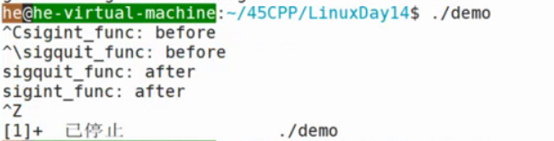
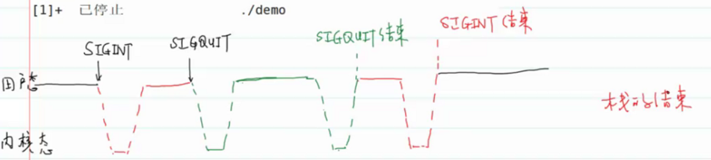

- # 一、可重入函数
	- 针对信号处理函数中而言可不可重入。
	- ```C
	  //missing.c
	  int global = 1;
	  
	  void sigint_func(int signo);
	  void foo()
	  {
	    global = 2;
	  }
	  int main()
	  {
	    struct sigaction act;
	    act.sa_handler = sigint_func;
	    sigemptyset(&act.sa_mask);
	    act.sa_flags = 0;
	    
	    sigaction(SIGINT,act,NULL);
	    
	    //正常流程
	    printf("before: global = %d\n",global);
	    sleep(5);
	    printf("after: global = %d\n",global);
	  }
	  
	  void sigint_func(int signo)
	  {
	    printf("Caught SIGINT\n");
	    //更改全局变量
	    //foo这个函数是不可重入的，损坏了原来的全局变量的值
	    foo();
	  }
	  ```
		- 信号处理函数调用一个函数后可能会修改全局变量或静态数据区的数据，这个函数就称为不可重入函数。
	- **可重入函数**：在信号处理函数中可以安全调用的函数
		- reentrant
		- 安全调用：asyc-signal safe：异步信号安全
		- 不会修改全局的数据结构
	- **不可重入的函数**：
		- 1.malloc/calloc/realloc/free
			- malloc/calloc/free过程是可以接收信号的，如果前一个信号malloc，过程中又接到一个信号，malloc或free掉了同一个地方就完了。内存空闲空间用链表连起来的话，那么前一个malloc刚断开一半指针，后面又来了，不就无了。
		- 2.标准库IO函数
			- printf、scanf...
			- 打印过程中收到信号，然后进入下一个处理函数，又有打印，不就打印在一堆了。输入也是。输入一半，然后接收到信号了，那缓冲区的数据怎么办？去那个处理函数？
		- 3.使用静态数据区的函数
			- getpwnam...
	- ==自己写信号处理函数时应该注意的事情==
		- 1.不要修改全局数据结构（包括静态区和堆上的数据）
			- 全局变量啊、全局数据结构啊什么的
		- 2.不要调用不可重入函数
			- 不然第一个在执行的时候，又来个信号，然后又执行这个，不就覆盖了第一次的，就不对了。
- # 二、示例，感受信号的执行流程
  collapsed:: true
	- collapsed:: true
	  ```C
	  //demo.c
	  //查看不同情况下信号的行为
	  void sigint_func(int signo);
	  
	  void sigquit_func(int signo);
	  
	  int main(void)
	  {
	    //注册
	    struct sigaction act1,act2;
	    act1.sa_handler = sigint_func;
	    sigemptyset(&act1.sa_mask);
	    act1.sa_flasg = 0;
	    
	    sigaction(SIGINT,act1,NULL);
	    
	    act2.sa_handler = sigquit_func;
	    sigemptyset(&act2.sa_mask);
	    act2.sa_flasg = 0;
	    
	    sigaction(SIGINT,act2,NULL);
	    
	    while(1)
	      ;
	    return 0;  
	  }
	  
	  void sigint_func(int signo)
	  {
	    //不要用printf，只是为了演示方便
	    printf("sigint_func before\n");
	    sleep(5);//睡眠5s过程中输入ctrl+\ SIGQUIT信号
	    printf("sigint_func after\n");
	  }
	  
	  void sigquit_func(int signo)
	  {
	    printf("sigquit_func before\n");
	    sleep(5);
	    printf("sigquit_func after\n");
	  }
	  ```
		- 用户的代码是可以响应信号的，所以在第一个信号处理过程中可以响应第二个信号，去处理第二个信号。就像一个函数调用栈：
		- 
		  id:: 62c501a3-47c0-473a-a5dd-606b23ea1677
		- 