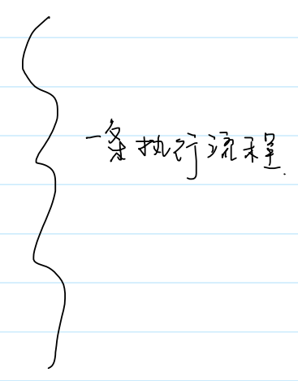
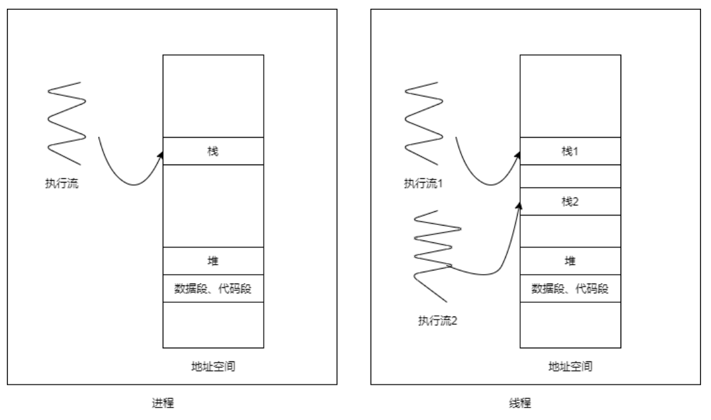
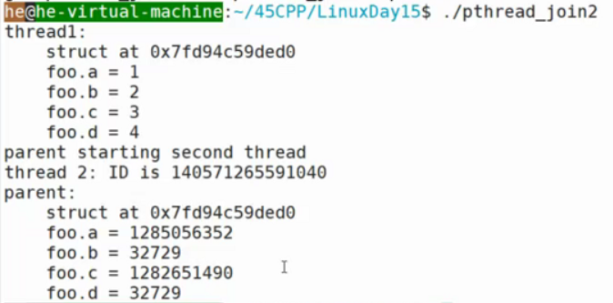
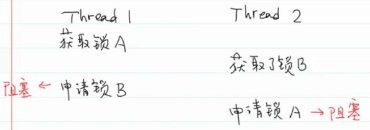

- # 一、线程的概念
  collapsed:: true
	- 线程就是一条执行流程
	- 
	- 
	- 线程间可以共享进程的所有资源（包括打开文件列表、进程地址空间等）
	- 进程：是OS分配资源的最小单位
	- 线程：是CPU调度的最小单位
- # 二、为什么引入线程
  collapsed:: true
	- 核心的两个原因：
	  collapsed:: true
		- 1.进程之间切换代价太大，线程之间的切换代价会小很多
		  collapsed:: true
			- TLB失效、Cache失效
		- 2.进程之间是隔离的（对一个进程来说是感受不到另一个进程的存在的），所以进程间通信需要打破隔离的屏障，代价很大。线程间共享进程的所有资源，通信的代价几乎没有，但是需要保证数据的一致性。
- # 三、线程的标识
  collapsed:: true
	- 线程的ID在同一个进程内才有意义
	- 目前使用最广泛的线程库名为NPTL (Native POSIX Threads Library)，在Linux内核2.6版本之后，它取代了传统的LinuxThreads线程库。NPTL支持了POSIX的线程标准库。
	  collapsed:: true
		- 因为它支持了POSIX的线程标准库，所以用它。
	- ## pthread_self
	  collapsed:: true
		- 每个使用线程库的 都要链接`-lpthread`，这里省略了`l`。
		- ```C
		  NAME
		         pthread_self - obtain ID of the calling thread
		  
		  SYNOPSIS
		         #include <pthread.h>
		  
		         pthread_t pthread_self(void);
		  //pthread_t：线程ID
		  
		         Compile and link with -pthread.
		           //-lpthread，这里省略了l
		  
		  RETURN VALUE
		         This function always succeeds, returning the calling thread's ID.
		  ```
	- ## pthread_equal
	  collapsed:: true
		- 线程的pthread_t是一个数据结构，在不同OS中不同，所以我们不能直接==比较，要用pthread_equal进行比较。
		- ```C
		  NAME
		         pthread_equal - compare thread IDs
		  
		  SYNOPSIS
		         #include <pthread.h>
		  
		         int pthread_equal(pthread_t t1, pthread_t t2);
		  
		         Compile and link with -pthread.
		           
		  RETURN VALUE
		         If the two thread IDs are equal, pthread_equal() returns a nonzero value; otherwise, it returns
		         0.
		  ```
- # 四、==线程的创建==
  collapsed:: true
	- ```C
	  NAME
	         pthread_create - create a new thread
	  
	  SYNOPSIS
	         #include <pthread.h>
	  
	         int pthread_create(pthread_t *thread, const pthread_attr_t *attr,
	                            void *(*start_routine) (void *), void *arg);
	  
	         Compile and link with -pthread.
	           
	  RETURN VALUE
	         On success, pthread_create() returns 0; on error, it returns an error number, and the  contents
	         of *thread are undefined.
	  //返回的值是错误码，不会设置errorno.
	  //在线程中错误码是每个线程独享的。
	  //如果是全局变量errno，那么有一个线程检查的时候，可能其他线程发生错误，更改了errno
	  //这样就错了。
	  //所以也就不能用perror(它会找全局变量errno，再输出对应错误信息)，
	  //要用strerror打印错误信息（他找的是传入的err值）
	  ```
	- `thread`：线程的ID，传入传出参数。
		- 用户不能指定线程的ID，OS进行管理，必须由OS内核分配，所以我们需要传入一个参数获取OS分配的线程ID
	- `attr`：线程的属性，一般填NULL，表示采用默认属性
		- attribute
	- `start_routine`：线程的入口函数（类似进程的main函数）
		- 函数指针：`void *(*) (void *)`
			- `void *`是通用指针，可以转化为其他任意类型的指。
			- `void *`在32位系统上占4个字节，在64位系统上占8个字节
				- 所以`void*`可以和整型/浮点型数值转换。（不超过void*大小就可以转换）。只是换了另外一种方式去解释这片内存空间
		- 线程从这儿开始执行。
	- `arg`：线程入口函数的参数。
	-
	- `pthread_create`：是新线程先执行还是旧线程先执行，是不确定的
		- 类比`fork`，是竞态条件的滋生地
	-
	- `pthread_create`示例：
	- ```C
	  pthread_t ntid;
	  
	  void printids(const char* msg)
	  {
	    pid_t pid = getpid();
	    pthread_t tid = pthread_self();
	    //pthread_t tid = ntid;不能用。见下
	    
	    
	    printf("%s:pid %lu, pid %lu (%lx)\n",
	          msg,
	          (unsigned long)pid,//跨平台表示，不管pid什么类型，先强转，因为每个系统实现
	           //pid类型可能不一样。
	          (unsigned long)tid,
	          (unsigned long)tid);
	  }
	  
	  void* start_routine(void* arg)
	  {
	    printfids("new thread");
	    return NULL;
	  }
	  
	  int main(void)
	  {
	    int err = pthread_create(&ntid,NULL,start_routine,NULL);
	    if(err!=0)
	    {
	      fprintf(stderr,"Cannot create thread: %s\n",strerror(err));
	      //exit(1);//会导致整个进程结束
	    }
	    //main 线程
	    printids("main thread");
	    
	    //如果主线程退出，会导致整个进程退出
	    sleep(1);
	    return 0;
	  }
	  ```
	- **如果主线程退出，会导致整个进程退出。**
	- **不能把pthread_create看成一个整体，他不是一个原子操作，pthread_create会调用系统调用创建线程，创建成功后才会把线程id赋值给ntid（这一段是库函数内容了），但是创建完后返回到主线程，可能主线程还没赋值，新线程就先执行了，这时ntid就 != 线程id，就出错了。**
	- 新线程的执行流程就是入口函数，当入口函数返回，新线程就结束。
- # 五、==线程的终止==
  collapsed:: true
	- **在线程中调用exit、_exit、_Exit函数会导致整个进程终止**
	- ```C
	  pthread_t ntid;
	  
	  void printids(const char* msg)
	  {
	    pid_t pid = getpid();
	    pthread_t tid = pthread_self();
	    
	    printf("%s:pid %lu, pid %lu (%lx)\n",
	          msg,
	          (unsigned long)pid,
	          (unsigned long)tid,
	          (unsigned long)tid);
	  }
	  
	  void* start_routine(void* arg)
	  {
	    printfids("new thread");
	    exit(1);//会终止进程
	  }
	  
	  int main(void)
	  {
	    int err = pthread_create(&ntid,NULL,start_routine,NULL);
	    if(err!=0)
	    {
	      fprintf(stderr,"Cannot create thread: %s\n",strerror(err));
	    }
	    //main 线程
	    sleep(1);//等带线程执行exit
	    printids("main thread");
	    
	    sleep(1);
	    return 0;
	  }
	  ```
	- **线程的终止**
		- 1.从线程的入口函数返回，返回值为线程的退出码
		- 2.线程可以被**同进程**的其他线程取消。
			- `pthread_cancel`：`int pthread_cancel(pthread_tthread);`
		- 3.线程自己调用pthread_exi退出
			- ```C
			  NAME
			         pthread_exit - terminate calling thread
			  
			  SYNOPSIS
			         #include <pthread.h>
			  
			         void pthread_exit(void *retval);
			  
			         Compile and link with -pthread.
			           
			  RETURN VALUE
			         This function does not return to the caller.
			  ```
			- retval：线程的退出码/退出状态码
				- 可以被其他线程获取，知晓退出信息
			- `pthread_join`：可以获取另一个线程的退出码
			- ```C
			  NAME
			         pthread_join - join with a terminated thread
			  
			  SYNOPSIS
			         #include <pthread.h>
			  
			         int pthread_join(pthread_t thread, void **retval);
			  
			         Compile and link with -pthread.
			  
			  RETURN VALUE
			         On success, pthread_join() returns 0; on error, it returns an error number.
			  
			  If  the  target  thread was canceled, then PTHREAD_CANCELED is placed in the location
			         pointed to by retval.
			  //如果目标线程响应pthread_cancel取消了，则retval返回PTHREAD_CANCELED宏
			  ```
			- 线程会一直阻塞等待目标thread线程终止，目标线程终止时，会把退出码放入reval所指向的位置。
			- retval：保留被join线程的退出码
			- join的使用示例：
			- ```C
			  //线程入口函数
			  void* thread1_func(void* arg)
			  {
			    printf("thread1 returning\n");
			    return (void*)1;
			  }
			  
			  void* thread2_func(void* arg)
			  {
			    printf("thread2 exiting\n");
			    pthread_exit((void*)2);
			  }
			  
			  int main(void)
			  {
			    pthread_t tid1,tid2;
			    int err;
			    
			    //创建线程
			    err = pthread_create(&tid1,NULL,thread1_func,NULL);
			    THREAD_ERROR_CHECK(err,"pthread_create");
			    
			    err = pthread_create(&tid2,NULL,thread2_func,NULL);
			    THREAD_ERROR_CHECK(err,"pthread_create");
			    
			    //希望线程的退出状态码保留在tret中
			    //获取线程退出状态码
			    void* tret;
			    err = pthread_join(tid1,&tret);
			    THREAD_ERROR_CHECK(err,"pthread_join");
			    printf("thread1_exit_code: %ld\n",(long)tret);
			    
			    err = pthread_join(tid2,&tret);
			    THREAD_ERROR_CHECK(err,"pthread_join");
			    printf("thread2_exit_code: %ld\n",(long)tret);
			    
			    return 0;
			  }
			  ```
	-
	- 返回的信息不要位于即将终止的线程的栈空间上：
	- ```C
	  struct foo
	  {
	    int a,b,c,d;
	  };
	  
	  void print_foo(char* msg,struct foo* fp)
	  {
	    printf("%s,"msg);
	    //打印fp的值，看结构体的地址是多少.确认下面两次打印的是相同的地址的数据结构
	    printf("   struct at %p\n",fp);
	    printf("   foo.a = %d\n",fp->a);
	    printf("   foo.b = %d\n",fp->b);
	    printf("   foo.c = %d\n",fp->c);
	    printf("   foo.d = %d\n",fp->d);
	  }
	  
	  void *thread1_func(void* arg)
	  {
	    struct foo foo1 = {1,2,3,4};
	    printf_foo("thread1:\n",&foo1);
	    pthread_exit((void*)&foo1);
	  }
	  
	  void *thread2_func(void* arg)
	  {
	    printf("thread 2 : ID is %lu\n",(unsigned long)pthread_self());
	    pthread_exit(NULL);//其实就是返回0，NULL
	  }
	  
	  int main()
	  {
	    pthread_t tid1,tid2;
	    int err;
	    
	    err = pthread_create(&tid1,NULL,thread1_func,NULL);
	    //check
	    
	    struct foo *fp;
	    err = pthread_join(tid1,(void**)&fp);
	    
	    sleep(5);
	    
	    //用第二个线程去复用第一个线程运行结束后的线程栈空间。不一定成功
	    printf("parent starting seconde thread\n");
	    
	    err = pthread_create(&tid2,NULL,thread2_func,NULL);
	    //check
	    sleep(1);
	    //现在打印查看
	    pint_foo("parent:\n",fp);
	    
	  }
	  ```
		- 
		-
- # 六、宏函数会用do...while(0)包裹起来
  collapsed:: true
	- ```C
	  #define THREAD_ERROR_CHECK(ret,msg)\
	  	do\
	  	{\
	  		if(ret != 0)\
	  			fprintf(stderr,"%s:%s\n",msg,strerror(ret));\
	  	}while(0)
	  //没有分号
	  ```
	-
	- 若不包裹：
	- ```C
	  #define THREAD_ERROR_CHECK(ret,msg)\
	  	{\
	  		if(ret != 0)\
	  			fprintf(stderr,"%s:%s\n",msg,strerror(ret));\
	  	}
	  
	  int main()
	  {
	    int i = 1;
	    if(i != 0)
	      THREAD_ERROR_CHECK(1,"i!=0");//错在这个分号，前面宏函数替换后，会是};就认为
	    //if结束了，所以下面else报错。
	    /*
	    if(..)
	    {
	    	..
	    };错在这里
	    */
	    else//这里报错
	      printf("hello\n");
	  }
	  ```
	- 无法通过编译。
	- 对宏函数展开后，后面会有一个`;`，就认为if语句已经结束了
	- ```C
	  //加上do..while(0)
	  if(...)
	    do
	    {
	      ...
	    }while(0);
	  else
	    ...
	  ```
- # 七、线程的清理
  collapsed:: true
	- 线程清理函数
	- ```C
	  NAME
	         pthread_cleanup_push, pthread_cleanup_pop - push and pop thread cancellation clean-up handlers
	  
	  SYNOPSIS
	         #include <pthread.h>
	  
	         void pthread_cleanup_push(void (*routine)(void *),
	                                   void *arg);
	  //清理函数入栈
	  //arg：线程清理函数的参数
	         void pthread_cleanup_pop(int execute);
	  //清理函数出栈
	  
	         Compile and link with -pthread.
	  ```
	- 清理函数是通过栈进行管理的
	- **如果execute非0，清理函数弹栈后会执行清理函数，如果为0，则弹栈后不会执行清理函数**
	- 线程清理函数被调用的时机：
		- ```C
		  1. When  a  thread is canceled, all of the stacked clean-up handlers are popped and executed in
		     the reverse of the order in which they were pushed onto the stack.
		  
		  2. When a thread terminates by calling pthread_exit(3), all clean-up handlers are  executed  as
		     described  in  the  preceding point.  (Clean-up handlers are not called if the thread termi‐
		     nates by performing a return from the thread start function.)
		  
		  3. When a thread calls pthread_cleanup_pop() with a  nonzero  execute  argument,  the  top-most
		     clean-up handler is popped and executed.
		  ```
		- **return的时候不会执行**
	- 线程清理函数定义（宏函数）。可以看出两个{、}，分别在两个宏函数里面，所以需要成对出现，并位于同一作用域中。
		- ```
		   //  /usr/include/pthread.h里面
		   551 #  define pthread_cleanup_push(routine, arg) \
		   552   do {                                        \
		   553     __pthread_cleanup_class __clframe (routine, arg)
		   554 
		   555 /* Remove a cleanup handler installed by the matching pthread_cleanup_push.
		   556    If EXECUTE is non-zero, the handler function is called. */
		   557 #  define pthread_cleanup_pop(execute) \
		   558     __clframe.__setdoit (execute);                        \
		   559   } while (0)
		  ```
	- 示例:
	- ```C
	  void clean(void* arg)
	  {
	    printf("cleanup: %s\n",(char*)arg);
	  }
	  
	  void* thread1_func(void* arg)
	  {
	    //清理函数入栈
	    printf("thread_1_start\n");
	    pthread_cleanup_push(clean,"thread 1 first");
	    pthread_cleanup_push(clean,"thread 1 second");
	    printf("thread 1 push cpmplete\n");
	    
	    if(arg)
	    {
	      return (void*)1;
	    }
	    //出栈但不执行
	    pthread_cleanup_pop(0);
	    pthread_cleanup_pop(0);
	    
	    return (void*)1;
	  }
	  void* thread2_func(void* arg)
	  {
	    //清理函数入栈
	    printf("thread_2_start\n");
	    pthread_cleanup_push(clean,"thread 2 first");
	    pthread_cleanup_push(clean,"thread 2 second");
	    printf("thread 2 push cpmplete\n");
	    
	    if(arg)
	    {
	      pthread_exit((void*)2);
	    }
	    //出栈但不执行
	    pthread_cleanup_pop(0);
	    pthread_cleanup_pop(0);
	    
	    pthread_exit((void*)2);
	  }
	  
	  int main(void)
	  {
	    //创建线程
	    pthread_t tid1,tid2;
	    int err;
	    err = pthread_create(&tid1,NULL,thread1_func,(void*)1);
	    //check
	    
	    err = pthread_create(&tid2,NULL,thread2_func,(void*)2);
	    //check
	    
	    //等待他们退出，并打印退出码
	    //看return和exit退出下，对清理函数栈的处理
	    //return 不执行线程清理函数
	    //exit 后进先出执行线程清理函数
	    void* tret;
	    err = pthread_join(tid1,&tret);
	    //check
	    printf("thread 1 exit code : %ld\n",(long)tret);
	    
	    err = pthread_join(tid2,&tret);
	    //check
	    printf("thread 2 exit code : %ld\n",(long)tret);
	  }
	  ```
- # 八、小结
  collapsed:: true
	- | 进程         | 线程                 |
	  | ------------ | -------------------- |
	  | fork         | pthread_create       |
	  | exit         | pthread_exit         |
	  | atexit       | pthread_cleanup_push |
	  |              | pthread_cleanup_pop  |
	  | wait/waitpid | pthread_join         |
	  | getpid       | pthread_slef         |
- # 九、==线程的同步==
  collapsed:: true
	-
	- ```c
	  int global = 0;
	  
	  //线程要执行的任务
	  void* thread_func(void* arg)
	  {
	    for(int i = 0;i<100000000;i++)
	    {
	      global++;
	    }
	    return NULL;
	  }
	  
	  int main()
	  {
	    //创建运行线程
	    pthread_t tid1,td2;
	    int err;
	    err = pthread_create(&tid1,NULL,thread_func,NULL);
	    THREAD_ERROR_CHECK(err,"pthread_create");
	    
	    err = pthread_create(&tid2,NULL,thread_func,NULL);
	    THREAD_ERROR_CHECK(err,"pthread_create");
	    
	    //等待线程结果
	    void* tret;
	    err = pthread_join(tid1,&tret);
	    THREAD_ERROR_CHECK(err,"pthread_join");
	    
	    err = pthread_join(tid2,&tret);
	    THREAD_ERROR_CHECK(err,"pthread_join");
	    
	    //打印最终的值
	    printf("gloabal = %d\n",global);
	    return 0;
	  }
	  ```
	- 结果远小于2亿。原子性问题
	- 如果对临界区的操作是原子的，就能够避免数据的不一致性。
	  collapsed:: true
		- 临界区：访问共享资源的那段代码
	- 原子的：要么就一次性执行完（中途其他线程不能执行临界区的代码），要么就不执行
	- 解决办法：
	  collapsed:: true
		- 1.在进入临界区时加锁
		- 2.在退出临界区时解锁
- # 十、互斥锁（mutex）
  collapsed:: true
	- 保护共享资源，避免出现数据不一致的现象
	- mutual exclusive
	- 类型：`pthread_mutex_t`：互斥锁变量类型
	- 互斥锁的创建和销毁：
	- ```C
	  NAME
	         pthread_mutex_destroy, pthread_mutex_init — destroy and initialize a mutex
	  
	  SYNOPSIS
	         #include <pthread.h>
	  
	         int pthread_mutex_destroy(pthread_mutex_t *mutex);
	         int pthread_mutex_init(pthread_mutex_t *restrict mutex,
	             const pthread_mutexattr_t *restrict attr);
	         pthread_mutex_t mutex = PTHREAD_MUTEX_INITIALIZER;
	  ```
	- 第二种：静态方式：mutex是一个静态变量可以采用这种方式。后面是一个宏，锁的属性是默认的。相当于`pthread_mutex_init(&mutex,NULL)`
	- 第一种是动态初始化，attr一般为NULL，表示默认属性
		- 动态：锁位于堆空间
	- **如果锁是静态变量，可以采用静态的方式**
	- **如果锁变量是动态申请的，采用动态的方式初始化**
	- `Attempting to initialize an already initialized mutex results in undefined behavior.`
		- 如果一个锁已被初始化了，就不能再一次初始化了。第二次初始化会是未定义的行为
	- ```C
	  The  pthread_mutex_destroy()  function  shall destroy the mutex object referenced by mutex; the
	  mutex object becomes, in effect, uninitialized. An implementation may  cause  pthread_mutex_de‐
	  stroy() to set the object referenced by mutex to an invalid value.
	  ```
		- destroy不是说把锁变量清除了，而是把他变为未初始化的状态。
	- ```C
	  It  shall  be  safe  to destroy an initialized mutex that is unlocked.  
	  Attempting to destroy a locked mutex or a mutex that is referenced 
	  (for example, while being used in a pthread_cond_timedwait() or pthread_cond_wait()) 
	  by another thread results in undefined behavior.
	  ```
		- 不要destroy一个正在使用的锁
			- 不要销毁上了锁的锁，或被其他线程上了锁的锁。
	- `A destroyed mutex object can be reinitialized using pthread_mutex_init(); the results of otherwise referencing the object after it has been destroyed are undefined.`
		- 一个被销毁的互斥锁，可以用init初始化，对销毁后的互斥锁的使用会是未定义的行为
	- 互斥锁使用之前需要初始化，destroy只是把锁置为未初始化状态，destroy之后可以重新初始化。
	- free之前必须先destroy锁，而destroy锁之前需要先unblock锁。不然会出现未定义的行为。
	- ```C
	  NAME
	         pthread_mutex_lock, pthread_mutex_trylock, pthread_mutex_unlock — lock and unlock a mutex
	  
	  SYNOPSIS
	         #include <pthread.h>
	  
	         int pthread_mutex_lock(pthread_mutex_t *mutex);
	         int pthread_mutex_trylock(pthread_mutex_t *mutex);
	         int pthread_mutex_unlock(pthread_mutex_t *mutex);
	  ```
	- lock：会试图上锁，如果锁被其他线程占用，就会一直阻塞，直到上锁为止。
	- trylock：如果锁被其他线程占用，会立即返回。
	- unlock：释放锁资源
	- **示例：**
		- ```C
		  int global = 0;
		  
		  //定义锁,全局变量，静态初始化，默认属性
		  pthread_mutex_t mutex = PTHREAD_MUTEX_INITIALIZER;
		  
		  //线程要执行的任务
		  void* thread_func(void* arg)
		  {
		    for(int i = 0;i<100000000;i++)
		    {
		      //上锁
		      pthread_mutex_lock(&mutex);
		      //临界区代码
		      global++;
		      //解锁
		      pthread_mutex_unlock(&mutex);
		    }
		    return NULL;
		  }
		  
		  int main()
		  {
		    //创建运行线程
		    pthread_t tid1,td2;
		    int err;
		    err = pthread_create(&tid1,NULL,thread_func,NULL);
		    THREAD_ERROR_CHECK(err,"pthread_create");
		    
		    err = pthread_create(&tid2,NULL,thread_func,NULL);
		    THREAD_ERROR_CHECK(err,"pthread_create");
		    
		    //等待线程结果
		    void* tret;
		    err = pthread_join(tid1,&tret);
		    THREAD_ERROR_CHECK(err,"pthread_join");
		    
		    err = pthread_join(tid2,&tret);
		    THREAD_ERROR_CHECK(err,"pthread_join");
		    
		    //打印最终的值
		    printf("gloabal = %d\n",global);
		    return 0;
		  }
		  ```
	-
- # 十一、避免死锁
  collapsed:: true
	- 如：对互斥锁锁两次
	- 
	- 1.按顺序申请锁资源
	- 2.用trylock，如果没有申请到锁，主动释放自己占用的锁
	-
	- 实现引用计数（青春版）：
		- ```C
		  struct foo
		  {
		    int ref_count;//引用计数
		    int id;//对象标识
		    pthread_mutex_t mutex;//引用计数了，自然会共享，那么就需要访问保护,
		    //所以定义互斥锁
		    /*...其他属性*/
		  };
		  
		  //初始化
		  struct foo* alloc_foo(int id)
		  {
		    //创建对象
		    struct fpp* fp = (struct fpp*)malloc(sizeof(struct foo));
		    if(fp == NULL)
		    {
		      return NULL;
		    }
		    //初始化.
		    //刚创建foo对象，其他线程还不能够访问到他，所以不需要上锁
		    fp->ref_count = 1;
		    fp->id = id;
		    //动态初始化锁
		    int err = pthread_mutex_init(&fp->mutex,NULL);
		    //如果每初始化成功，那就没有保护，就不能使用
		    if(err != 0)
		    {
		      //避免内存泄漏
		      free(fp);
		      return NULL;
		    }
		    return fp;
		  }
		  
		  //添加引用
		  void hold_foo(struct foo* fp)
		  {
		    //使用时，引用+1
		    //上锁
		    pthread_mutex_lock(&fp->mutex);
		    fp->ref_count++;
		    pthread_mutex_unlock(&fp->mutex);
		  }
		  
		  //解除引用
		  void release_foo(struct foo* fp)
		  {
		    pthread_mutex_lock(&fp->mutex);
		    if(--fp->ref_count == 0)
		    {
		      //1.解锁
		  	pthread_mutex_unlock(&fp->mutex);
		      //2.销毁锁:将锁置于未初始化状态
		      pthread_mutex_destroy(&fp->mutex);
		      //3.释放堆空间
		      free(fp);
		    }
		    else
		    {
		      //还有计数，解锁
		      pthread_mutex_unlock(&fp->mutex);
		    }
		  }
		  
		  ```
	-