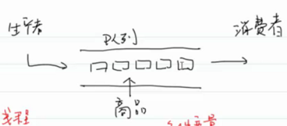

- # 一、对前面引用计数改进
  collapsed:: true
	- 前面互斥锁仍存在bug：
	  collapsed:: true
		- 引用计数为0时，解锁和销毁不是原子操作。
		- 改进：
		- ```C
		  //foo.c
		  #include<func.h>
		  #include"foo.h"
		  //初始化
		  struct foo* alloc_foo(int id)
		  {
		    //创建对象
		    struct fpp* fp = (struct fpp*)malloc(sizeof(struct foo));
		    if(fp == NULL)
		    {
		      return NULL;
		    }
		    //初始化.
		    //刚创建foo对象，其他线程还不能够访问到他，所以不需要上锁
		    fp->ref_count = 1;
		    fp->id = id;
		    //动态初始化锁
		    int err = pthread_mutex_init(&fp->mutex,NULL);
		    //如果每初始化成功，那就没有保护，就不能使用
		    if(err != 0)
		    {
		      //避免内存泄漏
		      free(fp);
		      return NULL;
		    }
		    return fp;
		  }
		  
		  //添加引用
		  struct foo* hold_foo(struct foo* fp)
		  {
		    //使用时，引用+1
		    //上锁
		    pthread_mutex_lock(&fp->mutex);
		    if(fp->ref_count > 0)//防止下面解锁后，立马占用了锁
		    {
		      fp->ref_count++;
		      pthread_mutex_unlock(&fp->mutex);
		      return fp;
		    }
		    pthread_mutex_unlock(&fp->mutex);
		    return NULL;
		  }
		  
		  //解除引用
		  void release_foo(struct foo* fp)
		  {
		    pthread_mutex_lock(&fp->mutex);
		    if(--fp->ref_count == 0)
		    {
		      //1.解锁
		  	pthread_mutex_unlock(&fp->mutex);
		      //2.销毁锁:将锁置于未初始化状态
		      pthread_mutex_destroy(&fp->mutex);
		      //3.释放堆空间
		      free(fp);
		    }
		    else
		    {
		      //还有计数，解锁
		      pthread_mutex_unlock(&fp->mutex);
		    }
		  }
		  ```
		- ```C
		  //foo.h
		  struct foo
		  {
		    int ref_count;//引用计数
		    int id;//对象标识
		    pthread_mutex_t mutex;//引用计数了，自然会共享，那么就需要访问保护,
		    //所以定义互斥锁
		    /*...其他属性*/
		  };
		  struct foo* alloc_foo(int id);
		  struct foo* hold_foo(struct foo* fp);
		  void release_foo(struct foo* fp);
		  
		  ```
		- ```C
		  //main.c
		  #include"foo.h"
		  void* thread_func(void* arg)
		  {
		    //强转为struct foo*类型指针
		    struct foo* fp = (struct foo*)arg;
		    fp = hold_foo(fp);
		    if(fp == NULL)
		    {
		      //进行错误处理，因为引用计数已经清零准备删除了
		    }
		    //对fp指向对象进行操作...
		    
		    release_foo(fp);
		  }
		  int main(void)
		  {
		    pthread_t tid1,tid2;
		    int err;
		    
		    //创建结构体foo
		    struct foo* fp = alloc_foo(1);
		    
		    err = pthread_create(&tid1,NULL,thread_func,fp);
		    THREAD_ERROR_CHECK(err,"pthread_create");
		    
		    err = pthread_create(&tid2,NULL,thread_func,fp);
		    THREAD_ERROR_CHECK(err,"pthread_create");
		    
		    //等待
		    void* tret;
		    err = pthread_join(tid1,(void**)&tret);
		    THREAD_ERROR_CHECK(err,"pthread_join");
		    
		    err = pthread_join(tid2,(void**)&tret);
		    THREAD_ERROR_CHECK(err,"pthread_join");
		    return 0;
		  }
		  ```
- # 二、避免死锁
  collapsed:: true
	- 在前面foo的基础上扩展：hash.c
	- ```C
	  #define NHASH 29//大小
	  #define HASH(id) ((ubsigned long)id % NHASH)//哈希函数
	  
	  struct foo *table[NHASH];//多个线程访问，所以需要锁
	  
	  pthread_mutex_t hashlock = PTHREAD_MUTEX_INITIALIZER//锁整个哈希表，防止修改整个哈希表结构
	  
	  struct foo
	  {
	    int ref_count;
	    int id;
	    pthread_mutex_t mutex;//锁单个结构体的修改
	    
	    //会改变整个哈希表结构，需要hashlock和内部的结构体的锁保护
	    struct foo* next;
	    /*...*/
	  }
	  
	  struct foo* alloc_foo(int id)
	  {
	    struct foo* fp = (struct foo*)malloc(sizeof(struct foo));
	    if(fp == NULL)return NULL;
	    
	    //创建成功
	    fp->ref_count = 1;
	    fp->id = id;
	    int err = pthread_mutex_init(&fp->mutex,NULL);
	    if(err != 0)
	    {
	      free(fp);//要先free
	      return NULL;
	    }
	    
	    //把创建的对象放入哈希表中,创建之后其他线程是可以访问到创建的对象的。
	    //1.求索引位置
	    int idx = HASH(id);
	    //2.修改哈希表结构
	    //2.1上锁：hashlock
	    pthread_mutex_lock(&hashlock);
	    //头插
	    fp->next = table[idx];
	    table[idx] = fp;
	    
	    //必须在释放hashlock之前，给结点上锁，然后才能尽快释放hashlock以保证并发度，再修改结点
	    pthread_mutex_lock(&fp->mutex);
	    
	    pthread_mutex_unlock(&hashlock);
	    /*其他的对结点foo的操作*/
	    pthread_mutex_unlock(&fp->mutex);
	    
	    return fp;
	  }
	  
	  //增加引用计数
	  struct foo* hold_foo(struct foo* fp)
	  {
	    pthread_mutex_lock(&fp->mutex);
	    if(fp->ref_count == 0)
	    {
	      pthread_mutex_unlock(&fp->mutex);
	      return NULL;
	    }
	    fp->ref_count++;
	    pthread_mutex_unlock(&fp->mutex);
	    return fp;
	  }
	  
	  //查找结点
	  struct foo* find_foo(int id)
	  {
	    struct foo* fp;
	    //操作整个表,上锁。但是查找为啥上锁？防止查找的时候有人修改表结构
	    //因为这个时候查找的作用域是整个表，那整个表是不能有改动的。
	    //要是不对表加锁，那么直接找，万一有个地方正在插入结点，断开了，查不过去，然后
	    //就没找到，但其实在后面是有的。就出错了
	    pthread_mutex_lock(&hashlock);
	    for(fp = table[HASH(id)] ; fp != NULL; fp = fp->next)
	    {
	      if(fp->id == id)
	      {
	        fp = hold_foo(fp);
	        break;
	      }
	    }
	    pthread_mutex_unlock(&hashlock);
	    return fp;
	  }
	  
	  //解除一个引用计数，如果为0，则删除
	  void release_foo(struct foo* fp)
	  {
	    pthread_mutex_lock(&fp->mutex);
	    //最后一个引用
	    if(fp->ref_count == 1)
	    {
	      pthread_mutex_unlock(&fp->mutex);//防止死锁，所以要释放，重新上锁，保证上锁的顺序，避免死锁
	      pthread_mutex_lock(&hashlock);
	      //存在时间窗口
	      pthread_mutex_lock(&fp->mutex);
	      
	      //重新判断条件，可能在上锁的窗口时间，又有线程添加引用计数了
	      if(fp->ref_count > 1)
	      {
	        fp->ref_count--;
	        pthread_mutex_unlock(&fp->mutex);
	        pthread_mutex_unlock(&hashlock);
	        return ;
	      }
	      else
	      {
	        //从哈希表删除结点
	        int idx = HASH(fp->id);
	        struct foo* prev = table[idx];
	        if(prev == fp)
	        {
	          //头结点
	          table[idx] = fp->next;
	        }
	        else
	        {
	          while(prev->next!=fp)
	          {
	            prev = prev->next;
	          }
	          prev->next = fp->next;
	          pthread_mutex_unlock(&fp->mutex);
	        	pthread_mutex_unlock(&hashlock);
	        	pthread_mutex_destroy(&fp->mutex);
	        	free(fp);
	        }
	      }
	    }
	    else
	    {
	      fp->red_count--;
	      pthread_mutex_unlock(&fp->mutex);
	    }
	  }
	  ```
	-
- # 三、生产者消费者模型
  collapsed:: true
	- 
	- 生产者：当队列不满的时候，生产者生产商品，通知消费者消费；当队列满的时候，生产者阻塞
	- 消费者：当队列不空的时候，消费者消费商品，通知生产者生产；当队列空的时候，消费者阻塞
- # 四、条件变量
  collapsed:: true
	- 等待/唤醒机制，目的是为了：控制线程的执行流程，所以引入条件变量。
		- join也是可以控制执行流程的
	- 类型：`pthread_cond_t`
	- 条件变量初始化和销毁
		- ```C
		  NAME
		         pthread_cond_destroy, pthread_cond_init
		         — destroy and initialize condition variables
		  
		  SYNOPSIS
		         #include <pthread.h>
		  
		         int pthread_cond_destroy(pthread_cond_t *cond);
		  //将锁重新设置为未初始化状态
		  
		  //动态初始化
		         int pthread_cond_init(pthread_cond_t *restrict cond,
		             const pthread_condattr_t *restrict attr);
		  //attr表示属性，一般设为NULL，标识默认属性
		  
		  //静态初始化
		         pthread_cond_t cond = PTHREAD_COND_INITIALIZER;
		  //等价于：pthread_cond_init(&cond,NULL);
		  ```
	- 等待在一个条件上:`wait on a condition`
		- ```C
		  NAME
		         pthread_cond_timedwait, pthread_cond_wait — wait on a condition
		  
		  SYNOPSIS
		         #include <pthread.h>
		  
		         int pthread_cond_timedwait(pthread_cond_t *restrict cond,
		             pthread_mutex_t *restrict mutex,
		             const struct timespec *restrict abstime);
		  //等待这个条件成立
		  //cond是线程共享的，因为需要其他线程修改条件变量使之满足，
		  //让我继续运行下去。
		  //因为是共享的，所以需要一把锁保护起来。所以第二个参数是锁，用于保护cond变量。
		  //内部就是先释放掉mutex锁，才能让其他线程操作锁改变条件
		  //，然后让线程陷入阻塞
		  //第三个参数表示超时时间：陷入阻塞后最多等待这么长时间。
		  //超时之后自己唤醒自己，继续往下运行
		  
		         int pthread_cond_wait(pthread_cond_t *restrict cond,
		             pthread_mutex_t *restrict mutex);
		  ```
		- 表示某个条件曾经成立过。
			- 所以表示某个等待机制成立的时候，用while，而不是if
			- ```C
			  //不能用if(q->front == q->rear)
			  while(q->front == q->rear)
			    {
			      pthread_cond_wait(&q->not_empty,&q->mutex);
			    }
			  ```
		- `abstime`表示绝对时间
			- 如设置时间为3分钟，则要把当前时间加上3分钟传给他
		- ```C
		  struct timespec {
		                 long    tv_sec;         /* seconds */
		                 long    tv_nsec;        /* nanoseconds */
		             };
		  ```
		- 设置超时时间：
		- ```C
		  #incude<sys/time.h>
		  void maketimeout(struct timespec *ts,int minutes)
		  {
		    struct timeval now;
		    //获取当前的时间
		    gettimeofday(&now,NULL);
		    ts->tv_sec = now.tv_sec;
		    ts->tvnsec = now->tv_usec * 1000;
		    ts->tv_sec = ts->tv_sec + minutes * 60;
		  }
		  ```
	- 通知：
		- 条件变量发生改变时，调用`pthread_cond_signal`通知其他线程
		- ```C
		  NAME
		         pthread_cond_broadcast, pthread_cond_signal — broadcast or signal a condition
		  
		  SYNOPSIS
		         #include <pthread.h>
		  
		         int pthread_cond_broadcast(pthread_cond_t *cond);
		  
		         int pthread_cond_signal(pthread_cond_t *cond);
		  ```
		- **至少会唤醒一个等待在`cond`这个条件上的线程**
			- 不会释放锁
			- 为了让内核实现的更简单，所以设计成至少唤醒一个（可能会唤醒多个）
			- **虚假唤醒**
		- `pthread_cond_broadcast`：唤醒所有等待`cond`条件的线程。
			- broadcast：广播
		- **当条件成立时，才调用signal和broadcast**
		-
- # 五、阻塞队列
  collapsed:: true
	- 生产者消费者的阻塞队列
	- 阻塞队列可以非常容易的实现生产者和消费者模型
	- ```C
	  //blockq.c
	  #include"blockq.h"
	  
	  blockq_t* blockq_create()
	  {
	    blockq_t* q = (blockq_t*)calloc(1,sizeof(blockq_t));
	    pthread_mutex_init(&q->mutex,NULL);
	    pthread_cond_init(&q->not_empty,NULL);
	    pthread_cond_init(&q->not_full,NULL);
	    return q;
	  }
	  //destroy自己写
	  
	  //每次访问队列都需要加锁，不然你判满、空的时候，有其他线程
	  //在操作，就可能判断出错了。
	  bool isEmpty(blockq_t* q)
	  {
	    pthread_mutex_lock(&q->mutex);
	    bool flag = (q->front == q->rear);
	    pthread_mutex_unlock(&q->mutex);
	    return flag;
	  }
	  
	  bool isFull(blockq_t* q)
	  {
	    pthread_mutex_lock(&q->mutex);
	    bool flag = ((q->rear+1)%N == q->front);
	    pthread_mutex_unlock(&q->mutex);
	    return flag;
	  }
	  
	  int peek(blockq_t* q)
	  {
	    pthread_mutex_lock(&q->mutex);
	    if(q->front == q->rear)//空。不能调用isempty，不然死锁了
	    {
	      //等待队列不为空条件,并且释放锁，陷入阻塞;
	      //当wait函数返回时，会重新获取锁（已经重新获取了锁）。
	      //放到队列不为空条件上
	      pthread_cond_wait(&q->not_empty,&q->mutex);
	    }
	    int retval = q->elements[q->front];
	    pthread_mutex_unlock(&q->mutex);
	    return retval;
	  }
	  
	  void enque(blockq_t* q,int val)
	  {
	    pthread_mutex_lock(&q->mutex);
	    //if(q->rear+1)%N == q->front)
	    /*不能用if，当你等待的信号满足时，signal可能唤醒了多个线程，
	    这个时候可能其他的线程得到了锁，入队，现在又满了。但是if只判断一次
	    当前线程拿到锁之后返回往下运行，入队就超过了队列长度。
	    主要是因为：*/
	    while(q->rear+1)%N == q->front)
	    {
	      //wait的含义不是说，返回的时候条件一定成立，只是说曾经某一时刻成立。
	      //所以需要while再次验证
	      //唤醒和加锁返回不是原子操作。所以唤醒和加锁不连贯的。
	      //被抢了，其他线程先入队，就不满足入队条件了。
	      pthread_cond_wait(&q->not_full,&q->mutex);
	    }
	    q->elements[q->rear] = val;
	    q->rear = (q->rear + 1)%N;
	    q->size++;
	    //队列不为空了，至少唤醒一个等待not_empty条件的线程
	    //signal 和 broadcast 不会释放锁
	    pthread_cond_signal(&not_empty);
	    pthread_mutex_unlock(&q->mutex);
	  }
	  
	  int dequeue(blockq_t* q)
	  {
	    pthread_mutex_lock(&q->mutex);
	    while(q->front == q->rear)
	    {
	      pthread_cond_wait(&q->not_empty,&q->mutex);
	    }
	    int retval = q->elements[q->front];
	    q->front = (q->front + 1)%N;
	    q->size--;
	    //唤醒等待不满的线程
	    pthread_cond_signal(&not_full);
	    pthread_mutex_unlock(&q->mutex);
	    return retval;
	  }
	  ```
	- 每个条件变量都会有一个等待队列，等待在上面的线程就在队列里 17：14（√）
	- ```C
	  //blockq.h
	  #include<func.h>
	  #include"blockq.c"
	  #define N 10
	  
	  typedef struct blockqueue
	  {
	    int elements[N];
	    int front;
	    int rear;
	    int size;//阻塞队列内大小
	    pthread_cond_t not_empty;//非空，成立则通知消费者消费
	    pthread_cond_t not_full;//不满，成立则通知生产者生产
	    //为了简单一点，就设一把队列锁
	    pthread_mutex_t mutex;
	  }blockq_t;
	  
	  blockq_t* blockq_create();
	  bool isEmpty(blockq_t* q);
	  bool isFull(blockq_t* q);
	  int peek(blockq_t* q);
	  void enque(blockq_t* q,int val);
	  int dequeue(blockq_t* q);
	  ```
	- ```C
	  //main.c
	  
	  void* produce(void* arg)
	  {
	    //生产线程入口函数
	    blockq_t *q = (blockq_t*)arg;//等下往这个阻塞队列放产品
	    srand((unsigned int)time(NULL));
	    while(1)
	    {
	      int r = rand();
	      enqueue(q,r);
	      printf(">> producer %ld: produce a value,size = %d\n",pthread_self(),q->size);
	      //访问了size，阻塞队列，要加锁
	      sleep(1);
	    }
	    return NULL;
	  }
	  
	  void* comsume(void *arg)
	  {
	    blockq_t *q = (blockq_t *)arg;
	    while(1)
	    {
	      int val = dequeue(q);
	      printf(">> cosumer %ld: consume a value,size = %d\n",pthread_self(),q->size);
	      sleep(1);
	    }
	    return NULL;
	  }
	  
	  int main(void)
	  {
	    //1 2 生产者，3 消费者
	    pthread_t tid1,tid2,tid3;
	    int err;
	    
	    //创建阻塞队列
	    blockq_t *q = blockq_create();
	    err = pthread_create(&tid1,NULL,produce,q);
	    THREAD_ERROR_CHECK(err,"pthread_create");
	    
	    err = pthread_create(&tid2,NULL,produce,q);
	    THREAD_ERROR_CHECK(err,"pthread_create");
	    
	    err = pthread_create(&tid3,NULL,consume,q);
	    THREAD_ERROR_CHECK(err,"pthread_create");
	    
	    //主线程等待子线程终止
	    void* tret;
	    err = pthread_join(tid1,&tret);
	    THREAD_ERROR_CHECK(err,"pthread_join");
	    
	    err = pthread_join(tid2,&tret);
	    THREAD_ERROR_CHECK(err,"pthread_join");
	    
	    err = pthread_join(tid3,&tret);
	    THREAD_ERROR_CHECK(err,"pthread_join");
	    
	  }
	  ```
	-