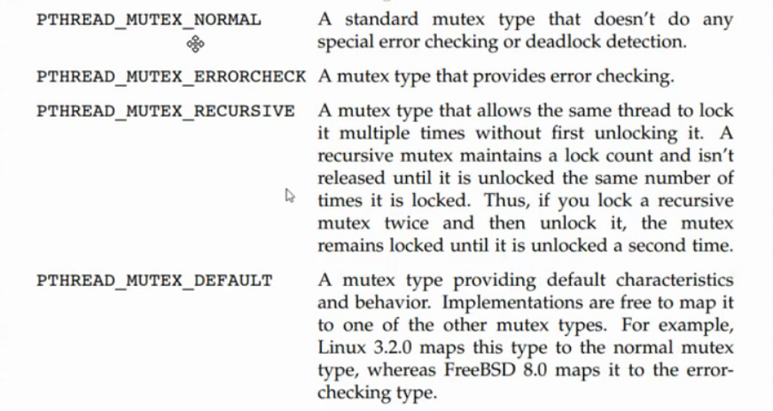
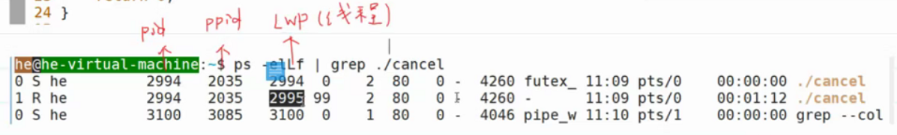
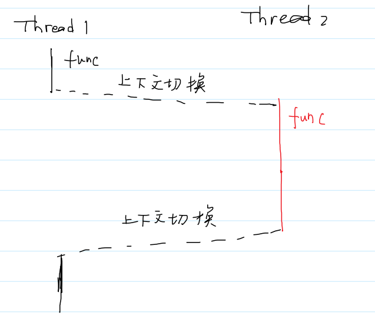
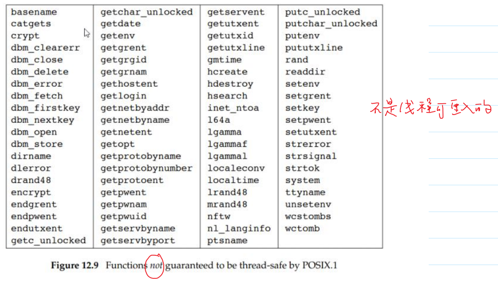

- # 一、线程的属性
  collapsed:: true
	- **属性：**
	  collapsed:: true
		- `detachstate`：游离态
		  collapsed:: true
			- 表示线程终止时，OS内核会释放该线程占有的资源。（OS不会保存他的终止状态给别人join获取）
			- 有两个取值：宏
			  collapsed:: true
				- `PTHREAD_CREATE_DETACHED`以游离态创建
				- `PTHREAD_CREATE_JOINABLE`别的函数可以通过join获取他的终止状态
		- `guardsize`
		  collapsed:: true
			- 判断栈是否溢出
		- `stackaddr`
		  collapsed:: true
			- 线程栈的起始地址
		- `stacksize`
		  collapsed:: true
			- 线程栈的最小大小（不是定死了为size，而是最小大小）
	- 类型：`pthread_attr_t`：多个属性的集合。可以设置上面四个属性
	-
	- ```C
	  NAME
	         pthread_attr_init, pthread_attr_destroy - initialize and destroy thread attributes object
	  
	  SYNOPSIS
	         #include <pthread.h>
	  
	         int pthread_attr_init(pthread_attr_t *attr);
	  //初始化就是把属性设置为默认值
	         int pthread_attr_destroy(pthread_attr_t *attr);
	  ```
	- **每个属性都有对应的`get`和`set`方法**。
	  collapsed:: true
		- 如：
		  collapsed:: true
			- ```C
			  int pthread_attr_setdetachstate(pthread_attr_t *attr, int detachstate);
			  int pthread_attr_getdetachstate(const pthread_attr_t *attr, int *detachstate);
			  
			  The following values may be specified in detachstate:
			  
			         PTHREAD_CREATE_DETACHED
			                Threads that are created using attr will be created in a detached state.
			  
			         PTHREAD_CREATE_JOINABLE
			                Threads that are created using attr will be created in a joinable state.
			  
			         The default setting of the detach state attribute in a newly initialized thread attributes object is  PTHREAD_CRE‐
			         ATE_JOINABLE.
			  ```
	- 例子：
	- ```c
	  void* start_routine(void* arg)
	  {
	    printf("new thread running\n");
	    return (void*)1;
	  }
	  
	  int main()
	  {
	    //创建属性对象
	    pthread_attr_t attr;
	    //初始化
	    pthread_attr_init(&attr);//默认初始化为默认值
	    //定制属性:游离态
	    pthread_attr_setdetachstate(&attr,PTHREAD_CREATE_DETACHED);
	    
	    pthread_t tid;
	    int err;
	    err = pthread_create(&tid,&attr,start_routine,NULL);
	    //check
	    
	    //测试游离态能否join
	    //void* tert;
	    //err = pthread_join(tid,&tert);
	    //报错invailid argument
	    //check
	    
	    sleep(1);
	    //销毁
	    pthread_attr_destroy(&attr);
	    
	    return 0;
	  }
	  ```
- # 二、互斥锁的属性
  collapsed:: true
	- 类型：
	  collapsed:: true
		- `pthread_mutexattr_t`：表示多个属性的集合
	- 创建和销毁：
	- ```C
	  NAME
	         pthread_mutexattr_destroy, pthread_mutexattr_init — destroy and initialize the mutex attributes object
	  
	  SYNOPSIS
	         #include <pthread.h>
	  
	         int pthread_mutexattr_destroy(pthread_mutexattr_t *attr);
	         int pthread_mutexattr_init(pthread_mutexattr_t *attr);
	  ```
	- 单独的属性：
	  collapsed:: true
		- `process_shared`
		  collapsed:: true
			- 是否为多进程共享
			- `PTHREAD_PROCESS_PRIVATE`
			- `PTHREAD_PROCESS_`
		- `robust`
		  collapsed:: true
			- 解决有一个进程终止了，但是没有释放锁的问题。
			- 法1.其他线程阻塞
			- 法2.释放锁资源
		- `type`
		  collapsed:: true
			- ```C
			  NAME
			         pthread_mutexattr_gettype, pthread_mutexattr_settype — get and set the mutex type attribute
			  
			  SYNOPSIS
			         #include <pthread.h>
			  
			         int pthread_mutexattr_gettype(const pthread_mutexattr_t *restrict attr,
			             int *restrict type);
			         int pthread_mutexattr_settype(pthread_mutexattr_t *attr, int type);
			  ```
			- 通过这两个函数设置
			- 
			- 第三个：可重入锁
- # 三、条件变量的属性
  collapsed:: true
	- 类型：`pthread_condattr_t`：表示多个属性的集合
	- `process_shared`
	  collapsed:: true
		- 可以被多个进程共享
	- `clock`
	  collapsed:: true
		- 这个条件变量用的是哪一个定时器去计算超时时间
	- ```C
	  NAME
	         pthread_condattr_setclock — set the clock selection condition variable attribute
	  
	  SYNOPSIS
	         #include <pthread.h>
	  
	         int pthread_condattr_setclock(pthread_condattr_t *attr,
	             clockid_t clock_id);
	  ```
- # 四、线程的取消  11：26补充
  collapsed:: true
	- 线程可否被取消没有被包含在attr里面
	- `cancelability state`
		- `PTHREAD_CANCEL_ENABLE`
			- 可以响应取消
		- `PTHREAD_CANCEL_DISABLE`
			- 不响应取消：阻塞取消请求，不会响应他。
			- ```C
			  void* start_routine(void* arg)
			  {
			    pthread_setcancelstate(PTHREAD_CANCEL_DISABLE,NULL);
			    whilel(1)
			    {
			      pthread_testcancel();//不会被取消。
			    }
			  }
			  ```
	- `cancelability type`
	- 设置：
		- ```C
		  NAME
		         pthread_setcancelstate, pthread_setcanceltype - set cancelability state and type
		  
		  SYNOPSIS
		         #include <pthread.h>
		  
		         int pthread_setcancelstate(int state, int *oldstate);
		         int pthread_setcanceltype(int type, int *oldtype);
		  
		         Compile and link with -pthread.
		  ```
	- 取消一个线程：
		- ```C
		  NAME
		         pthread_cancel - send a cancellation request to a thread
		  
		  SYNOPSIS
		         #include <pthread.h>
		  
		         int pthread_cancel(pthread_t thread);
		  
		         Compile and link with -pthread.
		  ```
		- 只是发送一个取消请求，并不会等待另一个线程终止。
		- 另一个线程也不是立马取消，需要运行到取消点才会查看是否有取消请求，如果有才会响应取消请求。
	- 示例：
		- ```C
		  void* start_routine(void* arg)
		  {
		    whilel(1)
		      ;
		  }
		  int main()
		  {
		    pthread_t tid;
		    int err;
		    err = pthread_create(&tid,NULL,start_routine);
		    //check
		    
		    sleep(1);
		    pthread_cancel(tid);//无法取消,因为没有取消点
		    
		    void* tret;
		    err = pthread_join(tid,&tret);
		    //check
		    
		    printf("returnning ...\n");//不会输出
		    return 0;
		  }
		  ```
		- `ps -elLf | grep ./cancel`
		- L：表示查看线程信息
		- 
	- `man 7 pthreads`里有Cancellationpoints
	- 有的程序里面没有调用取消点的函数，那就一直不会响应，此时可以自己设置取消点
	- ```C
	  NAME
	         pthread_testcancel - request delivery of any pending cancellation request
	  
	  SYNOPSIS
	         #include <pthread.h>
	  
	         void pthread_testcancel(void);
	  
	         Compile and link with -pthread.
	  ```
	- ```C
	  void* start_routine(void* arg)
	  {
	    whilel(1)
	    {
	      pthread_testcancel();//用户自己设置取消点
	      //会调用线程清理函数
	    }
	  }
	  ```
	-
	- `cancelability type`
		- ```C
		         PTHREAD_CANCEL_DEFERRED
		                A cancellation request is deferred until the thread next calls a function that is a cancellation point (see
		                pthreads(7)).  This is the default cancelability type in all new threads, including the initial thread.
		  //推迟响应，程序运行到取消点时才会响应取消请求
		                
		         PTHREAD_CANCEL_ASYNCHRONOUS
		                The thread can be canceled at any time.
		  //在任意时刻可以响应取消
		  ```
	- ```C
	  void* start_routine(void* arg)
	  {
	    pthread_setcancelstate(PTHREAD_CANCEL_DISABLE,NULL);
	    whilel(1)
	    {
	      pthread_testcancel();//不会被取消。
	    }
	  }
	  11：26补充
	  ```
- # 五、线程的可重入函数
  collapsed:: true
	- 一个函数可以在多个线程中安全的执行（在没有任何同步机制下（锁、条件变量）），这样的函数就是线程的可重入函数
		- 安全：每次运行的最终结果都一样，不会影响最终结果
		- 如：线程1 func执行一半被中断，线程2执行func，执行完后，回到线程1继续执行func。func最终的结果不受影响。则func为线程的可重入函数
	- 
	- 