- # 一、网络编程的知识点
  collapsed:: true
	- **这部分内容的作业就是面试常考题** #面试常考
	- 计算机网络发展历史（了解）
	- ==计算机网络七层协议==
	- 其他层协议（了解）
	- ==传输层协议（**TCP**/UDP）==
	- ==wireshark抓包工具==
	- ==socket套接字编程==
	- ==网络IO复用模型epoll==
	- 参考资料：
	  collapsed:: true
		- 偏理论
		  collapsed:: true
			- 《TCP/IP协议 卷一》
			- 《Unix网络编程》
		- 偏实战
		  collapsed:: true
			- 《Unix高级环境编程》APUE
			- 《Linux系统编程手册》
		- 大头书，当字典查，不要从头到尾读，因为现在没时间
- # 二、协议
  collapsed:: true
	- 什么叫协议？
	  collapsed:: true
		- 两个实体通信（数据交换）**约定的规则**
		- 要让彼此能够知道在说什么
	- 最简单的协议：**echo服务**（回显服务）
	  collapsed:: true
		- 就是发送什么，就回什么。
		- 可以确认彼此能够收到对方的数据
- # 三、OSI七层模型
  collapsed:: true
	- 解决的问题是什么？
		- 不同的计算机要进行数据交互
	- 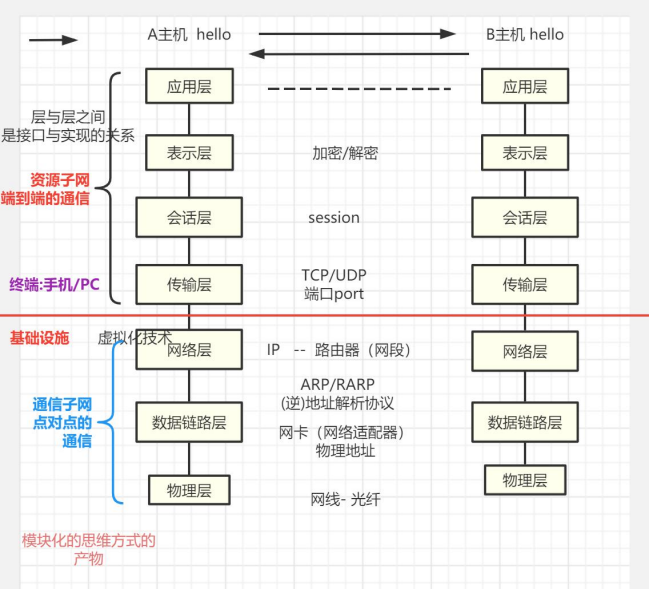
	- **模块化：接口与实现进行分离**
	- 网络层：
		- 有虚拟化技术：将任何机器，转化为用IP表示他。
	- 表示层：处理加密/解密操作
		- 端口号：定位到具体的一个进程
	- 数据在网络中发送时的情况
		- 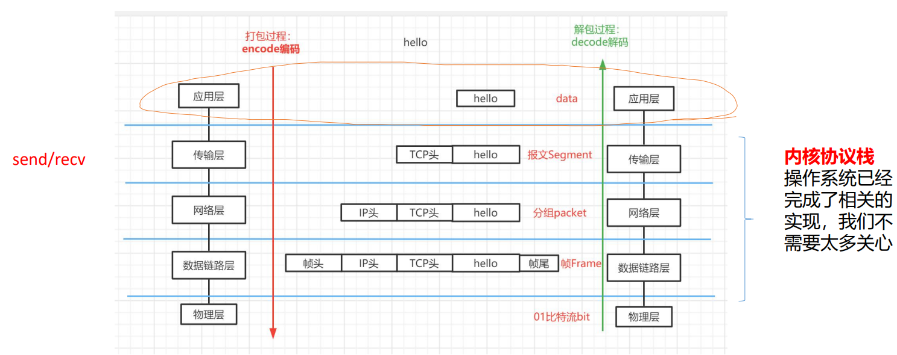
	- 程序员的工作：
		- 程序员在工作中不需要编解码传输层以下的协议
		- 除非去做内核级别的开发才需要
		- 实际工作中，只需要了解/熟悉应用层协议就可以了
	- 传输层到链路层是**内核协议栈**：OS已经完成了相关的实现，我们不需要太多关心
		- 有send/recv系统调用
- # 四、应用层协议
  collapsed:: true
	- 公有协议
		- **HTTP/HTTPS**、SSH（会加密的协议）、DNS（域名解析）、FTP（文件传输）、SMTP/POP3、RTP/RTCP/RTSP（实时传输协议，音视频开发）
	- **私有协议**
		- 海康威视：
			- 视频格式：（公有格式）avi、mp4、h264、h265、rmvb、flv
				- 容易被破解，所以需要用私有格式发送视屏数据
			- 视频数据本身就是公司的资产，视频格式都是私有的，普通的播放器根本就打不开。
				- EV视频也是一样的进行了加密，必须要用专用播放器打开才能播放。
- # 五、数据链路层
  collapsed:: true
	- 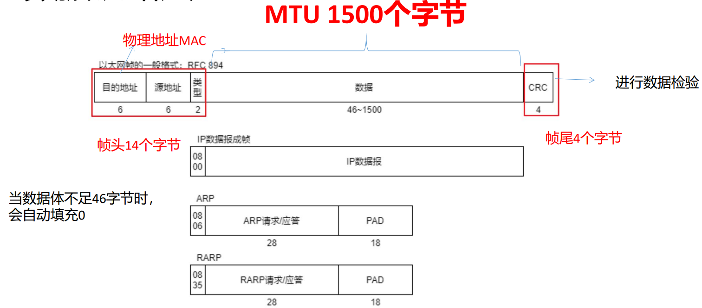
	- CRC：进行数据校验
- # 六、IP层的报文头信息
  collapsed:: true
	- 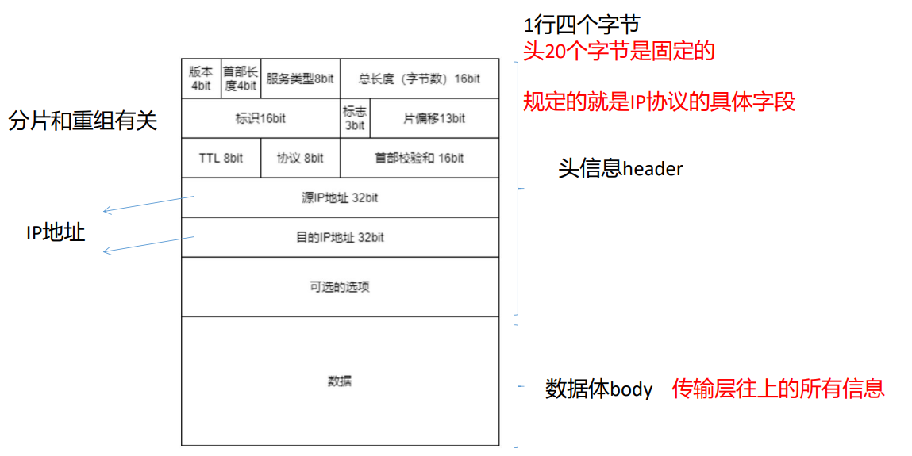
	- IP头是可以扩展的
	- 总长度：整个IP数据报的长度
- # ==七、传输层TCP协议==->徒手画出头二十字节 #面试重点
	- 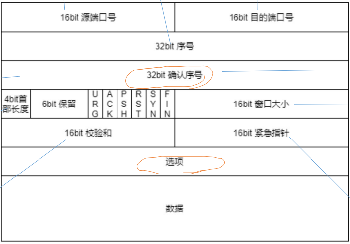
	- TCP是一个**面向连接的、可靠的、全双工的、字节流的、具有流量控制的**协议
	- **TCP报文头也是20个字节**
	  collapsed:: true
		- 编程时就是一个结构体
	- 端口号表示某一个进程
	  collapsed:: true
		- 源端口号：表示发送主机上哪一个进程发送的
		- 目的端口号：数据要发到目的主机的哪一个进程
		- 端口号范围：0~65535（2^16-1）
		  collapsed:: true
			- 1024以下的不能使用的
			  collapsed:: true
				- HTTP：80
				- HTTPS(SSL)：443
				- SSH：22
				- FTP：
					- 21：
						- 建立连接
						- 控制信息交互
					- 20
						- 文件传输
			- Mysql：3306
			- Redis：6379
	- 32bit序号：对要发送的数据每一个字节进行编号（保证可靠，收到的数据有序，由随机算法生成）
	- 确认序号：告诉对端确认号之前的数据都已经收到了，可以从确认号之后开始发送新的数据。
		- 确认序号什么情况下会起作用？
			- 只有ACK位被置为 1 时才起作用
	- 4bit首部长度：一般从五开始，因为至少也有20字节：（5~15）*4->（20~60字节）
		- TCP协议是一个可以扩展的协议（选项部分可扩展）
	- 6bit保留。（现在只有3bit保留了）
	  collapsed:: true
		- CWR：拥塞控制
		- ECN
		- Nonce
	- Flags标志位：
	  collapsed:: true
		- FIN：断开连接的请求
		- SYN：建立连接的请求：发起连接
		- RST：重置连接的请求
		- PSH：告诉对方赶紧接收数据，本端还有很多数据要发
			- 推送。push
		- ACK：确认报文
		- URG：这位置为1，后面的紧急指针才起作用
	- 16bit窗口大小：与滑动窗口机制有关，告诉对方当前接收缓冲区还剩多少空间
		- 0~2^16-1   64KB
			- 现在可以乘以一个基数：包中Window的值，128/256，以表示更大的窗口大小
		- 进行流量控制
	- 16bit校验和：数据校验
		- 校验哪些部分
			- 首部和数据
	- 紧急指针：一般情况下并不使用
	- **当首部长度超过20字节时，一般是SYN报文携带的选项**。
		- 里面就含有窗口的基数
		- MSS：最大的报文长度。由MTU 1500字节计算得来
		- SACK：选择确认重传算法
	- TCP是一个字节流的协议      ？10：00（√）
		- 以字节为单位
			- 含义是：在应用层之上没有数据包的概念，只有字节的概念
				- 就是应用层来的消息不区分包的边界，都是字节流传输，都是字节流存储。按MSS分开发送出去。TCP的首部没有边界信息。
			- 即：应用层之上的消息不区分边界条件
				- 就是不管应用层发几个包过来，都是往TCP接收缓冲区一个挨一个放的，不会区分数据包的前后左右，不会区分边界，然后看MSS分开发送出去。
			- 所以需要程序员人为区分数据包的边界条件
				- 就是TCP不管多少包过来，都往缓冲区堆，不区分边界，都认为是数据。至于每个数据包有多长，需要应用层去区分。但UDP有数据包长度信息，可以区分
		- 因而有了：“粘包”问题 #面试常考
	- UDP是一个数据包的协议
		- UDP首部有数据包长度信息，严格区分数据包的首尾边界进行发送。而TCP不知道数据包有多长。
	- ==**TCP与UDP的区别是什么？**==
		- 从首部区别去进行分析
- # 八、TCP三次握手
  collapsed:: true
	- 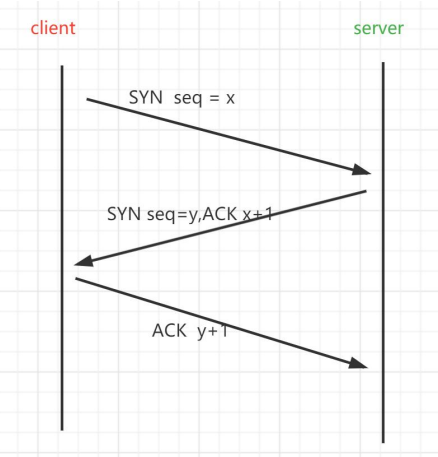
		- seq：报头的那个序号，通过随机算法得到
		- 第一个ACK：对前面的SYN的确认（SYN和ACK可以用同一个报文传输，只需在对应标志位置一即可）
	- ==**为什么TCP建立连接时会采用三次握手？**== #面试常考
	  id:: 62ceb2d2-d397-48e2-b9d9-4b94f8a05b52
		- 1.要确保双方确实已经收到了对方的确认，连接建立成功。
		- 2.防止大量出现被延迟的SYN报文到达服务器时，产生的问题。
	- 这个问题其实就是在问**两次握手可以吗?**
		- 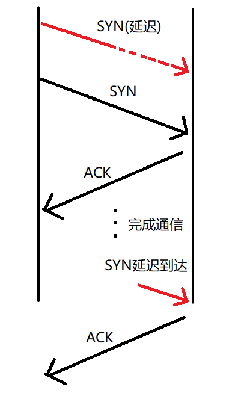
		- **第一种情况：**第一次握手SYN报文被延迟
			- 当客户端重发SYN之后，与服务器建立好了连接，并且完成了数据的通信。
			- 之后，被延迟的SYN报文此时到达了服务器，服务器会认为客户端想要重新建立连接，因此会给客户端回复一个ACK报文，此时服务器开始等待客户端发送数据。
			- 很显然，此时客户端根本就没有建立连接的需求，会造成服务器资源的浪费。
		- **第二种情况**：第二个报文ACK在网络中消失，没有被client接收到
			- 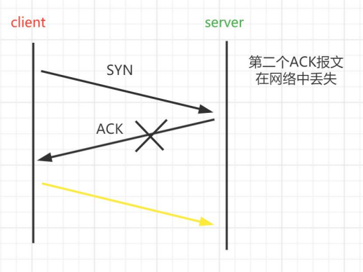
			- 服务器因为已经发出了ACK报文，它认为连接已经建立好了，一直等待客户端发数据过来，造成服务器资源的浪费。
			- 此时客户端根本就没有收到，因此认为该连接没有建立成功。
	-
- # 九、TCP四次挥手
  collapsed:: true
	- **TCP连接断开时，要采用四次挥手，为什么？**
		- 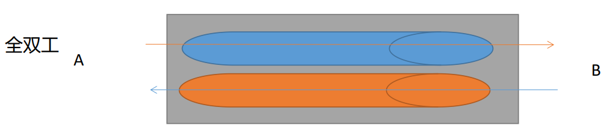
		- TCP是一个全双工的协议，全双工的含义是可以同时进行数据的读写操作，互不干扰。
		- 当连接断开时，要做到两个方向上的数据传输全部断开。
			- 1）第一次client发送FIN报文时，表示client已经发送完了所有的数据，再没有数据要发送给server了，但还可以接收数据
			- 2）当server收到FIN报文，并进行确认发送ACK时，表示已经知道了client没有数据发送了。
			- 3）当server也没有数据要发送给client时，发送FIN报文给client
			- 4）当client收到FIN时，最后一次给server发送ACK报文；当ACK报文到达服务器时，就断开连接了。
	- 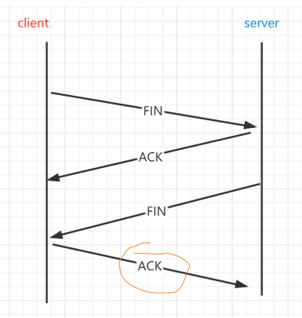
	- 第二次挥手和第三次可以合并
		- 因为ACK和FIN可以在同一个报文内传输。（若服务器没有数据传了，对应位置为 1 即可）
	- 客户端断开连接了为什么还能发最后要给ACK报文？
		- 是数据传输断开，而ACK是控制报文，不是数据报文，所以可以传输。不然的话第一个SYN就发不到了。
	- 报文分为：
		- 控制报文
			- 不携带数据（所以可以接受也可以发送）
		- 数据报文
			- 传输数据。
- # 十、TCP是一个面向连接的协议
  collapsed:: true
	- 可靠
		- 序号、确认序号、滑动窗口
	- 全双工
		- 三次握手、四次挥手
	- 但是什么体现了TCP是一个面向连接的协议呢？
	- ## 1.什么叫做面向连接？
		- 通信双方彼此维护一张状态图
		- ==**状态图**==：（徒手画出，面试经常考） #面试常考
			- 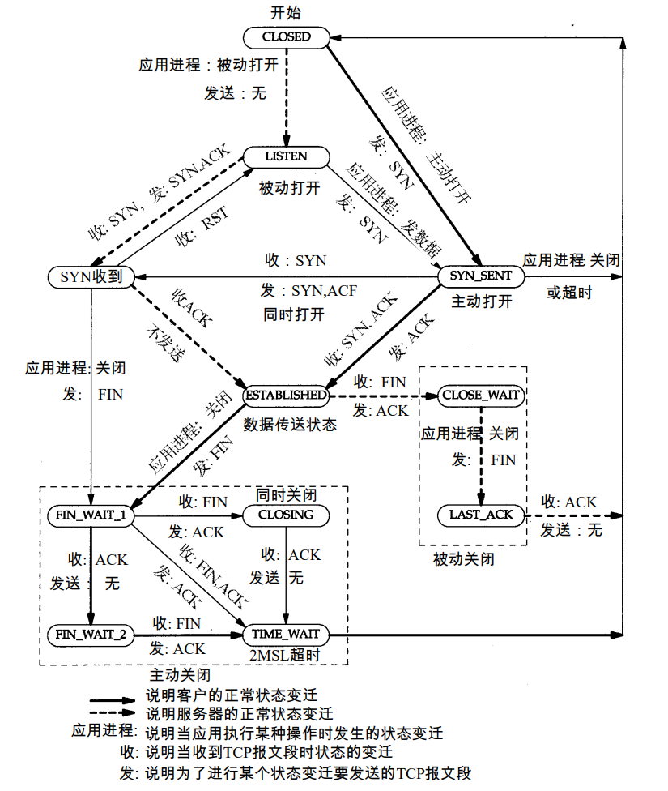
			- CLOSING：同时关闭
				- 客户端发送FIN后，马上收到了服务器发来的FIN。发送ACK后客户端进入CLOSING状态，服务器收到FIN，发送ACK后进入右边CLOSE_WAIT状态，客户端进入TIME_WAIT状态
			- 分为上下两个部分，上面是三次握手，下面是四次挥手。
			- **三次握手：**
				- 刚开始都是CLOSED状态，服务器打开后，进去LISTEN监听状态；然后客户端发送SYN请求连接后进入SYN_SENT状态，服务器收到SYN，发送SYN、ACK后进入SYN_RECVED状态。客户端收到SYN、ACK，发送ACK后进入EXTABLISHED状态。服务器收到ACK后也进入EXTABLISHED状态。三次握手结束
				- 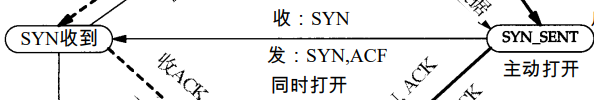
					- 表示客户端和服务器同时向对方发送连接请求的情况。
				- 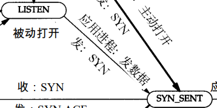
					- 表示服务器向客户端发送SYN连接请求。
			- **四次挥手：**
				- 刚开始都处于EXTABLISHED状态，客户端像服务器发送FIN报文后进入FIN_WAIT1状态；服务器接收到FIN报文，发送ACK报文后进入CLOSE_WAIT状态。客户端接收到ACK后进入FIN_WAIT2状态。服务器数据发送完毕后，发送FIN报文进入LAST_ACK状态；客户端接收到FIN，发送ACK后进入TIME_WAIT状态，等待2MSL时间进入CLOSED状态。服务器接收到ACK后进入CLOSED状态。
					- MSL：指一个报文在网络中生存的最长时间。
					- RFC793为2分钟。
					- [RFC文档中心-分享最新RFC及中文翻译版本](http://rfc.ac.cn/)
		- **什么叫一个连接？一个连接是由那些信息组成的?**
			- 一个TCP连接是由协议类型、源IP/源port、目的IP/目的port五元组信息构成。
			- ```C
			  ubuntu@VM-16-2-ubuntu:~$ netstat -ano -p tcp | grep tcp
			  (Not all processes could be identified, non-owned process info
			   will not be shown, you would have to be root to see it all.)
			  tcp        0      0 127.0.0.1:953           0.0.0.0:*               LISTEN      -                    off (0.00/0/0)
			  tcp        0      0 127.0.0.1:33060         0.0.0.0:*               LISTEN      -                    off (0.00/0/0)
			  tcp        0      0 127.0.0.1:3306          0.0.0.0:*               LISTEN      -                    off (0.00/0/0)
			  tcp        0      0 0.0.0.0:111             0.0.0.0:*               LISTEN      -                    off (0.00/0/0)
			  tcp        0      0 10.0.16.2:53            0.0.0.0:*               LISTEN      -                    off (0.00/0/0)
			  tcp        0      0 127.0.0.1:53            0.0.0.0:*               LISTEN      -                    off (0.00/0/0)
			  tcp        0      0 127.0.0.53:53           0.0.0.0:*               LISTEN      -                    off (0.00/0/0)
			  tcp        0      0 0.0.0.0:22              0.0.0.0:*               LISTEN      -                    off (0.00/0/0)
			  tcp        0      0 10.0.16.2:39828         169.254.0.4:80          TIME_WAIT   -                    timewait (57.44/0/0)
			  tcp        0      0 10.0.16.2:22            117.157.87.15:49064     ESTABLISHED -                    keepalive (7198.00/0/0)
			  tcp        0      0 10.0.16.2:22            111.175.55.252:39184    ESTABLISHED -                    keepalive (7165.65/0/0)
			  tcp        0      0 10.0.16.2:37320         169.254.0.55:5574       ESTABLISHED -                    off (0.00/0/0)
			  tcp        0      0 10.0.16.2:49418         169.254.0.138:8086      ESTABLISHED -                    off (0.00/0/0)
			  tcp        0    232 10.0.16.2:22            111.175.55.252:62111    ESTABLISHED -                    on (0.18/0/0)
			  tcp6       0      0 ::1:953                 :::*                    LISTEN      -                    off (0.00/0/0)
			  tcp6       0      0 :::111                  :::*                    LISTEN      -                    off (0.00/0/0)
			  tcp6       0      0 fe80::5054:ff:fe97:1:53 :::*                    LISTEN      -                    off (0.00/0/0)
			  tcp6       0      0 ::1:53                  :::*                    LISTEN      -                    off (0.00/0/0)
			  tcp6       0      0 :::22                   :::*                    LISTEN      - 
			  ```
		- **四次挥手：**
			- 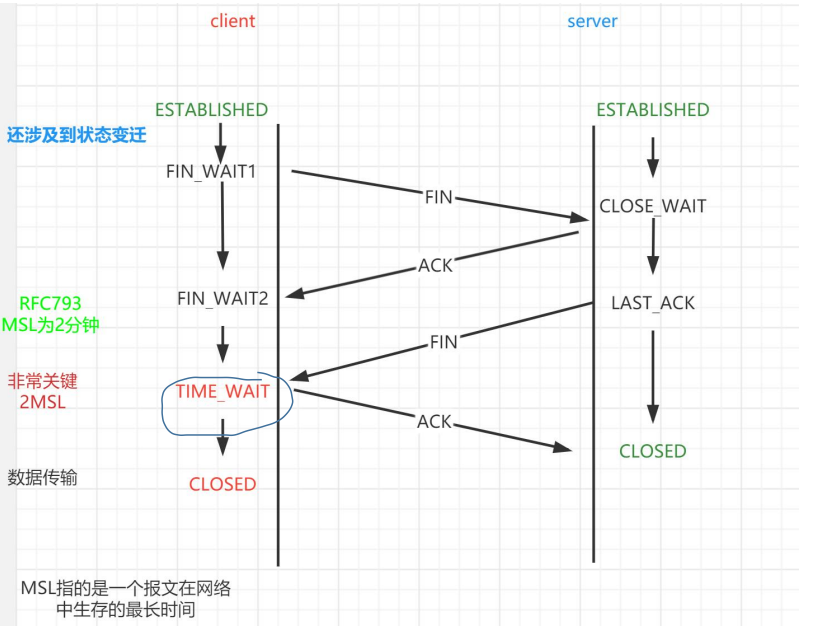{:height 566, :width 709}
			- **1.服务器是否可以主动断开连接呢？**
				- 可以，如果服务器主动断开连接，会进入到TIME_WAIT状态，该状态持续2MSL的时间；此时服务器不能做其他的事情，是对服务器资源的一种浪费，**因此一般情况下服务器不会主动断开连接。**但服务器是可以主动断开连接的，同时为了防止出现服务器资源浪费的情况，会设置套接字属性可以重用。
					- 不想连你，可以主动断开你。
			- **2.为什么需要TIME_WAIT状态？**
				- 1.防止出现连接无法正常断开的情况
				- 2.防止出现数据蹿链的情况
			- 这问就是**删除TIME_WAIT可不可以**的变相问题
				- 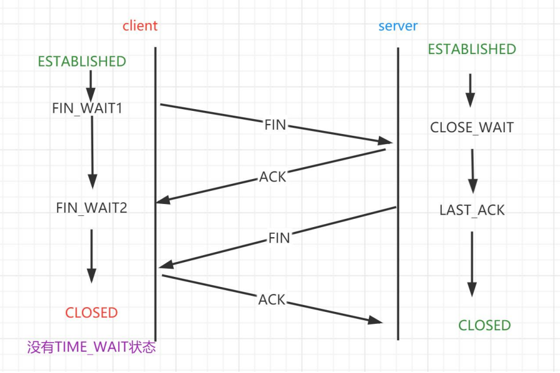
				- 第一种情况：
					- 假设server端没有收到第4次挥手ACK，服务器认为连接没有断开，因此它会重发FIN报文，等待客户端给其回复ACK，而客户端由于已经发送了ACK报文，它认为该连接已经断开了，因此不会再接收FIN报文了。而有了TIME_WAIT状态，则服务器可以超时重传，client没有断开连接，仍然可以获得ACK。
						- 这样会导致该连接无法正常断开
				- 第二种情况：数据蹿链
					- 第一次起了一个连接，也完成了通信过程，连接关闭了；当再起一个新连接时，其五元组与第一次是相同的。
					- 此时如果第一次连接进行过程中，在网络中被延迟的数据到达了第二个连接，是一定会被第二个连接接受的。因此就会造成数据蹿链的问题。
						- 在网络中被延迟的数据指的是确认重传的数据。
					- 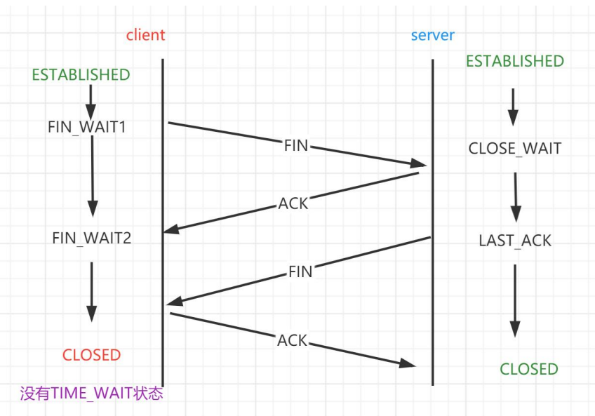
	- ## 2.UDP是一个无连接的协议
- # 十一、UDP报文头
  collapsed:: true
	- 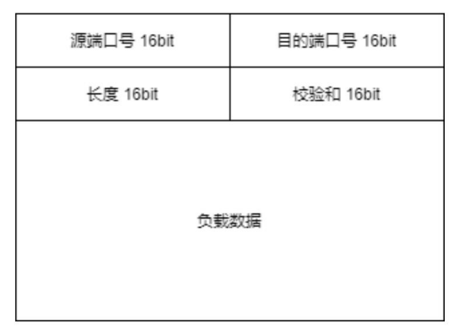
	- 对于通信的双方来说，无法获取到对端的任何信息
	- 1.不知道对方是否收到数据
	- 2.即使收到了数据，也不知道收了多少，有没有丢包根本就不清楚。
- # 十二、抓包工具wireshark---在Windows上抓包
  collapsed:: true
	- 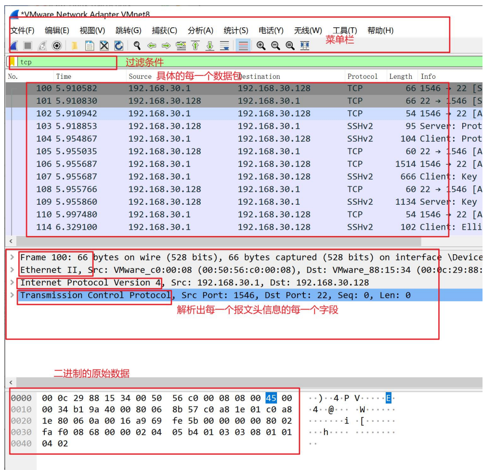
	- ## 三次握手中SYN报文解析
		- 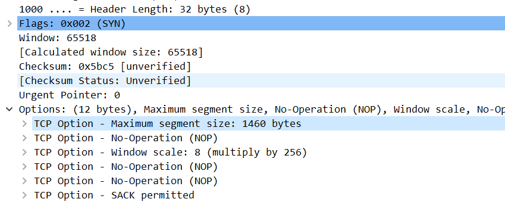
		- Window：接收窗口大小
		- SACK：选择重传的算法为SACK
		- Window scale：与滑动窗口有关，滑动窗口为16bit，能表示的容量为：2^16-1，太小了。Window scale表示，可以在这个基础上乘以一个数：2^8 = 256.以表示更大的空间
			- 经常听说“TCP Window Scale”这个概念，它究竟和接收窗口有何关系？
				- 在TCP刚被发明的时候，全世界的网络带宽都很小，所以最大接收窗口被定义成65535 字节。随着硬件的革命性进步，65535 字节已经成为性能瓶颈了，怎么样才能扩展呢？TCP 头中只给接收窗口值留了 16 bit，肯定是无法突破 65535（216−1）的。1992年的RFC 1323中提出了一个解决方案，就是在三次握手时，把自己的Window Scale信息告知对方。由于Window Scale放在TCP头之外的Options中，所以不需要修改 TCP 头的设计。Window Scale 的作用是向对方声明一个 Shift count，我们把它作为2的指数，再乘以TCP头中定义的接收窗口，就得到真正的TCP接收窗口了。
		- MSS（Maximum segment size）：MTU-IP头-TCP头得到：1500 - 20 - 2 - = 1460.收发数据最多携带这么多数据。最大网段大小。
	- ## 四次挥手报文解析
		- 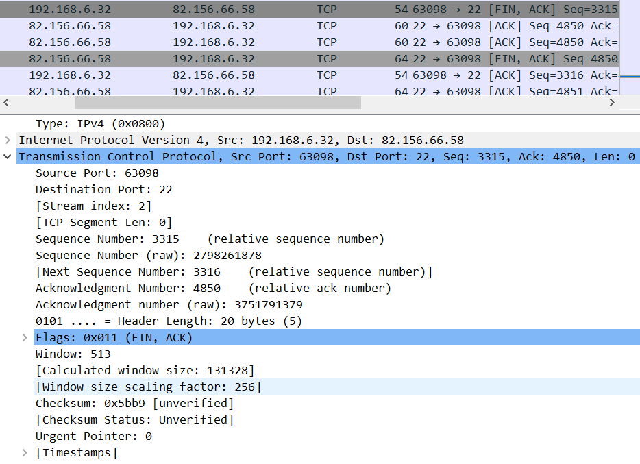
	- Source Port：表示源端口号
	- Destination Port：目的端口号
	- Sequence Number：序号（相对的序号，相对于当前通信，这是第几个。就是相对于第一个报文的实际信号）
		- 序号的增长不是简单+1，TCP按字节编号，所以有多少字节，加多少号。
	- Sequence Number（raw）：实际序号（所有通信总的序号的第几个）
	- Acknowledgment Number：确认号（相对的）
	- Acknowledgment Number（raw）：确认号（实际的）
	- Header Length：头部长度 32
	- Window：窗口大小，与滑动串口机制有关，告诉对方当前接收缓冲区还剩多少空间
	- Checksum：校验和
	-
	- https://marth.oss-cn-shenzhen.aliyuncs.com/Mypicture/抓包02.png
	- 第一行000：保留位
	- Urgent：紧急指针的标志位，置为一，紧急指针才有效
	- Acknowledgment ：确认报文，为1，ACK号才有效
	- Push：推送，告诉对方赶紧接收数据，本端还有很多数据要发
	- Reset：重置连接请求
	- Syn：请求连接
	- Fin：断开连接
- # 十三、在Linux上抓包
  collapsed:: true
	- [Linux命令搜索引擎 命令](https://wangchujiang.com/linux-command/)命令搜索引擎
	- 推荐《wireshark网络分析就这么简单》
	- tcpdump
	- 1.``$ sudo tcpdump -i eth0 -S -w test.pcap`抓包
		- 保存到test.pcap
		- eth0是linux的网络适配器：`ifconfig`查看
	- 2.抓包完毕后，下载到windows上，再用windows进行分析