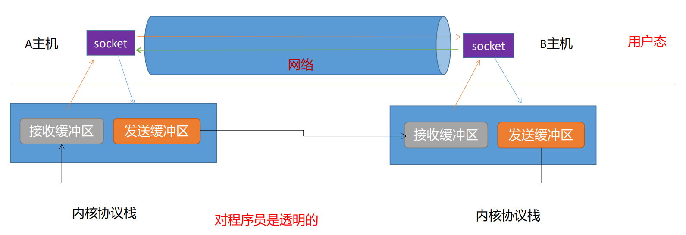
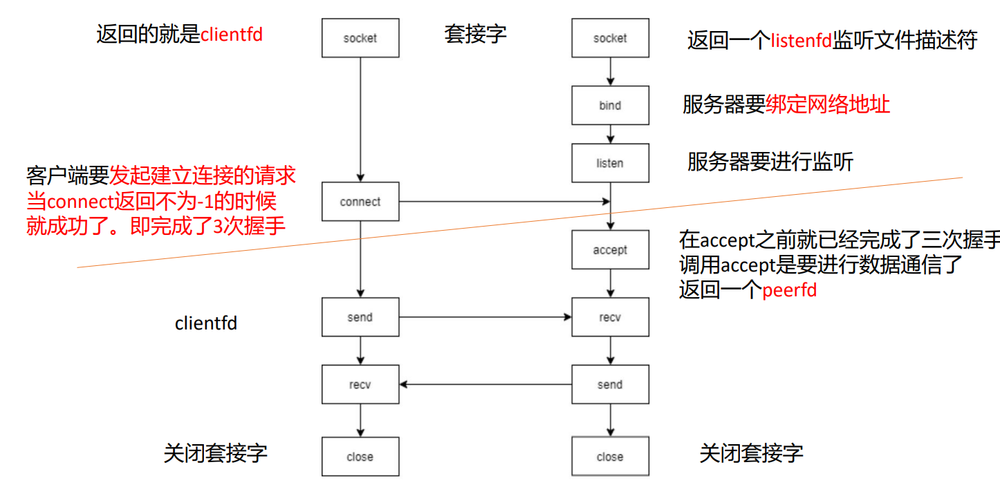
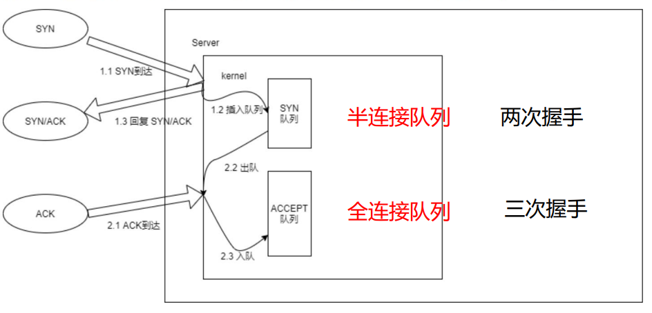
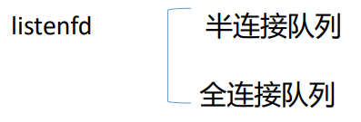
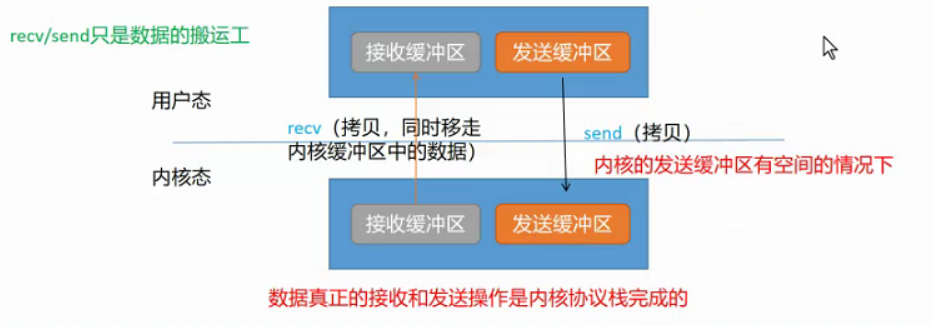
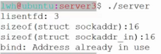
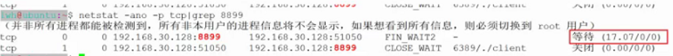

- # 一、网络地址
	- ```C
	  struct sockaddr{//是一个通用类型
	    sa_family_t sin_family;//2B
	    char sa_data[14];
	  };
	  
	  struct sockaddr_in{//是一个具体的类型，是通用类型其中的一个具体形式
	    sa_family_t sin_family;
	    uint16_t sin_port;
	    struct in_addr sin_addr;
	    char sin_zero[8];
	  };
	  //这两个结构体的大小是一样的。16B
	  ```
	- sockaddr：套接字地址，占据16个字节空间
	- sa_data[14]：可以扩展的空间
		- IPV6、IPV4、Unix的套接字都不同，到底是什么类型的套接字，可以进行扩展
	-
	- sin_family：协议族，一般是IPV4：`AF_INET`：`sin_family  is  always  set to AF_INET.`
	- sin_port：端口号：16bit无符号整数。网络字节序。
	- sin_addr：IP地址->网络字节序
		- IPV4形式是点分十进制，如：“192.168.30.128”
		- 若以字符串存储，这适合人类读取，但对于机器来说这不合理。如“0.0.0.0”占7字节，而上面字节更多，不好存储区分。所以对机器来说看为四个整数最好，所以转换为in_addr类型网络字节序存储。
	- id:: 62ccda0d-854d-44ad-b14f-8c2910015f9a
	  ```C
	  /* Internet address. */
	  //网络字节序
	  struct in_addr {
	      uint32_t       s_addr;     /* address in network byte order */
	    //4字节无符号整数
	  };
	  ```
	-
- # 二、大端存储和小端存储
	- 对于计算机整型数据分大端和小端存储，所以上部分的端口号等，需要区分存储方式。
	- **对于多字节的整型数据**，在内存中有两种不同的摆放方式。字符串没有大小端的区别
		- **高字节低地址：大端模式**
			- 符合人类的阅读习惯
			- 数据在网络中传输时，都是采用大端模式，又称为**网络字节序**
		- **低字节低地址：小端模式**
			- x86/x64都是用的小端模式，又称为**主机字节序**
	- ```C
	  int main()
	  {
	    int a = 0x12345678;
	    printf("a = %x\n",a);
	    return 0;
	  }
	  ```
		- 可以gdb查看存储方式
	- **测试PC是哪一种模式**
		- ```C
		  int main()
		  {
		    int a = 0x12345678;
		    
		    char *p = (char*)&a;
		    printf("*p = %x\n",*p);
		    return 0;
		  }
		  
		  //输出：78。低字节存低地址所以是小端模式
		  ```
- # 三、网络字节序和主机字节序的转换接口
	- ```C
	  NAME
	         htonl, htons, ntohl, ntohs - convert values between host and network byte order
	  
	  SYNOPSIS
	         #include <arpa/inet.h>
	  
	         uint32_t htonl(uint32_t hostlong);
	  
	         uint16_t htons(uint16_t hostshort);//后面常用
	  
	         uint32_t ntohl(uint32_t netlong);
	  
	         uint16_t ntohs(uint16_t netshort);//后面常用
	  ```
	- 使用：
		- ```C
		  //htons.c
		  
		  int main(void)
		  {
		    uint16_t hport = 8888;
		    printf("hport = %x\n",hport);
		    
		    //将主机字节序转换成了网络字节序。
		    uint16_t nport = htons(hport);
		    printf("nport = %x\n",nport);
		    
		    //将网络字节序转换成主机字节序
		    hport = ntohs(nport);
		    printf("hport = %x\n",hport);
		  }
		  /*
		  输出：
		  hport = 22b8
		  nport = b822
		  hport = 22b8
		  */
		  ```
- # 四、点分十进制IP与网络字节序的IP地址的转换
	- 将**点分十进制IP**与**网络字节序的IP地址****互相转换**
	- ```C
	  NAME
	         inet_aton, inet_addr, inet_network, inet_ntoa, inet_makeaddr, inet_lnaof, inet_netof - Internet address manipulation
	         routines
	  
	  SYNOPSIS
	         #include <sys/socket.h>
	         #include <netinet/in.h>
	         #include <arpa/inet.h>
	  
	         int inet_aton(const char *cp, struct in_addr *inp);
	  //aton a就是char*字符串，n就是net转换后的ip
	  
	         in_addr_t inet_addr(const char *cp);
	  //in_addr_t就是in_addr也就是sin_addr的类型
	  
	         char *inet_ntoa(struct in_addr in);//只能是IPV4地址。
	  //IPV6地址用inet_ntop
	         const char *inet_ntop(int af, const void *src,char *dst, socklen_t size);
	  //af：协议族
	  //src：网络字节序的ip地址，二进制形式的
	  //dst：可视化的ip地址，是一个传入传出参数
	  //size：空间，dst的大小
	  //在C语言中传递数组的方式：首地址+数组长度
	  
	  
	  typedef uint32_t in_addr_t;
	  
	             struct in_addr {
	                 in_addr_t s_addr;
	             };
	  ```
	- ```C
	  int main(void)
	  {
	    const char* ip = "192.168.30.128”;
	    
	    //将点分十进制ip地址转化为网络字节序ip地址
	    in_addr_t nip = inet_addr(ip);
	    printf("nip: %x\n",addr);
	    
	    //将点分十进制ip地址转化为网络字节序ip地址
	    struct in_addr add = {0};//一定要注意初始化
	    inet_aton(ip,&addr);
	    printf("addr: %x\n",addr);
	    
	    //将网络字节序ip地址转换为点分十进制
	    printf("addr: %s\n",inet_ntoa(addr))
	  }
	  ```
- # 五、构造一个网络地址
	- ```C
	  //server.c
	  
	  
	  int main(void)
	  {
	    //定义网络结构体
	    struct sockaddr_in serverAddr;
	    //清空初始化
	    menset(&serverAddr,0,sizeof(serverAddr));
	    
	    //初始化服务器的网络地址
	    serverAddr.sin_family = AF_INET;//IPV4
	    serverAddr.sin_port = htons(8888);
	    serverAddr.sin_addr.s_addr = inet_addr("192.168.30.128”);//s_addr是结构体
	    
	  }
	  ```
- # 六、IP地址 和 域名（domain）
	- IP地址的问题：比较难以记忆
	- 如果能够将IP转换为一个比较好记的、具有语义的字符串就解决了
		- 因此有了域名。
	- DNS：建立IP和域名之间的映射。进行转换
	- 一个好的域名是能够给企业带来流量的。
		- 如小米的域名：www.mi.com
		- 京东：www.jd.com
- # 七、IP和域名的转换:
	- ```C
	  NAME
	         gethostbyname, gethostbyaddr, sethostent, gethostent, endhostent, h_errno, herror, hstrerror, gethostbyaddr_r, geth‐
	         ostbyname2, gethostbyname2_r, gethostbyname_r, gethostent_r - get network host entry
	  
	  SYNOPSIS
	         #include <netdb.h>
	         extern int h_errno;
	  
	         struct hostent *gethostbyname(const char *name);
	  
	  
	             struct hostent {
	                 char  *h_name;            /* official name of host */
	               //官方名字
	                 char **h_aliases;         /* alias list */
	               //别名
	                 int    h_addrtype;        /* host address type */
	               //IPV4/IPV6
	                 int    h_length;          /* length of address */
	                 char **h_addr_list;       /* list of addresses */
	               //IP
	             }
	             #define h_addr h_addr_list[0] /* for backward compatibility */
	  ```
	-
	- gethostbyname原理
		- gethostbyname（域名->IP）、gethostbyaddr（IP->域名）在解析的时候，系统默认会先到/etc/hosts 文件中去寻找匹配信息，然后再到DNS服务器去解析，这个顺序是可以交换的，只要修改 /etc/host.conf 里的 host（本机） 和 bind（DNS服务器） 的顺序即可
		  [CSDN](https://blog.csdn.net/u010886535/article/details/102719963 "gethostbyname工作过程")
	- `gethostbyname`示例：
	- ```C
	  //dns测试
	  //属于域名：如www.baidu.com
	  int main(int argc,char* argv[])
	  {
	    struct hostent* p = gethostbyname(argv[1]);
	    if(p)
	    {
	      printf("p->h_name:%s\n",p->h_name);
	      for(int i = 0;p->h_aliases[i]!=NULL;i++)
	      {
	        printf("p->h_aliases[%d]:%s\n",i,p->h_aliases);
	      }
	      printf("p->h_addrtype:%d\n",p->h_addrtype);
	      printf("p->h_length:%d\n",p->h_length);
	      
	      char buf[64]={0};
	      for(int i = 0;p->h_addr_list[i]!=NULL;i++)
	      {
	        memset(buf,0,sizeof(buf));
	        printf("ip:%s\n",i,inet_ntop(p->h_addrtype,p->h_addr_list[i],buf,sizeof(buf)));
	      }
	    }
	  }
	  ```
- # 八、TCP套接字编程
	- 
		- A主机通过socket将数据放入发送缓冲区，然后内核协议栈会将发送缓冲区的内容发送给B主机的接收缓冲区。对程序员是透明的，像是直接通过socket发送给了对方。
	- **TCP的通信流程：**
		- 
		- 1.创建套接字：
			- ```C
			  NAME
			         socket - create an endpoint for communication
			  
			  SYNOPSIS
			         #include <sys/types.h>          /* See NOTES */
			         #include <sys/socket.h>
			  
			         int socket(int domain, int type, int protocol);
			  
			  socket() creates an endpoint for  communi‐
			         cation  and returns a file descriptor that
			         refers to that  endpoint.   The  file  de‐
			         scriptor  returned  by  a  successful call
			         will be the lowest-numbered file  descrip‐
			         tor not currently open for the process.
			  ```
			- 参数：
				- domain：`AF_INET`
				- type：`SOCK_STREAM/SOCK_DGRAM`
					- 流式、数据包式
				- protocol：0
			- 返回值：文件描述符。创建成功，返回值是一个大于0的值，否则返回-1.
				- 文件描述符关联接收缓冲区、发送缓冲区，然后可以操作他们。
				- 客户端返回的就是clientfd
				- 服务器返回一个listenfd，监听文件描述符
			- 套接字对应的数据结构有 内核接收缓冲区和发送缓冲区、以及套接字属性
		- 2.server端：
			- `bind`绑定网络地址
				- ```C
				  NAME
				         bind - bind a name to a socket
				  
				  SYNOPSIS
				         #include <sys/types.h>          /* See NOTES */
				         #include <sys/socket.h>
				  
				         int bind(int sockfd, const struct sockaddr *addr,
				                  socklen_t addrlen);
				  
				  RETURN VALUE
				         On success, zero is returned.  On error, -1 is returned, and errno is set appro‐
				         priately.
				  ```
				- 参数：
					- sockfd：就是socket函数返回的listenfd
					- my_addr：服务器的网络地址 struct sockaddr_in
					- addrlen：sizeof(struct sockaddr_in)
				- 将listenfd与网络地址绑定起来。
			- `listen`进行监听
				- 一旦启用了 listen 之后，操作系统就知道该套接字是服务端的套接字，操作系统内核就不再启用其发送和接收缓冲区，转而在内核区维护两个队列结构：**半连接队列和全连接队列。**
				- `backlog` 在有些操作系统用来指明半连接队列和全连接队列的长度之和，一般填一个正数即可。如果队列已经满了，那么服务端受到任何再发起的连接都会直接丢弃（大部分操作系统中服务端不会回复RST，以方便客户端自动重传）
				- ```C
				  NAME
				         listen - listen for connections on a socket
				  
				  SYNOPSIS
				         #include <sys/types.h>          /* See NOTES */
				         #include <sys/socket.h>
				  
				         int listen(int sockfd, int backlog);
				  //sockfd：就是listenfd：接收新连接的请求
				  //backlog：指定半连接队列的长度；如果要考虑大并发的情况，
				  //就需要修改backlog的值
				  ```
				- 
				- 
				- 完成二次握手后加入半连接队列，完成三次后才会加入全连接队列
				- 新连接的到来，都是由listenfd来处理
		- 2.client端：
			- 客户端要发起建立连接的请求。
			- **当connect返回一个不为-1的值的时候，就成功了；即完成了三次握手**
			- ```C
			  NAME
			         connect - initiate a connection on a socket
			  
			  SYNOPSIS
			         #include <sys/types.h>          /* See NOTES */
			         #include <sys/socket.h>
			  
			         int connect(int sockfd, const struct sockaddr *addr,
			                     socklen_t addrlen);
			  //sockfd：clientfd
			  //addr：服务器的网络地址
			  //addrlen：这个地址的长度
			  ```
			- `connect`发起建立连接的请求，当成功返回时，就完成了三次握手。
		- 3.server端：
			- accept
				- ```C
				  NAME
				         accept, accept4 - accept a connection on a socket
				  
				  SYNOPSIS
				         #include <sys/types.h>          /* See NOTES */
				         #include <sys/socket.h>
				  
				         int accept(int sockfd, struct sockaddr *addr, socklen_t *addrlen);
				  //sockfd:listenfd
				  //addr：传入传出参数，存储的就是对端的网络地址
				  //addrlen：长度
				  ```
				- `accept`默认情况下，是一个**阻塞式的函数**。
					- 如果没有新连接到来时，程序就阻塞了
				- 返回值：是具体的与对端进行交互的文件描述符`peerfd`
				- listenfd相当于10086的总机
					- **监听所有电话，具体的处理发送给一个分机，而且只有一个总机**
				- peerfd相当于是一个分机
					- 有很多个
				- **在accept之前就已经完成了三次握手，调用accept是要进行真正的数据通信了，所以返回peerfd**
				- ==作用：从全连接队列中取下一个客户端，进行服务==
		- 3.client端服务端交互
			- ```C
			  NAME
			         recv, recvfrom, recvmsg - receive a message from a socket
			  
			  SYNOPSIS
			         #include <sys/types.h>
			         #include <sys/socket.h>
			  
			         ssize_t recv(int sockfd, void *buf, size_t len, int flags);
			  //sockfd:对于服务器而言，就是peerfd
			  //对于客户端就是clientfd
			  
			  //buf：指的是用户态接收缓冲区的首地址
			  //len：用户态接收缓冲区的长度
			  //flags：标志位，一般情况下指定为0即可。
			  
			  //返回值：大于0表示接收到的数据的长度
			  //		 等于0表示该连接已经断开
			  //		 小于0表示该连接发生了错误
			  //			如果错误是一个中断错误EINTR，直接跳过
			  
			  //默认情况下recv/send都是阻塞式函数
			  //send在内核态的发送缓冲区满了的时候就阻塞。
			  ```
			- 
			- 真正进行数据的接收和发送的是内核协议栈来完成的。
			- `recv`本质上没有进行接收数据的操作，只是从内核态的接收缓冲区接收数据。
			- `send`函数本质上没有发送数据的操作，只是将数据发送到内核态的发送缓冲区。
				- 默认情况下是阻塞式函数
			- ```C
			  NAME
			         send, sendto, sendmsg - send a message on a socket
			  
			  SYNOPSIS
			         #include <sys/types.h>
			         #include <sys/socket.h>
			  
			         ssize_t send(int sockfd, const void *buf, size_t len, int flags);
			  //sockfd:对于服务器而言，就是peerfd
			  //对于客户端就是clientfd
			  
			  //buf：指的是用户态发送缓冲区消息的首地址
			  //len：用户态发送缓冲区消息的长度
			  //flags：标志位，一般情况下指定为0即可。
			  
			  //返回值：>=0表示发送数据的长度：从应用层缓冲区拷贝了ret字节的数据到内核发送缓冲区
			  //		 <0表示该连接发生了错误
			  ```
		- 交互完后关闭套接字close
	- 示例：  ==?==(√)
		- ```C
		  //server.c
		  int main(void)
		  {
		    //本进程忽略SIGPIPE信号,防止client关闭后send函数发送SIGPIPE导致服务器程序崩溃
		    signal(SIGPIPE,SIG_IGN);
		    //1.创建套接字
		    int listenfd = socket(AF_INET,SOCK_STREAM,0);
		    //error check
		    
		    //将网络地址设置为可重用的，对listenfd进行属性设置
		    //需要在bind之前执行
		    int on = 1;
		    int ret = setsockopt(listenfd,SOL_SOCKET,SO_REUSEADDR,&on,sizeof(on));
		    //check
		    
		    //设置服务器的网络地址
		    struct sockaddr_in serverAddr;
		    //清空初始化
		    menset(&serverAddrm0msizeof(serverAddr));
		    
		    //初始化服务器的网络地址
		    serverAddr.sin_family = AF_INET;//IPV4
		    serverAddr.sin_port = htons(8888);
		    serverAddr.sin_addr.s_addr = inet_addr("192.168.30.128”);//服务器内网IP
		    
		    //绑定套接字
		    int ret = bind(listenfd,(struct sockaddr*)&serverAddr,sizeof(serverAddr));
		    //listen
		    ret = listen(listenfd,100);
		    //error check
		                                           
		    while(1){
		      int peerfd = accept(listenfd,NULL,NULL);
		      //error check
		      
		      char recvbuf[100] = {0};
		      //发送数据进行回显操作
		      //接收数据
		      ret = recv(peerfd,recvbuf,sizeof(recvbuf));
		      if(ret>0)
		      {
		        printf("recv from client:%5d,%s\n",ret,recvbuf);
		      }
		      else if(0 == ret)
		      {
		        printf("conn has closed:%s\n",recvbuf);
		        close(peerfd);
		        break;
		      }
		      else
		      {
		        perror("recv");
		      }
		      //发送数据
		      ret = send(peerfd,recvbuf,strlen(recvbuf));
		      printf("peerfd %d send ret:%d\n",peerfd,ret);
		      close(peerfd);
		      //如果不关闭，fd每次accept会涨一
		      //所以是循环迭代式的服务器
		    }
		   
		    close(listenfd);
		    
		  }
		  ```
		- ```C
		  //client.c
		  int main(void)
		  {
		    //1.创建套接字
		    int clientfd = socket(AF_INET,SOCK_STREAM,0);
		    //error check
		    
		    //设置服务器的网络地址
		    struct sockaddr_in serverAddr;
		    //清空初始化
		    menset(&serverAddr,0,sizeof(serverAddr));
		    
		    //初始化服务器的网络地址
		    serverAddr.sin_family = AF_INET;//IPV4
		    serverAddr.sin_port = htons(8888);
		    serverAddr.sin_addr.s_addr = inet_addr("192.168.30.128”);
		                                           
		    int ret = connect(clientfd,(struct sockaddr*)&serverAddr,sizeof(serverAddr));
		    //error check
		    
		    printf("conn has \n");
		    char recvbuf[100] = {0};
		    ret = send(clientfd,"hello,server",strlen("hello,server"),0);
		    ret = recv(clientfd,recvbuf,sizeof(recvbuf),0);
		    
		    close(clientfd);
		  }
		  ```
		- 可以开启多个客户端连接一个服务器
		- 当connect成功返回时，表示三次握手已完成，连接已建立，服务器与客户端都进入到ESTABLISHED状态。
		- `$netstat -ano -p tcp | grep 8888`
			- 查看8888号端口tcp
- # 九、TIME_WAIT状态
	- 
	- 
	- 当服务器主动断开连接的情况下，如果希望重新再起服务器，会遇到以上错误
		- 是因为服务器主动断开后会进入一段时间的TIME_WAIT状态，这个时候这个地址仍然被占用着，所以报错。
	- 要解决该问题，必须要对套接字的属性进行设置。
		- ```C
		  NAME
		         getsockopt, setsockopt - get and set options on sockets
		  
		  SYNOPSIS
		         #include <sys/types.h>          /* See NOTES */
		         #include <sys/socket.h>
		  
		         int setsockopt(int sockfd, int level, int optname,
		                        const void *optval, socklen_t optlen);
		  ```
		- 我们能设置成地址可以重用就可以了。
		- sockfd：listenfd
		- level：SOL_SOCKET
			- 理解为分类，在这个类下，有一个SO_REUSEADDR
		- optname：SO_REUSEADDR
		- optval：表示的是选项值的首地址
			- 一般情况下设置为1表示有效
		- optlen：表示该值占据空间的大小
	- ```C
	  //需要在bind之前执行
	  int on = 1;
	  int ret = setsockopt(listenfd,SOL_SOCKET,SO_REUSEADDR,&on,sizeof(on));
	  //check
	  ```
- # 十、send的问题--SIGPIPE信号的处理
	- 现象:
		- 当客户端把连接断开时，服务器第一次执行send函数时，可以正常执行，但当第二次执行send函数时，程序直接崩溃了。
	- **客户端断开连接时，导致服务器程序挂了**。这是非常危险的行为
	- 原因：
		- 当执行第二次send时，触发了一个信号`SIGPIPE`。
			- 默认处理是：管道终止：写入无人读取的管道。会结束进程
			- `man 7 signal`查看默认动作
		- 可以忽略掉SIGPIPE信号
			- `signal(SIGPIPE,SIG_IGN);`