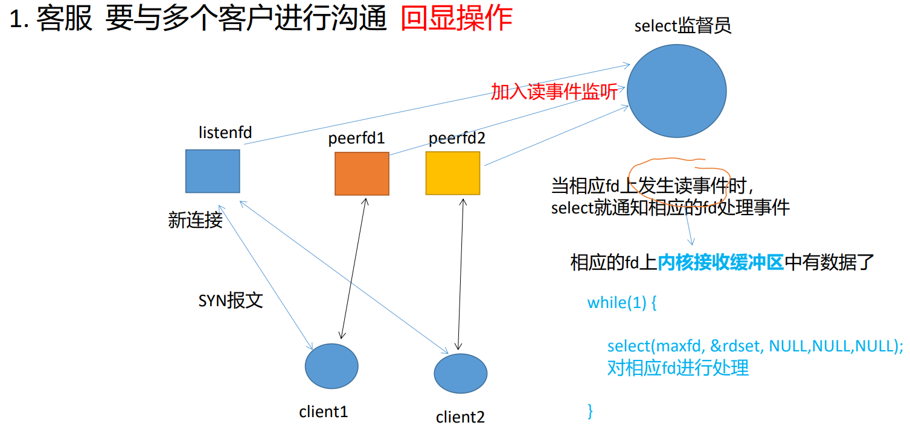
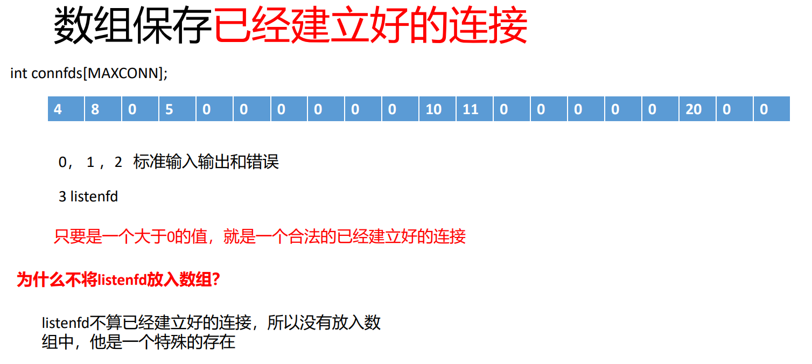

- # ==一、select==  ？
	- 1.IO复用模型
		- 以前可以通过创建一个对应的子线程来处理一个IO，但是当大量IO请求同时到达时，就不行了，子线程太多了会影响效率。
		- 复用：一个单线程可以处理多个客户端的请求
	- 2.为什么可以达到这个效果？
		- 本质：基于**事件驱动的模型**，事件循环->不断调用select函数。
			- I   input    读取数据 读操作 **读事件**
				- 相应的fd上的内核接收缓冲区中有数据了，就会触发读事件
			- O output 发送数据 写操作 **写事件**
			- 当recv和send第四个参数设置为0时，效果与read和write一致
	- **select接口**
		- ```C
		  NAME
		         select, pselect, FD_CLR, FD_ISSET, FD_SET, FD_ZERO - synchronous I/O multiplexing
		  
		  SYNOPSIS
		         /* According to POSIX.1-2001, POSIX.1-2008 */
		         #include <sys/select.h>
		  
		         /* According to earlier standards */
		         #include <sys/time.h>
		         #include <sys/types.h>
		         #include <unistd.h>
		  
		         int select(int nfds, fd_set *readfds, fd_set *writefds,
		                    fd_set *exceptfds, struct timeval *timeout);
		  //readfds：监听读事件的集合
		  //writefds：监听写事件的集合
		  //exceptfds：监听错误事件的集合
		  
		         void FD_CLR(int fd, fd_set *set);
		         int  FD_ISSET(int fd, fd_set *set);
		         void FD_SET(int fd, fd_set *set);
		         void FD_ZERO(fd_set *set);
		  ```
		- 返回值：
			- 大于0：表示有多少fd就绪
			- 等于0：超时
			- 小于0：发生了错误
	- **1.select的限制：**
		- 最多能够监听的文件描述符数量：
			- 32位系统：1024   `FD_SETSIZE`  该宏可以修改，只需要重新编译内核。
			- 64位系统：2048
	- **2.内核的数据结构：位图**
	- **3.内核中的轮询机制：**
		- nfds+1范围内的每一个fd都要去主动询问一次，假设有1000个fd被监听，只有10个fd真正就绪，也要全部询问，询问1000次，就有900次询问是无效的。
	- **4.用户态的轮询机制：**
		- 必须要遍历所有已经建立连接的fd，查找到真正发生了事件的fd。然后才去进行相应的处理。
			- 假如有1000个fd，只有10个有。那么在用户态也要轮询1000次。
	- **select实现即时聊天：**
		- 1.服务器是客服 要与多个客户进行沟通  完成回显操作
		- 
		- 
		- 对于建立好的很多连接，可以用一个数组来进行保存。
		- ```C
		  //select.c
		  //server.c
		  #define MAXCONNS 1000
		  int main(void)
		  {
		    //本进程忽略SIGPIPE信号,防止client关闭后服务器send函数发送SIGPIPE导致服务器程序崩溃
		    signal(SIGPIPE,SIG_IGN);
		    //1.创建套接字
		    int listenfd = socket(AF_INET,SOCK_STREAM,0);
		    //error check
		    
		    //将网络地址设置为可重用的，对listenfd进行属性设置
		    int on = 1;
		    int ret = setsockopt(listenfd,SOL_SOCKET,SO_REUSEADDR,&on,sizeof(on));
		    //check
		    
		    //设置服务器的网络地址
		    struct sockaddr_in serverAddr;
		    //清空初始化
		    menset(&serverAddrm0msizeof(serverAddr));
		    
		    //初始化服务器的网络地址
		    serverAddr.sin_family = AF_INET;//IPV4
		    serverAddr.sin_port = htons(8888);//初始化网络地址时注意字节序的转换
		    serverAddr.sin_addr.s_addr = inet_addr("192.168.30.128");
		    //服务器内网IP
		    
		    //绑定套接字
		    int ret = bind(listenfd,(struct sockaddr*)&serverAddr,sizeof(serverAddr));
		                                           
		    //listen
		    ret = listen(listenfd,100);     ?listen 中 100 的影响
		    //error check
		    
		    fd_Set rdset;
		    
		    //设置最大文件描述符，select时用
		    int maxfd = listenfd;
		  
		    //数组保存已经建立好的连接，初始全0.listenfd不在里面,它不算已经建立好的连接，它是一个特殊的存在
		    int connfds[MAXCONNS] = {0};//已经建立好的连接，保存在数组中
		    //当连接满的时候，
		    //方案1.直接踢掉
		    //方案2.继续扩容
		    //select最多能监听的文件描述符是有限的，所以在select中是无法做到扩容的。
		    
		    //连接计数
		    int conncnts = 0;
		    
		    while(1){
		      //每一次select调用之前都需要监听相应的文件描述符
		      FD_ZERO(&rdset);
		      FD_SET(listenfd,&rdset);//将listen加入监听
		      
		      //遍历整个数组，将所有已经建立好的连接加入到select中进行监听
		      for(int i = 0;i<MAXCONNS;++i)
		      {
		        if(connfds[i]!=0)
		        {
		          FD_SET(connfds[i],&rdset);
		        }
		        //不能else break，因为可能前面有的连接关闭了，就变成0了。所以要遍历整个数组
		      }
		      
		      printf("before select\n");
		      
		      int nready = select(maxfd+1,&rdset,NULL,NULL,NULL);
		      //check
		      
		      printf("after select\n");
		      
		      //有新连接请求
		      if(FD_ISSET(listenfd,&rdset))
		      {
		        //进行新连接的处理
		        int peerfd = accept(listenfd,NULL,NULL);
		        //error check
		        
		        //当达到最大连接数时，不再接收新的客户端连接。即：直接踢走
		        if(conncnts >= MAXCONNS)
		        {
		          close(peerfd);
		          continue;
		        }
		        
		        //保存已经建立好的连接
		        for(int i = 0;i < MAXCONNS;++i)
		        {
		          if(connfds[i] == 0)
		          {
		            connfds[i] = peerfd;
		            //数量加一
		            conncnts++;
		            break;
		          }
		        }
		        //更新maxfd！
		        maxfd = maxfd < peerfd? peerfd:maxfd;
		      }
		      
		      //处理已经建立好的连接
		      //遍历全部连接才能直到哪一个连接有了事件发生
		      //用户态轮询
		      for(int i = 0;i<MAXCONNS;++i)
		      {
		        if(connfds[i] != 0)
		        {
		          if(FD_ISSET(connfds[i],&rdset))
		          {
		            //表示对端有数据到达。执行读操作
		            char recvbuf[100] = {0};
		            //接收数据
		            ret = recv(connfds[i],recvbuf,sizeof(recvbuf),0);
		            //ret = read(connfds[i],recvbuf,sizeof(recvbuf));
		            if(ret>0)
		            {
		              printf("recv from client:%5d,%s\n",ret,recvbuf);
		              //回显
		              ret = send(connfds[i],recvbuf,strlen(recvbuf),0);
		              //ret = write(connfds[i],recvbuf,strlen(recvbuf));
		              printf(">> %d send %d byte data\n",connfds[i],ret);
		              
		              //可以设置for循环群发至所有客户端
		              
		            }
		            else if(0 == ret)
		            {
		              printf("conn has closed:%s\n",recvbuf);
		              //关闭文件描述符
		              close(connfds[i]);
		              //断开连接后，将该连接从数组中清除掉
		              connfds[i] = 0;
		              //数量减一
		              conncnts--;
		              
		              //不用管maxfd，它最大就行了
		            }
		            else
		            {
		              perror("recv");
		            }
		            
		          }
		        }
		      }
		    }
		    close(listenfd);
		    return 0;
		  }
		  ```
		- ```C
		  //client.c
		  //client.c
		  int main(void)
		  {
		    //1.创建套接字
		    int clientfd = socket(AF_INET,SOCK_STREAM,0);
		    //error check
		    
		    //设置服务器的网络地址
		    struct sockaddr_in serverAddr;
		    //清空初始化
		    menset(&serverAddr,0,sizeof(serverAddr));
		    
		    //初始化服务器的网络地址
		    serverAddr.sin_family = AF_INET;//IPV4
		    serverAddr.sin_port = htons(8888);
		    serverAddr.sin_addr.s_addr = inet_addr("192.168.30.128");
		                                           
		    int ret = connect(clientfd,(struct sockaddr*)&serverAddr,sizeof(serverAddr));
		    //error check
		    
		    fd_set rdset;
		    
		    printf("conn has \n");
		    while(1)
		    {
		      //设置rdset
		      FD_ZERO(&rdset);//因为每次rdset会被覆盖，所以需要重新初始化
		      FD_SET(clientfd,&rdset);
		      FD_SET(STDIN_FILENO,&rdset);
		      
		      select(clientfd+1,&rdset,NULL,NULL,NULL);
		      
		      if(FD_ISSET(STDIN_FILENO,&rdset))
		      {
		        //获取数据
		        char recvbuf[100] = {0};
		        ret = recv(clientfd,recvbuf,sizeof(recvbuf),0);
		        //ret = read(clientfd,recvbuf,sizeof(recvbuf));
		        //发送数据
		        ret = send(clientfd,recvbuf,sizeof(recvbuf),0);
		        //ret = write(clientfd,recvbuf,sizeof(recvbuf));
		      }
		      if(FD_ISSET(clientfd,&rdset))
		      {
		        char recvbuf[100] = {0};
		        ret = recv(clientfd,recvbuf,sizeof(recvbuf),0);
		        //ret = read(clientfd,recvbuf,sizeof(recvbuf));
		        printf("recv from server: %s\n",recvbuf);
		      }
		    }
		    close(clientfd);
		    return 0;
		  }
		  ```
	- **select群发：**
		- ```C
		  //server.c
		  #include<func.h>
		  #define MAXFDS 1000
		  
		  int main(int argc,char* argv[])
		  {
		      //忽略SIGPIPE信号
		      signal(SIGPIPE,SIG_IGN);
		      //创建套接字
		      int listenfd = socket(AF_INET,SOCK_STREAM,0);
		      ERROR_CHECK(listenfd,-1,"socket");
		  
		      //设置套接字属性，地址可重用
		      int on = 1;
		      int retval = setsockopt(listenfd,SOL_SOCKET,SO_REUSEADDR,&on,sizeof(on));
		  
		      //创建网络地址
		      struct sockaddr_in serverAddr;
		      memset(&serverAddr,0,sizeof(serverAddr));
		      serverAddr.sin_family = AF_INET;
		      serverAddr.sin_port = 8888;
		      serverAddr.sin_addr.s_addr = inet_addr("10.0.16.2");
		  
		      //绑定网络地址
		      int ret = bind(listenfd,(struct sockaddr*)&serverAddr,sizeof(serverAddr));
		      ERROR_CHECK(ret,-1,"bind");
		  
		      //监听
		      ret = listen(listenfd,100);
		      ERROR_CHECK(-1,ret,"listen");
		  
		      //建立位图
		      fd_set readfds;
		      FD_ZERO(&readfds);
		  
		      int maxfd = listenfd;
		      int connectfds[MAXFDS] = {0};
		  
		      while(1)
		      {
		          //初始化，因为每次位图都会被覆盖
		          FD_ZERO(&readfds);
		          FD_SET(listenfd,&readfds);
		  
		          for(int i = 0;i < MAXFDS;i++)
		          {
		              if(connectfds[i] != 0)
		              {
		                  FD_SET(connectfds[i],&readfds);
		              }
		          }
		  
		          printf("before select\n");
		          //select
		          select(maxfd+1,&readfds,NULL,NULL,NULL);
		          printf("afterk select\n");
		  
		          if(FD_ISSET(listenfd,&readfds))
		          {
		              int peerfd = accept(listenfd,NULL,NULL);
		              for(int i = 0;i < MAXFDS; i++)
		              {
		                  if(connectfds[i] == 0)
		                  {
		                      connectfds[i] = peerfd;
		                      maxfd = maxfd < peerfd?peerfd:maxfd;
		  
		                      printf("加入数组！\n");
		  
		                      break;
		                  }
		              }
		          }
		  
		          for(int i = 0;i < MAXFDS; i++)
		          {
		              if(connectfds[i] != 0)
		              {
		                  if(FD_ISSET(connectfds[i],&readfds))
		                  {
		                      
		                      printf("开始检测!\n");
		  
		                      char buf[1024];
		                      memset(buf,0,1024);
		                      int len = read(connectfds[i],buf,1024);
		                      ERROR_CHECK(len,-1,"read");
		                      if(len == 0 )
		                      {
		                          printf("connect is closed!\n");
		                          close(connectfds[i]);
		                          connectfds[i] = 0;
		                          //不加continue，当一个连接断开后，会卡在后面的read上面；
		                          continue;
		                      }
		  
		                      printf("read from client:%s\n",buf);
		  
		                      struct timeval nowOfClient;
		                      len = read(connectfds[i],&nowOfClient,sizeof(struct timeval));
		                      ERROR_CHECK(len,-1,"read");
		                    //群发至所有客户端
		                      for(int j = 0;j < MAXFDS;j++)
		                      {
		                          if(connectfds[j] != 0 && j != i)
		                          {
		                              len = send(connectfds[j],buf,1024,0);
		                              ERROR_CHECK(len,-1,"send");
		                              len = send(connectfds[j],&nowOfClient,sizeof(struct timeval),0);
		                              ERROR_CHECK(len,-1,"send");
		                              printf("发送完毕!\n");
		                          }
		                      }
		                  }
		              }
		          }
		      }
		      close(listenfd);
		  }
		  ```
		- ```C
		  //client.c
		  #include<func.h>
		  #define MAXFDS 1000
		  
		  int main(int argc,char* argv[])
		  {
		      //创建套接字
		      int clientfd = socket(AF_INET,SOCK_STREAM,0);
		      ERROR_CHECK(clientfd,-1,"socket");
		  
		      //设置服务器网络地址
		      struct sockaddr_in serverAddr;
		      memset(&serverAddr,0,sizeof(serverAddr));
		      serverAddr.sin_family = AF_INET;
		      serverAddr.sin_port = 8888;
		      serverAddr.sin_addr.s_addr = inet_addr("10.0.16.2");
		  
		      //建立位图
		      fd_set readfds;
		  
		      int ret = connect(clientfd,(struct sockaddr*)&serverAddr,sizeof(serverAddr));
		      ERROR_CHECK(ret,-1,"connect");
		  
		      while(1)
		      {
		          //初始化，因为每次位图都会被覆盖
		          FD_ZERO(&readfds);
		          FD_SET(clientfd,&readfds);
		          FD_SET(STDIN_FILENO,&readfds);
		  
		          //select
		          select(clientfd+1,&readfds,NULL,NULL,NULL);
		  
		          if(FD_ISSET(clientfd,&readfds))
		          {
		              char buf[1024];
		              memset(buf,0,1024);
		              int len = read(clientfd,buf,1024);//分开接收数据，前1024字节是发送的信息
		              ERROR_CHECK(len,-1,"read");
		              if(len == 0 )
		              {
		                  printf("connect is closed!\n");
		                  break;
		              }
		              printf("from server:%s",buf);
		              struct timeval nowOfClient;
		              len = read(clientfd,&nowOfClient,sizeof(struct timeval));
		            //recv、read会一边拷贝一边清除缓冲区，所以可以读后sizeof的数据就是timeval，然后
		            //解析出来时间
		              ERROR_CHECK(len,-1,"read");
		              struct tm *nowOfClient_tm = localtime(&nowOfClient.tv_sec);
		              printf("(%.4d年%.2d月%.2d日%.2d时%.2d分%.2d秒)\n",
		                      nowOfClient_tm->tm_year + 1900,
		                      nowOfClient_tm->tm_mon + 1,
		                      nowOfClient_tm->tm_mday,
		                      nowOfClient_tm->tm_hour,
		                      nowOfClient_tm->tm_min,
		                      nowOfClient_tm->tm_sec);
		          }
		  
		          //STDIN
		          if(FD_ISSET(STDIN_FILENO,&readfds))
		          {
		            //读数据
		              char buf[1024];
		              memset(buf,0,1024);
		              int len = read(STDIN_FILENO,buf,1024);
		              ERROR_CHECK(len,-1,"read");
		            //发送数据
		              int size = write(clientfd,buf,1024);
		              ERROR_CHECK(size,-1,"write");
		            //发送时间
		              struct timeval now;
		              gettimeofday(&now,NULL);
		              size = write(clientfd,&now,sizeof(struct timeval));
		          }
		      }
		      close(clientfd);
		  }
		  ```