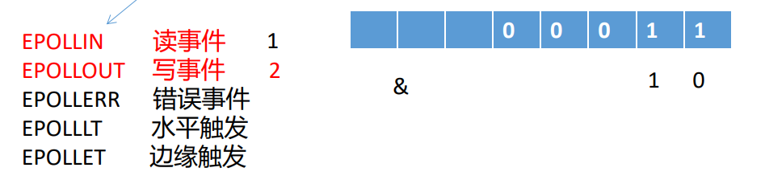

- # 一、IO复用模型之epoll
	- ## 1.`epoll`的出现就是为了解决select面临的问题
	- ## 2.`epoll`的接口
		- `e`：`event` 基于**事件驱动**的机制。
		- `poll`：轮询    **单线程处理多个客户端的请求**
		- ### （1）epoll实例的创建
			- ```C
			  NAME
			         epoll_create, epoll_create1 - open an epoll file descriptor
			  
			  SYNOPSIS
			         #include <sys/epoll.h>
			  
			         int epoll_create(int size);//不推荐使用了。
			         int epoll_create1(int flags);//现在用这个，flags的值直接设置为0即可
			  ```
			- 返回值就是一个epoll的文件描述符`efd`。
			- epoll的文件描述符所在的指针指向的就是一个就绪链表和一颗红黑树的数据结构
				- 红黑树：存储被监听的文件描述符==fd==及其==事件==
					- 红黑树的特点： 左根右、根叶黑、不红红、黑路同
						- 访问任何一个结点的时间复杂度为$O(log_2N)$
							- 二分查找。
						- 没有节点数目的限制
				- 
		- ### （2）==epoll_ctl 控制函数==
			- ```C
			  NAME
			         epoll_ctl - control interface for an epoll file descriptor
			  
			  SYNOPSIS
			         #include <sys/epoll.h>
			  
			         int epoll_ctl(int epfd, int op, int fd, struct epoll_event *event);
			  
			  RETURN VALUE
			         When  successful,  epoll_ctl()  returns zero.  When an error occurs, epoll_ctl() returns -1 and errno is set appropri‐
			         ately.
			  
			  struct epoll_event {
			                 uint32_t     events;      /* Epoll events */
			                 epoll_data_t data;        /* User data variable */
			             };
			  
			  //联合体：共用同一段内存，只是每个数据的解释方式不一样。
			  //即：同一时刻只能表示一种数据（就像钟点房，同一时刻只有一个客户）
			  //地址是相同的，他有时候表示void*，有时候表示int ... 本质只是内存数据解释方式不同
			  //相比结构体：节省内存空间
			  typedef union epoll_data {
			                 void        *ptr;
			    //可以用ptr，它指向一个结构体，该结构体再存储fd
			                 int          fd;//上面data里面放的就是fd的时刻
			                 uint32_t     u32;
			                 uint64_t     u64;
			             } epoll_data_t;
			  ```
			- 参数：
				- epfd：epoll_create1返回的epfd
				- op：操作：
					- ==EPOLL_CTL_ADD==：添加监听
					- ==EPOLL_CTL_MOD==：修改监听
					- ==EPOLL_CTL_DEL==：删除监听
				- fd：被监听的文件描述符
					- 下面ev.data.fd已经包含了fd，为什么还加？11：16（√）
						- epoll_ctl操作的是红黑树，红黑树是有序的。这个fd，代表的是红黑树中的key，按这个key的大小排序插入红黑树。
						- ev代表的是红黑树中的value。
						- 所以这里的fd和下面的ev联合起来构成一个键值对，一个红黑树的结点
							- 而且event中的fd是一个联合体，有时候它表示ptr指针，指向一个结构体，结构体里面存fd；不能寄希望于event中每次都是fd，如果表示的不再是fd，就不好操作了，所以外面的fd不能删除。
					- 一个结点：
						- fd
						- event
				- event.events：
					- ```C
					  //可以用位来表示这些事件的发生，只需要将对应位置为1就表示该事件触发
					  //读事件
					  EPOLLIN
					                The associated file is available for read(2) operations.
					  
					  //写事件
					         EPOLLOUT
					                The associated file is available for write(2) operations.
					  
					  //错误事件
					         EPOLLERR
					                Error condition happened on the associated file descriptor.  This event is also reported for the write end of a
					                pipe  when  the read end has been closed.  epoll_wait(2) will always report for this event; it is not necessary
					                to set it in events.
					  //水平触发      
					  EPOLLLT
					  
					  //边缘触发  
					         EPOLLET
					                Sets  the  Edge Triggered behavior for the associated file descriptor.  The default behavior for epoll is Level
					                Triggered.  See epoll(7) for more detailed information about Edge and Level Triggered event distribution archi‐
					                tectures.
					  ```
					- 
					- 用整型表示事件：1 2 4 8 这样的。与返回的数进行按位与，结果不为0，这个时间就发生了。
				- ```C
				  //event结构体初始化：
				  struct epoll_event ev;
				  ev.data.fd = listenfd;
				  ev.events = EPOLLIN;
				  ```
					- 只需要添加一次，不需要像select每次循环都要重新添加。
					- 因为红黑树结构就保存在内核的。
		- ### （3）epoll_wait 等待
			- **它是一个阻塞式函数**
				- 直到有文件描述符被触发。
			- ```C
			  NAME
			         epoll_wait, epoll_pwait - wait for an I/O event on an epoll file descriptor
			  
			  SYNOPSIS
			         #include <sys/epoll.h>
			  
			         int epoll_wait(int epfd, struct epoll_event *events,
			                        int maxevents, int timeout);
			  ```
			- epfd：epoll的实例
			- events：
				- 用户态数组的首地址
				- 传出参数。
			- maxevents：
				- 数组的长度
				- 假设连接数有10000，就绪的fd有1000个，数组长度为100；会每次循环调用epoll_wait取100个，慢慢取了处理。
			- timeout
				- 超时时间，单位是毫秒，5000表示5秒超时一次
				- 设置的值为-1，表示无限等待
			- 返回值跟select一样
				- \>0：表示已经就绪的文件描述符个数nready
					- nready个就绪fd的数据会被写入到events数组中
						- 写入就绪链表
				- =0：表示超时
				- <0：表示出现了错误
			- 当epoll_wait函数返回时，直接从内核中的就绪链表中取下就绪的fd数据，写入到用户态的events数组中。
			- 在**内核进行轮询**时，内部有**回调机制**，发生了事件的fd**会主动通知epoll_wait，因此提高程序的执行效率。**
				- 就是现在是内部的回调机制主动来通知epoll_wait的，只需要处理有事件就绪的fd，而不是select需要一直轮询所有的fd。
	- ## 3.使用
		- 
		- ```C
		  #ifndef __WD_TCP_H__
		  #define __WD_TCP_H__
		  
		  #define MAXCONNS 1000
		  #include<func.h>
		  
		  void setNonBlock(int fd);
		  int tcpInit(const char* ip,unsigned short port);
		  
		  int epollAddReadEvent(int epfd,int fd);
		  int epollDelEvent(int epfd,int fd);
		  
		  int handleNewConnection(int epfd,int listenfd);
		  int handleMessage(int epfd,int fd);
		  
		  int eventloop(int epfd,int listenfd,struct epoll_event *pevtList,MAXCONNS);
		  
		  #endif
		  ```
		- ```C
		  #include "tcp.h"
		  
		  void setNonBlock(int fd)
		  {
		    int flags = fcntl(fd,F_GETFL,0);
		    flags |= O_NONBLOCK;
		    fcntl(fd,F_SETFL,flags);
		  }
		  
		  int tcpInit(const char* ip,unsigned short port)
		  {
		    //本进程忽略SIGPIPE信号,防止client关闭后服务器send函数发送SIGPIPE导致服务器程序崩溃
		    signal(SIGPIPE,SIG_IGN);
		    //1.创建套接字
		    int listenfd = socket(AF_INET,SOCK_STREAM,0);
		    //socket(AF_INET,SOCK_STREAM | SOCK_NONBLOCK,0);外面就不用再设置了
		    //error check
		    
		    //将网络地址设置为可重用的，对listenfd进行属性设置
		    int on = 1;
		    int ret = setsockopt(listenfd,SOL_SOCKET,SO_REUSEADDR,&on,sizeof(on));
		    //check
		    
		    //设置服务器的网络地址
		    struct sockaddr_in serverAddr;
		    //清空初始化
		    memset(&serverAddr,0,sizeof(serverAddr));
		    
		    //初始化服务器的网络地址
		    serverAddr.sin_family = AF_INET;//IPV4
		    serverAddr.sin_port = htons(port);//初始化网络地址时注意字节序的转换
		    serverAddr.sin_addr.s_addr = inet_addr(ip);
		    //服务器内网IP
		    
		    //绑定套接字
		    int ret = bind(listenfd,(struct sockaddr*)&serverAddr,sizeof(serverAddr));
		                                           
		    //listen得到监听套接字，供accept使用
		    ret = listen(listenfd,100);     //?listen 中 100 的影响
		    //error check
		    
		    return listenfd;
		  }
		  
		  int epollAddReadEvent(int epfd,int fd)
		  {
		    struct epoll_event ev;
		    memset(&ev,0,sizeof(ev));
		    ev.events = EPOLLIN;    //监听读事件
		    ev.data.fd = fd;  //对listenfd进行监听
		    int ret = epoll_ctl(epfd,EPOLL_CTL_ADD,fd,&ev);
		    ERROR_CHECK(ret,-1,"epoll_ctl");
		    return 0;//成功返回0
		  }
		  
		  int epollDelEvent(int epfd,int fd)
		  {
		    struct epoll_event ev;
		    ev.data.fd = fd;
		    int ret = epoll_ctl(epfd,EPOLL_CTL_DEL,fd,&ev);
		    ERROR_CHECK(ret,-1,"epoll_ctl");
		    return 0;
		  }
		  
		  int handleNewConnection(int epfd,int listenfd)
		  {
		    int peerfd = accept(listenfd,NULL,NULL);
		    //error check
		    /*如设置peerfd一样设置listen的属性，可以让accept变为非阻塞*/
		          
		    //对新连接的读事件进行监听
		    //对新连接的监听只需要一次
		    epollAddReadEvent(epfd,peerfd);
		          
		    /*
		    将peerfd设置成非阻塞
		    因为后面recv、send操作的是每一个peerfd套接字。
		    */
		    setNonBlock(peerfd);
		    return 0;
		  }
		  
		  int handleMessage(int epfd,int fd)
		  {
		    char recvbuf[100] = {0};
		    //接收数据，默认情况下recv是阻塞函数
		    int ret = recv(fd,recvbuf,sizeof(recvbuf),0);
		    if(ret>0)
		    {
		      printf("recv from client:%5d,%s\n",ret,recvbuf);
		      //回显
		      ret = send(fd,recvbuf,strlen(recvbuf),0);
		      printf(">> %d send %d byte data\n",fd,ret);
		    }
		    else if(0 == ret)
		    {
		      printf("conn has closed\n");
		      //关闭文件描述符
		      close(fd);
		      //连接断开后，还要将其从监听的红黑树上删除，即：不再监听他
		      epollDelEvent(epfd,fd);
		    }
		    else
		    {
		      perror("recv");
		    }
		    return 0;
		  }
		  
		  int eventloop(int epfd,int listenfd,struct epoll_event *pevtList,MAXCONNS)
		  {
		    int ret = -1;
		    //事件循环
		    while(1){
		      
		      printf("before select\n");
		      
		      int nready = epoll_wait(epfd,pevtList,MAXCONNS,-1);//-1:无限等待
		      //check
		      if(nready == -1 && errno == EINTR)//EINTR中断错误
		      {
		        continue;
		      }
		      else if( 0 == nready)
		      {
		        //epoll_wait超时
		        printf(">> epoll tomeout\n");
		        continue;
		      }
		      else if(-1 == nready)
		      {
		        perror("epoll_wait");
		        return EXIT_FAILURE;
		      }
		      //当epoll_wait返回时，前nready个已经就绪的fd信息写入到了pevtList数组的前nready个位置上。
		      printf("after select\n");
		      
		      //遍历就绪数组
		      for(int i = 0;i < nready;i++)
		      {
		        int fd = pevtList[i].data.fd;
		        //1.对新连接的处理
		        if(fd == listenfd)
		        {
		          ret = handleNewConnection(epfd,listenfd);
		        }
		        //2.处理已经建立好的连接.只要不是listenfd，就肯定是已经建立好的连接
		        else
		        {
		          ret = handleMessage(epfd,fd);
		          //可以测试新连接是否会加入就绪队列
		          //recv(fd,recvbuf,sizeof(recvbuf),0);
		        }
		      }
		    }
		    return 0;
		  }
		  ```
		- ```C
		  //epoll.c
		  #include "tcp.h"
		  
		  //当你在写函数时，如果超过五十行，要考虑进行封装了。vim一页放得下
		  
		  int main(void)
		  {
		    //得到tcp监听套接字
		    int listenfd = tcpInit("127.0.0.1",8888);
		    
		    //将listenfd设置为非阻塞，accept就可以不阻塞了。
		    setNonBlock(listenfd);
		    
		    //1.创建epoll的实例
		    int epfd = epoll_create1(0);
		    ERROR_CHECK(epfd,-1,"epoll_create1");
		    
		    //2.用epoll对listenfd进行监听。
		    epollAddReadEvent(epfd,listenfd);
		    
		    int ret = 0;
		    
		    //就绪数组
		    struct epoll_event *pevtList = calloc(MAXCONNS,sizeof(struct epoll_event));
		    
		    //事件循环
		    eventloop(epfd,listenfd,pevtList,MAXCONNS);
		    
		    free(pevtList);
		    close(listenfd);
		    return 0;
		  }
		  ```
- # 二、==epoll和select的对比==
	- 1.对于文件描述符的监听
		- select每次执行之前都需要重新进行设置。
		- epoll只需要**监听一次，后续不再需要再次监听**。
	- 2.底层实现
		- select底层是采用数组（位图），其监听的文件描述符是有上限的。一般情况下：
			- 32位系统是1024    FD_SETSIZE宏进行设置。可以修改，但是修改之后需要重新编译内核
				- 位图是数组实现，所以大小是固定的有上限的。
			- 64位系统是2048
		- epoll底层实现采用的是红黑树+就绪链表，其监听的文件描述符没有上限，一般情况下与内存有关 1G=>10万
			- `cat /proc/sys/fs/file-max`
	- 3.轮询的机制有所不同
		- select的内部实现（内核态）：每一次轮询时，都要对监听的所有fd都去询问一次：是否就绪；比如即使只有10个就绪，也会遍历1000个文件描述符（线性扫描）
		- epoll的内部实现（内核态）：具有回调Callback机制，比如监听的是1000个文件描述符，如果只有10个fd就绪，主动通知epoll去进行处理。**尤其是针对大并发的请求，效率远远高于select**
	- 4.用户态的轮询：
		- select返回之后还是需要对已经建立好的连接挨个去询问，确认其是否已经在就绪的fd_set中。
		- epoll_wait返回之后，相应的就绪文件描述符已经拿到了，不再需要轮询所有已经建立好的连接。
	- 
	-
- # 三、在epoll轮询过程中的问题
	- **epoll在轮询的过程中，处理一个fd的事件不宜过长。**
	- ```C
	  char recvbuf[100] = {0};
	          //接收数据，默认情况下recv是阻塞函数
	          ret = recv(fd,recvbuf,sizeof(recvbuf),0);//阻塞
	          if(ret>0)
	          {
	            printf("recv from client:%5d,%s\n",ret,recvbuf);
	            //回显
	            ret = send(fd,recvbuf,strlen(recvbuf),0);//阻塞
	            printf(">> %d send %d byte data\n",fd,ret);
	          }
	  ```
	- 在轮询过程中，如果有一个连接发生了阻塞，就会导致其他所有的连接，不能及时的得到相应的处理
	- 为了防止发生这样的问题，一般情况下要结合**非阻塞**进行操作
	- ## 1.非阻塞的设置方式
		- **方式1：对recv/send函数进行设置**
			- recv/send
				- 可以设置第四个参数
				- ==MSG_DONTWAIT==
					- 非阻塞，没有数据时，立刻返回，并设置相应的错误码
					- ==**只针对这一次的行为，有非阻塞的效果**==
						- 就是对设置了这个参数的这一个函数有效，其他没设置的无效。
				- ==MSG_WAITALL==
					- `recv(fd,recvbuf,sizeof(recvbuf),0)`
					- 一直等待，直到接满sizeof(recvbuf)字节才会返回
					- 即：必须要接收指定字节数才能返回
				- ==MSG_PEEK==
					- 只拷贝内核接收缓冲区的数据，并不清除。
						- recv拷贝走数据的同时会清除内核缓冲区的数据；
					- 判断一个连接是否断开时，经常使用。
		- **方式2：对套接字本身的属性进行设置**
			- ==**永久有效的，所有操作都是非阻塞的**==
			- ```C
			  NAME
			         fcntl - manipulate file descriptor
			  
			  SYNOPSIS
			         #include <unistd.h>
			         #include <fcntl.h>
			  
			         int fcntl(int fd, int cmd, ... /* arg */ );
			  
			  //cmd：
			         F_GETFL (void)
			                Return (as the function result) the file access mode and the file status flags; arg is ignored.
			  
			         F_SETFL (int)//O_NONBLOCK
			  ```
			- **操作步骤：**
				- 1.先获取套接字原来的标志位信息flags
				- 2.将非阻塞的属性O_NONBLOCK添加到flags中
				- 3.再将flags设置回去
				- ```C
				  int flags = fcntl(peerfd,F_GETFL,0);
				  flags |= O_NONBLOCK;
				  fcntl(peerfd,F_SETFL,flags);
				  ```
		- **方式3：创建套接字时，也可以设置为非阻塞。**
			- ```C
			  socket(AF_INET,SOCK_STREAM | SOCK_NONBLOCK,0);
			  ```
			- 当第二次调用accept函数时，由于没有新的连接到来，accept立刻返回，其返回值为-1.
			- perror：`accept:Resource temporarily unavailable`
- # 四、==水平触发 VS 边缘触发==
	- `EPOLLLT`：
		- select只支持水平触发
		- epoll两者都支持，且默认情况下为水平触发。
	- 水平触发
		- level trigger：当有事件发生时，只要不处理，就一直通知你，烦死你。
			- 如：缓冲区有数据，只要你不recv，就会一直通知你。这样`epoll_wait`会一直响应。
			- 希望我们尽快把内核的接收缓冲区的数据取出，以保证数据传输的流畅度。所以可以在应用层设置接收缓冲区和发送缓冲区
	- 假设而有一个时刻，暂时不想去处理消息了，希望等待一段时间后，再处理消息。**此时就需要用到边缘触发 EPOLLET**
		- `ev.events = EPOLLIN | EPOLLET;`
	- 边缘触发：
		- edge trigger：**当有消息到达时，只通知一次，之后如果没有处理也不会再进行通知；但当有新的消息到达时，才会再通知一次。**
		- ==带来了新的问题：消息的处理时机不好把握。在实际编程时，其复杂度会增加==
		- ==**结论**==：后续在实践时，推荐使用水平触发的方式，可以沿用之前的编程经验。
		- 一般情况下，应用层必须要拥有**应用层接收缓冲区**和**发送缓冲区**。