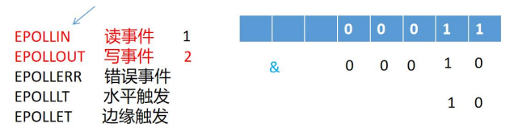

- # 一、写事件在什么情况下触发？
	- EPOLLOUT
	- ```C
	  #ifndef __WD_TCP_H__
	  #define __WD_TCP_H__
	  
	  #define MAXCONNS 1000
	  #include<func.h>
	  //抽象通道层
	  #define BUFFSIZE 1000
	  //通道结构体：一个通道就是一个结构体
	  typedef struct channel_s{
	    int sockfd;
	    int recvBufSize;//应用层接收缓冲区中数据的长度
	    char recvBuff[BUFFSIZE];
	    int sendBuffSize;//应用层发送缓冲区中数据的长度
	    char sendBuff[BUFFSIZE];
	  }channel_t;
	  
	  //通道层的基本操作
	  void channelInit(channel_t *pconns);//对某一个通道进行初始化
	  void channelAdd(channel_t* pconns,int fd);//在通道数组里添加一个通道
	  void channelDel(channel_t *pconns,int fd);//从通道数组中删除一个通道
	  
	  int channelGetIndex(channel_t* pconns,int fd);//获取fd在通道数组中的下标
	  
	  //清空一个通道的输入输出缓冲区
	  void channelClearRecvBuff(channel_t *pconn);
	  void channelClearSendBuff(channel_t *pconn);
	  
	  void setNonBlock(int fd);
	  int tcpInit(const char* ip,unsigned short port);
	  
	  const char* getLocalIp(int sockfd);
	  unsigned short getLocalPort(int sockfd);
	  
	  const char* getPeerIp(int sockfd);
	  unsigned short getPeerPort(int sockfd);
	  
	  int epollAddReadEvent(int epfd,int fd);
	  int epollAddReadWriteEvent(int epfd,int fd);
	  int epollDelEvent(int epfd,int fd);
	  int epollClearWriteEvent(int epfd,int fd);//清除写事件
	  int epollSetWriteEvent(int epfd,int fd);//设置写事件
	  
	  int handleNewConnection(int epfd,int listenfd,channel_t* pconns);
	  int handleReadEvent(int epfd,int fd,channel_t *pconns);
	  int handleWriteEvent(int epfd,int fd,channel_t *pconns);
	  
	  typedef void(*msgHandleCallback)(int fd);//回调函数
	  
	  int eventloop(int epfd,int listenfd,struct epoll_event *pevtList,MAXCONNS);
	  
	  #endif
	  ```
	- ```C
	  #include "tcp.h"
	  
	  void channelInit(channel_T *pconns)
	  {
	    pconns->recvBuffSize = 0;
	    pconns->sendBuffSize = 0;
	    memset(pconns->recvBuff,0,BUFFSIZE);
	    memset(pconns->sendBuff,0,BUFFSIZE);
	  }
	  
	  void channelAdd(channel_t* pconns,int fd)
	  {
	    for(int i = 0;i <MAXCONNS;++i)
	    {
	      if(pcons[i].sockfd == 0)
	      {
	        pcons[i].sockfd = fd;
	        channelInit(&pcons[i]);
	        break;
	      }
	    }
	  }
	  
	  void channelDel(channel_t *pconns,int fd)
	  {
	    int idx = channelGetIndex(pconns,fd);
	    if(idx >= 0)
	    {
	      pconns[idx].sockfd = 0;
	      channelInit(&pconns[idx]);
	    }
	  }
	  
	  int channelGetIndex(channel_t* pconns,int fd)
	  {
	    for(inti = 0;i< MAXCONNS;++i)
	    {
	      if(pconns[i].sockfd == fd)
	        return i;
	    }
	    return -1;
	  }
	  
	  void channelClearRecvBuff(channel_t *pconn)
	  {
	    if(pconn)
	    {
	      pconn->recvBuffSize = 0;
	      memset(pconn->recvBuff,0,BUFFSIZE);
	    }
	  }
	  
	  void channelClearSendBuff(channel_t *pconn)
	  {
	    if(pconn)
	    {
	      pconn->sendBuffSize = 0;
	      memset(pconn->sendBuff,0,BUFFSIZE);
	    }
	  }
	  
	  void setNonBlock(int fd)
	  {
	    int flags = fcntl(fd,F_GETFL,0);
	    flags |= O_NONBLOCK;
	    fcntl(fd,F_SETFL,flags);
	  }
	  
	  const char* getLocalIp(int sockfd)
	  {
	    struct sockadd_in addr;
	    socklen_t len = sizeof(struct sockaddr_in);
	    memset(&addr ,0,sizeof(addr));
	    if(getsockname(sockfd,&addr,&len) < 0)
	    {
	      perror("getsockname");
	      return NULL;
	    }
	    return inet_ntoa(addr.sin_addr);
	  }
	  
	  unsigned short getLocalPort(int sockfd)
	  {
	    struct sockadd_in addr;
	    socklen_t len = sizeof(struct sockaddr_in);
	    memset(&addr ,0,sizeof(addr));
	    if(getsockname(sockfd,&addr,&len) < 0)
	    {
	      perror("getsockname");
	      return -1;
	    }
	    return ntohs(addr.sin_port);
	  }
	  
	  const char* getPeerIp(int sockfd)
	  {
	    struct sockadd_in addr;
	    socklen_t len = sizeof(struct sockaddr_in);
	    memset(&addr ,0,sizeof(addr));
	    if(getpeername(sockfd,&addr,&len) < 0)
	    {
	      perror("getsockname");
	      return NULL;
	    }
	    return inet_ntoa(addr.sin_addr);
	  }
	  
	  unsigned short getPeerPort(int sockfd)
	  {
	    struct sockadd_in addr;
	    socklen_t len = sizeof(struct sockaddr_in);
	    memset(&addr ,0,sizeof(addr));
	    if(getpeername(sockfd,&addr,&len) < 0)
	    {
	      perror("getsockname");
	      return -1;
	    }
	    return ntohs(addr.sin_port);
	  }
	  
	  int tcpInit(const char* ip,unsigned short port)
	  {
	    //本进程忽略SIGPIPE信号,防止client关闭后服务器send函数发送SIGPIPE导致服务器程序崩溃
	    signal(SIGPIPE,SIG_IGN);
	    //1.创建套接字
	    int listenfd = socket(AF_INET,SOCK_STREAM,0);
	    //socket(AF_INET,SOCK_STREAM | SOCK_NONBLOCK,0);外面就不用再设置了
	    //error check
	    
	    //将网络地址设置为可重用的，对listenfd进行属性设置
	    int on = 1;
	    int ret = setsockopt(listenfd,SOL_SOCKET,SO_REUSEADDR,&on,sizeof(on));
	    //check
	    
	    //设置服务器的网络地址
	    struct sockaddr_in serverAddr;
	    //清空初始化
	    memset(&serverAddr,0,sizeof(serverAddr));
	    
	    //初始化服务器的网络地址
	    serverAddr.sin_family = AF_INET;//IPV4
	    serverAddr.sin_port = htons(port);//初始化网络地址时注意字节序的转换
	    serverAddr.sin_addr.s_addr = inet_addr(ip);
	    //服务器内网IP
	    
	    //绑定套接字
	    int ret = bind(listenfd,(struct sockaddr*)&serverAddr,sizeof(serverAddr));
	                                           
	    //listen得到监听套接字，供accept使用
	    ret = listen(listenfd,100);
	    //error check
	    
	    return listenfd;
	  }
	  
	  int epollAddReadEvent(int epfd,int fd)
	  {
	    struct epoll_event ev;
	    memset(&ev,0,sizeof(ev));
	    ev.events = EPOLLIN;    //监听读事件
	    ev.data.fd = fd;  //对listenfd进行监听
	    int ret = epoll_ctl(epfd,EPOLL_CTL_ADD,fd,&ev);
	    ERROR_CHECK(ret,-1,"epoll_ctl");
	    return 0;//成功返回0
	  }
	  
	  int epollAddReadWriteEvent(int epfd,int fd)
	  {
	    struct epoll_event ev;
	    memset(&ev,0,sizeof(ev));
	    ev.events = EPOLLIN | EPOLLOUT;
	    ev.data.fd = fd;
	    int ret = epoll_ctl(epfd,EPOLL_CTL_ADD,fd,&ev);
	    ERROR_CHECK(ret,-1,"epoll_ctl");
	    return 0;//成功返回0
	  }
	  
	  int epollDelEvent(int epfd,int fd)
	  {
	    struct epoll_event ev;
	    ev.data.fd = fd;
	    int ret = epoll_ctl(epfd,EPOLL_CTL_DEL,fd,&ev);
	    ERROR_CHECK(ret,-1,"epoll_ctl");
	    return 0;
	  }
	  
	  int epollClearWriteEvent(int epfd,int fd)//清除写事件,只监听读事件
	  {
	    struct epoll_event ev;
	    memset(&ev,0,sizeof(ev));
	    ev.events = EPOLLIN;
	    ev.data.fd = fd;  //对listenfd进行监听
	    int ret = epoll_ctl(epfd,EPOLL_CTL_MOD,fd,&ev);
	    ERROR_CHECK(ret,-1,"epoll_ctl");
	    return 0;//成功返回0
	  }
	  int epollSetWriteEvent(int epfd,int fd)//设置写事件
	  {
	    struct epoll_event ev;
	    memset(&ev,0,sizeof(ev));
	    ev.events = EPOLLIN | EPOLLOUT;
	    ev.data.fd = fd;  //对listenfd进行监听
	    int ret = epoll_ctl(epfd,EPOLL_CTL_MOD,fd,&ev);
	    ERROR_CHECK(ret,-1,"epoll_ctl");
	    return 0;//成功返回0
	  }
	  
	  int handleNewConnection(int epfd,int listenfd,channel_t* pconns)
	  {
	    int peerfd = accept(listenfd,NULL,NULL);
	    //error check
	    
	    //当连接建立好的时候，希望进行一个记录，记录四元组信息
	    printf(">> conn %s:%d-->%s:%d\n",getLocalIp(peerfd),getLocalPort(peerfd),//【扩展点】
	          getPeerIp(peerfd),getPeerPort(peerfd));
	    
	    //将peerfd添加到通道数组中
	    channelAdd(pconns,peerfd);
	    epollAddReadWriteEvent(epfd,peerfd);
	    setNonBlock(peerfd);
	    return 0;
	  }
	  
	  int handleReadEvent(int epfd,int fd,channel_t *pconns)
	  {
	    int idx = channelGetIndex(pconns,fd);
	    if(idx < 0)return -1;//未找到
	    
	    int ret = recv(fd,pconns[idx].recvBuff,BUFFSIZE,0);
	    if(ret>0)
	    {
	      printf("recv from client:%d,%s\n",ret,pconns[idx].recvBuff);
	      pconns[idx].recvBuffSize = ret;//接收缓冲区数据的长度，不考虑发送缓冲区不够
	      //每次都能全部copy进发送缓冲区
	      //回显->具体的业务需求
	      
	      //request（输入） -->compute（计算） -->response（响应）
	      //寻找一个合适的时间来进行发送才更合理，不能直接就send
	      //在这并不真正去做发送操作，而是将数据放入应用层发送缓冲区中
	      strncpy(pconns[idx].sendBuff + pconns[idx].sendBuffSize,pconns[idx].recvBuff,ret);//【扩展点】
	      pconns[idx].sendBuffSize += ret;//之前可能有数据
	      
	      //发送缓冲区也装不下怎么办？暂时不考虑
	      
	      if(pconns[idx].sendBuffSize > 0)
	      {
	        //当发送缓冲区的长度值大于0时，表示有数据要进行发送
	        epollSetWriteEvent(epfd,fd);//触发写事件,下一次循环的时候就会执行
	      }
	      //清空接收缓冲区,接收缓冲区的数据已经处理完了
	      channelClearRecvBuff(&pconns[idx]);
	    }
	    else if(0 == ret)
	    {
	      printf("conn has closed\n");
	      //连接断开后，还要将其从监听的红黑树上删除，即：不再监听他
	      epollDelEvent(epfd,fd);
	      //从通道数组中删除
	      channelDel(pconns,fd);
	      //连接断开时，也需要做一个记录
	      printf(">> conn %s:%d-->%s:%d has closed\n",getLocalIp(fd),getLocalPort(fd),//【扩展点】
	      	getPeerIp(fd),getPeerPort(fd));
	      //关闭文件描述符.最后关闭，不然会报错
	      close(fd);
	    }
	    else
	    {
	      perror("recv");
	    }
	    return 0;
	  }
	  
	  int handleWriteEvent(int epfd,int fd,channel_t* pconns)
	  {
	    printf("write event trigger\n");
	    //判断发送缓冲区是否有东西发送
	    int idx = channelGetIndex(pconns,fd);//找到触发事件的通道
	    int ret = -1;
	    //当发现缓冲区没有数据时，就清除写事件的监听
	    if(pconns[idx].sendBuffSize == 0)
	    {
	      //缓冲区没有数据，清除写事件,不然一直触发
	      epollClearWriteEvent(epfd,fd);
	    }else{
	      //进行真正的数据的发送操作
	      ret = send(fd,pconns[idx].sendBuff,pconns[idx].sendBuffSize,0);
	      //可能只会发送一部分，所以要更新发送缓冲区的数据
	      if(ret >= 0)
	      {
	        //更新发送缓冲区中数据的长度
	        pconns[idx].sendBuffSize -= ret;
	        //如果数据全部发送完毕，清除写事件的监听
	        if(pconns[idx].sendBuffSize == 0)
	        {
	          epollClearWriteEvent(epfd,fd);
	        }
	        else
	        {//发送缓冲区中还有部分数据没有发送完成，
	          //因此需要进行滑动窗口机制，移走已经发送的数据
	          memmove(pconns[idx].sendBuff,
	          pconns[idx].sendBuff + ret,
	          pconns[idx].sendBuffSize);
	        }
	      }
	      else
	      {
	        perror("send");
	      }
	    }
	    return 0;
	  }
	  
	  int eventloop(int epfd,int listenfd,struct epoll_event *pevtList,MAXCONNS)
	  {
	    channel_t *pconns = (channel_t *)calloc(MAXCONNS,sizeof(channel_t));
	    int ret = -1;
	    //事件循环
	    while(1){
	      printf("before select\n");
	      int nready = epoll_wait(epfd,pevtList,MAXCONNS,-1);//-1:无限等待
	      //check
	      if(nready == -1 && errno == EINTR)//EINTR中断错误
	      {
	        continue;
	      }
	      else if( 0 == nready)
	      {
	        //epoll_wait超时
	        printf(">> epoll tomeout\n");
	        continue;
	      }
	      else if(-1 == nready)
	      {
	        perror("epoll_wait");
	        return EXIT_FAILURE;
	      }
	      //当epoll_wait返回时，前nready个已经就绪的fd信息写入到了pevtList数组的前nready个位置上。
	      printf("after select\n");
	      
	      //遍历就绪数组
	      for(int i = 0;i < nready;i++)
	      {
	        int fd = pevtList[i].data.fd;
	        //1.对新连接的处理
	        if(fd == listenfd)
	        {
	          ret = handleNewConnection(epfd,listenfd,pconns);
	        }
	        //2.处理已经建立好的连接.只要不是listenfd，就肯定是已经建立好的连接
	        else
	        {
	          if(pevtlist[i].events & EPOLLIN)
	          {
	            ret = handleReadEvent(epfd,fd,pconns);
	          }
	          if(pevtlist[i].events & EPOLLOUT)//上面触发写事件，这里也不会立马响应
	            //得下一次循环才会，因为本次events不会变的。
	          {
	            handleWriteEvent(epfd,fd,pconns);
	          }
	        }
	      }
	    }
	    return 0;
	  }
	  ```
	- ```C
	  //epoll.c
	  #include "tcp.h"
	  
	  int main(void)
	  {
	    //得到tcp监听套接字
	    int listenfd = tcpInit("127.0.0.1",8888);
	    
	    //将listenfd设置为非阻塞，accept就可以不阻塞了。
	    setNonBlock(listenfd);
	    
	    //1.创建epoll的实例
	    int epfd = epoll_create1(0);
	    ERROR_CHECK(epfd,-1,"epoll_create1");
	    
	    //2.用epoll对listenfd进行监听。
	    epollAddReadEvent(epfd,listenfd);
	    
	    int ret = 0;
	    struct epoll_event *pevtList = calloc(MAXCONNS,sizeof(struct epoll_event));
	    
	    eventloop(epfd,listenfd,pevtList,MAXCONNS);
	    
	    free(pevtList);
	    close(listenfd);
	    return 0;
	  }
	  ```
	- 写事件就是在进行数据的发送，只需要内核的发送缓冲区有空间就可以了；**有空间send函数就可以返回**。
		- 只要内核发送缓冲区有空间，写事件就会触发。满了就阻塞，等内核协议栈发送了有空间了又触发。
	- ==引入写事件的监听==
		- 当引入写事件的监听以后，在用户态轮询过程中，就**需要对读事件进行判断了**，不能只处理读事件。
		- 
		- ```C
		  if(pevtlist[i].events & EPOLLIN)//不能用==，因为events是__uint32_t类型数据，就是一个
		    //位图，EPOLLIN是一个标志位，是一个只有某一位二进制为1的整型数据
		    //按位与操作分离读写事件
		  {...}
		  if(pevtlist[i].events & EPOLLOUT){...}//不能用else if，都要判断的
		  ```
	- ==对于单个send操作来说==
		- 一次send并不能保证将所有的数据全部发送完毕，因为send的返回值小于等于第三个参数len。
		- 如果在某一次发送的过程中数据比较多的情况下，**只send了一部分数据**（发送缓冲区就满了），那么发送工作就没有完成。而且发送的数据很大，会对其他连接造成“饥饿”现象，应用层缓冲区可以分开发，如每次只发100KB。
			- 解决方案：
				- 1.推荐：提供一个**应用层发送缓冲区，只要发送缓冲区中还有数据，就触发写事件**
				- 2.可选方案：一直发，while循环之中调用send函数
					- 这种方案适合一个线程中处理一个客户端的情况
				- 3.子线程中进行发送。
				- 也可以设置属性：`MSG_WAITALL`
- # 二、抽象通道层
	- 每一个socket在应用层都要有一个应用层接收缓冲区和应用层发送缓冲区。本质上套接字就是提供了一个交互的通道，故抽象出通道层，在通道里进行数据接收和发送。
		- 在应用层套接字和内核协议栈的收发缓冲区之间抽象出通道层，进行数据的缓冲。
	- ```C
	  int channelSize = 0;//表示当前已经建立好连接的通道数
	  channel_t* channelsp[MAXEVENT] = (channel_t*)calloc(MAXEVENT,sizeof(channel_t));
	  ```
	- channels尽量用malloc申请。最好使用哈希表实现，这样后面找连接对应的缓冲区就不用循环。
	- **通道层的存储是可以用hashTable进行升级的。**
	- ```C
	  //抽象出一个通道层
	  typedef struct channel_s{
	    int sockfd;
	    int recvBufSize;//应用层接收缓冲区中数据的长度
	    char recvBuff[BUFFSIZE];
	    int sendBuffSize;//应用层发送缓冲区中数据的长度
	    char sendBuff[BUFFSIZE];
	  }channel_t;
	  ```
- # 三、对epoll的读写事件的处理方式进行升级
	- **具体代码见：E:\360MoveData\Users\dell\Desktop\王道\03.Linux网络编程\LinuxDay22**
	- ==实现echo服务，eventloop的实现==
		- 1.当连接建立好之后，**在监听时，监听的是读写事件**。
		- 2.在事件循环之中，要对读写事件分别进行处理
		- ```C
		  			for(int i = 0; i < nready; ++i) {
		  				int fd = pevtList[i].data.fd;
		  				//1. 进行新连接的处理
		  				if(fd == listenfd) {
		  					ret = handleNewConnection(epfd, listenfd, pconns);
		  				} else {
		  					//2.处理已经建立好的连接
		  					//2.1 针对于读事件的处理
		  					if(pevtList[i].events & EPOLLIN) {
		  						ret = handleReadEvent(epfd, fd, pconns);
		  					}
		  					//2.2 针对于写事件的处理
		  					if(pevtList[i].events & EPOLLOUT) {
		  						printf(">> write event trigger\n");
		  						ret = handleWriteEvent(epfd, fd, pconns);
		  					}
		  				}
		  			}
		  ```
	- ==实现echo服务，处理读事件==
		- 1.先获取数据
		- 2.对数据本身进行处理（涉及到具体的业务（需求））
			- echo服务要做的就是将接收到的数据拷贝到通道层中的发送缓冲区即可，不再直接进行发送
		- 3.触发写事件，在下一次循环epoll_wait后（触发的写事件），将数据发送出去。
			- 不会在本次发送，因为返回的就绪数组中写事件没有触发，得下一次执行wait后，才会有。
			- 触发写事件就是让epoll监听该连接的写事件。
	- ==实现echo服务，处理写事件==
		- 1.（前提条件）当连接建立好之后，关注的是连接的读写事件
		- 2.当写事件触发时，要做判断：
			- A.**当发送缓冲区的长度为0**时，就要清除写事件的监听。
				- 数据发完了，没有数据要进行发送了
			- B.**当发送缓冲区的长度>0时**，就要执行`send`操作。其返回值为ret
				- 1.ret == sendBuffSize，表示数据已经发送完毕，就要清除写事件的监听。
				- 2.ret < sendBuffSize，表示还有数据需要进行发送，需要将已经发送完毕的数据从发送缓冲区中移走。`memmve`。也就是实现滑动窗口机制
					- 此时并没有清除写事件，所以在下一次epoll_wait返回时，会继续触发写事件，完成数据的发送，直到所有数据发送完毕。
					- ```C
					  NAME
					         memmove - copy memory area
					  
					  SYNOPSIS
					         #include <string.h>
					  
					         void *memmove(void *dest, const void *src, size_t n);
					  //把src位置开始的n个字节的数据移动到dest所指的位置
					  The  memmove() function copies n bytes from memory area src to memory area dest.
					  //src所在的位置和dest所在的位置，在空间上可能会又交叉
					  
					  ```
- # 四、对于已经建立好的连接获取四元组信息
	- ```C
	  NAME
	         getsockname - get socket name
	  
	  SYNOPSIS
	         #include <sys/socket.h>
	  
	         int getsockname(int sockfd, struct sockaddr *addr, socklen_t *addrlen);
	  ```
	-
	- ```C
	  NAME
	         getpeername - get name of connected peer socket
	  
	  SYNOPSIS
	         #include <sys/socket.h>
	  
	         int getpeername(int sockfd, struct sockaddr *addr, socklen_t *addrlen);
	  ```
	- 示例：
		- ```C
		  const char * getLocalIp(int sockfd)
		  {
		  	struct sockaddr_in addr;
		  	socklen_t len = sizeof(struct sockaddr_in);
		  	memset(&addr, 0, sizeof(addr));
		  	if(getsockname(sockfd, &addr, &len) < 0) {
		  		perror("getsockname");
		  		return NULL;
		  	}
		  	return inet_ntoa(addr.sin_addr);
		  }
		  
		  unsigned short getLocalPort(int sockfd)
		  {
		  	struct sockaddr_in addr;
		  	socklen_t len = sizeof(struct sockaddr_in);
		  	memset(&addr, 0, sizeof(addr));
		  	if(getsockname(sockfd, &addr, &len) < 0) {
		  		perror("getsockname");
		  		return -1;
		  	}
		  	return ntohs(addr.sin_port);
		  }
		  
		  const char * getPeerIp(int sockfd)
		  {
		  	struct sockaddr_in addr;
		  	socklen_t len = sizeof(struct sockaddr_in);
		  	memset(&addr, 0, sizeof(addr));
		  	if(getpeername(sockfd, &addr, &len) < 0) {
		  		perror("getsockname");
		  		return NULL;
		  	}
		  	return inet_ntoa(addr.sin_addr);
		  }
		  
		  unsigned short getPeerPort(int sockfd)
		  {
		  	struct sockaddr_in addr;
		  	socklen_t len = sizeof(struct sockaddr_in);
		  	memset(&addr, 0, sizeof(addr));
		  	if(getpeername(sockfd, &addr, &len) < 0) {
		  		perror("getsockname");
		  		return -1;
		  	}
		  	return ntohs(addr.sin_port);
		  }
		  ```