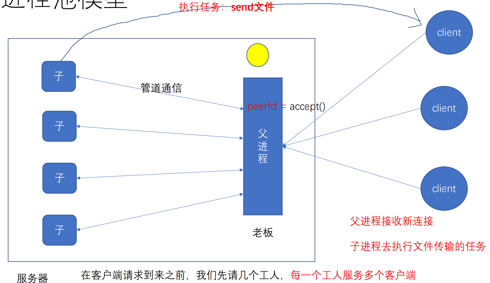
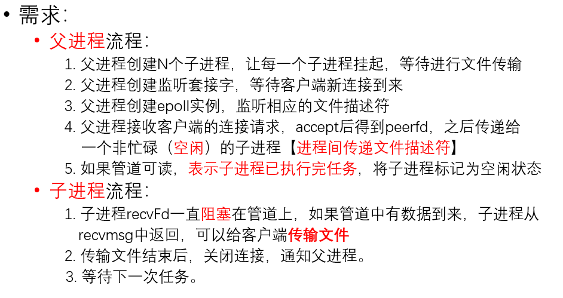
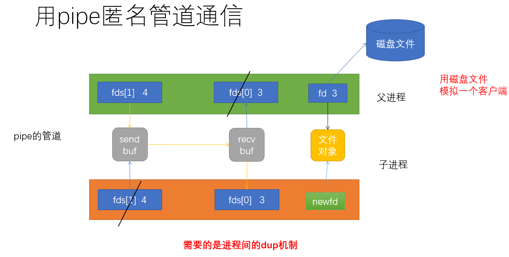
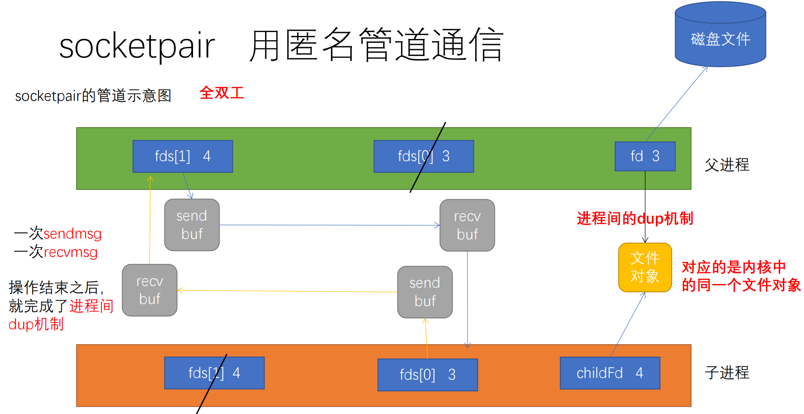
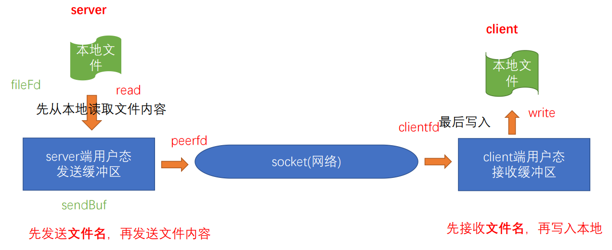

- # 一、进程池
	- 项目：网盘
	- 当有大量的客户端需要下载文件时，我们可以采用的方案：
		- 1.fork一个子进程之后，每一个客户端就交给一个子进程进行处理，处理完毕之后，需要进行回收。
		- 2.pthread_create创建子线程之后，每一个客户端就交给一个子线程进行处理，结束之后，需要进行回收
			- 当并发大了之后，频繁的去fork/pthread_create，其开销也是非常大的
- # 二、进程池模型
	- 
	- **宏观理解**：
		- 1.父进程工作流程：获取新的客户，将其peerfd交给子进程。
		- 2.子进程工作流程：
			- 没有客户时阻塞等待客户到来。
			- 父进程通知子进程客户到来后，子进程执行工作任务。
			- 任务结束后通知父进程，然后继续等待。
			- 如此循环往复。
- # 三、进程池的流程
	- 
	- ==**父进程流程**==：
		- 1.父进程创建N个子进程，让每一个子进程挂起，等待进行文件传输
		- 3.父进程创建监听套接字，等待客户端新连接到来
		- 4.父进程创建epoll实例，监听相应的文件描述符
		- 5.父进程接收客户端的连接请求，accept后得到peerfd，之后传递给
		  一个非忙碌（**空闲**）的子进程【==进程间传递文件描述符==】
		- 6.如果管道可读，表示子进程已执行完任务，将子进程标记为空闲状态
	- ==**子进程流程**==：
		- 7.子进程recvFd一直==阻塞==在管道上，如果管道中有数据到来，子进程从
		  recvmsg中返回，可以给客户端==传输文件==
		- 8.传输文件结束后，关闭连接，通知父进程。
		- 9.等待下一次任务。即继续阻塞在recvFd上。
- # 四、如何完成进程间传递文件描述符
	- ## 1.**通过管道实现父进程向子进程传递文件描述符，测试子进程是否可以操纵文件描述符对文件进行读写。**
		- ```C
		  int main()
		  {
		    int fds[2];
		    pipe(fds);
		    
		    pid_t pid = fork();
		    if(pid > 0)
		    {
		      close(fds[0]);
		      int fd = open("file",O_RDWR);
		      
		      //文件描述符交给子进程
		      write(fds[1],&fd),sizeof(fd);
		      //等待子进程结束。
		      wait(NULL);
		    }
		    else
		    {
		      close(fds[1]);
		      int childfd;
		      read(fds[0],&childfd,sizeof(childfd));
		      printf("childfd: %d\n",childfd);
		      
		      char buf[20] = {0};
		      read(childfd,buf,20);        //子进程会卡在这里，
		      printf("buf = %s\n",buf);
		    }
		  }
		  ```
		- 
		- 子进程读取出来的childfd仅仅只是一个整型数据而已，并没有对应内核中的一个文件对象。
		- 而且进程的打开文件表不同，导致同一个文件描述符在不同的进程中也会指向不同的文件对象。
		- 匿名管道无法解决这个问题。我们需要进程间的dup机制。
	- ## 2.==socketpair+sendmsg/recvmsg实现进程间dup机制==
		- socketpair只能用于父子进程之间，全双工的。
		- 可不可以关闭同一端，都用fds[0]通信，因为全双工？也行，但最好是01、10一对的用，更符合匿名管道的习惯。
		- ```C
		  NAME
		         socketpair - create a pair of connected sockets
		  
		  SYNOPSIS
		         #include <sys/types.h>          /* See NOTES */
		         #include <sys/socket.h>
		  
		         int socketpair(int domain, int type, int protocol, int sv[2]);
		  ```
		- domain：表示协议族，必须为AF_LOCAL或AF_UNIX（同义）本地套接字
		- type：表示类型，SOCK_STREAM或SOCK_DGRAM；为前者时，创建的是流管道。
		- protocol：必须是0。
		- sv：用于保存创建的套接字对
		- ```C
		  NAME
		         send, sendto, sendmsg - send a message on a socket
		  
		  SYNOPSIS
		         #include <sys/types.h>
		         #include <sys/socket.h>
		  
		         ssize_t send(int sockfd, const void *buf, size_t len, int flags);
		  
		         ssize_t sendto(int sockfd, const void *buf, size_t len, int flags,
		                        const struct sockaddr *dest_addr, socklen_t addrlen);
		  
		         ssize_t sendmsg(int sockfd, const struct msghdr *msg, int flags);
		  
		             struct msghdr {
		                 void         *msg_name;       /* Optional address */
		                 socklen_t     msg_namelen;    /* Size of address */
		               //第一组参数：套接口地址成员（未使用）
		                 struct iovec *msg_iov;        /* Scatter/gather array */ //首地址
		               //iovec本身就是一个数组，iovec*就是一个二维数组，缓冲区的数组。vec：vector
		                 size_t        msg_iovlen;     /* # elements in msg_iov */  //缓冲区个数，二维数组长度
		               //第二组参数：IO向量缓冲区（聚集写，填充）
		                 void         *msg_control;    /* Ancillary data, see below */
		                 size_t        msg_controllen; /* Ancillary data buffer len */
		               //len指的是控制信息所占用的总字节数，在我们的使用中，控制信息用cmsghdr结构体来填充
		               //第三组参数：附属数据缓冲区（填充）
		                 int           msg_flags;      /* Flags (unused) */
		               //接收信息标记位（未使用）The msg_flags field is ignored
		             };
		  
		             struct iovec {//(man readv)
		                 void  *iov_base;    /* Starting address */数组首地址
		                 size_t iov_len;     /* Number of bytes to transfer */数组长度
		             };
		  
		             struct cmsghdr {//（man cmsg）
		                 size_t cmsg_len;    /* Data byte count, including header
		                                        (type is socklen_t in POSIX) */
		               //头加数据部分的字节数：头就是这三个数据，数据部分就是后面的变长部分。
		                 int    cmsg_level;  /* Originating protocol */
		                 int    cmsg_type;   /* Protocol-specific type */
		               //SCM_RIGHTS 附属数据对象是一个文件描述符。
		               //SCM_CREADENTIALS 附属数据对象是一个包含证书信息的结构
		               
		             /* followed by
		                unsigned char cmsg_data[]; */ //不是成员，但后面是有数据的，cmsghdr是一个变长结构体
		  //cmsg_data  这个成员并不实际存在，它用来指明实际的额外附属数据所在的位置。
		             };
		  
		  ```
		-
		- ```C
		  NAME
		         CMSG_ALIGN, CMSG_SPACE, CMSG_NXTHDR, CMSG_FIRSTHDR - access ancillary data
		  
		  SYNOPSIS
		         #include <sys/socket.h>
		         struct cmsghdr *CMSG_FIRSTHDR(struct msghdr *msgh);
		         struct cmsghdr *CMSG_NXTHDR(struct msghdr *msgh ,
		                                     struct cmsghdr *cmsg);
		         size_t CMSG_ALIGN(size_t length);
		         size_t CMSG_SPACE(size_t length);
		         size_t CMSG_LEN(size_t length);//返回头加数据区的长度
		         unsigned char *CMSG_DATA(struct cmsghdr *cmsg);//返回数据区的首地址
		  //操纵cmsghdr的宏函数
		  ```
		-
		- ```C
		  NAME
		         readv, writev, preadv, pwritev, preadv2, pwritev2 - read or write data into multiple buffers
		  
		  SYNOPSIS
		         #include <sys/uio.h>
		  
		         ssize_t readv(int fd, const struct iovec *iov, int iovcnt);
		  
		         ssize_t writev(int fd, const struct iovec *iov, int iovcnt);
		  ```
	- ## 3.**结构体iovec的使用：**
		- 聚集写：一次写多个缓冲区
			- 现在有多个缓冲区，以前的只能一个缓冲区一个缓冲区的发，无法满足需求，所以有了聚集写、分散读函数一次完成。
			- ```C
			  int main()
			  {
			    char buf1[] = "hi,";
			    char buf2[] = "wuhan";
			    
			    struct iovec ios[2];
			    ios[0].iov_base = buf1;
			    ios[0].iov_len = strlen(buf1);
			    ios[1].iov_base = buf2;
			    ios[1].iov_len = strlen(buf2);
			    
			    int fd = open("file",O_RDWR);
			    writev(fd,ios,2);//聚集写
			    
			    close(fd);
			  }
			  ```
		- 分散读：一次读多个缓冲区
			- ```C
			  int main()
			  {
			    char buf1[10] = {0};
			    char buf2[20] = {0};
			    
			    struct iovec ios[2];
			    ios[0].iov_base = buf1;
			    ios[0].iov_len = 5;
			    ios[1].iov_base = buf2;
			    ios[1].iov_len = 20;
			    
			    int fd = open("file",O_RDWR);
			    readv(fd,ios,2);//分散读
			    
			    printf("buf1:%s\n",buf1);
			    printf("buf2:%s\n",buf2);
			    
			    close(fd);
			  }
			  ```
			- 分散读：先填满第一个缓冲区，再填满第二个缓冲区，依次进行下去。严格按照iov_len进行填充
	- ## 4.**完成进程间的dup（重定向）机制：**子进程和父进程的fd指向同一个文件对象
		- 一次sendmsg和一次recvmsg就可以完成。
		- 
		- ```C
		  //socketpair.c。完成进程间的dup机制
		  int sendFd(int pipefd,int fd);
		  int recvFd(int pipefd,int *childfd);
		  
		  int main()
		  {
		    //创建socketpair管道，不能用pipe创建了，因为下面需要双工、需要使用sendmsg和recvmsg
		    int fds[2];
		    socketpair(AF_LOCAL,SOCK_STREAM,0,fds);
		    
		    pid_t pid = fork();
		    if(pid > 0)
		    {
		      close(fds[0]);
		      int fd = open("file",O_RDWR);
		      
		      //文件描述符交给子进程
		      sendFd(fds[1],fd);
		      //等待子进程结束。
		      wait(NULL);
		    }
		    else
		    {
		      close(fds[1]);
		      int childfd;
		      recvFd(fds[0],&childfd);//子进程中fd与父进程fd指向的是内核中的同一个文件对象
		      printf("childfd: %d\n",childfd);
		      
		      char buf[20] = {0};
		      read(childfd,buf,20);        //子进程会卡在这里
		      printf("buf = %s\n",buf);
		    }
		  }
		  ```
		- ```C
		  int sendFd(int pipefd,int fd)
		  {
		    //1.构造iovec数组
		    char buf[10] = "hello";
		    struct iovec iov;
		    iov.iov_base = buf;
		    ios.ios_len = strlen(buf);
		    
		    //2.构造附属数据结构struct cmsghdr
		    size_t len = CMSG_LEN(sizeof(fd));
		    printf(">>cmsghdr's len:%ld\n",len);
		    struct cmsghdr* pcmsghdr = (struct cmsghdr*)calloc(len,1);
		    pcmsghdr->cmsg_len = len;
		    //下面两个固定用法
		    pcmsghdr->cmsg_level = SOL_SOCKET;
		    pcmsghdr->cmsg_type = SCM_RIGHTS;
		    //拿到存储数据的首地址
		    int *P = (int *)CMSG_DATA(pcmsghdr);
		    *p = fd;//赋值
		    
		    //3.构造msghdr
		    struct msghdr mhdr;
		    memset(&mhdr,0,sizeof(mhdr));
		    mhdr.msg_iov = &iov;
		    mhdr.msg_iovlen = 1;
		    mhdr.msg_control = pcmsghdr;
		    mhdr.msg_controllen = len;
		    
		    //4.发送数据
		    int ret = sendmsg(pipefd,&mhdr,0);
		    
		    return ret;
		  }
		  
		  int recvFd(int pipefd,int *childfd)//childfd传出参数
		  {
		      //1.构造iovec数组
		    char buf[10] = {0};
		    struct iovec iov;
		    iov.iov_base = buf;
		    ios.ios_len = sizeof(buf);
		    
		    //2.构造附属数据结构struct cmsghdr
		    size_t len = CMSG_LEN(sizeof(int));
		    //附属的数据部分是fd文件描述符，int类型。头是固定长度，
		    //所以传入数据部分长度就可以返回总的结构体的长度了。
		    printf(">>cmsghdr's len:%ld\n",len);
		    struct cmsghdr* pcmsghdr = (struct cmsghdr*)calloc(len,1);
		    pcmsghdr->cmsg_len = len;
		    //下面两个固定用法
		    pcmsghdr->cmsg_level = SOL_SOCKET;
		    pcmsghdr->cmsg_type = SCM_RIGHTS;
		    //拿到存储数据的首地址
		    int *P = (int *)CMSG_DATA(pcmsghdr);
		    
		    //3.构造msghdr
		    struct msghdr mhdr;
		    memset(&mhdr,0,sizeof(mhdr));
		    mhdr.msg_iov = &iov;
		    mhdr.msg_iovlen = 1;
		    mhdr.msg_control = pcmsghdr;
		    mhdr.msg_controllen = len;
		    
		    //4.接收数据
		    int ret = recvmsg(pipefd,&mhdr,0);
		    *childfd = *p;//*p读取fd，将其传递出去（进行赋值即可）
		    
		    return ret;
		  }
		  ```
- # 三、搭建进程池框架
	- ## 父子进程流程
		- ```C
		  //func.h
		  typedef struct process_data
		  {
		    pid_t pid;//子进程的pid
		    int pipefd;//父进程与子进程通信的管道
		    short busy;//0 空闲  1 忙碌
		  }process_data_t,*process_data_t;
		  
		  #define 0 FREE
		  #define 1 BUSY
		  
		  void makeChild(int processNumber,pProcess_data_t pProcessData);
		  void childHandleTask(int pipefd);
		  
		  int sendFd(int pipefd,int fd);
		  int recvFd(int pipefd,int *childfd);
		  
		  void eventloop(epfd,listenfd,pevtList,MAXCONNS,pProcessData);
		  ```
		- ```C
		  //main.c
		  int main(void)
		  {
		    // ip port processNum
		    ARGS_CHECK(argc,4);
		    
		    int processNumber = atoi(argv[3]);
		    pProcess_data_t pProcessData = (pProcess_data_t)
		      calloc(processNumber,sizeof(peocess_data_t));
		    //1.创建processNumber个子进程
		    makeChild(processNumber,pProcessData);
		    
		    //2.监听新客户端的到来
		    int listenfd = tcpInit(argv[1],atoi(argv[2]));//上周的代码中的函数
		    
		    //3.创建epoll实例
		    int epfd = epoll_create1(0);
		    ERROR_CHECK(epfd,-1,"epoll_create1");
		    //4.1 监听listenfd
		    epollAddReadEvent(epfd,listenfd);
		    //4.2 监听父进程与子进程通信的管道
		    for(int i = 0;i < processNumber;i++)
		    {
		      epollAddReadEvent(epfd,pProcessData[i].fd);
		    }
		    
		    //5.事件循环
		    struct epoll_event pevtList = (struct epoll_event*)
		      calloc(MAXCONNS,sizeof(struct epoll_event));//MAXCONNS = 10
		    
		    while(1) {
		  		printf("before epoll_wait\n");
		  		//当epoll_wait返回时，前nready已经就绪的fd信息写入到了pevtList数组的
		  		//前nready个位置上
		  		int nready = epoll_wait(epfd, pevtList, MAXCONNS, -1);
		  		printf("after epoll_wait nready: %d\n", nready);
		  		if(nready == -1 && errno == EINTR) {
		  			continue;
		  		} else if(0 == nready) {
		  			//epoll_wait超时
		  			printf(">> epoll timeout\n");
		  		} else if(-1 == nready){
		  			perror("epoll_wait");
		  			return EXIT_FAILURE;
		  		} else {
		  			//nready > 0 的情况
		  			for(int i = 0; i < nready; ++i) {
		  				int fd = pevtList[i].data.fd;
		  				//1. 进行新连接的处理
		  				if(fd == listenfd) {
		  					int peerfd = accept(listenfd, NULL, NULL);
		  					ERROR_CHECK(peerfd, -1, "accept");
		  					//将peerfd交给一个空闲的子进程
		  					for(int j = 0; j < processNumber; ++i) {
		  						if(pProcessData[j].busy == FREE) {
		  							sendFd(pProcessData[j].pipefd, peerfd);
		  							pProcessData[j].busy = BUSY;//设置子进程处于忙碌状态
		  							break;
		  						}
		  					}
		  					close(peerfd);//在父进程中关闭peerfd
		  				} else {
		  				//2. 管道可读: 子进程给父进程发了通知
		  					int howmany = 0;
		  					read(fd, &howmany, sizeof(howmany));
		  					//设置子进程处于空闲状态
		  					for(int j = 0; j < processNumber; ++j) {
		  						if(pProcessData[j].pipefd == fd) {
		  							pProcessData[j].busy = FREE;
		  							printf(">> child %d is not busy.\n", pProcessData[j].pid);
		  							break;
		  						}
		  					}
		  				}
		  			}
		  		}
		  	}
		  
		  	free(pevtList);
		  	close(listenfd);
		  	close(epfd);
		  	return 0;
		    
		  }
		  
		  
		  ```
		- ```C
		  //child.c
		  void makeChild(int processNumber,pProcess_data_t pProcessData)
		  {
		    int fds[2];
		    for(int i = 0;i < processNumber;++i)
		    {
		      socketpair(AF_LOCAL,SOL_SOCKET,0,fds);
		      int pid = fork();
		      if(0 == pid)
		      {
		        close(fds[1]);
		        //子进程要做的事,执行任务
		        childHandleTask(fds[0]);
		        exit(0);
		      }
		      close(fds[0]);
		      pProcessData[i].pid = pid;
		      pProcessData[i].pipefd = fds[1];
		      pProcessData[i].busy = FREE;
		    }
		  }
		  
		  void childHandleTask(int pipefd)
		  {
		    printf("child is ready\n");
		    while(1)
		    {
		      int childfd;
		      //1.没有任务时，阻塞在recvFd上
		      //一旦recvFd返回，就表示有任务到达
		      recvFd(pipefd,&childfd);
		      
		      //2.模拟发送文件
		      send(childfd,"hello,wuhan",11,0);
		      
		      //3.如果发送完成，就关闭该连接，进入下一次的循环
		      close(childfd);
		      
		      //4.通知父进程,父进程监视管道，所以往管道上写点东西就可以了.
		      int one = 1;
		      write(pipefd,&one,sizeof(one));
		    }
		  }
		  ```
- # 四、关闭连接
	- 对于服务器来说，因为有了进程间dup机制，只有到父子进程中都关闭了相应的fd时，才算将连接关闭了。如果只关闭其中一个，该连接并没有被真正关闭。（引用计数法）
	- 所以在父子进程中都需要关闭与对端的连接。
- # 五、文件传输
	- 
	- ## TCP粘包问题
		- TCP是一个字节流，没有消息边界，因此需要人为的在应用层设置边界信息。不然信息包就粘在一起的。接收端无法区分。
		- 可以实现私有协议结局该问题：
			- 如：先发文件名，然后发文件长度。再发结构体，结构体内含一小片的长度，以及这片数据。
			- 但这种情况，也有bug，就是当send的数据小于第三个参数时，接收端就会把接收的错误信息读取为长度信息，从而出错。所以需要让send完全发送出去。见下一节
		- ```C
		  //发送文件
		  #define FILENAME "file"
		  #define BUFFSIZE 1024
		  
		  int transferfile(int peerfd)
		  {
		    //1.读取本地文件
		    int fd = open(FILENAME,O_RDWR);
		    //check
		    
		    //2.先发文件名，再发文件内容
		    train_t train;
		    memset(&train,0,sizeof(train));
		    train.length = strlen(FILENAME);
		    strcopy(train.buf,FILENAME);
		    int ret = send(peerfd,&train,4 + train.length,0);
		    
		    //3.发送文件的内容
		    char buff[BUFFSIZE] = {0};
		    //ret = read(fd, buff, sizeof(buff));
		    struct stat st;
		    fstat(fd, &st);
		    printf("file's length: %ld\n", st.st_size);
		    printf("sizeof(st.st_size): %ld\n", sizeof(st.st_size));
		    send(peerfd, &st.st_size, 8, 0);
		    
		    size_t sendSize = 0;
		    while(sendSize < st.st_size) 
		    {
		    	memset(&train, 0, sizeof(train));
		    	//从本地文件中读取,将其放入train
		    	ret = read(fd, train.buff, sizeof(train.buff)); 
		    	train.length = ret;
		    	send(peerfd, &train, 4 + train.length, MSG_WAITALL);
		    	sendSize += ret;
		    }
		  
		  	//结论:用TCP发送任何数据，要确保双方都知道
		  	//消息的边界在哪里,即先发数据的长度，再发数据本身
		  	//对端在接收时，先接长度，再接数据本身
		    
		    close(fd);
		  }
		  ```
	- `md5sum`可以查看文件是否相同。
		- 对应的接收文件，也就需要先接收文件名，然后接收文件大小，再循环接收结构体。
		- ```C
		  int main(int argc, char *argv[])
		  {
		  	//0. 创建套接字
		  	int clientfd = socket(AF_INET, SOCK_STREAM, 0);
		  	ERROR_CHECK(clientfd, -1, "socket");
		  
		  	printf("sizeof(struct sockaddr):%ld\n", sizeof(struct sockaddr));
		  	printf("sizeof(struct sockaddr_in):%ld\n", sizeof(struct sockaddr_in));
		  
		  	//1. 设置服务器的网络地址
		  	struct sockaddr_in serverAddr;
		  	memset(&serverAddr, 0, sizeof(serverAddr));
		  
		  	serverAddr.sin_family = AF_INET;
		  	serverAddr.sin_port = htons(8888);
		  	serverAddr.sin_addr.s_addr = inet_addr("127.0.0.1");
		  
		  	int ret = connect(clientfd, (struct sockaddr*)&serverAddr, sizeof(serverAddr));
		  	ERROR_CHECK(ret, -1, "connect");
		  	printf("conn has connected\n");
		  
		  	//1. 先接文件名
		  	char filename[100] = {0};
		  	
		  	//recv第三个参数最多能接1000个字节数据
		  	int length = 0;
		  	recv(clientfd, &length, 4, 0);
		  	printf("file length: %d\n", length);
		  	recv(clientfd, filename, length, 0);
		  	printf(">> filename:%s\n", filename);
		  
		  	int fd = open(filename, O_RDWR|O_CREAT, 0644); 
		  	//2. 再接收文件内容
		  	//2.1 先接文件长度
		  	size_t filelength = 0;
		  	recv(clientfd, &filelength, 8, 0);
		  	printf("filecontent length: %ld\n", filelength);
		  
		  	//2.2 再接文件内容
		  	size_t recvSize = 0;
		  	while(recvSize < filelength) {
		  		char buff[1000] = {0};
		  		recv(clientfd, &length, 4, 0);
		  		//recv(clientfd, buff, length, 0);
		  		recv(clientfd, buff, length, MSG_WAITALL);
		  		//3. 写入本地
		  		write(fd, buff, length);
		  		recvSize += length;
		  	}
		  	close(fd);
		  	close(clientfd);
		  }
		  ```
- # 五、为什么使用进程池？
	- 见一.