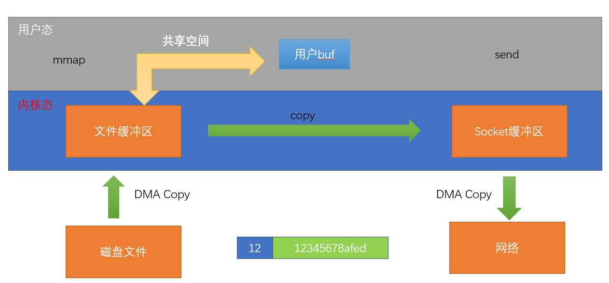
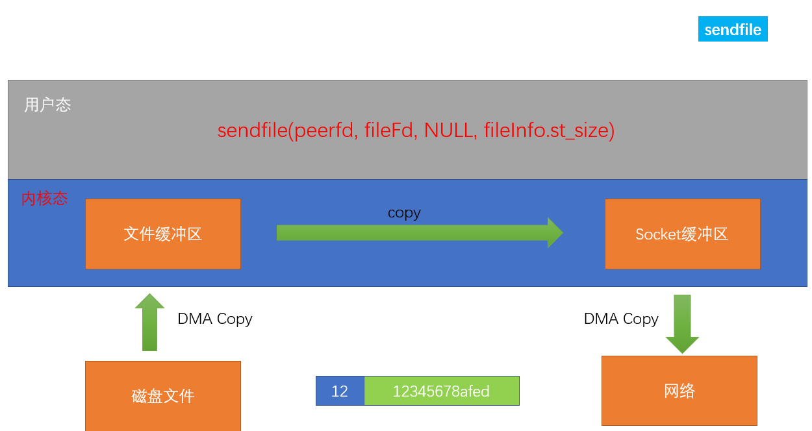
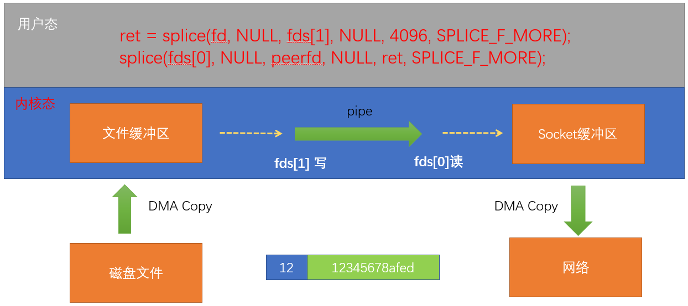

- # 一、改进recv为循环接收数据--recvCircle
	- ```C
	  int recvCircle(int fd, char * buff, int length)
	  {
	  	char * pbuf = buff;
	  	int left = length;
	  	int ret = 0;
	  	while(left > 0) {
	  		ret = recv(fd, pbuf, left, 0);//每次接收ret长度数据
	  		if(0 == ret) {//连接断开，length-left判断是否接收完毕。
	  			close(fd);
	  			break;
	  		} else if(ret == -1 && errno == EINTR) {//recv被终端，continue继续
	  			continue;
	  		} else if(ret == -1) {//error
	  			perror("recv");
	  			break;
	  		} else {// > 0
	  			pbuf += ret;//pbuf偏移ret的位置继续接收数据。因为recv是从pbuf的地址开始接收的
	  			left -= ret;
	  		}
	  	}
	  	return length - left;
	  }
	  ```
# 二、进度条
	- 实现下载时的进度条
	- ```C
	  	size_t percentOne = filelength / 100;//百分之一
	  	size_t lastSize = 0;
	  
	  	//2.2 再接文件内容
	  	size_t recvSize = 0;
	  	while(recvSize < filelength) {
	  		char buff[1000] = {0};
	  		recvCircle(clientfd, (char*)&length, 4);
	  		recvCircle(clientfd, buff, length);
	  		//3. 写入本地
	  		write(fd, buff, length);
	  		recvSize += length;
	  		if(recvSize - lastSize > percentOne) {//每次下载量达到百分之1以上就打印一次。
	  			printf("has complete %5.2f%%\r", (double)recvSize / filelength * 100);
	  			fflush(stdout);
	  			lastSize = recvSize;
	  		}
	  	}
	  printf("\n");
	  
	  
	  也可以直接：
	  printf("has complete %5.2f%%\r", (double)recvSize / filelength * 100);
	  这样可以实时小数打印了。
	  打印完再
	  printf("\n");换行刷新下缓冲区。
	  ```
- # 三、零拷贝的技术--==面试时，作为项目优化点来展开说明即可==
	- 减少内核态到用户态的拷贝
	- ## mmap
		- 
		- ==服务器和客户端都可以使用==
		- 将用户态的缓冲区和文件缓冲区映射到同一内存区域
		- ```C
		  //client.c
		  int main(int argc, char *argv[])
		  {
		  	//0. 创建套接字
		  	int clientfd = socket(AF_INET, SOCK_STREAM, 0);
		  	ERROR_CHECK(clientfd, -1, "socket");
		  
		  	printf("sizeof(struct sockaddr):%ld\n", sizeof(struct sockaddr));
		  	printf("sizeof(struct sockaddr_in):%ld\n", sizeof(struct sockaddr_in));
		  
		  	//1. 设置服务器的网络地址
		  	struct sockaddr_in serverAddr;
		  	memset(&serverAddr, 0, sizeof(serverAddr));
		  
		  	serverAddr.sin_family = AF_INET;
		  	serverAddr.sin_port = htons(8888);
		  	serverAddr.sin_addr.s_addr = inet_addr("127.0.0.1");
		  
		  	int ret = connect(clientfd, (struct sockaddr*)&serverAddr, sizeof(serverAddr));
		  	ERROR_CHECK(ret, -1, "connect");
		  	printf("conn has connected\n");
		  
		  	//1. 先接文件名
		  	char filename[100] = {0};
		  	
		  	//recv第三个参数最多能接1000个字节数据
		  	int length = 0;
		  	//recv(clientfd, &length, 4, MSG_WAITALL);
		  	recvCircle(clientfd, (char*)&length, 4);
		  	printf("file length: %d\n", length);
		  	//recv(clientfd, filename, length, MSG_WAITALL);
		  	recvCircle(clientfd, filename, length);
		  	printf(">> filename:%s\n", filename);
		  
		  	int fd = open(filename, O_RDWR|O_CREAT, 0644); 
		  
		  	//2. 再接收文件内容
		  	//2.1 先接文件长度
		  	size_t filelength = 0;
		  	//recv(clientfd, &filelength, 8, MSG_WAITALL);
		  	recvCircle(clientfd, (char*)&filelength, 8);
		  	printf("filecontent length: %ld\n", filelength);
		  
		  	// 设置文件大小[这一步不能少]
		  	ftruncate(fd, filelength);
		  	char * pbuf = mmap(NULL, filelength, PROT_READ|PROT_WRITE, MAP_SHARED, fd, 0);
		  	recvCircle(clientfd, pbuf, filelength);
		  
		  	munmap(pbuf, filelength);
		  	close(fd);
		  	close(clientfd);
		  }
		  ```
		- ```C
		  //server.c发送部分
		  //3.2 进行映射(零拷贝技术之一)
		  	char * pbuf = mmap(NULL, st.st_size, 
		  			PROT_READ|PROT_WRITE, MAP_SHARED, fd, 0);
		  	//4. 直接发送
		  	ret = send(peerfd, pbuf, st.st_size, MSG_WAITALL);
		  	printf(">> send ret: %d\n", ret);
		  
		  ```
		- 将文件缓冲区映射到用户态文件，然后直接send用户态文件即可。
	- ## sendfile
		- 
		-
		- 直接将文件缓冲区数据拷贝到sock缓冲区，不需要经过用户态。
		- sndfile**只适用于将数据从文件拷贝到套接字**上，限定了它的使用范围。
		- ==所以就只能在服务器端使用。==
		- ```c
		  NAME
		         sendfile - transfer data between file descriptors
		  
		  SYNOPSIS
		         #include <sys/sendfile.h>
		  
		         ssize_t sendfile(int out_fd, int in_fd, off_t *offset, size_t count);
		  //out_fd：等待写的fd：目的fd
		  //in_fd：等待读的fd：源fd
		  //offset：正式读取数据之前，应该向前偏移的byte数
		  //count：发的长度
		  ```
		- ```C
		  //3.2 直接发送(零拷贝技术之二sendfile)
		  	ret = sendfile(peerfd, fd, NULL, st.st_size);
		  	printf(">> send ret: %d\n", ret);
		  ```
	- ## splice
		- 
		- Linux在2.6.17版本引入splice系统调用，用于**在两个文件描述符中移动数据**，而不需要数据在内核空间和用户空间来回拷贝。
		- ==服务器和客户端都可以使用==
		- 借助管道实现，一点一点的拷贝过去。第一个函数将一页内存数据写进管道，第二个函数从管道读出数据。所以每次将文件缓冲区4k的数据移动入socket缓冲区，反之亦然。
		- ```C
		  NAME
		         splice - splice data to/from a pipe
		  
		  SYNOPSIS
		         #define _GNU_SOURCE         /* See feature_test_macros(7) */
		         #include <fcntl.h>
		  
		         ssize_t splice(int fd_in, loff_t *off_in, int fd_out,
		                        loff_t *off_out, size_t len, unsigned int flags);
		  //数据来源，源fd
		  //偏移量
		  //数据目的地，管道写端
		  //偏移量
		  //一次传一片内存空间大小的数据：4k，固定值
		  
		  ```
		- ```C
		  //服务器
		  size_t sendSize = 0;
		  while(sendSize < st.st_size)
		  {
		    int ret = splice(fd,NULL,fds[1],NULL,4096,SPLICE_F_MORE);
		    ret = splice(fds[0],NULL,peerfd,NULL,ret,SPLICE_F_MORE);
		    sendSize += ret;
		  }
		  //客户端
		  size_t recvSize = 0;
		  while(recvSize < filelength)
		  {
		    int ret = splice(clientfd,NULL,fds[1],NULL,4096,SPLICE_F_MORE);
		    ret = splice(fds[0],NULL,fd,NULL,ret,SPLICE_F_MORE);
		    recvSize += ret;
		  }
		  ```
	- **在实际使用中，可能数据从内核到用户态空间的拷贝速度并不是系统的瓶颈，系统瓶颈更多的是网络，一旦数据在网络中延迟，以秒作为单位的**
- # 四、进程池的退出
	- ## 进程池退出的流程
		- `kill -10 pid`异步通知父进程退出：写退出的管道
		- 父进程epoll_wait响应管道信息，通知子进程退出
			- 1.在主进程中，直接调用kill函数，给子进程发送SIGUSR1信号杀死子进程（粗暴）
			- 2.在主进程中，通过sendFd函数，通知子进程退出。在子进程中通过recvFd获取到退出标志位，然后再退出。可以确保每一个任务都执行完毕。（温和）
	- 信号+匿名管道->**异步拉起同步**
		- 异步：信号
	- ```C
	  int exitPipe[2];//退出的管道
	  void sigfunc(int signum)
	  {
	    //通知父进程回收子进程资源
	    char ch = '1';
	    write(exitPipe[1],&ch,1);
	  }
	  
	  int main()
	  {
	    //machild()...之后。不然会被fork过去，子进程也会捕捉
	    //只作用于父进程，不做用于子进程
	    //因此要放在子进程创建结束之后
	    signal(SIGUSR1,sigfunc);
	    pipe(exitPipe);
	    
	    //需要监听进程池退出的管道exitPipe
	    epollAddReadEvent(epfd,exitPipe[0]);
	    //事件循环
	    while(1)
	    {
	      ...;
	      else if(fd == exitPipe[0])
	      {
	        //进程池退出的操作
	        //1.kill直接粗暴杀死
	        char ch;
	        read(exitPipe[0],&ch,1);
	        for(int j = 0;j < processNumber; j++)
	        {
	          printf("kill child %d\n",pProcessData[j].pid);
	          kill(pProcessData[j].pid,SIGUSR1);
	        }
	        for(int j = 0;j < processNumber; j++)
	        {
	          wait(NULL);//wait三个子进程.
	        }
	        exit(0);//主进程退出
	      }
	      ...;
	    }
	  }
	  ```
	- ```C
	  //2.温和杀死
	    while(1)
	    {
	      ...;
	      else if(fd == exitPipe[0])
	      {
	        //进程池退出的操作
	        char ch;
	        read(exitPipe[0],&ch,1);
	        for(int j = 0;j < processNumber; j++)
	        {
	          printf("kill child %d\n",pProcessData[j].pid);
	          sendFd(pProcessData[j].pipefd,)
	        }
	        for(int j = 0;j < processNumber; j++)
	        {
	          wait(NULL);//wait三个子进程.
	        }
	        exit(0);//主进程退出
	      }
	      ...;
	    }
	  
	  int sendFd(int pipefd, int fd, char exitflag)//添加一个标记位
	  {
	  	//1. 构造struct iovec数组
	  	//char buff[10] = "a";
	  	struct iovec iov;
	  	iov.iov_base = &exitflag;//放在iov发送过去，刚好之前也没用过
	  	iov.iov_len = 1;
	  
	  	//2. 构造struct cmsghdr
	  	size_t len = CMSG_LEN(sizeof(fd));
	  	//printf(">> cmsghdr's len: %ld\n", len);
	  	struct cmsghdr * pcmsghdr = (struct cmsghdr*)calloc(len, 1);
	  	pcmsghdr->cmsg_len = len;
	  	pcmsghdr->cmsg_level = SOL_SOCKET;
	  	pcmsghdr->cmsg_type = SCM_RIGHTS;
	  	int * p = (int*)CMSG_DATA(pcmsghdr);//拿到存储数据的首地址
	  	*p = fd;//赋值
	  
	  	//3. 构造struct msghdr
	  	struct msghdr mhdr;
	  	memset(&mhdr, 0, sizeof(mhdr));
	  	mhdr.msg_iov = &iov;
	  	mhdr.msg_iovlen = 1;
	  	mhdr.msg_control = pcmsghdr;
	  	mhdr.msg_controllen = len;
	  
	  	//4. 发送消息
	  	int ret = sendmsg(pipefd, &mhdr, 0);
	  	ERROR_CHECK(ret, -1, "sendmsg");
	  	free(pcmsghdr);
	  	return ret;
	  }
	  
	  int recvFd(int pipefd, int * childfd, char * pexitflag)
	  {
	  	//1. 构造struct iovec数组
	  	//char buff[10] = {0};
	  	struct iovec iov;
	  	iov.iov_base = pexitflag;//接收消息时，准备好空间即可
	  	iov.iov_len = 1;
	  
	  	//2. 构造struct cmsghdr
	  	size_t len = CMSG_LEN(sizeof(int));
	  	//printf(">> cmsghdr's len: %ld\n", len);
	  	struct cmsghdr * pcmsghdr = (struct cmsghdr*)calloc(len, 1);
	  	pcmsghdr->cmsg_len = len;
	  	pcmsghdr->cmsg_level = SOL_SOCKET;
	  	pcmsghdr->cmsg_type = SCM_RIGHTS;
	  
	  	//3. 构造struct msghdr
	  	struct msghdr mhdr;
	  	memset(&mhdr, 0, sizeof(mhdr));
	  	mhdr.msg_iov = &iov;
	  	mhdr.msg_iovlen = 1;
	  	mhdr.msg_control = pcmsghdr;
	  	mhdr.msg_controllen = len;
	  
	  	//4. 接收消息
	  	int ret = recvmsg(pipefd, &mhdr, 0);
	  	ERROR_CHECK(ret, -1, "recvmsg");
	  	int * p = (int*)CMSG_DATA(pcmsghdr);//拿到存储数据的首地址
	  	*childfd = *p;//*p读取fd, 再传递出去, 进行赋值即可
	  	//printf(">> recvFd buff:%s\n", buff);
	  	free(pcmsghdr);
	  	return ret;
	  }
	  
	  void childHandleTask(int pipefd)
	  {
	  	printf("child is running\n");
	  	while(1)
	  	{
	  		int childfd;
	  		char exitflag = 0;
	  		//1. 没有任务时，阻塞在recvFd之上
	  		//一旦recvFd返回，就表示有任务到达
	  		recvFd(pipefd, &childfd, &exitflag);
	  
	        //每次需要判断标记位的值，再做选择。
	  		if(exitflag == 0) {
	  			//2. 发送文件
	  			transferfile(childfd);
	  			//3. 如果发送完成，那就关闭该连接
	  			close(childfd);
	  			//4. 通知父进程(往管道上写点儿数据)
	  			int one = 1;
	  			write(pipefd, &one, sizeof(one));
	  		} else {
	  			printf(">> child exit while\n");
	  			break;
	  		}
	  	}
	  }
	  ```
- # 五、客户端断开连接--SIGPIPE信号的处理
	- 现象：
		- 客户端断开连接时，导致服务器中的某个子进程挂掉了，变成了僵尸进程，导致父子进程通信的管道被关闭了。而父进程一直监听该管道，因此epoll_wait不断返回，才有了服务器疯狂打印的情况出现。
			- server疯狂打印
	- 客户端断开连接时，为什么导致服务器中的某个子进程挂掉了？
		- 子进程连接之后就一直进行send操作，而客户端断开后，send会发送SIGPIPE信号，导致了异常情况。所以要忽略SIGPIPE信号（同前面一样），同时要判断send返回值
		- ```C
		  signal(SIGPIPE,SIG_IGN);
		  ...
		  ret = send(...);
		  if(ret > 0)
		  {
		    sendSize += (ret - 4);
		  }
		  else
		  {
		    perror("send");
		    break;
		  }
		  ```
	-