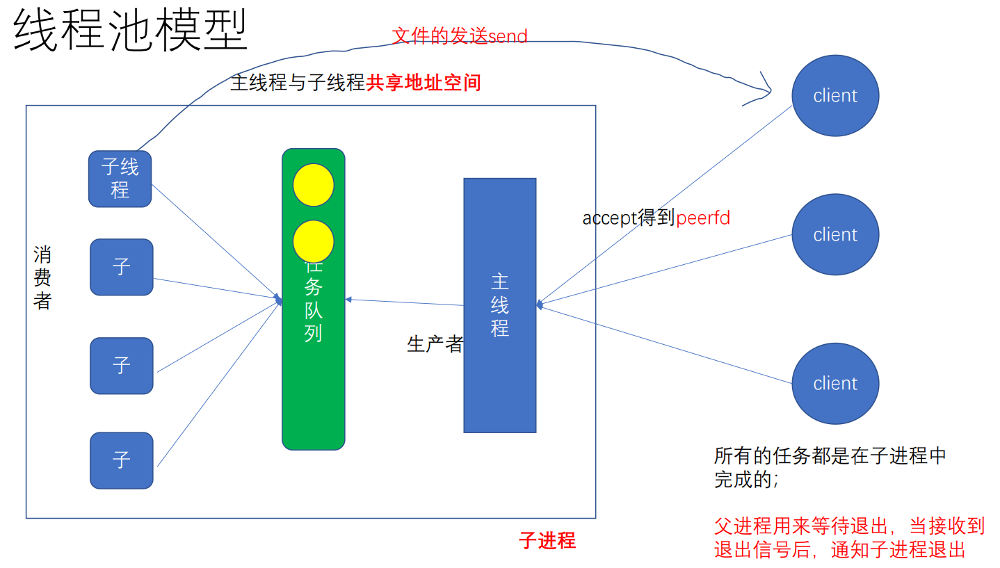
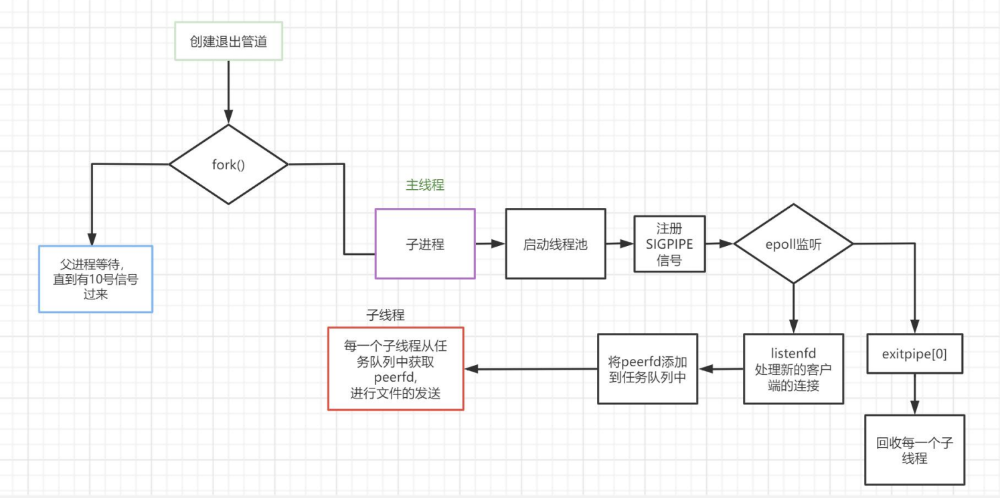

- # 一、为什么要使用线程池？
	- 提高并发，提高执行效率。
	- 都是一个进程中，完成多个客户端的请求。
	- ==Linux中的线程本质上还是一个task_struct==
		- 进程的结构体也是task_struct
		- 在Linux内核的眼中，只有task_struct的概念。即：线程的本质还是进程，只是共享了一些空间。
- # 二、线程池模型
	- 
	- 线程池模型本质上就是一个生产者消费者模型。
	- 所有的任务都是在子进程中完成的。
	- 父进程用来等待退出，当接收到退出信号后，通知子进程退出。
- # 三、线程池流程
	- ==主线程的执行流程==
		- 1.主线程接收客户端peerfd的到来2
		- 2.再将peerfd加入到**任务队列**中去
	- ==子线程的执行流程==
		- 1.先从**任务队列**中获取**任务节点**，拿到peerfd
		- 2.执行文件发送任务
		- 3.文件发送完毕之后，进入等待状态，试图继续获取下一个任务节点。
	- 这样，任务队列将成为临界资源：互斥锁，并且主线程和子线程也会涉及线程同步问题：条件变量。
		- 也就相当于一个生产者消费者模型。
	- 
- # 四、数据结构
	- 这样需要的数据结构就有：任务队列---链表实现，管理链表，包括整个链表的互斥锁，自然包括唤醒线程的条件变量。任务结点：存储任务。以及一个线程池结构：管理任务队列、所有线程。
	- 任务结点：存储peerfd，即：分配的任务。
		- ```C
		  typedef struct task_s
		  {
		    int peerfd;
		    struct task_s *pNext;
		  }task_t;
		  ```
	- 任务队列：链表实现：实现任务的入队、出队、队列判空、任务个数统计等常见链表队列操作。而且任务
		- ```C
		  typedef struct taskQueue_s
		  {
		    task_t *pFront;//链表头尾指针
		    task_t *pRear;
		    int queueSize;//链表大小
		    int exitFlag;//退出的标志位，用于退出线程池
		    pthread_mutex_t mutex;//互斥锁与条件变量
		    pthread_cond_t cond;
		  }task_queue_t;
		  ```
	- 线程池结构：管理任务队列、所有线程
		- ```C
		  typedef struct {
		  	pthread_t * threads;//线程id数组，定义成这个样子是为了其可变长度
		  	int threadNumber;//线程数组长度
		  	task_queue_t queue;//任务队列
		  } thread_pool_t, *pThread_pool_t;
		  ```
- # 五、源码结构
	- ## 1.任务队列相关操作：
	  collapsed:: true
		- 1.初始化：最开始初始化任务队列，即初始化任务队列的数据结构就可以了。
			- ```C
			  void queueInit(task_queue_t * que)
			  {
			  	if(que) {
			  		que->pFront = NULL;
			  		que->pRear = NULL;
			  		que->queSize = 0;
			  		que->exitFlag = 0;
			  		int ret = pthread_mutex_init(&que->mutex, NULL);
			  		THREAD_ERROR_CHECK(ret, "pthread_mutex_init");
			  
			  		ret = pthread_cond_init(&que->cond, NULL);
			  		THREAD_ERROR_CHECK(ret, "pthread_cond_init");
			  	}
			  }
			  ```
		- 2.任务队列的销毁：线程池退出时，销毁任务队列。
			- 因为线程退出时，会执行完所有的结点任务，所以任务队列必为空，所以不必去依次释放每一个结点。
			- ```C
			  void queueDestroy(task_queue_t* que)
			  {
			  	if(que) {
			  		int ret = pthread_mutex_destroy(&que->mutex);
			  		THREAD_ERROR_CHECK(ret, "pthread_mutex_destroy");
			  
			  		ret = pthread_cond_destroy(&que->cond);
			  		THREAD_ERROR_CHECK(ret, "pthread_cond_destroy");
			  	}
			  }
			  ```
		- 3.队列判空，以及计算任务结点数
			- ```C
			  int getTaskSize(task_queue_t * que)
			  {	return que->queSize;	}
			  
			  int queueIsEmpty(task_queue_t *que)
			  {	return que->queSize == 0;	}
			  ```
		- 4.任务入队
			- 主线程调用的，将任务结点放入任务队列并通知子线程取任务。
			- **入队将会通知消费者取任务**，勿忘！而且入队出队都是对链表的操作，需要申请互斥锁。
			- ```C
			  void taskEnqueue(task_queue_t* que, int peerfd)
			  {
			  	int ret = pthread_mutex_lock(&que->mutex);
			  	THREAD_ERROR_CHECK(ret, "pthread_mutex_lock");
			  	task_t * ptask = (task_t*)calloc(1, sizeof(task_t));
			  	ptask->peerfd = peerfd;
			  	ptask->pnext = NULL;
			  	if(queueIsEmpty(que)) {
			  		que->pFront = que->pRear = ptask;
			  	}else {
			  		que->pRear->pnext = ptask;	
			  		que->pRear = ptask;
			  	}
			  	++que->queSize;
			  	ret = pthread_mutex_unlock(&que->mutex);
			  	THREAD_ERROR_CHECK(ret, "pthread_mutex_unlock");
			  	//通知消费者线程取任务
			  	ret = pthread_cond_signal(&que->cond);
			  }
			  ```
		- 5.任务出队：
			- 线程取任务。没有任务时，线程会阻塞在pthread_cond_wait，直到主线程通知。
			- ```C
			  int taskDequeue(task_queue_t * que)
			  {
			  	int ret = pthread_mutex_lock(&que->mutex);
			  	THREAD_ERROR_CHECK(ret, "pthread_mutex_lock");
			  	//当队列为空时，进入等待状态
			  	while(!que->exitFlag && queueIsEmpty(que)) {//防止虚假唤醒(高频考点)
			  		pthread_cond_wait(&que->cond, &que->mutex);
			  	}
			  
			  	int fd = -1; 
			  	if(!que->exitFlag) {//不退出线程池时,要取任务节点
			  		task_t * pFree = NULL;//保存待释放的节点
			  		fd = que->pFront->peerfd;
			  		pFree = que->pFront;
			  		if(getTaskSize(que) > 1) {
			  			que->pFront = que->pFront->pnext;
			  		} else {
			  			que->pFront = que->pRear = NULL;
			  		}
			  		free(pFree);
			  		--que->queSize;
			  	}
			  	ret = pthread_mutex_unlock(&que->mutex);
			  	THREAD_ERROR_CHECK(ret, "pthread_mutex_unlock");
			  
			  	return fd;
			  }
			  ```
		- 6.唤醒所有线程
			- 当我们需要退出线程池时，需要通知所有的线程退出。此时就需要广播条件变量，唤醒所有的线程执行完他们的任务，然后关闭线程池。这里用到了退出标志。线程会根据退出标志退出。
			- ```C
			  void queueWakeup(task_queue_t* que) 
			  {
			  	que->exitFlag = TASKQUEUE_READY_EXIT_FLAG;
			  	int ret = pthread_cond_broadcast(&que->cond);
			  	THREAD_ERROR_CHECK(ret, "pthread_cond_broadcast");
			  }
			  ```
	- ## 2.线程池相关操作：
	  collapsed:: true
		- 1.初始化线程池
			- 初始化线程池就是初始化线程池的结构体，包括子线程数组和任务队列，任务队列的初始化可以直接调用前面的函数。
			- ```C
			  void threadpoolInit(thread_pool_t* pthreadpool, int threadNum)
			  {
			  	pthreadpool->threadNumber = threadNum;
			  	pthreadpool->threads = (pthread_t*)calloc(threadNum, sizeof(pthread_t));
			  	queueInit(&pthreadpool->queue);
			  }
			  ```
		- 2.销毁线程池
			- 在线程池退出时，回收堆空间的资源。
			- ```C
			  void threadpoolDestroy(thread_pool_t* pthreadpool)
			  {
			  	free(pthreadpool->threads);
			  	queueDestroy(&pthreadpool->queue);
			  }
			  ```
		- 3.启动线程池
			- 子进程创建线程池，将他们阻塞在条件变量上。
			- ```C
			  void threadpoolStart(thread_pool_t * pthreadpool)
			  {
			  	for(int idx = 0; idx < pthreadpool->threadNumber; ++idx) {
			  		int ret = pthread_create(&pthreadpool->threads[idx],
			  			NULL, 
			  			threadFunc, 
			  			pthreadpool);
			  		THREAD_ERROR_CHECK(ret, "pthread_create");
			  	}
			  }
			  
			  ```
		- 4.线程处理函数
			- 每一个子线程要做的事情。可以根据出队函数的返回值退出线程。
			- ```C
			  void * threadFunc(void* arg)
			  {
			  	//每一个子线程要做的事儿
			  	printf("sub thread %ld is runing\n", pthread_self());
			  	thread_pool_t * pthreadpool = (thread_pool_t*)arg;
			  	while(1) {
			  		int peerfd = taskDequeue(&pthreadpool->queue);
			  		if(peerfd > 0) {
			  			char filename[] = "bigfile.avi";
			  			transferfile(peerfd, filename);
			  		} else {
			  			break;
			  		}
			  	}
			  	printf("sub thread %ld is ready to exit\n", pthread_self());
			  	pthread_exit(0);
			  }
			  ```
	- ## 3.main函数：
	  collapsed:: true
		- 习惯上是用子进程去创建线程池，主进程等待，并可以接收SIGUSR1信号，通知子进程销毁线程池。
		- 主线程监听新连接和线程池退出的管道。当新连接到来时，建立连接，并将peerfd打包放入任务队列，通知子线程执行。
		- 当退出管道有消息时，就执行线程池退出操作。
		- ```C
		  //定义与子进程通信的管道，用于销毁线程池
		  int exitpipe[2];
		  
		  void sigfunc(int num) 
		  {
		  	printf("sig %d is coming\n", num);
		  	//通过管道通知父进程退出
		  	char ch = 1;
		  	write(exitpipe[1], &ch, 1);
		  }
		   
		  int main(int argc, char *argv[])
		  {//ip,port,threadNum
		  	ARGS_CHECK(argc, 4);
		  	int threadNum = atoi(argv[3]);
		  	pipe(exitpipe);//创建退出的管道
		  
		  	pid_t pid = fork();
		  	if(pid > 0) {
		  		close(exitpipe[0]);
		          signal(SIGUSR1, sigfunc);//10号信号
		  		wait(NULL);
		  		exit(0);
		  	}
		  	//子进程
		  	close(exitpipe[1]);
		  	thread_pool_t threadpool;
		  	threadpoolInit(&threadpool, threadNum);
		  	threadpoolStart(&threadpool);
		  
		  	//2. 创建TCP的监听套接字listenfd
		  	int listenfd = tcpInit(argv[1], atoi(argv[2]));
		  
		  	//3. 创建epoll的实例, 并注册(监听)相应文件描述符上的事件
		  	int epfd =  epoll_create1(0);
		  	ERROR_CHECK(epfd, -1, "epoll_create1");
		  	epollAddReadEvent(epfd, listenfd);
		  	epollAddReadEvent(epfd, exitpipe[0]);
		  
		  	struct epoll_event * pevtList = (struct epoll_event*)
		  		calloc(MAXCONNS, sizeof(struct epoll_event));
		  	
		  	int nready;
		  	while(1) {
		  		do {
		  			//4. epoll等待事件就绪
		  			nready = epoll_wait(epfd, pevtList, MAXCONNS, 5000);
		  		}while(-1 == nready && errno == EINTR);
		  
		  		if(0 == nready) {
		  			printf(">> epoll timeout.\n");
		  			continue;
		  		} else if(-1 == nready) {
		  			perror("epoll_wait");
		  			return EXIT_FAILURE;
		  		} else {//nready > 0
		  			
		  			for(int i = 0; i < nready; ++i) {
		  				int fd = pevtList[i].data.fd;
		  				if(fd == listenfd) {//5. 客户端到来的处理
		  					int peerfd = accept(listenfd, NULL, NULL);
		  					if(peerfd < 0) {
		  						perror("accept");
		  					}
		  					printf("accept a new conn, peerfd: %d\n", peerfd);
		  					//让peerfd入队
		  					taskEnqueue(&threadpool.queue, peerfd);
		  
		  				} else if(fd == exitpipe[0]) {
		  					char exitflag;
		  					read(exitpipe[0], &exitflag, 1);
		  					printf("parent process ready to exit.\n");
		  					//收到退出的通知之后，子线程要逐步退出
		  					queueWakeup(&threadpool.queue);
		  					for(int j = 0; j < threadNum; ++j) {//等待每一个子线程退出
		  						pthread_join(threadpool.threads[j], NULL);
		  					}
		  					printf("parent process pool exit\n");
		  					threadpoolDestroy(&threadpool);
		  					exit(0);
		  				} 
		  			}
		  		}
		  	}
		  
		  	free(pevtList); 
		  	close(listenfd);
		  	close(epfd);
		  	return 0;
		  }
		  
		  ```
- ==虚假唤醒问题：高频考点==
	- ```C
	  while(queueIsEmpty(que))
	  {
	    pthread_cond_wait(&que->cond,&que->mutex);
	  }
	  ```