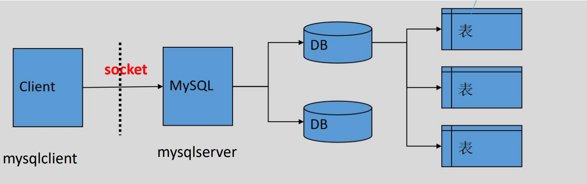
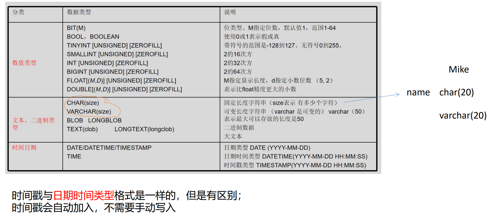
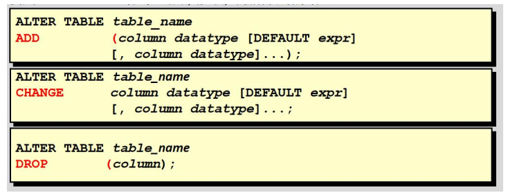
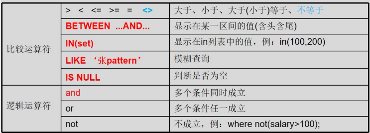
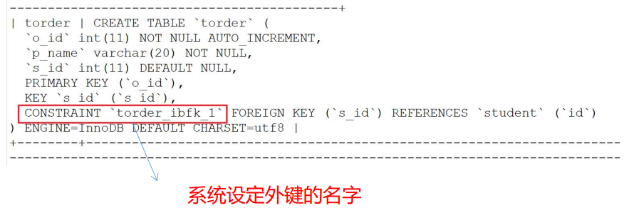

- # 一、数据库的历史与分类
	- ## 1.为什么使用数据库？
		- 没有数据库时，可以写入到
			- 数据结构（数组、链表、哈希表等）：**存放在内存之中，易丢失**
			- 文件（**存储在磁盘之中--持久化**）：检索时不高效、不方便。
		- 有了数据库之后，在数据的组织方面会更高效，更方便，易于维护。
	- ## 2.数据库的分类
		- 关系型的数据库
			- 学生的信息
			- 教师的信息
			- 表的数据之间、表之间都有一点联系
			- SQL lite：手机上的轻型数据库
		- 非关系型的数据库NoSQL（Not Only SQL）
			- Redis 键值对 key-value  缓存系统 --哩哩老师的课程
			- MongoDB 文档
	- ## 3.Mysql的使用：
		- 1.直接通过命令行的方式---推荐使用
		- 2.图形化界面工具
			- Navicat（熟悉命令行后再使用）。
		- 3.C程序的API（开发）
	- ## 4.概念区分
		- 
		- 数据库服务器（**管理软件**） MySQL是其中一种
			- DB Server
			- DB ->数据库是多张表
			- mysql服务器是以**守护进程**的方式运行的，没有终端。
				- 与其交互都是通过客户端进行的（我们都是客户端，命令行也是）。
			- mysql服务器的默认端口号是**3306**.
		- 数据库
- # 二、结构化查询语言SQL（Structured Query Language）
	- SQL是独立于其他编程语言，单独用来控制数据的。
	- ## 1.DDL 数据定义语言
		- ### 1.查看数据库
			- `show databases;`
			- ```C
			  mysql> show databases;
			  +--------------------+
			  | Database           |
			  +--------------------+
			  | information_schema |
			  | mysql              |
			  | performance_schema |
			  | sys                | //以上四个是mysql数据库自带的与性能相关的库，
			  | yourdb             | //一般情况下不需要进行修改
			  +--------------------+
			  5 rows in set (0.01 sec)
			  ```
		- ### 2.创建数据库：
			- `create DATABSE DbName;`
		- ### 3.删除数据库
			- `drop DATABSE DbName;`
		- ### 4.字符校对集
			- #### 1)查看数据库支持的字符集
				- `show character set;`
			- #### 2)查看相应字符集的校对规则
				- `show collation;`
					- ci：忽略大小写的意思。bin二进制，肯定大小写不一样的，所以不会忽略大小写。
			- #### 3)查看数据库的字符集
				- 在数据库创建语句的前面加上show关键字，就可以看到了。
					- `show create database 45th;`
			- #### 4)修改数据库默认字符集
				- `Alter DATABASE DbName default character set CharacterSetName;`
				- `alter database 45th default character set utf8mb4;`
		- ### 5.使用数据库
			- `use DbName;`
		- ### 6.MySQL数据类型
			- 数值类型
				- BIT：最多64位
				- BOOL、BOOLEAN
				- TINYINT
				- SMALLINT
				- INT
				- BIGINT
			- 文本类型
				- TEXT/LONGTEXT
			- 字符串类型
				- CHAR   固定字节数
				- VARCHAR   可变字节数
			- 二进制类型
				- BLOB
			- 时间日期类型
				- DATE
				- DATETIME   需要手动写入
				- TIMESTAMP  设置时间戳类型会自动插入当前时间
			- 
			- char：char（20）：那就占据20字节
			- varchar：varchar（20）：最大占据20，小于的时候，就没有20了。
		- ### 7.创建表Table
			- ```SQL
			  CREATE TABLE table_name
			  (
			  	field1 datatype,
			      field2 datatype,
			      field3 datatype
			  )[character set 字符集 collate 校对规则]
			  field:指定列明
			  datatype：列的数据类型
			  
			  
			  ```
		- ### 8.查看表结构
			- `show create table tName;`
			- `show tables;`可以总览查看该库所拥有的所有表。
			- ```SQL
			  | Student | CREATE TABLE `Student` (
			    `s_id` int NOT NULL AUTO_INCREMENT,
			    `s_name` varchar(20) NOT NULL,
			    `s_birth` date NOT NULL,
			    `s_sex` tinyint(1) NOT NULL,
			    PRIMARY KEY (`s_id`)
			  ) ENGINE=InnoDB AUTO_INCREMENT=9 DEFAULT CHARSET=utf8mb4 COLLATE=utf8mb4_0900_ai_ci |
			  ```
			- ENGINE=InnoDB表示数据存储引擎：指定存储数据的数据结构：B+树
			- DEFAULT CHARSET：默认字符集，没有设置时，与数据库保持一致。
		- ### 9.修改表结构
			- 对于表名大小写敏感。
			- 添加删除修改一个字段：
				- 
			- #### 1.添加列
				- `ALTER TABLE student ADD english float;`
			- #### 2.对列名进行修改
				- `ALTER TABLE student CHANGE chinese Chinses float;`
			- #### 3.对列的数据类型进行修改
				- `ALTER TABLE student modify Chinses int;`
			- #### 4.删除一个列
				- `ALTER TABLE student drop math;`
			- #### 5.删除表结构
				- `DROP TABLE student;`
			- ctrl + a可以跳到命令的开始。ctrl+l可以清屏。
	- ## 2.DML 数据控制语言--对表中的数据进行写操作
		- ### 1.在表中插入记录
			- 1.对指定列进行数据的添加 (一行)
				- ```SQL
				  insert into TName(field1, field2,...)
				  values(fiedl1Value, field2Value);
				  ```
			- 2.对所有列都进行数据的添加 （一行）
				- `insert into TName values(field1Value, field2Value, ...)`
			- 3.对指定列进行数据的添加 (多行)
				- ```SQL
				  insert into TName(field1, field2,...)
				  values(fiedl1Value, field2Value)，
				  (filed1Value, field2Value),...;
				  ```
			- 4.对所有列都进行数据的添加 （多行）
				- ```SQL
				  insert into TName values
				  (field1Value, field2Value...),
				  (filed1Value, field2Value...)，...;
				  ```
		- ### 2.修改某些列的数据
			- `update tName set field1=xxx [Where ...]`
				- 不带where子句，作用于所有行。
				- 带where子句，只作用于相应行。
		- ### 3.复制表
			- 1.复制表结构（并不复制数据）
				- `create table newTName like oldTName;`
			- 2.复制表结构和数据
				- `create table newTName select * from oldTNa;`
		- ### 4.删除表中的数据
			- `delete from TName [Where condition];`
				- 加上where子句后，只作用于满足条件的行。
				- 只会删除数据，不会删除表结构。
			- `truncate table tableName;`
				- 会删除数据表中所有数据。不会删除表结构。
	- ## 3.DQL数据查询语言   ==工作中用的最多==
		- select database();查看自己当前是那个数据库
			- show tables;也可以
		- ### 1.去除重复的数据
			- 使用`DISTINCT`关键字。
			- 当distinct作用于单个字段时，去除重复的列即可
			- 当distinct作用于多个字段时，表示的是多个字段都相同时，才会去除
			- distinct关键字必须要放在第一个字段前面，否则会报错。
		- ### 2.SELECT的表达式
			- select语句选择的列可以进行运算
			- as可以取别名
			- **数据的存储和数据的展示是两回事儿**---视图
		- ### 3.ORDER BY子句
			- 默认升序ASC
			- 降序用DESC
			- 如果选择多个字段，第一个是主排序的字段，后续的依次进行副排序。
		- ### 4.WHERE子句
			- 比较运算符：!=、<>
			- 范围查找：between ... and ...
			- 
			- 枚举查询：in     **经常在子查询中出现**
				- `SELECT * FROM student WHERE math in (55,67,44,89);`
			- 模糊查询 like
				- 通配符：
					- _：代表任意一个字符
					- %：代表0个或者多个字符
			- 对于字符串可以用双引号，也可以用单引号，但在SQL语言中，推荐用单引号，因为后面SQL是作为字符串**嵌入到C语言**的字符串中，所以必须用单引号。
				- `const char * pstr =“insert into student valuse(6,‘saiwen’, 90, 95, 99,‘2005-06-06’)”;`
			- 判空操作
				- IS NULL;
			- ==分页查询（常考点）==
				- ==limit m==
					- 如果只有一个数字时，表示获取前m条记录。
				- ==limit m,n==
					- m表示的是偏移记录条数，n表示要显示的数据条数
				- ==limit m offset n    推荐使用==
					- n表示的是偏移记录条数，m表示要显示的数据条数
- # 三、数据库完整性
	- ## 1.实体完整性
		- 表中的每一行数据都是唯一的，不能出现重复的。
		- 通过主键来实现 PRIMARY KEY
		- 主键可以设置成自动增长：`auto_increment`。不需要手动添加。
		- ### 1.在表不存在的情况下，建新表时设置主键。
			- ```SQL
			  create table person(
			  	id int primary key,
			      name varchar(20)
			  );
			  
			  多个主键：
			  create table person(
			  	id int,
			      name varchar(20),
			      primary key(id,name)
			  );
			  ```
		- ### 2.表已经建好了，添加主键约束
			- ```SQL
			  ALTER TABLE student MODIFY id int primary key;
			  
			  ALTER TABLE student MODIFY id int auto_increment primary key;
			  
			  多个主键
			  ALTER TABLE member add primary key(id,name);
			  ```
		- 建议都使用**整型数据**设置主键
			- ==INT 4个字节 2^32 - 1 4G条记录 1条记录50个字节==
			- ==BIGINT 8个字节 2^64 - 1==
		- ### 3.删除主键约束有两步
			- **一般情况下，一张表只有一个主键**
				- 1.去掉自动增长的约束：`Alter table TName modify field datatype;`
				- 2.删除主键约束：`Alter table TName drop primary key;`
					- ```SQL
					  alter table student modify id int;
					  alter table student drop primary key;
					  ```
		- ### 4.联合主键
			- 对于某一张表，一条记录的唯一性由两个或者以上的字段共同决定。
			- 就是有多个主键。只有当多个主键都一样时，该记录才重复，有一个不一样，就不一样。
			- `ALTER TABLE member add primary key(id,name);`
	- ## 2.数据的完整性
		- ### 1.域完整性
			- 默认值约束：DEFAULT
			- 非空约束：NOT NULL
				- `alter table student modify english int NOT NULL;`
			- 唯一约束：UNIQUE  **该字段不允许重复**
				- `alter table student modify name varchar(20) unique;`
			- 删除唯一约束：
				- `alter table Tname drop INDEX name;`
		- ### 2.参照完整性
			- 外键约束 FOREIGN KEY， 外键是另外一张表的主键
			- #### 1.表已经存在时，创建外键
				- ```SQL
				  alter table TName
				  add CONSTRAINT fk_1     外键的名字
				  FOREIGN KEY(s_id) REFERENCES student(id);
				  ```
			- #### 2.表不存在的情况下，设置外键
				- ```SQL
				  create table torder(
				  	...
				    	foreign key(s_id) REFERENCES student(id);
				  )
				  此时系统将会自动设定一个外键的名字
				  ```
				- 
			- #### 3.删除外键
				- 1.先查找外键的名字
				- 2.直接删除
				- ```SQL
				  show create table torder;
				  
				  alter table torder drop FOREIGN KEY torder_ibfk_1;
				  ```
- # 四、小结
	- **对数据库的修改、对表的结构的修改都用alter。删除数据库、表都用drop**
	- **对数据进行更改，用insert、update、delete**
	- **对约束的更改也是更改表结构，所以用alter，删除用alter和drop**