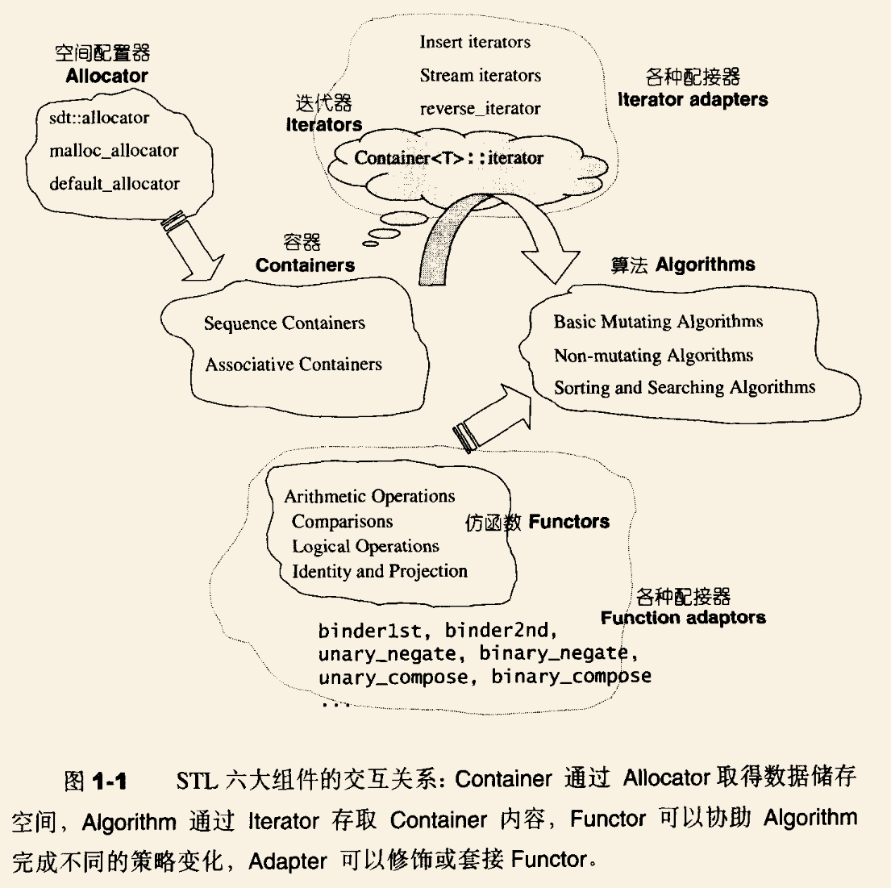

- _1673309891586_0.pdf)
-
- # 1.STL概论与版本简介
	- ## 1.2STL六大组件 功能与运用
		- 容器
			- 就是各种数据结构，如vector、list、deque、set、map。使用来存放数据的
		- 算法
		- 迭代器
			- 容器和算法之间的粘合剂；相当于指针
		- 仿函数
		- 配接器
		- 配置器
			- 负责空间的配置与管理
		- {:height 1109, :width 1105}
	-