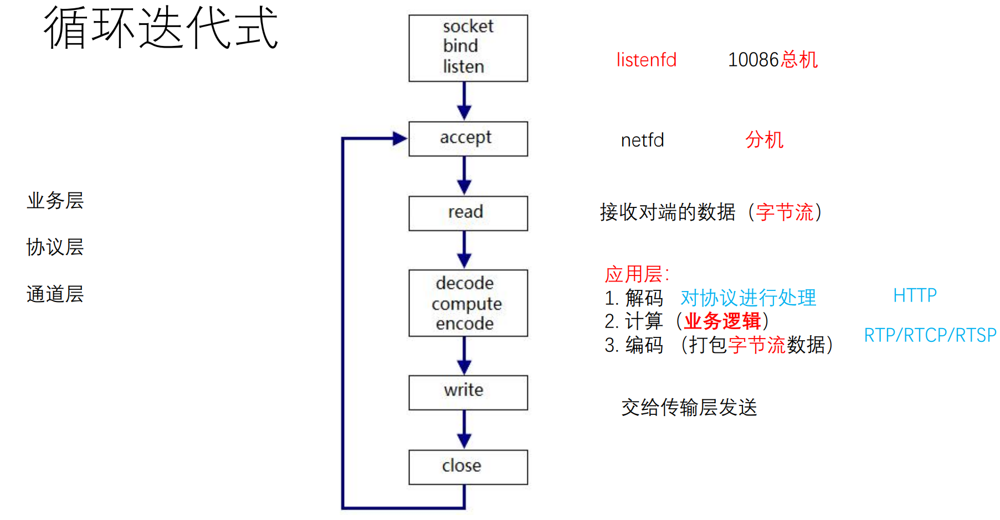
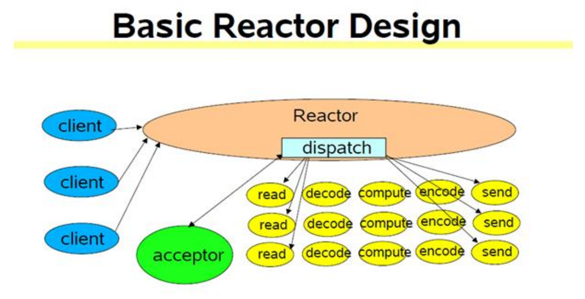
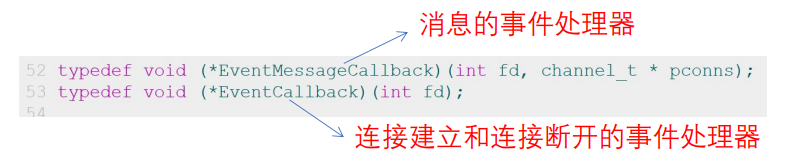
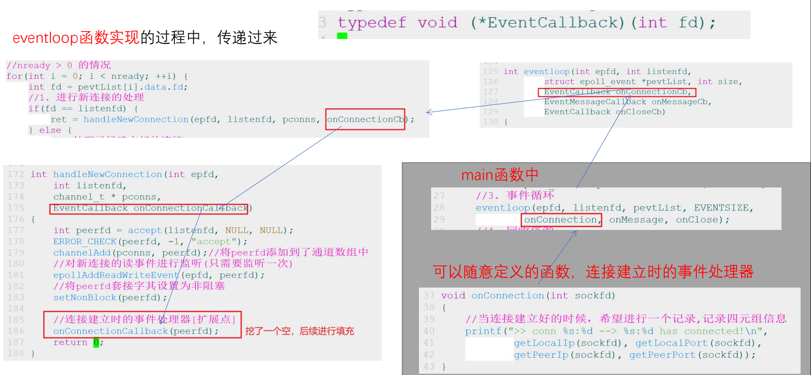
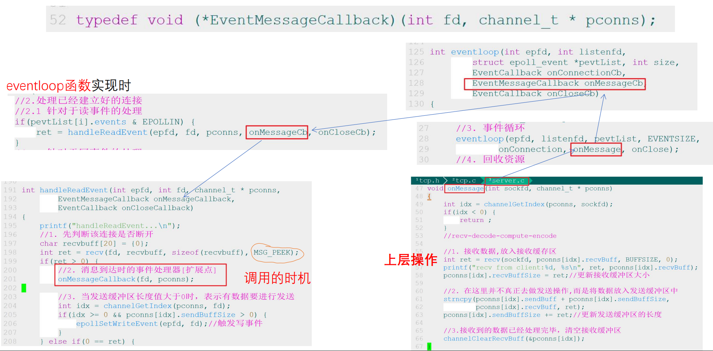
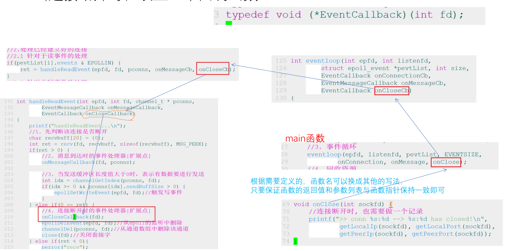

- # 一、常见并发服务器的方案
	- 1.循环迭代式服务器
		- 刚开始那个最原始的TCP实现
		- 
		- 可以分三层：
			- 业务层
				- 处理解码出的数据，完成需求，传出结果。
			- 协议层
				- 负责按照协议规定对收发的数据进行编解码
			- 通道层
				- 只负责传输
	- 2.并发式服务器
	- 3.prefork or pre threaded
	- 4.反应器（reactive）服务器（Reactor模式）
		- 在我们学的epoll模型上提取出了Reactor理论模型
		- 简单来说就是多路IO复用模型->select、epoll
		- Reactor模式，又叫反应器模式，应用于同步I/O的场景
			- 注册就绪事件：就是关注读事件或写事件
			- 事件处理器：就是回调函数（函数指针）
			- 事件分离器：epoll_wait
		- 
		- acceptor：处理新连接
		- 优点：单线程就可以处理大并发
		- 缺点：在轮询的过程中，某一个连接的处理时间过长，就会影响其他连接的响应
			- 所以要求每一个请求的处理时间要很短。send/recv必须是非阻塞的。
			- 而且跟网络环境有关系，网络环境太差，就不行了。
- # 二、网络编程过程中要涉及到的事件
	- 三个半事件：
		- 当**连接建立**的时候，要发生的事件
			- onConnection();
		- 当**消息到达**的时候，要发生的事件
			- onMessage();
		- 当**消息发送完成**（半个事件）时，要发生的事件
			- 可以计算出其发送速度
		- 当**连接断开**的时候，要发生的事件
			- onClose();
	- 如果要考虑扩展性，就必须要设计三个函数指针。
- # 三、考虑扩展性
	- 根据网络编程过程中发生的三个事件，设置三个事件处理器
	- 对day22代码：
		- 
		- 第一个：消息的事件处理器
		- 第二个：连接建立和连接断开的事件处理器
	- 当连接建立的时候，设置一个回调函数
		- 
	- 当消息到达时，设置一个回调函数
		- 
	- 当连接断开时，设置一个回调函数
		- 
	-